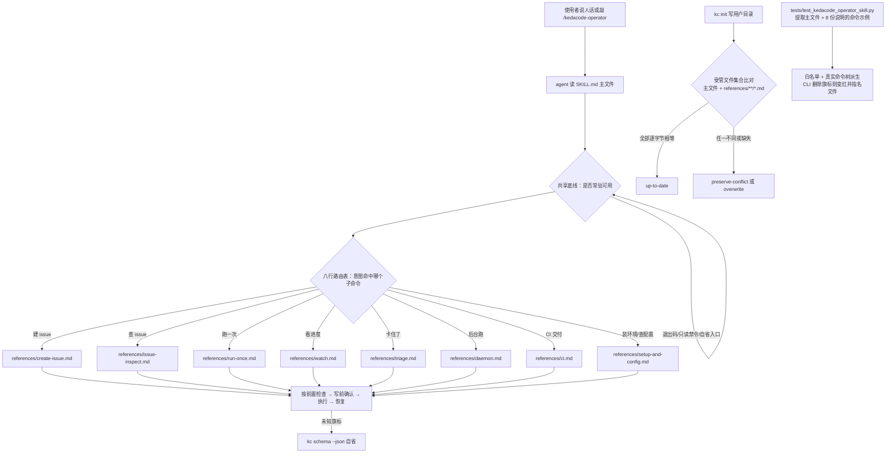

# PRD: Operator Skill 子命令化（hub + references 结构）

> ⛔ **交付前置**：`tasks/pending/P1-REFACTOR-20261007-013512-rename-product-surface-to-single-new-name.md`（产品表面改名为 KedaCode / `kc`）必须先合并落地。
> 结构化声明见 §8 Delivery Dependencies，**那里是唯一事实源**。

> ⬜ **验收状态**：未开工。
> 本行是 §9 Acceptance Checklist 的投影，**那里是唯一事实源**。

本文分两层：Part A 是给人审的行为与决策层，不含实现机制、文件路径与命令；Part B 是给执行器的实现层。两层都是投影，`§8` 与 `§9` 才是对应事实源。

## Feature Overview (功能一览)

以下条目是 §10 Functional Requirements 的投影，行为验收请看 §1 的行为样例表。

- **一个 Skill，八条子命令入口**（FR-1、FR-2）：随包发布的 operator Skill 从「一张 20 行的大表」变成「一张窄路由表 + 八份按需读取的子命令说明」。使用者的体感不变——还是对 agent 说人话——但每次加载的常驻内容大幅变轻。
- **路由表按人说的词命名，不按命令树复刻**（FR-2）：路由表里的名字是「建issue / 查 issue / 跑一下 / 看进度 / 卡住了 / 后台跑 / CI / 装环境」，而不是 `kc issue create` 的原样复刻。原样复刻等于没做抽象。
- **每条子命令先讲前置检查，再讲命令**（FR-3）：子命令说明不重复 CLI 手册（真实命令树由 `kc schema --json` 自省），只写自省说不了的东西：动手前必须先确认什么、写操作前必须征得同意什么、绝对不能做什么、出问题怎么回滚。
- **「只看一眼」永远不等于「跑起来」**（FR-4）：这条禁令以及退出码表留在常驻部分，不进按需加载的子命令文件。理由很直接——它们是所有子命令共享的底线，按需加载意味着最需要它的那次恰好没有它。
- **安装完整性从「只比一个文件」升级为「比所有受管文件」**（FR-5）：随包 Skill 的同步判定目前只比对 `SKILL.md` 字节。拆成多文件后，用户改过某份子命令说明时安装器仍会报「已是最新」并把用户的改动留下。这条修掉，比对范围限定在发行包实际管理的文件（主文件 + 子命令说明），用户自己丢进去的额外文件不触发冲突。
- **子命令文档同样受命令漂移守卫**（FR-6）：现在这道守卫只扫主文件。子命令说明里的命令示例若不被扫描，CLI 删掉仍在使用的旗标时守卫不会变红，文档会静默腐烂。本次把守卫扩展到全部子命令说明。
- **Skill 的自我描述覆盖全部子命令关键词**（FR-7）：自动触发只认自我描述，路由表对模型不可见。描述里必须包含全部八条子命令的口语关键词，否则新子命令永远不会被自动选中。
- **随包安装、冲突保护、安装计划三项既有行为逐字不变**（FR-8）：目录结构变化不改变安装目标、不改变同名冲突默认保留、不改变 `--dry-run` 不落盘。

# Part A · 人审层 (Review Layer)

## 1. Introduction & Goals

### Problem Statement

KedaCode 随包的 `kedacode-operator` Skill 是 agent 操作 CLI 的唯一随包说明书。它的现状是一个 **115 行、2795 词的单文件**（`src/backend/engines/agent_runner/templates/skills/kedacode-operator/SKILL.md`），结构上是「一张 20 行的意图表 + 若干散段」。

这份文件已经长成了自己的问题，有三处可核查的事实：

**第一，常驻内容与实际需要不匹配。** 那张意图表有 20 行、覆盖从仓库初始化到 CI 自动修复的十几类操作，外加退出码表、四条查看路径、标签语义表、一节安全与兼容性。agent 在用户说「建个 issue」时，也会把 daemon 生命周期、CI 自动修复策略、快速通道的不变量全部读进上下文——这些跟建 issue 毫无关系。所有内容无条件常驻，没有「需要时再取」的机制。

**第二，文件内部已经出现重复。** 意图表里「Preview the next execution pass」出现 2 次、「Execute one pass」出现 2 次，两对行的措辞几乎一致；「Safety and compatibility」一节里讲守护进程互斥的那条 bullet 也出现了 2 次。这是单文件长期只增不减的典型痕迹：改写时找不到原有那一句，就近又添了一句。

**第三，也是最要紧的：读者被要求在「查命令」和「走流程」之间二选一。** 真实命令树已经能自省（`kc schema --json` 输出每条命令、每个旗标、类型、必填、枚举、默认值和示例），但流程知识——建 issue 之前要确认什么、写操作前要征得什么同意、哪些请求绝对不能变成执行——只能靠人写。于是这份文件同时承担了两个冲突的角色：**命令参考**（会随 CLI 演进而腐烂）和**流程手册**（需要人来写、被人读）。两者混在一起，结果是流程部分被淹没在命令表里，而命令部分又因为混在流程里而无法被自动校验。

还有一处必须点名的现状：**这道守卫只守住了安装，不管内容。** 仓库文档 `docs/ai-standards/tooling.md` 至今写着「守卫测试只覆盖随包 Skill 的安装资源与冲突保护，不校验命令表内容」。这句话本身已经过期——测试里其实有一道 `test_packaged_skill_command_examples_match_cli_help`，会把主文件里所有命令示例的旗标逐个对照白名单，白名单再对照真实命令树。但**这道保护只覆盖主文件一个**。也就是说，今天如果有人把命令示例搬进第二个文件，那道保护立刻失效，而且失效得很安静。

此外，「快速建一个 issue」这类请求是最常被人工发起的高频操作，当前 Skill 把它压在与其他十几类操作等权的一行里，既没有把「建之前要确认的四件事」写出来，也没法让使用者在敲 `/kedacode-operator` 之后有一个明确的第一选择。

### Interpretation (解读回显)

**行为样例**

下表是本次交付后、使用者能观察到的行为。表中仍然有效的每一行都会变成 §7.6 的验收标准，**改动某一格就等于改动验收标准**。

| 验证方式 | 输入 / 操作 | 期望观察到的结果 |
|---|---|---|
| 🤖 自动验证 | 使用者对 agent 说「把tasks/pending/xxx.md 建成 issue」 | Skill 载入后，agent 读取的是「建 issue」那份子命令说明；该说明要求它先确认 PRD 文件存在、是否已有关联 Issue、是否有在飞的 PR、是否要进队列，然后才执行创建 |
| 🤖 自动验证 | 使用者说「看看 197 现在什么情况」 | agent 走的是只读查询路径，**不会**因为「看进度」而启动任何执行；说明文件里明确写着只读请求不得变成执行 |
| 🤖 自动验证 | 使用者敲 `/kedacode-operator 建个 issue`（子命令说人话，不是 CLI 旗标） | 路由表能把它落到「建 issue」那份说明；路由表里的名字是使用者口语，不是 `kc issue create` 的原样复刻 |
| 🤖 自动验证 | CLI 删除了某条子命令说明里仍在使用的旗标 | 守卫测试变红，并指名是哪个文件的哪个旗标不在真实命令树里；不是静默通过 |
| 🤖 自动验证 | 用户改过安装目录里某一份子命令说明，然后跑 `kc init` | 安装器不再报「已是最新」，而是按既有冲突保护语义报告冲突并保留用户文件；用户自己丢进去的额外文件不触发冲突 |
| 👀 人审 + 自动验证 | 阅读瘦身后的 Skill 常驻部分与八份子命令说明的划分 | 退出码表和「只看一眼≠跑起来」的禁令仍然常驻可见；八条子命令的划分与命名读起来是使用者的语言，不是命令树的复刻 |
| 🤖 自动验证 | 使用者说一句不在路由表覆盖范围内的话（例如询问某个旗标的完整默认值） | agent 转向自省入口拿真实命令树，而不是从路由表或某份子命令说明里猜一个旗标 |

**我默默定了这些**

- **一次切八份子命令说明，不做分批。** 我原本建议先切四份试水。选八份是因为守护安装完整性对比这件事本身可以独立完成、风险可控；而拆两次会让「同步只比一个文件」这个缺陷在中间状态里多活一段时间。
- **退出码表和只读禁令留在常驻部分，不进子命令说明。** 这与「所有内容都按需加载」的直觉相反，理由是它们是所有子命令共享的底线，按需加载意味着最需要它的那一次恰好没有它。
- **子命令说明不重复 CLI 旗标手册。** 真实命令树能自省，重复写只会产生第二份会腐烂的真相。子命令说明只写前置检查、写前确认义务、禁止事项、恢复路径。
- **安装完整性比对覆盖发行包实际管理的文件**（主文件 + `references/` 下全部 `.md`），用户自己放进 Skill 目录的其他文件不参与比对、不触发冲突。否则用户在 Skill 目录里丢个自己的笔记就会导致安装器报冲突。
- **子命令之间可以互相引用，但只允许单向一句话引用。** 不做 A→B→C 的链式读取，那会把按需加载省下的成本吃掉。
- **不在子命令说明里复述共享安全约束**，只写自己独有的部分。共享约束只留在主文件里一处，避免同一事实两处并存、改一处忘一处。
- **旧命令名的写法不在本次交付范围内。** 本 PRD 只在 `kedacode-operator` 目录内工作；残留守卫（禁止旧名字面量残留）由改名 PRD 拥有，本 PRD 不新增也不修改它。

**我理解为不做**

- **不做多个 Skill**（拆成 `kedacode-issue` / `kedacode-run` / `kedacode-daemon`）。随包安装器按单目录判冲突，多个 Skill 会让冲突保护语义和安装清单都要改，而拆分的唯一收益只是「每个子命令有独立描述」——本次扩描述就能拿到。
- **不新增自定义斜杠命令文件**（`.codebuddy/commands/*.md` 薄壳）。那会另出一条需要随包安装与同步的资产路径。
- **不改任何 CLI 命令、旗标、退出码或输出格式。** 本次是 Skill 文档结构与守卫测试的变更，CLI 的行为面一行不动。因此不触发随包资产同步约定的另一半（`docs/` 只做与本次结构变更相关的最小更新）。
- **不重写 `docs/guides/agent-runner.md`。** 它仍是详细命令参考的权威出处，子命令说明与它分工而非取代它。
- **不改旧命令名、旧目录名、旧环境变量名的任何残留检查。** 那些是改名 PRD 的 FR-7 与残留守卫所有；本 PRD 以它的合并为前提，不重复承担。

**可证伪的读法**

请把本 PRD 读作：**「只重构随包 Skill 的内部组织方式，让 agent 按需取用，并把它已经承诺的漂移保护兑现到全部子命令文件上」**，而不是读作「扩展 CLI 能力」或「重新设计 Skill 体系」。如果读成后者，那么合理交付物会是新命令、新旗标或多个 Skill 目录——那些都不在本 PRD 范围内。

判据：交付后 `kc --help` 与 `kc schema --json` 的输出应与交付前逐字一致；变的只有 `SKILL.md`、新增的 `references/`、守卫测试和两处文档。

### What The User Gets

使用者的操作方式不变——仍然对 agent 说人话，仍然可以敲 `/kedacode-operator`。变化有三个体感点。

第一，**agent 每次读的东西变少了**。用户说「建个 issue」时，daemon 生命周期、CI 自动修复策略这些无关内容不再被读进来。这直接减少上下文占用，也让 agent 在简单请求上更不容易被无关规则带偏。

第二，**高频操作有了明确的第一步。** 建 issue、查 issue、跑一下、看进度、卡住了、后台跑、CI、装环境——八件事在路由表上有各自的明确入口，且用使用者的语言命名。`/kedacode-operator` 之后不用在一张二十行的大表里找。

第三，**文档不会静默腐烂。** 之前只有主文件的命令示例受守卫保护；之后每份子命令说明都受保护，CLI 改了旗标而文档没跟上时，守卫会红并指名文件。

### Measurable Objectives

- 瘦身后 `SKILL.md` 的非空行数 ≤ 70（当前 115），且退出码表与只读禁令在其中仍完整可见。
- `references/` 下恰好存在 8 份子命令说明，每份都只包含至少一条真实 `kc` 命令示例（否则它该被合并进邻近文件）。
- 守卫测试对全部 8 份子命令说明生效：向某份说明注入一个真实命令树里不存在的旗标，守卫必须失败并指名该文件。
- 安装完整性比对覆盖发行包管理的全部文件：用户改动任一份子命令说明后，`kc init` 不再报「已是最新」。
- `kc schema --json` 与 `kc --help` 的输出在交付前后逐字一致（用命令输出比对证明）。
- 真实安装验证：在隔离 HOME 上跑真实的 `kc init`，安装产物目录含主文件与 8 份子命令说明，且与发行包资源逐字节相同。
- Skill 自我描述包含全部八条子命令的口语关键词——用一个可自动断言的方式证明（下文 rv-4）。

## 2. Human Review Map (介入与风险地图)

### 决策一：八条子命令怎么划分、怎么命名

这是本 PRD 唯一真正需要你判断的设计点，因为它直接决定使用者每天敲什么、看到什么。给出推荐划分的理由、风险与验收方式如下。

**推荐按「使用者会怎么问」划分，而不是按命令树层级划分。** 命令树本身是 `kc issue create` / `kc run` / `kc daemon run` / `kc backlog ci ...`，而使用者问的是「建issue」「看看它到哪了」「卡住了怎么办」。原样复刻命令树等于没做抽象，使用者仍然要自己做命令树到人话的翻译。八条子命令建议是：建 issue、查 issue、跑一次、看进度、卡住了怎么办、后台跑、CI 交付、装环境与查 Agent 配置。

**主要风险是划分粒度可能不合手。** 切得太粗，单份说明又会长回现在这个体量，等于没瘦身；切得太细，使用者记不住哪条是哪条，而且每份都薄到撑不起「前置检查 + 禁止事项」的完整叙述。这个取舍只能由每天使用它的人来判断，代码里没有答案。

**请确认：** 这八条划分和命名，是否是你要的粒度与措辞？如果你更希望合并某几条（例如「查 issue」和「看进度」并成一条、「后台跑」并进「跑一次」），请指出哪一对；如果你希望换成别的口头语，也请给出你想用的词。

**验收：** 瘦身后的路由表全文呈递在§9.1，你按呈现的划分逐条判断「我找得到我要的那件事吗」；同时 §7.6 rv-4 用自动断言证明每条子命令的关键词都能让Skill 被自动选中。

### 决策二：退出码表与只读禁令是常驻还是按需加载

这一条决定使用者的 agent 每次要多读多少内容，代价与收益都很实在。

**推荐让它们常驻，把子命令细节按需加载。** 这与「所有东西都按需加载」的直觉相反，理由是这两块内容的性质不同：子命令细节是**分支知识**——建 issue 才需要建 issue 的前置检查，跑一次才需要跑一次的旗标组合；而退出码表和「只看一眼不等于跑起来」是**共享底线**——每一次调用都适用。按需加载的机制是「需要时才读」，但底线恰恰是最需要它的那一次可能没有读的那一次。共享底线常驻的成本也很低：它现在是全文 20 行左右，拆分后仍在主文件里。

**风险是常驻部分将来会重新膨胀。** 拆分完成后如果后续改动又把子命令细节塞回主文件，今天省下的成本会全部还回去。所以这条必须配一个可自动检查的边界，而不是靠人的自觉。

**请确认：** 接受「共享底线常驻 + 子命令细节按需」这个划分，还是你希望把退出码表也一起搬进按需加载的部分（更省常驻，但拿不到它的调用会猜退出码语义）？

**验收：** §9.1 呈递瘦身后的主文件全文供你直读；§7.6 rv-5 用自动断言证明退出码表与只读禁令仍在主文件中，且主文件未超过约定的常驻行数上限。

### 自动门禁，不需要逐项人工审阅

- 八份子命令说明的内容正确性与命令合法性：由扩展后的守卫测试逐份校验，任一份出现真实命令树里不存在的旗标即变红（§7.6 rv-2）。
- 安装产物的完整性：隔离 HOME 上的真实 `kc init` 产物与发行包资源逐字节比对（§7.6 rv-1）。
- 安装完整性比对的行为：用户改动受管文件后 `kc init` 报冲突、用户自加文件不报冲突（§7.6 rv-3）。
- Skill 自我描述覆盖八条子命令关键词：自动断言（§7.6 rv-4）。
- CLI 行为面未变：`kc --help` 与 `kc schema --json` 输出在交付前后逐字一致（§7.6 rv-6）。
- 真实 agent 消费路径：一次真实会话里 agent 确实读到了对应子命令说明、且只读请求没有变成执行（§7.6 rv-7）。

### 本次明确不涉及

没有数据库结构变更，没有 Web 控制台改动。CLI 的命令、旗标、退出码、机器可读输出格式全部不变。旧命令名与旧目录名的残留治理由前置 PRD 拥有。

## 3. Usage And Impact After Implementation

### 直接使用者：用自然语言让 agent 操作的人

- **不变**：说人话让 agent 操作 CLI；敲 `/kedacode-operator` 触发；`/kedacode-operator` 之后可以带参数。
- **不变**：冲突保护语义——目标下已有内容不同的同名 Skill 时默认保留并报告冲突，只有明确要求才覆盖。
- **不变**：`kc init --dry-run` 显示安装计划且不落盘。
- **变**：agent 每次载入的内容变少。简单请求（建 issue、看进度）不再连带载入 daemon 生命周期与 CI 策略细节。

### 直接使用者：日常敲 `/kedacode-operator` 的人

- **变**：命令表从二十行大表变成八条路由，每条用你的语言命名（决策一已请确认）。
- **不变**：仍然可以用完整的 CLI 旗标表达任何意图；路由表覆盖的是常见意图，不是全部能力。

### 审查者 / 管理员：阅读随包 Skill 判断它是否准确的人

- **变**：Skill 从一个 115 行文件变成一个约 65 行主文件加八份子命令说明。审查完整内容的路径变长，但任一份子命令说明的审查范围更小、更容易发现写错。
- **变**：命令示例的守卫保护从「只保护主文件」扩展到「保护全部九份文件」，审查者不再需要人工比对子命令说明里的旗标。
- **不变**：详细命令参考的权威出处仍是 `docs/guides/agent-runner.md`。

### 运维 / 集成方：消费机器可读输出的调用方

- **完全不变**。本 PRD 不触碰任何 CLI 行为、输出格式或退出码。任何脚本、任何 A2A 调用方、任何 `--json` 消费者都不需要改动。

### 开发者：修改 CLI 表面并需要同步随包资产的维护者

- **变**：改动 CLI 表面时，同步义务从「改一个文件」扩展到「改主文件 + 可能改若干子命令说明」。这是本次刻意接受的代价，换取子命令说明不再静默腐烂。
- **变**：守卫测试会覆盖子命令说明，因此旗标漂移在提交阶段就暴露，而不是在评审阶段靠人眼。
- **不变**：`docs/ai-standards/tooling.md` 里「改动 CLI 表面必须同步随包资产」的约定本身不变，只是同步范围变宽了。

## 4. Requirement Shape

- **actor**：使用 CLI 的操作者（说人话或敲 `/kedacode-operator`）；阅读随包 Skill 判断其准确性的审查者；修改 CLI 表面并同步随包资产的维护者。
- **trigger**：使用者的任一 CLI 操作意图；或维护者改动 CLI 表面后的同步动作；或安装器判定随包 Skill 是否需要写入用户目录。
- **expected behavior**：agent 按使用者意图读到对应的一份子命令说明并据此执行；共享底线（退出码表、只读禁令）无条件可读；子命令说明中的命令示例受守卫校验；安装器能识别受管文件被用户改动；Skill 自我描述覆盖全部子命令关键词。
- **explicit scope boundary**：不新增、不改名、不删除任何 CLI 命令或旗标；不改退出码与输出格式；不拆成多个 Skill；不新增自定义斜杠命令资产；不重写 `docs/guides/agent-runner.md`；不触碰旧命令名的残留治理。

# Part B · 执行器层 (Build Layer)

## 5. Repository Context And Architecture Fit

### 5.1 Existing Path

随包 Skill 作为 Python 发行资源存在：`src/backend/engines/agent_runner/templates/skills/kedacode-operator/SKILL.md`，由 `install_packaged_operator_skill`（`src/backend/engines/agent_runner/remote_template_skills.py`）在 `kc init` 期间写入用户级 Skill 目录。该函数用 `shutil.copytree(source_path, target_path)` 复制整个目录——**子目录会被自动带上，安装器不需要改动**。

### 5.2 Reuse Candidates

- **安装机制**：复用 `install_packaged_operator_skill` 的既有语义（`install` / `up-to-date` / `preserve-conflict` / `overwrite` 四种结果、`--dry-run` 不落盘、`--force` 才覆盖）。子目录随 `copytree` 自动安装，无需新安装路径。
- **同步判定**：`install_packaged_operator_skill` 中「本地契约字节 == 发行包契约字节 → `up-to-date`」的判定思路复用，只需把比较对象从单个文件扩展到发行包管理的文件集合。
- **冲突保护**：`--force` 语义、`shutil.rmtree` 后重装的既有逻辑不变。
- **Skill 目录解析**：Skill 加载由 agent 侧完成，`${CODEBUDDY_SKILL_DIR}`（及 `${CLAUDE_SKILL_DIR}` 别名）占位符在 SKILL.md 中可用，子命令路径用它拼接，不依赖当前工作目录。`skills.md` 文档确认该占位符适用于所有来源的 skill。
- **守卫测试的既有机制**：`tests/test_kedacode_operator_skill.py` 里的 `_ALLOWED_FLAGS` 白名单 + `_real_flags_by_path()`（从真实 Typer 命令树经 `build_command_schema(app)` 派生）+ 反引号命令示例提取，三个机制全部原样复用，只是作用文件集合从单文件扩展为「主文件 + 全部子命令说明」。
- **命令自省入口**：`kc schema --json` 已经是旗标真相源，子命令说明不重复旗标手册这一准则由它支撑。

### 5.3 Architecture Constraints

- Skill 是**发行资源**，属于 engines 层模板机制；本次不新增层次、不新增服务、不新增依赖。
- 不得为了本 PRD 的方便改动 CLI 命令树。本次全部改动落在随包资源、守卫测试与文档三处。
- 依赖方向 `api → core → engines → infrastructure` 不受本次影响（无新增 import，无跨层调用）。
- 随包资产同步约定（`docs/ai-standards/tooling.md` 的 CLI Surface And Packaged Skill Sync）：本次不改 CLI 表面，因此不触发该约定的同步义务；但该文档中「守卫测试不校验命令表内容」这句已过期，本次顺带更正为事实。
- 前置 PRD 已把新名字面量收敛到身份模块；本 PRD 不新增任何产品名字面量，因此不参与那次收敛。

### 5.4 Frontend Impact

**No frontend impact**。本次改动只涉及随包 Skill 的 Markdown 资源、Python 守卫测试和 `docs/`，不改变任何用户可见的界面。管理控制台不承载 Skill 内容、Skill 安装清单或子命令路由，本次不涉及它的任何路由、组件或 API 接线。

### 5.5 Existing PRD Relationship

- **`tasks/pending/P1-REFACTOR-20261007-013512-rename-product-surface-to-single-new-name.md`（产品表面改名）**：**本 PRD 的硬前置**。它把产品表面从 `iar` 改为 KedaCode / `kc`，把随包 Skill 目录改名为 `kedacode-operator`、守卫测试改名为 `tests/test_kedacode_operator_skill.py`、命令示例的提取正则改为反引号内 `kc …`。本 PRD 在它合并之后工作，因此 §5.1/§5.2 里出现的路径、文件名、环境变量与命令名全部是改名后的形态。若本 PRD 在它之前开工，路径与命令名会全线错误——这正是本 PRD 设硬前置而非软重叠的原因。
- **`tasks/pending/P1-FEAT-20261006-122336-any-issue-execution.md`（任意 Issue 可执行）**：在扩展 `run` 的目标语义、快速通道档位，并改动 `issue create` 的输入方式。本 PRD **不改任何 CLI 行为**，因此与它没有任务顺序依赖；但两者都会写「建 issue」这条使用路径的内容。**实现前必须核对当前 `kc issue create --help` 的真实旗标，不得凭本 PRD 正文或改名 PRD 的描述推断**——两份 PRD 都可能落后于对方。
- **`tasks/archive/P1-FEAT-20260924-020856-iar-operator-skill-and-predictable-queue.md`**：创建了该 Skill 的全部现有内容（当时名为 `iar-operator`）。本 PRD 是它的结构延续，不推翻其任何行为契约（命令表、不变量、退出码说明、冲突保护）。本次不动其决策 D-01（Skill 随包发行、离线可用）与 D-04（稳定排序的 dry-run/执行共享）。
- **`tasks/pending/P1-REFACTOR-20261007-013512-rename-product-surface-to-single-new-name.md` 的 FR-7 与残留守卫**：旧副本安全清理、`kedacode-operator` 与旧名的残留归零检查，都由改名 PRD 拥有。本 PRD 在其后工作，不新增、不修改、不放宽那些检查；本 PRD 的守卫扩展只处理「子命令说明未纳入漂移保护」这一个正交问题。

### 5.6 Potential Redundancy Risks

- 不要为子命令说明另建一套命令参考 —— 会产生第二份会腐烂的真相。真实命令树由 `kc schema --json` 自省。
- 不要在子命令说明里复述共享安全约束（守护进程互斥、快速通道不变量、只读禁令）——同一事实两处并存必然漂移。这些只留主文件一处。
- 不要为了本次结构变更修改 `install_packaged_operator_skill` 的安装目标、冲突语义或 `--force` 行为 —— 只改同步判定的比较范围。
- 不要因为前置 PRD 已经清理过旧名字，就以为本 PRD 可以写死 `iar` 字面量 —— 残留守卫仍禁止；本 PRD 一律用 `kc`。
- 不要顺手把这次变更当成机会重写 `docs/guides/agent-runner.md` —— 它仍是权威出处，本 PRD 与它分工。

## 6. Recommendation

### Recommended Approach

把随包 operator Skill 从「单文件全量常驻」重构为「瘦主文件 + 8 份按需读取的子命令说明」，同时兑现两件当前已被承诺但未完全实现的事：安装完整性比对覆盖全部受管文件、命令漂移守卫覆盖全部子命令说明。

具体做法：主文件保留 frontmatter（扩写 `description` 以覆盖八条子命令的口语关键词）、一张八行路由表、以及共享底线段（只读禁令、目标必填契约、未知旗标先用 `kc schema --json` 自省、完整退出码表）；子命令说明放进 `references/` 下的八份 `.md`，每份只写前置检查、写前确认义务、禁止事项、恢复路径，不写旗标手册。安装器保持不动（`copytree` 自动带上子目录），只把「是否已是最新」的比较对象从 `SKILL.md` 一个文件扩展为发行包管理的文件集合。守卫测试的既有三件套（命令示例提取 + 白名单 + 真实命令树派生）原样复用，作用文件集合扩展为「主文件 + 全部子命令说明」。

### Design Challenge

**质疑一：把子命令说明拆到按需加载，会不会让最需要详尽流程的那次调用恰好没读到？** 确有这个风险，但它已经被决策二的划分回答了——分支知识（每条子命令的前置检查）按需加载，共享底线（退出码、只读禁令）常驻。真正的残余风险是 agent 判断错了意图、读了子命令 A 却要做子命令 B 的事。缓解方式是主文件的路由表必须覆盖使用者可能说的全部常见表达，而不是只覆盖 CLI 旗标的直译。

**质疑二：安装完整性比对从「比一个文件」扩到「比一组文件」，会不会制造新的误报？** 会，如果把用户自己丢进 Skill 目录的任意文件也算进比对——用户加个自己的笔记就会让安装器报冲突。所以比对范围必须限定为**发行包实际管理的文件集合**（`SKILL.md` 加 `references/**/*.md`），额外文件既不触发冲突也不被删除。这样语义精确：发行包说「这些文件是我管理的，你说改过了我就报告冲突」。

**质疑三：子命令命名用使用者的口语，会不会让使用者敲 `run` 而路由表里没有 `run`？** 会。这正是决策一要你拍板的地方，也是为什么它不能由 agent 默默决定。缓解方式是路由表同时接受口语表达与 CLI 直译：口语词优先，未命中时按 CLI 直译匹配。

**质疑四：既然前置 PRD 刚把整个目录改过名，为什么不顺便把拆分也做了？** 因为改名 PRD 的验收清单里含「旧命令名残留归零」这类守卫，它的判定以「改名后的目录内容与历史摘要一致」为前提。若在同一批改动里又改了目录内容，那套摘要集立刻失配，守卫要么误报要么被迫重算。改名 PRD 必须先以单一批次闭环，本 PRD 才能在其之上做第二次有据可依的内容变更。这也是本 PRD 设硬前置的实际收益。

**质疑五：为什么不干脆拆成八个 Skill？** 因为拆多个 Skill 会让安装清单、冲突保护（当前按单目录判冲突）和守卫的作用对象一起改变，而拆分的唯一收益是「每个子命令有独立描述」——扩写主文件的 `description` 就能拿到同一个效果，代价小一个数量级。

### Proposed Solution Summary (实现机制)

1. **主文件瘦身**：改写 `src/backend/engines/agent_runner/templates/skills/kedacode-operator/SKILL.md`——frontmatter 的 `description` 扩写为覆盖八条子命令的口语关键词（这是 Skill 被自动选中的唯一依据，路由表对模型不可见）；主体替换为八行路由表（每行给子命令名、触发词、指向的子命令说明文件）；保留共享底线段：只读请求不得变成执行、`run` 的目标必填契约、未知旗标先用 `kc schema --json` 自省、完整退出码表。目标 ≤70 非空行。
2. **八份子命令说明**：在 `src/backend/engines/agent_runner/templates/skills/kedacode-operator/references/` 下建立八份 `.md`，按使用者口语命名——建 issue、查 issue、跑一次、看进度、卡住了怎么办、后台跑、CI 交付、装环境与查 Agent 配置。每份内部按统一骨架：何时用这个 → 动手前必须先确认什么 → 执行/禁止事项 → 出问题怎么恢复 → 交叉引用（单向一句话）。每份至少含一条真实 `kc` 命令示例。
3. **安装完整性比对扩展**：`install_packaged_operator_skill` 的「是否已是最新」判定，把比较对象从 `SKILL.md` 单文件扩展为「发行包管理的文件集合」。实现上以发行包目录为基准枚举受管文件（主文件 + `references/**/*.md`），逐个与目标目录同名文件比较；任一不同则不再报 `up-to-date`，转而按既有 `force` 语义返回 `preserve-conflict` 或 `overwrite`。目标目录中不属于受管集合的额外文件不参与比较。
4. **守卫扩展**：`tests/test_kedacode_operator_skill.py` 的既有命令示例提取与白名单校验从「只读主文件」扩展为「读主文件 + 全部子命令说明」，失败信息必须指名来源文件与旗标；新增一条断言：受管文件集合与发行包实际文件一一对应（防止新增一份说明却忘了纳入比对与守卫）。同步把 `docs/ai-standards/tooling.md` 里「守卫测试不校验命令表内容」这句过期陈述改为事实。
5. **文档最小更新**：`docs/guides/agent-runner.md` 中描述随包 Skill 的那一段，补充它现在是「主文件 + 子命令说明」的结构，并说明子命令说明与该文档的分工（该文档是命令参考权威，子命令说明是流程顺序）。

刻意避开的复杂度：不引入新的 Skill 加载机制（`references/` 是平台既有能力）；不引入第二套命令参考；不改安装目标与冲突语义；不改任何 CLI 行为；不新增或修改任何产品名字面量（前置 PRD 已收敛）；不新增插件系统或命令分发层。

### Alternatives Considered

- **拆成多个 Skill**（`kedacode-issue` / `kedacode-run` / `kedacode-daemon` 等）：能拿到每条子命令独立的 `description`，但要改安装清单、冲突保护的作用对象和守卫的作用对象，收益（独立描述）可由扩写主文件 `description` 达到。以更大的机制改动换一个可等价获得的效果，不划算。
- **新增 `.codebuddy/commands/*.md` 自定义斜杠命令作为薄壳**：每条命令一个真入口，但这是另一条需要随包安装、同步、冲突保护的资产路径，且与 Skill 的 `description` 触发机制功能重叠。
- **只拆一份（建 issue）作为试点**：风险最低，但「同步只比一个文件」的缺陷在中间状态里继续存在，且主文件几乎不会变瘦，等于没交付目标状态。
- **把拆分并入改名 PRD 一批做**：会让改名 PRD 的历史摘要集失效，其残留守卫失去判定基准。见质疑四。

### Scope Cohesion

三项改动——主文件瘦身 + 八份子命令说明、安装完整性比对扩展、守卫扩展——必须一次交付，原因不是「顺手」，而是它们互为对方的验证条件：

- 若只做文档拆分而不扩守卫，子命令说明成为无保护区的新内容，这是**净退化**：漂移风险从「一个文件在守」变成「一个文件在守、九个文件不守」；
- 若只扩守卫而不改安装完整性比对，用户改过的子命令说明永远停在用户目录里，且安装器报告「已是最新」，守卫与安装器互相矛盾；
- 若只改安装比对而不拆分文档，比对范围从 1 个文件扩到 1 个文件，没有任何行为变化，那项改动就没有意义。

拆成三个 PRD 会让中间状态在「文档已拆但守卫没扩」这个最坏点上停留一段时间。三个改动各自可在半天内独立验证，拆分的收益不足以抵消中间状态的退化风险，因此保持为一个 PRD。

## 7. Implementation Guide

本节根据当前仓库分析形成，是执行期间持续更新的实现指南；实现者应复查扩展点和相关 PRD，若事实有变须同步修订实现与验收 oracle。

### 7.1 Core Logic

#### 主文件瘦身的判定标准

瘦身的硬标准是**共享底线 vs 分支知识**，不是「行数少」。以下内容必须留在主文件，因为它们是每次调用都适用的：

- 只读意图不得变成执行（看进度 / 查 issue 两类请求的第一句约束）；
- `run` 的目标必填契约（裸 `run` 是 usage error，autopilot 旗标不属于 `run`）；
- 完整退出码表（agent 把 `$?` 与 stderr 对上的唯一依据）；
- 未知旗标时用 `kc schema --json` 自省而不是猜。

可以移入子命令说明的是：某条子命令独有的前置检查序列、写操作前的确认义务、该子命令的恢复路径。

不要移入子命令说明的是：守护进程与 `run` 的互斥规则、快速通道的不变量、队列优先级顺序——这些虽然只在部分场景适用，但属于「不变量」而非「流程」，且已经在主文件的 Safety 段落里，改动它们的风险高于拆分收益。本 PRD 不动它们。

#### 子命令说明的写法

八份子命令说明统一骨架（写的时候按这个顺序，避免有的写三段有的写七段）：

1. **何时用**：触发词，含使用者口语与 CLI 直译两种表达；
2. **动手前必须先确认**：编号的前置检查，每条说明为什么要查（不是「为了正确性」这种空话，而是不查会导致什么具体后果）；
3. **执行与禁止**：哪些命令会写GitHub / 跑 Agent / 起后台进程，以及哪些请求绝对不能变成执行；
4. **恢复**：出问题时走哪条恢复路径；
5. **相关**：单向一句话指向另一份子命令说明或 `docs/guides/agent-runner.md` 的章节。

**「建 issue」那份子命令说明是本次的重点**，因为它是使用者点名要的高频操作。它的前置检查至少覆盖这四件事，每件都要写清不查的后果：

- PRD 文件是否存在且可读（不存在则整个流程无从下手）；
- 该 PRD 是否已有关联 Issue（PRD 文件里的 GitHub Issue 链接或 `kc issue list` 的查询结果）——重复创建会产生两个指向同一份 PRD 的 Issue；
- 是否有在飞的 PR 指向这个 PRD（决定是否需要新建）；
- 是否要立刻进队列（进队列与只建 Issue 是两种不同的用户意图，混为一谈会导致意外执行）。

**已知风险要写进子命令说明而不是留给 agent 自己发现**：当前工作目录匹配到多个已注册仓库时，多条命令会拒绝猜测，需要显式指定仓库标识；`kc init` 的覆盖式 `--force` 可能替换用户自有 Skill，不是版本修复手段。

#### 安装完整性比对

现有判定在 `install_packaged_operator_skill` 内：读目标 `SKILL.md` 字节，与发行包 `SKILL.md` 字节比较，相等则返回 `up-to-date`。

改法：以发行包 Skill 目录为基准枚举**受管文件集合**——主文件，以及 `references/` 下递归的全部 `.md`。逐个比较目标目录下的同名文件。全部逐字节相等 → `up-to-date`；任一不同或缺失 → 不再返回 `up-to-date`，按现有 `force` 分支返回 `preserve-conflict`（`force=False`）或 `overwrite`（`force=True`）。目标目录下不属于受管集合的文件既不参与比较，也不被 `shutil.rmtree` 之外的逻辑单独处理（覆盖路径仍是整目录 rmtree 后 copytree，行为不变）。

注意保持 `dry_run` 语义不变：`--dry-run` 仍然不写任何文件，只返回计划。

失败三角定位：如果实现后 `up-to-date` 的判定在「用户只改了子命令说明」的场景下仍返回 `up-to-date`，问题几乎必然在受管文件枚举上——检查是否只枚举了主文件，或枚举时被 `references/` 下的非 `.md` 过滤掉。

#### 守卫扩展

复用现有三个机制，只改作用文件集合：

- 命令示例提取：现有正则从任意文本提取命令示例，把输入文本从「主文件全文」换成「主文件全文 + 每份子命令说明全文」；
- 白名单 `_ALLOWED_FLAGS`：不动；
- 真实命令树派生 `_real_flags_by_path()`：不动。

失败信息必须指名来源文件——现在只有一个文件，指名意义有限；拆到九份文件后，agent 修错地方的成本很高，指名是必需的。

新增一条守卫断言：`references/` 下的每一份 `.md` 都被纳入守卫与安装比对范围，且与发行包目录实际文件一一对应。这条防的是「新增了一份说明但忘了加进比对范围」——那种漏检在运行时表现为子命令说明永远不被更新，且没有任何报错。

#### 守卫测试的归属与提交

`tests/test_kedacode_operator_skill.py` 位于 `tests/` 根目录、文件头没有「守卫测试（guard test）」标注，因此修改它**不需要** `GUARD_UPDATE_ACK=1`。实施者在提交前仍应确认这一判断（文件头标注可能已变）。

#### 与改名 PRD 的守卫分工

改名 PRD 拥有「旧名字面量残留归零」的守卫。子命令说明里出现的每个 `kc` 命令示例都在其检查范围内，因此**不要**在本 PRD 里另写一份旧名残留检查，也不要为了让它通过而在说明里写旧命令名。本 PRD 唯一的守卫扩展是「子命令说明纳入命令示例漂移保护」。

### 7.2 Change Impact Tree

```text
Operator Skill 子命令化（hub + references）
├── engines / packaged resources
│   ├── templates/skills/kedacode-operator/SKILL.md         改写：扩 description + 八行路由表 + 共享底线
│   └── templates/skills/kedacode-operator/references/*.md  新增 8 份子命令说明（随 copytree 自动安装）
├── engines / installation
│   └── remote_template_skills.py::install_packaged_operator_skill
│                                                       改判定范围：单文件 → 受管文件集合；安装目标/冲突语义/dry-run 不变
├── tests
│   └── test_kedacode_operator_skill.py
│       ├── 命令示例提取 + 白名单校验的作用文件集合扩展到 8 份子命令说明
│       ├── 新增断言：references 受管集合与发行包目录一一对应
│       └── 新增断言：用户改受管文件后不再 up-to-date、用户自加文件不触发冲突
├── docs
│   ├── ai-standards/tooling.md                            更正过期陈述：守卫现已校验命令示例（含子命令说明）
│   └── guides/agent-runner.md                             补充 Skill 结构说明与文档分工
└── frontend-admin/                                          No frontend impact（无界面变化）
```

不涉及 `api/`、`core/`、`infrastructure/`：无新增 import，无跨层调用，CLI 表面零改动。无产品名字面量改动（前置 PRD 已收敛到身份模块）。

### 7.3 Executor Drift Guard

- **前置 PRD 必须已合并**：开工前确认 `src/backend/engines/agent_runner/templates/skills/kedacode-operator/SKILL.md` 与 `tests/test_kedacode_operator_skill.py` 已存在、旧名路径已不存在。若两个文件任一仍用旧名，说明前置未落地，**停下来报告，不要开工**。
- **CLI 表面可能已被并发 PRD 改变**：`tasks/pending/P1-FEAT-20261006-122336-any-issue-execution.md` 正在扩展 `run` 与 `issue create`。写子命令说明前必须核对真实旗标，不要依据本 PRD 正文或记忆推断。核对方式：

```bash
uv run kc issue create --help
uv run kc run --help
uv run kc schema --json
```

- **受管文件集合是隐式约定**：新增一份子命令说明后，忘记把它纳入安装比对与守卫，会产生静默失效。落地时必须同时跑「新增文件后守卫与比对都覆盖它」这一检查（新断言就是为此存在），不要只靠人工记得。

- **子命令说明之间可能形成链式引用**：一旦 `A.md` 引用 `B.md`、`B.md` 引用 `C.md`，按需加载的成本收益就被吃掉了。约定单向一句话引用，实现时在 review 里盯住。

- **共享底线可能被复制进子命令说明**：写子命令说明时容易顺手把「不要把只读变成执行」也抄一遍到每份里。后果是同一事实九处并存，改一处忘一处。共享约束只在主文件一处，子命令说明只写自己独有的。

- **占位符必须用绝对路径拼接**：Skill 装到用户目录后与发行包位置不同，子命令说明路径不要写相对路径或 `docs/...` 形式。用 `${CODEBUDDY_SKILL_DIR}`；`${CLAUDE_SKILL_DIR}` 是等价别名，一致性由平台保证，本 PRD 不额外处理。

- **搜索面**：本次改动新增一个目录与八个文件。排查「哪里引用了 Skill 路径」时起点是：

```bash
rg -n 'kedacode-operator' src tests docs
rg -n 'templates/skills' src tests
rg -n 'CODEBUDDY_SKILL_DIR|CLAUDE_SKILL_DIR' src tests
```

这些搜索是起点而非穷举；实现者若发现额外引用点，按 `drift` 处理并更新本 PRD。

### 7.4 Flow / Architecture Diagram



### 7.5 ER Diagram

无数据库 schema 变更，无持久化状态变更，无迁移。受管文件集合是文件系统枚举，不是数据模型。

### 7.6 Realistic Validation Plan

以下 YAML 为结构化验收 oracle。CLI 与安装入口使用真实进程与真实 Typer 命令树；GitHub 交互不进入本 PRD 的验证范围（子命令说明是文档，验证对象是文档内容与安装产物，不是 GitHub 行为）。rv-7 需要真实 agent 会话，标记为可失败降级并写明降级形态。

```yaml
oracles:
  - id: rv-1
    behavior: "真实 kc init 把随包 Skill 装进隔离 HOME 时，安装产物含主文件与 8 份子命令说明，且全部与发行包资源逐字节相同。"
    reviewer: verifier
    real_entry: "在隔离 HOME（临时目录）上执行 uv run kc init，指向隔离仓库路径，然后枚举安装目录树并逐文件比对字节。"
    expected: "目标 Skill 目录下 SKILL.md 存在，references/ 下恰好 8 个 .md；逐文件 sha256 与发行包模板目录一致；--dry-run 变体不产生任何写入。"
    mock_boundary: "隔离 HOME 与隔离仓库路径；kc init 的真实 Typer 入口、安装编排、copytree 与冲突判定均不替换。"
    tier: R1
    test_layer: real_entry
    required_for_acceptance: true

  - id: rv-2
    behavior: "守卫测试对主文件与全部 8 份子命令说明生效：任一份说明里出现真实命令树中不存在的旗标时，测试失败并指名该文件与该旗标。"
    reviewer: verifier
    real_entry: "uv run pytest tests/test_kedacode_operator_skill.py，并额外执行一次负向运行：向某一份子命令说明注入一个真实命令树里不存在的旗标后重跑。"
    expected: "负向运行失败，失败信息指名被注入的文件与旗标；移除注入后恢复通过。"
    mock_boundary: "无 mock；测试读真实发行包文件与真实 Typer 命令树派生结果。"
    tier: R1
    test_layer: real_entry
    required_for_acceptance: true
    negative_control: "在 references/ 下任一份说明里临时注入一个真实命令树不存在的旗标（如 --definitely-not-a-real-flag）。"
    expected_fail: "守卫测试失败并指名该文件与该旗标。注入不触碰生产代码，只改随包文档资源。"

  - id: rv-3
    behavior: "安装完整性比对覆盖发行包管理的全部文件：用户改动受管文件后 kc init 不再报 up-to-date；用户在 Skill 目录里自加的非受管文件不触发冲突。"
    reviewer: verifier
    real_entry: "隔离 HOME 下先执行一次 uv run kc init（得到 up-to-date 基线），再分别做两种扰动后重跑。"
    expected: "扰动一：改 references/ 下任一份说明的字节 → 结果不再是 up-to-date，且 force=False 时报告 preserve-conflict 并保留用户内容。扰动二：在 Skill 目录内新增一个不属于受管集合的文件 → 结果仍为 up-to-date。"
    mock_boundary: "隔离 HOME；真实安装编排与真实比较逻辑；不替换比较函数。"
    tier: R2
    test_layer: real_entry
    required_for_acceptance: true
    critical_value_source: "发行包 Skill 目录内主文件与 references/**/*.md 的实际字节；目标目录同名文件字节。"
    must_cross: "真实 kc init 入口 → 安装编排 → install_packaged_operator_skill 的 up-to-date 判定 → 实际文件写入/保留决策。"
    forbidden_bypasses: "不得直接调用比较函数替代 kc init 入口；不得只在 dry-run 上断言；不得为了让扰动一通过而放宽为「主文件相同即 up-to-date」。"
    fresh_state_probe: "每种扰动从全新隔离 HOME 起步，先建立干净的 up-to-date 基线再施加扰动。"
    final_tree_evidence: "记录最终 git tree、两种扰动下 kc init 的完整输出、目标目录文件列表与被保留的用户内容。"
    negative_control: "把比较范围临时收窄回仅主文件。"
    expected_fail: "扰动一重新报 up-to-date，rv-3 失败。"

  - id: rv-4
    behavior: "Skill 自我描述覆盖全部 8 条子命令的口语关键词，因此使用者的任何常见 IAR 意图都能触发自动选中；路由表在主文件中可见。"
    reviewer: verifier
    real_entry: "读取随包 SKILL.md 的 frontmatter description 与路由表；对每条子命令，用其定义的触发词断言 description 或路由表中存在对应表达。"
    expected: "八条子命令各自至少一个触发词可在 description 中找到；八行路由表齐全且每行指向一个实际存在的子命令说明文件；指向的文件名全部存在于 references/ 下。"
    mock_boundary: "无 mock；读真实随包文件与真实目录。"
    tier: R1
    test_layer: real_entry
    required_for_acceptance: true

  - id: rv-5
    behavior: "共享底线仍在主文件且可读：瘦身后主文件的非空行数不超过 70，且退出码表的 7 个错误名与 7 个退出码、只读禁令、自省入口均在主文件中。"
    reviewer: verifier
    real_entry: "统计随包 SKILL.md 非空行数；对其内容断言退出码名与码值、只读禁令关键句、自省入口命令全部存在。"
    expected: "非空行数 ≤ 70；`ok` `usage_error` `not_found` `permission_denied` `conflict` `dry_run_ok` 与 0/1/2/3/4/5/10 全部可断言；'never start' 类只读禁令句存在；'kc schema --json' 存在。"
    mock_boundary: "无 mock；读真实随包文件。"
    tier: R1
    test_layer: real_entry
    required_for_acceptance: true

  - id: rv-6
    behavior: "CLI 表面未被本次改动改变：交付前后的 kc --help 与 kc schema --json 输出逐字一致。"
    reviewer: verifier
    real_entry: "在最终实现树上执行 uv run kc --help 与 uv run kc schema --json，与交付前捕获的基线输出做逐字 diff。"
    expected: "两份输出与基线无差异。"
    mock_boundary: "无 mock；真实命令树。"
    tier: R1
    test_layer: real_entry
    required_for_acceptance: true

  - id: rv-7
    behavior: "真实 agent 会话中，agent 按使用者意图读到对应的子命令说明，且只读请求没有变成执行。"
    reviewer: verifier
    real_entry: "把随包 Skill 安装到隔离 HOME，用真实 agent CLI 会话（headless）分别发出两类请求：一类'把某个 PRD 建成 issue'，一类'看看某个 Issue 现在什么情况'；采集 agent 的工具调用轨迹。"
    expected: "第一类：轨迹中出现对建 issue 子命令说明的读取，且执行前发生了 PRD 存在性/已有 Issue/在飞 PR/是否进队列的检查。第二类：轨迹中无任何 kc run / registry start 之类的执行类调用。"
    mock_boundary: "GitHub 交互可用受控替身；agent 会话、Skill 加载、工具调用轨迹采集均为真实。"
    tier: R2
    test_layer: real_entry
    required_for_acceptance: true
    critical_value_source: "agent 实际读取的子命令说明文件路径；agent 实际发出的 CLI 命令序列。"
    must_cross: "真实 agent 会话 → Skill 加载主文件 → 路由表命中 → 读取子命令说明 → 真实工具调用。"
    forbidden_bypasses: "不得用提示词直接塞入子命令说明内容来替代加载；不得把轨迹断言替换为『说明文件里写了这句话』；不得只看最终回复文本。"
    fresh_state_probe: "每类请求在全新隔离 HOME 与全新会话中发起。"
    final_tree_evidence: "记录最终 git tree、两类请求的完整 agent 轨迹、实际读取的文件路径与实际发出的 CLI 命令。"
    negative_control: "把路由表中的建 issue 行指向一份不含前置检查的说明。"
    expected_fail: "第一类轨迹中不再出现四项前置检查的调用，rv-7 失败。"

  - id: rv-8
    behavior: "子命令说明与真实命令树一致：八份说明里出现的全部 CLI 命令旗标都真实存在；说明中引用的 docs/guides/agent-runner.md 章节标题在该文件中真实存在。"
    reviewer: human
    real_entry: "PR evidence comment 展示随包 SKILL.md 与八份子命令说明的全文，并对每份说明给出它声明的前置检查顺序摘要。"
    expected: "人读后能判断：每份说明的前置检查顺序合理、禁止事项没有被削弱成模糊措辞、路由表八条覆盖了常见的 CLI 操作意图。"
    mock_boundary: "无 mock；展示真实文件全文与真实守卫结果。"
    tier: R2
    test_layer: real_entry
    required_for_acceptance: true
    presentation: "PR evidence comment 内嵌 SKILL.md 与八份子命令说明全文的阅读视图，并给出守卫测试 rv-2、rv-4、rv-5 的实际输出；本地可读视图用 open 打开 PR 上的 evidence 目录。判读方式：对着「建 issue」那份说明，确认它要求做的四项前置检查都在，缺一项就会说明白缺了会怎样。"
    critical_value_source: "八份子命令说明的全文文本。"
    must_cross: "真实安装产物 / 真实发行包文件 → 守卫校验 → 人读判读。"
    forbidden_bypasses: "不得用摘要替代全文呈递；不得把路由表呈递成图片而看不到子命令说明正文。"
    fresh_state_probe: "呈递内容取自最终实现树，不是设计稿。"
    final_tree_evidence: "记录最终 git tree、呈递的文件全文来源、守卫输出。"
    negative_control: "把某份子命令说明的禁止事项改写成模糊措辞（如『通常不要直接执行』）。"
    expected_fail: "人审能看出该措辞没有界定何时例外，rv-8 的判读不成立。"

  - id: rv-9
    behavior: "安装冲突保护的既有语义未变：干净 HOME 报告安装、同名不同内容报告保留冲突、--force 才覆盖、--dry-run 不落盘。"
    reviewer: human
    real_entry: "隔离 HOME 上执行 kc init --dry-run 的干净场景与同名冲突场景各一次，以及一次 --force 场景；在 PR evidence comment 展示三次的完整输出。"
    expected: "干净 dry-run：报告安装且目录未被创建。冲突 dry-run 与冲突实装：报告保留冲突，用户文件内容逐字未变。--force：覆盖成功。"
    mock_boundary: "隔离 HOME 与隔离仓库；真实安装编排。"
    tier: R2
    test_layer: real_entry
    required_for_acceptance: true
    presentation: "PR evidence comment 内展示三次 kc init 的完整终端输出（干净 dry-run / 冲突 / --force），并在 conflict 一栏附目标文件的实际字节内容。判读方式：确认冲突场景下用户文件内容确实未被改写。"
    critical_value_source: "隔离 HOME 中目标 Skill 目录的实际文件内容与 kc init 的输出。"
    must_cross: "真实 kc init 入口 → 冲突判定 → 目标目录实际内容。"
    forbidden_bypasses: "不得用 install_packaged_operator_skill 的直接调用替代 kc init 入口；不得省略 --dry-run 那一档。"
    fresh_state_probe: "三个场景各自使用全新隔离 HOME。"
    final_tree_evidence: "记录最终 git tree、三次命令与完整输出、目标目录文件内容。"
    negative_control: "临时把 preserve-conflict 分支改为默认 overwrite。"
    expected_fail: "冲突场景不再报告保留冲突、用户文件被覆盖，rv-9 失败。"
```

**rv-7 的降级形态**：若真实 headless agent 会话在当前环境不可用（无可用凭据或无可用 agent CLI），rv-7 必须记为 `REVIEW_INCISION / INCONCLUSIVE`（review incident，不是产品失败），并改用下述替代证据后才可交付：**在隔离 HOME 安装随包 Skill，用真实 agent CLI 会话只做路由验证**——若连这个也不可用，则退回为「加载真实安装产物、断言 Skill 工具清单中存在 `kedacode-operator` 且其 description 含全部触发词」+ 人工按 §9.1 阅读八份说明。降级形态必须写进 evidence report 并在 §9 勾选时注明，不得静默按通过处理。

## 8. Delivery Dependencies

工具中立的排期元数据，不是工具专属队列语法。无依赖时显式写 `none`。

- Depends on tasks/issues:
  - `tasks/pending/P1-REFACTOR-20261007-013512-rename-product-surface-to-single-new-name.md`（产品表面改名为 KedaCode / `kc`）
- Gate type: via-main
- Sequence: after `P1-REFACTOR-20261007-013512`
- Notes: **硬前置**。改名 PRD 把产品表面、Skill 目录名（`iar-operator` → `kedacode-operator`）、守卫测试文件名、命令示例提取前缀（`iar …` → `kc …`）一并改完，并把旧名字面量的残留守卫纳入其验收；本 PRD 的全部路径与命令名都建立在那些改动之上，且它的历史摘要集与残留守卫要求目录内容在改名那批里保持可判定的形态。若本 PRD 先落地，改名 PRD 的摘要集立刻失配。因此本 PRD 在其合并之后 rebase 开工，开工前按§7.3 第一条核对两个文件路径。与 `tasks/pending/P1-FEAT-20261006-122336-any-issue-execution.md`（命令名与文档文本）只有软重叠，不构成先后依赖，后落地者 rebase。

## 9. Acceptance Checklist

本节分两层读者：**9.1 是给人看的**——验收时只看这一层，目标是几分钟内看完；**9.2 起是给 verifier 和未来回溯用的机器证据**，默认不用打开，出问题再下钻。每项必须带证据（命令输出 / 观察 / 工件引用），不是裸勾。验收针对最终目标态，而不是中间阶段。

### 9.1 人读呈递区（Human Review Surface）

| Oracle | 你要看什么 | 呈递物（交付时填实际路径） | 想自己复核？ |
|---|---|---|---|
| rv-8 | 瘦身后的 SKILL.md 与八份子命令说明全文 | 交付时填：`tasks/evidence/P1-FEAT-20261007-013031-iar-operator-skill-subcommand-hub/rv-8-skill-and-references/` 下的全文阅读视图与 `just prd review` 生成的本地页面 | 对着「建 issue」那份，确认它要求做的四项前置检查都在，且每项都写明了不查的具体后果；任一项缺失或其后果被写成空话，即判不通过 |
| rv-9 | 安装与冲突保护三次真实输出 | 交付时填：`tasks/evidence/P1-FEAT-20261007-013031-iar-operator-skill-subcommand-hub/rv-9-init-conflict.txt` | 「冲突」那一栏：确认用户文件内容确实未被改写；「dry-run」那一栏：确认目录未被创建 |

呈递物要可直接打开：本地产物给绝对路径 + 一行 `open "<绝对路径>"`。PR 与 CI 给可点URL。

`reviewer: verifier` 的 rv-1、rv-2、rv-3、rv-4、rv-5、rv-6、rv-7 不进入人工呈递区。

### 9.2 Acceptance Evidence Package

#### Human-Confirmed

- [ ] **子命令划分与命名**（决策一）：按呈递的八行路由表判断「我找得到我要的那件事吗」；若判断某条找不到，改名或合并该条后重跑 rv-4、rv-8。证据见 rv-8。
- [ ] **常驻 vs 按需的划分**（决策二）：按呈递的主文件全文判断退出码表与只读禁令是否该继续常驻；若判断应一并按需加载，移出后必须重跑 rv-5 与 rv-4（路由表仍需常驻）。证据见 rv-5、rv-8。
- [ ] **八份说明的流程质量**（rv-8）：逐份确认前置检查顺序合理、禁止事项的措辞没有把例外情形模糊掉。证据见 rv-8。
- [ ] **安装体验**（rv-9）：确认三次安装输出中冲突场景确实保护了用户文件。证据见 rv-9。

#### Behavior and compatibility

- [ ] 真实 `kc init` 把随包 Skill 装进隔离 HOME，产物含主文件与 8 份子命令说明且逐字节与发行包一致；`--dry-run` 变体零写入（rv-1）。
- [ ] 守卫对全部 9 份文件生效：注入一个真实命令树不存在的旗标后必须变红并指名文件（rv-2）。
- [ ] 安装完整性比对覆盖受管文件：改受管文件后不再报 `up-to-date`，用户自加非受管文件不触发冲突（rv-3）。
- [ ] `description` 覆盖八条子命令关键词、八行路由表齐全且指向的文件都存在（rv-4）。
- [ ] 主文件非空行 ≤ 70，退出码表、只读禁令、自省入口仍在其中（rv-5）。
- [ ] `kc --help` 与 `kc schema --json` 输出与交付前基线逐字一致（rv-6）。
- [ ] 真实 agent 会话中，agent 读到对应子命令说明且只读请求未变成执行；若 rv-7 降级，按 §7.6 写明的降级形态取证并在证据报告注明（rv-7）。

#### Packaging and documentation

- [ ] 随包安装、冲突默认保留用户文件、`--force` 才覆盖、`--dry-run` 不落盘四项既有行为逐字未变（rv-9）。
- [ ] `docs/ai-standards/tooling.md` 中「守卫测试不校验命令表内容」这句过期陈述已更正为事实，且 `uv run mkdocs build --strict` 通过。
- [ ] `docs/guides/agent-runner.md` 说明了 Skill 的主文件 + 子命令说明结构，并说清与该文档的分工。

#### Delivery readiness

- [ ] §8 的硬前置已合并；开工路径核对通过（§7.3 第一条）。
- [ ] PRD §7.6 指定的自动化 oracle 在最终实现树上通过，证据文件与最终 Git tree 绑定。
- [ ] 仓库自带门禁通过：`just test`（`CI=true just test all`）与 `just lint`；`tests/test_kedacode_operator_skill.py` 全绿。
- [ ] PR 正文含本 PRD 归档路径与「合并即接受所列决策与结果」的明确声明；evidence comment 含 §9.1 两行呈递与 verifier 结论。

## 10. Functional Requirements

- **FR-1**：随包 operator Skill 改为「瘦主文件 + `references/` 子命令说明」结构，主文件保留 frontmatter、八行路由表与共享底线段（只读禁令、目标必填契约、完整退出码表、未知旗标先自省），主文件非空行 ≤ 70。
- **FR-2**：子命令说明按使用者口语命名，覆盖八类意图：建 issue、查 issue、跑一次、看进度、卡住了怎么办、后台跑、CI 交付、装环境与查 Agent 配置。路由表同时接受口语表达与 CLI 直译，未命中时按 CLI 直译匹配。
- **FR-3**：每份子命令说明只包含自省机制说不了的内容——动手前必须先确认什么（含不确认的具体后果）、写操作前的确认义务、禁止事项、恢复路径；不复制 CLI 旗标手册，不复述主文件已有的共享约束；子命令之间只允许单向一句话交叉引用。
- **FR-4**：Skill frontmatter 的 `description` 覆盖全部八条子命令的口语关键词；任一常见 CLI 意图都能据此自动选中本 Skill。
- **FR-5**：安装完整性判定（`up-to-date`）的比较对象从主文件扩展为发行包管理的全部文件（主文件 + `references/**/*.md`）；任一受管文件被用户改动后不再报 `up-to-date`，按既有 `force` 语义报告保留冲突或覆盖；目标目录中不属于受管集合的文件既不触发冲突，也不改变安装目标与 `--dry-run` 语义。
- **FR-6**：守卫测试的命令示例提取与白名单校验覆盖主文件与全部子命令说明，失败信息指名来源文件与旗标；新增断言保证 `references/` 下每一份 `.md` 都纳入守卫与安装比对范围，且与发行包目录实际文件一一对应。
- **FR-7**：`docs/ai-standards/tooling.md` 中关于守卫测试不校验命令内容的过期陈述更正为事实；`docs/guides/agent-runner.md` 说明 Skill 的新结构与该文档的分工；`uv run mkdocs build --strict` 通过。
- **FR-8**：随包 Skill 的安装目标、安装计划（`--dry-run` 不落盘）、同名冲突默认保留用户文件、只有明确要求才覆盖这四项既有行为逐字不变；CLI 的命令、旗标、退出码与机器可读输出格式零改动。

## 11. Non-Goals

- 不新增、不改名、不删除任何 CLI 命令或旗标；不改退出码与 `--json` 输出格式。
- 不新增或修改任何产品名字面量；旧命令名与旧目录名的残留治理、旧副本安全清理由 §8 的硬前置 PRD 拥有。
- 不把随包 Skill 拆成多个 Skill 目录；不新增自定义斜杠命令（`.codebuddy/commands/*.md`）作为另一条随包资产路径。
- 不重写 `docs/guides/agent-runner.md`；它是详细命令参考的权威出处，本 PRD 与它分工而非取代它。
- 不改变 Skill 的安装目标目录、冲突保护语义或 `--force` 行为；不改用户级 Skill 解析顺序（首位是自有状态目录）。
- 不为「按需加载」发明新的加载机制；`references/` 子目录与 `${CODEBUDDY_SKILL_DIR}` 占位符都是平台既有能力。
- 不引入第二套命令参考；不在子命令说明里重复 `kc schema --json` 已经能自省的内容。
- 不为解决测试而往生产代码增加 fault injection、test-only 旗标、开关、计数器或观测钩子（rv-2/rv-3 的负向运行只改随包文档资源，不改生产代码）。
- 不处理 GitHub 实际行为；本 PRD 的验证对象是文档内容、安装产物与 agent 的加载路径，不是在 GitHub 上的执行结果。

## 12. Risks And Follow-Ups

- **前置未合并就开工**：这是本 PRD 最大的实施风险，表现为路径与命令名全线错误（旧目录、旧的守卫测试文件名、旧的反引号提取前缀）。缓解是 §7.3 的开工第一条：两个文件任一仍用旧名即停下来报告。
- **前置 PRD 的摘要集与本 PRD 的新增内容冲突**：改名 PRD 用历史随包版本的 sha256 摘要集判定「旧副本可否安全清理」。本 PRD 在其之后改动目录内容不破坏该摘要集（摘要集针对的是历史版本），但若本 PRD 与它并行开发同一目录，两批改动会互相使摘要失配。因此必须是先后关系，不是并行。
- **并发 PRD 改动了被描述的 CLI**：`tasks/pending/P1-FEAT-20261006-122336-any-issue-execution.md` 正在扩展 `run` 与 `issue create`。本 PRD 的子命令说明若在它之后落地，其中的建issue 与跑一次说明必须按新的真实 CLI 行为调整措辞。实现时用 `uv run kc issue create --help`、`uv run kc run --help`、`uv run kc schema --json` 核对，不以本 PRD 正文推断。
- **拆分后主文件重新膨胀**：后续改动容易把子命令细节塞回主文件，今天省下的常驻成本会全部还回去。缓解是 rv-5 的行数断言加上「共享底线 vs 分支知识」的划分标准；行数超限时该问的是「哪段该搬走」，不是「标准可以放宽」。
- **子命令说明之间的链式引用吃掉收益**：实现时约定单向一句话引用，在 review 中盯住。若形成链条，应改为在路由表里直接可达。
- **共享底线被复制进多份子命令说明**：同一事实多处并存必然漂移。缓解是子命令说明只写自己独有的部分，共享约束仅存主文件一处。
- **安装完整性比对的误报**：比对范围若扩到用户自加文件，会导致用户在 Skill 目录里放笔记就触发冲突。缓解是范围限定为发行包管理的文件集合（rv-3 的扰动二就是这条的负向对照）。
- **守卫覆盖不全导致漏检**：新增一份子命令说明却忘了纳入比对与守卫，会静默失效。缓解是 rv-6 之外的新增断言，它把「一一对应」变成机器检查而非人工记得。
- **未来工作（已批准但不阻塞）**：若使用者在实际使用中反复找不到某条子命令，可在本 PRD 交付后另行调整路由表措辞或重新划分——那是基于真实使用反馈的迭代，不是本 PRD 欠下的工作。

## 13. Decision Log

| ID | 决策 | 状态 | 说明 |
|---|---|---|---|
| D-01 | 采用单 Skill hub + `references/` 子命令说明结构，不拆成多个 Skill | Proposed | 拆多个 Skill 会改安装清单、冲突保护与守卫的作用对象，而其唯一收益（独立 description）可由扩写主文件 `description` 等价获得 |
| D-02 | 退出码表与只读禁令留在主文件常驻，子命令细节按需加载 | Human-Confirmed | 二者是每次调用都适用的共享底线，按需加载会让最需要它的那次恰好没有它；分区标准是「共享底线 vs 分支知识」而非行数 |
| D-03 | 八条子命令按使用者口语命名，路由表同时接受 CLI 直译 | Human-Confirmed | 复刻命令树等于没做抽象；但纯口语会让敲过 CLI 直译的使用者落空，故两种表达都匹配 |
| D-04 | 子命令说明不写 CLI 旗标手册，只写前置检查/确认义务/禁止事项/恢复路径 | Proposed | `kc schema --json` 已是旗标真相源，重复写会产生第二份会腐烂的真相 |
| D-05 | 安装完整性比对覆盖主文件 + `references/**/*.md`，不含用户自加文件 | Proposed | 受管文件才报告冲突，用户在 Skill 目录里放笔记不应导致冲突；扩展比对范围本身是 rv-3 的直接对象 |
| D-06 | 守卫扩展到全部子命令说明，并新增「受管集合与发行包目录一一对应」断言 | Proposed | 不扩守卫则拆分是净退化（一处受保护变九处不受保护）；一一对应断言把「记得纳入新文件」从人工责任变成机器检查 |
| D-07 | 以产品改名 PRD 为硬前置（via-main），不设并行 | Human-Confirmed | 改名 PRD 的历史摘要集与残留守卫要求目录内容在改名那批里保持可判定形态；并行改动会使摘要失配，也让本 PRD 的路径与命令名全线错误 |
| D-08 | 旧命令名残留检查由改名 PRD 拥有，本 PRD 不新增也不放宽 | Proposed | 两个问题正交：改名治的是名字，本 PRD 治的是内容组织；同时维护两份残留守卫会产生「谁负责」的歧义 |

## Change Log

### Change 1 — 创建 Operator Skill 子命令化 PRD

- **Type**: Initial
- **Before**: 随包 operator Skill 是 115 行单文件，含 20 行意图表、退出码表、四条查看路径、标签语义与安全段；意图表内已出现 2 对重复行，安全段有一条重复 bullet；安装完整性判定只比对单个 `SKILL.md` 字节，因此改过其他文件仍会报「已是最新」；守卫测试的命令示例校验只作用于主文件一个文件；`docs/ai-standards/tooling.md` 关于「守卫不校验命令表内容」的陈述已过期。
- **After**: 定义「瘦主文件 + 8 份按需子命令说明」结构、安装完整性比对扩展到受管文件集合、守卫扩展到全部子命令说明并新增一一对应断言、文档更正，以及 9 条含真实安装入口与真实 agent 会话的验收 oracle。
- **Reason**: 让 agent 按使用者意图只读取所需流程，缓解单文件已出现的重复与常驻膨胀；并把已承诺但只覆盖单文件的命令漂移保护与安装完整性判定兑现到全部文件。
- **Impact**: 新增一份 pending P1 PRD；改动面为随包 Skill 资源（1 改 + 8 新增）、安装判定、守卫测试、两处文档；无 CLI 行为改动、无数据库变更、无前端改动。

### Change 2 — 改为以产品改名 PRD 为硬前置，并全文换用改名后的路径与命令名

- **Type**: Revision
- **Before**: 全文以 `iar-operator` 目录、`tests/test_iar_operator_skill.py`、`iar init` / `iar schema --json` 等旧名书写；§5.5 与改名 PRD 的关系记为「软重叠，不构成先后依赖」，§8 依赖为 `none`，排期为 `via-main`。
- **After**: §5.1/§5.2 的路径、文件名、环境变量与命令名全部改为 `kedacode-operator` / `tests/test_kedacode_operator_skill.py` / `kc …`；§8 改为 `Depends on` 改名 PRD、`Gate type: via-main`、§1 与 §2 加硬前置横幅；§5.5 明确它是硬前置并说明为何不能并行（摘要集与残留守卫要求目录内容在改名那批里保持可判定形态）；§7.1 新增「与改名 PRD 的守卫分工」，§7.3 新增开工第一条路径核对；新增 D-07、D-08；§11 补入「不新增或修改产品名字面量、不触碰旧名残留治理」。
- **Reason**: 用户指定改名为前置条件。原「软重叠」的判断低估了耦合深度——改名 PRD 的历史摘要集与残留守卫都以目录内容可判定为前提，两者并行会使摘要失配；且本 PRD 的全部落点都建立在改名后的路径与提取前缀之上，先写等于先写错。
- **Impact**: 只改表述与依赖声明，不改 §6 实现机制、不改 §7.6 oracle 集合、不改 §10 功能需求的技术内容；新增 2 条决策与 2 条实施指引。
