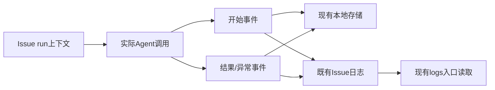
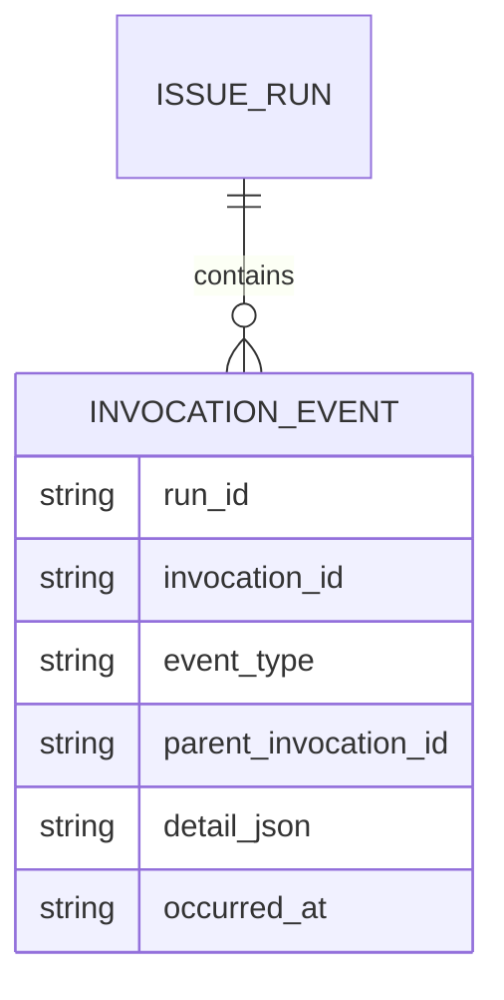

# PRD: Agent 调用记录与日志关联

- GitHub Issue: https://github.com/ZataZhang/keda/issues/242
- lifecycle_presets:
  - implementation: qoder-qwen3_8-max_xhigh

> ✅ **交付前置**：无硬依赖，可立即开工。结构化声明见 §8，那里是唯一事实源。
>
> ⬜ **验收状态**：未开工。本行是 §9 Acceptance Checklist 的投影，那里是唯一事实源。

本文 Part A 用于确认行为，Part B 用于执行。当前为需求规划，尚未实现。

## Feature Overview (功能一览)

以下为 §10 的投影，行为验收以 §1 样例为准。

- **每次调用可追踪**（FR-1）：区分任务、执行轮次、阶段、实际执行器及回退调用。
- **模型信息诚实呈现**（FR-2）：区分请求模型与执行器报告模型，未报告时显示“未提供”。
- **异常也有记录**（FR-3）：失败、超时、进程中断和记录缺失可辨认。
- **直接读日志定位调用**（FR-4）：现有日志入口展示调用身份、阶段、执行器、模型来源及结果。
- **配套日志阅读指引**（FR-5）：说明如何定位调用和沿现有恢复路径处理，不开发停滞判断功能。
- **兼容与隐私**（FR-6）：覆盖无 PRD Issue，旧记录可读，不采集完整提示词或密钥。

# Part A · Review Layer

## 1. Introduction & Goals

### Problem Statement

产品改名任务 #228 运行约九小时，经历多轮恢复却仍未发布 PR；日志更新和进程存活掩盖了交付停滞。现有记录有 attempt 耗时、阶段累计时间和部分模型字段，但模型只在显式绑定时写入，不能证明每次修复、审核、验证调用的实际模型。部分工具日志只显示 Agent 调用，无法解释内部子任务身份。

全量测试的已有实测约三分钟，当前优先消除重复恢复与无效等待。历史耗时来自本次对话观察，不作为未来任务的性能承诺。

### Interpretation (解读回显)

#### 行为样例

| 验证方式 | 输入 / 操作 | 期望观察到的结果 |
|---|---|---|
| 👀 人审 + 自动验证 | 查看包含实现、修复、验证和执行器回退的任务 | 现有日志入口展示每次调用的身份、阶段、执行器、模型来源、结果和耗时；回退调用独立记录 |
| 🤖 自动验证 | 执行器没有报告实际模型 | 请求模型可保留，执行器报告模型显示“未提供”，不用配置值冒充 |
| 🤖 自动验证 | 调用超时或运行进程中断后读取日志及记录 | 超时有终态并记录完整结果；中断保留未闭合开始记录，已确认进程退出时视为 incomplete，不显示成功或虚构结束时间 |
| 🤖 自动验证 | 查看无 PRD Issue 和旧版任务 | 新任务同样完整关联；旧任务标注历史不完整，不回填推测模型 |

这些行为样例逐项成为 §7.6 的验收 oracle，修改样例即修改验收标准。

#### 我默默定了这些

- 追踪范围是 keda 自身启动的顶层 Agent 调用；Agent 内部自行派生的子 Agent 只有在执行器提供可信事件时才关联。
- 不开发停滞判断或自动接管；操作者沿现有日志和恢复能力处理。
- 沿用现有 logs 入口，不新增命令、旗标、JSON摘要或管理终端页面；观测故障不把成功的业务任务改判为失败。
- 不改变正常、FAST、DIRECT 档位的验证或合并条件。

#### 我理解为不做

- 机器学习预测、模型排行榜、自动模型选择。
- 外部 tracing 平台、全局看板、完整提示词或响应归档。
- 自动杀进程、自动抢占认领、跳过测试或证据门禁。

目标是准确解释可观察的调用与交付进展；未观测到的内部活动必须明确未知，不能宣称完整分布式追踪。

### What The User Gets

任务变慢时，操作者能找到具体慢调用、恢复原因和原始日志，并在反复无进展时尽早接管。

### Measurable Objectives

- 所有本次范围内调用具有唯一身份和开始记录，正常结束、异常结束均可关联。
- 可从日志与调用记录还原测试场景的调用次数及调用耗时；并发耗时不相加冒充总墙钟时间。
- 未知模型、缺失事件、未闭合调用和旧历史明确呈现。
- 查看现有日志不触发诊断程序、停止或重新认领。

## 2. Human Review Map (介入与风险地图)

### 已确认决策：执行器明确记录，模型区分请求与报告

用户已在本次对话确认原“决策二”。keda自己启动的每次调用必须记录实际执行器，执行器回退独立记录。模型区分实际下发的请求值与执行器可信报告值；未报告时显示“未提供”，结构化字段为 null 并注明 unknown 来源。内部子 Agent 缺少可信事件时明确未观测。

请求参数不能独立证明服务端实际模型；报告值也仅表示执行器报告，不声称独立验证服务端内部运行。

验收：从现有日志能识别执行器、请求模型、报告模型及缺失原因，不夸大内部覆盖。

其余由执行器与自动验证负责：身份关联、时间计算、存储升级、失败记录和敏感信息约束。原决策一已移除，不开发摘要命令、停滞检测或自动接管。完成后仍需呈递日志样例供审阅，需求确认不等于产品验收。

## 3. Usage And Impact After Implementation

- 操作者：沿用 `kc logs --issue N` 和现有日志文件，将新增开始/结束标记与调用输出关联。
- 监督 Agent：直接读现有日志诊断；恢复指引为配套文档，不新增巡检阈值或自动检测。
- 执行器适配器：提供可获取的实际模型、会话和用量；缺失时保持未知。
- 原有任务提交者：执行、验证、发布流程保持原有语义。

## 4. Requirement Shape

- Type: backend invocation observability + logging documentation。
- Actor: 操作者、巡检 Agent、keda 调度器和执行器。
- Trigger: 任务调用开始/结束、读取现有日志。
- State: 追加式调用记录和关联日志标记，不新增任务调度状态机。

# Part B · Build Layer

## 5. Repository Context And Architecture Fit

### Existing Path / Reuse Candidates

- `run_agent_once.py::run_agent_with_prompt` / `run_agent_with_prompt_resilient`：实际调用和执行器回退边界。
- `run_agent_execution_loop.py`、`agent_runner_delivery_closeout.py`、`agent_runner_orchestrate.py`：实现、恢复、收尾及审核上下文。
- `agent_runner_attempt.py`、`agent_runner_attempt_recording.py`：已有计时与 attempt 结果。
- `agent_runner_orchestration_runtime.py`：Issue 处理及 usage 回调。
- `core/shared/interfaces/runner_console.py`、`infrastructure/persistence/console_store.py`：已有运行、attempt、PRD 生命周期事件与 SQLite 存储。
- `agent_runner_lifecycle.py`：事件呈现可借鉴，不能把无 PRD Issue 伪装成 PRD 生命周期。

### Architecture Constraints

遵循 api → core → engines → infrastructure；核心依赖接口，不导入 SQLite 实现。跨调用上下文使用对象，避免增加大量位置参数。复用计时、模型选择和日志安全处理。

### Frontend Impact

No frontend impact：本次仅补充调用记录、日志标记及operator文档。仓库有 frontend-admin 和 frontend-public，本次均不修改页面、路由或 API 客户端。

### Existing PRD Relationship

已搜索 pending 的 trace、telemetry、invocation、停滞及相关词，没有同范围任务。产品改名与 operator hub 存在路径演进关系，属于软关联；Direct PR label 是独立发布选择，不是本功能前置。已核对 archived 的 `P1-FEAT-20260921-161621-prd-lifecycle-observability.md` 与 `P1-FEAT-20260930-130445-agent-model-preset-switching.md`：前者限定本地 PRD 生命周期，后者提供模型选择背景；本次扩展通用调用身份，不能改变其既有状态语义。

### Potential Redundancy Risks

不新增第二份调度历史、不创建外部平台、不复制每个角色的包装器。PRD 生命周期表具有 PRD 专属身份，不能未经适配直接用于所有调用。

## 6. Recommendation

### Proposed Solution Summary (实现机制)

在现有实际 Agent 调用边界统一发出 started/finished 事件。沿用 console store 的连接、版本迁移和持久化端口，增加最小的通用 invocation 存储能力；可使用一张追加式事件表，避免 PRD 必填字段污染通用身份。生命周期事件可关联这些 invocation，但不重复生成调用事实。

在现有 Issue 日志中输出简洁的调用开始/结束标记，携带 run_id、invocation_id、阶段、实际执行器、模型来源、结果与耗时。工具输出在并发场景需要保留调用关联，不能依赖相邻文本推断归属。沿用 `kc logs --issue N` 的读取、follow及换轮路径，不新增 --trace、JSON摘要、API或页面。

### Alternatives / ROI

- 只完善巡检指令：成本最低，但无法可靠定位调用与模型，单独采用不足。
- 引入 OpenTelemetry 服务和看板：部署、权限和维护成本较高，本地事件已经足够，拒绝。
- 新增调用事实 + 现有存储 + 现有日志入口：最小可用闭环，推荐。

## 7. Implementation Guide

本节是 living implementation guide；执行前重新核对路径和真实调用链，发现偏差更新本节及 Change Log，不按过时路径复制实现。

### 7.1 Core Logic

调用上下文至少包含 repo_id、issue_number、run_id、attempt_number（无 attempt 时 null）、invocation_id、parent_invocation_id（无父调用时 null）、role、phase、retry_of、retry_reason、实际执行器、requested_model、reported_model、model_source、开始/结束时间、单调时钟耗时、结果、日志相对定位及前后 commit/tree（取不到时 null）。token usage 为可选，明确其来源与缺失。

- run_id 生成在所有 Issue 的处理入口，不依赖 PRD。跨机器使用不碰撞身份；本地查询明确只覆盖本机存储，不能宣称已聚合其他电脑日志。
- 每次实际进程调用单独 invocation；回退换执行器新建 invocation，以 retry_of 关联，不继承被丢弃的模型绑定。
- requested_model 来源于实际下发参数，reported_model 只来自执行器可信输出；model_source 表达 executor_report/unknown，不从当前配置反推历史。
- 记录开始后再调用，finally 路径覆盖普通异常与超时。强制 kill 无法 finally 时保留未闭合开始事件，不能根据 TTL 虚构终态；活动调用同样可能尚未结束，仅凭未闭合记录不能断言进程已中断。
- 调用墙钟时间用单调时钟计算；不新增总时间摘要，后续分析总时间须用运行时间线，不累计并行子调用。不将 Agent 内部工具测试时间计作 runner 验证时间。
- 日志相对定位解析需限制在批准的日志根目录，禁止用户提供路径逃逸。
- 观测写入失败仅告警并标注 coverage 不完整；不得改变业务返回、额外触发实现重跑。持久化写入幂等、防止重复完成事件。
- 只存必要元数据与脱敏失败类别/摘要，不存密钥、环境变量值、完整命令参数或提示词。日志链接不复制敏感日志正文。
- 无可信内部子 Agent 事件时记录注明 internal_agent_coverage=unobserved，不能编造 parent 关系。

### 7.1.1 配套日志阅读与恢复文档

当前权威operator文档说明：沿现有 logs 入口按run/invocation标记定位阶段、执行器和恢复原因；实现失败与发布失败使用各自既有恢复路径。接管前核对认领归属并保存改动，不抢占其他电脑的活跃任务。该文档不引入连续两次巡检规则、独立停滞演练、自动判断、接管按钮或调度改造。

### 7.2 Change Impact Tree

```text
src/backend/core/shared/models/                 调用上下文与事件契约
src/backend/core/shared/interfaces/runner_console.py  持久化端口
src/backend/core/use_cases/run_agent_once.py      实际进程统一观测点
src/backend/core/use_cases/agent_runner_*         角色上下文与日志关联
src/backend/infrastructure/persistence/console_store.py  附加式升级与查询
src/backend/api/cli_parsed_commands/             既有logs读取兼容验证（仅必要时修改）
src/backend/api/                                 不新增Typer命令、help旗标或schema字段
src/backend/engines/agent_runner/templates/skills/ 当前 operator skill/reference
 tests/                                         行为测试及真实 CLI 集成
 docs/guides/agent-runner.md、mkdocs.yml          用法与已有导航核对
```

必要新增一个小型调用观测模块，避免现有大文件继续膨胀；实际路径按当前模块命名规范确定。不新增 frontend 文件。

### 7.3 Executor Drift Guard

```bash
rg -n 'def run_agent_with_prompt|def run_agent_with_prompt_resilient|on_agent_usage' src/backend
rg -n 'PrdLifecycleEventRecord|_SCHEMA_VERSION|append_lifecycle_event' src/backend
rg --files src/backend/engines/agent_runner/templates/skills
rg -n 'logs|--json' src/backend/api/cli_parsed_commands
```

沿调用链清点 implementation、fix、review、verification、closeout 和启用时的 content generation；发现非 Issue 调用要明确排除并披露。不要覆盖其他执行器的在途改动。随包 skill 已迁移时修改新 reference；仍是旧结构时修改当前权威页，不创建两份协议。

### 7.4 Flow Or Architecture Diagram



### 7.5 ER Diagram



逻辑关系以 run_id 关联，现有业务运行记录允许稍后写入，不能以提前存在的外键阻止观测开始。升级为附加式，旧表保留，旧记录显示不完整。

### 7.6 Realistic Validation Plan (Oracle 块)

真实入口使用隔离配置/状态目录和临时 Git 仓库，通过已安装 CLI 运行与查询。Agent 边界允许确定性 fixture executable，Git 与 SQLite 使用真实实现；这证明本地编排与存储，不声称验证第三方服务的实际模型。另做一个可用执行器真实调用冒烟；若没有凭据，明确未完成该项，不伪造通过。不得修改生产代码制造负控。

```yaml
- id: rv-1
  behavior: 查看包含实现、修复、验证和执行器回退的任务
  reviewer: human
  real_entry: 已安装 kc run 的隔离任务及现有 kc logs --issue N
  expected: 现有日志入口展示每次调用的身份、阶段、执行器、模型来源、结果和耗时；回退调用独立记录
  presentation: tasks/evidence/<prd-stem>/invocation-log-sample.md；交付提供 open 命令和日志片段
  mock_boundary: 仅外部 Agent executable 使用确定性 fixture，Git/SQLite/CLI 真实
  tier: R2
  test_layer: cli-integration
  required_for_acceptance: true
  critical_value_source: 实际进程启动及退出、单调时钟和可信执行器输出
  must_cross: CLI -> orchestration -> actual invocation -> 事件/日志落盘 -> 新进程logs读取与存储核对
  forbidden_bypasses: 直接插入事件作为真实运行证据；只测渲染函数
  fresh_state_probe: 退出运行后用新 CLI 进程读取同一隔离库并核对 fixture 调用清单
  final_tree_evidence: 记录实现 tree、fixture 哈希、命令和输出
  negative_control: fixture 令首个执行器失败并回退，检查两次调用而非一条合并成功记录
  expected_fail: 合并回退记录或漏掉一条会导致调用清单断言失败
- id: rv-2
  behavior: 执行器没有报告实际模型
  reviewer: verifier
  real_entry: 同一 CLI fixture 运行与日志读取
  expected: 请求模型可保留，执行器报告模型显示“未提供”，不用配置值冒充
  mock_boundary: 执行器报告缺失和换执行器回退用 fixture 模拟
  tier: R1
  test_layer: cli-integration
  required_for_acceptance: true
- id: rv-3
  behavior: 调用超时或运行进程中断后读取日志及记录
  reviewer: verifier
  real_entry: 隔离 CLI 子进程超时测试以及开始事件落盘后终止该测试进程
  expected: 超时有终态并记录完整结果；中断保留未闭合开始记录，已确认进程退出时视为 incomplete，不显示成功或虚构结束时间
  mock_boundary: 慢执行器用 fixture，进程与存储真实
  tier: R1
  test_layer: process-integration
  required_for_acceptance: true
- id: rv-5
  behavior: 查看无 PRD Issue 和旧版任务
  reviewer: verifier
  real_entry: 无 PRD CLI 任务和旧版 SQLite fixture 的升级后 CLI 查询
  expected: 新任务同样完整关联；旧任务标注历史不完整，不回填推测模型
  mock_boundary: GitHub 使用本地测试适配边界，SQLite 升级真实
  tier: R1
  test_layer: cli-integration
  required_for_acceptance: true
- id: rv-6
  behavior: 调用输出包含敏感哨兵或请求日志根目录外路径
  reviewer: verifier
  real_entry: 隔离 CLI fixture 运行、现有logs读取及存储核对
  expected: 新事件不保存敏感哨兵；根目录外日志不可读取；业务结果保持原语义
  mock_boundary: 仅外部执行器fixture输出预设哨兵，存储和CLI真实
  tier: R2
  test_layer: cli-integration
  required_for_acceptance: true
  critical_value_source: fixture敏感哨兵和调用记录的日志定位
  must_cross: 实际调用 -> 事件构造 -> SQLite -> 新CLI进程查询及日志解析
  forbidden_bypasses: 只测脱敏helper；查询绕过CLI；预先写入安全记录
  fresh_state_probe: 新进程读取新增日志标记及隔离SQLite事件，检查哨兵不存在并拒绝越界路径
  final_tree_evidence: 最终tree、fixture哈希、查询输出及越界退出结果
```

补充自动验证：两任务并发身份隔离、观测写入失败不改变业务结果、敏感值不进入新事件、原CLI机器输出契约不变、现有logs读取/follow/换轮保持可用。按测试规范运行针对测试、`just lint --reuse`、`just lint --full`、`just test all`、`uv run mkdocs build --strict`。失败先诊断，禁止篡改 guard 或重复执行整轮仅为格式问题。

### 7.7 Low-Fidelity Prototype

不需要交互原型；rv-1呈递真实日志中的开始/结束及模型来源标记，不另造摘要展示。

### 7.8 Interactive Prototype Change Log

不适用，无前端或交互原型。

### 7.9 External Validation

无外部研究依赖。真实执行器冒烟记录实际报告能力，不用 fixture 证明外部模型身份。

### 7.10 Risk Classification Register

| 改动点 | 风险 | 理由 | 干预与 oracle |
|---|---|---|---|
| 调用身份/回退关联和日志 | R2 | 跨编排/执行/持久化契约，误关联会误导接管 | 决策二、rv-1 |
| 请求与实际模型来源 | R1 | 观测字段，不改变模型选择 | rv-2 |
| 异常终态和存储降级 | R1 | 只读观测，不阻塞业务 | rv-3及故障测试 |
| 升级、无PRD与旧logs兼容 | R1 | 附加式历史，不改状态语义 | rv-5与兼容测试 |
| 脱敏与日志定位 | R2 | 元数据可能携带凭据或路径，必须约束 | rv-6敏感哨兵/路径逃逸测试 |

## 8. Delivery Dependencies

- Depends on tasks/issues: none
- Gate type: none
- Sequence: none
- Notes: 产品改名与 operator hub 是软关联，实施时以主干真实路径为准；不等待 Direct PR label。各任务若并行修改公共调用链或 skill，错峰整合并重验最终树。

## 9. Acceptance Checklist

### 9.1 人读呈递区（Human Review Surface）

| 结果 | 呈递入口与动作 | 自查 |
|---|---|---|
| 调用时间线和未知模型（rv-1） | `open tasks/evidence/<prd-stem>/invocation-log-sample.md`，交付替换为真实 stem | 看到独立回退调用、报告模型未提供的说明和耗时口径 |

仅日志样例面向人审；rv-2/3/5和自动门禁由 verifier 复核。最终报告以人审导航开头，提供实际相对路径和上述关键内容，不要求下载大量散件。

### 9.2 Acceptance Evidence Package

#### Human-Confirmed

- [ ] 产品呈递：审阅rv-1日志样例，确认执行器、模型来源和未观测说明可理解。需求层决策二已于2026-10-08在对话中确认，此项仅为实施结果审阅。

#### Automated / Verifier

- [ ] R2调用关联和真实跨边界日志通过，绑定最终实现树（rv-1）。
- [ ] 新事件通过敏感哨兵和日志路径逃逸负控。
- [ ] 模型未知、超时和中断、无PRD、旧库兼容通过（rv-2/3/5）。
- [ ] 并发隔离、写入故障降级、原logs读取/follow/换轮及既有机器输出兼容通过。
- [ ] 已完成真实执行器冒烟，或明确记录不可用条件并保持该项未完成。
- [ ] 最终代码完成 lint、复用自检、全量测试和文档构建。
- [ ] 独立 verifier PASS；没有把 review incident 当产品失败或自宣告PASS。

#### Delivery Readiness

- [ ] §9.1已在交付回复或授权PR中直接呈递，验证限制可见。
- [ ] 完成 Final Reconciliation，横幅与清单一致，执行完成随改动归档。

### Final Reconciliation

实施时填写最终路径、覆盖的调用角色、实测耗时、缺失字段、最终tree及与计划差异；当前未执行。

## 10. Functional Requirements

- **FR-1**：所有Issue顶层Agent实际调用具有可关联的开始/结果事件，覆盖实现、修复、审核、独立验证、收尾及启用的内容生成；回退单独记录。
- **FR-2**：区分实际下发的请求模型、执行器报告模型和来源；缺失、回退丢弃绑定、旧历史一律保持未知。
- **FR-3**：失败和超时记录结果；中断标incomplete；观测故障不改变业务结果。
- **FR-4**：现有Issue日志展示调用开始/结束标记、run/invocation身份、阶段、实际执行器、请求/报告模型、结果与耗时；并发输出可以正确关联，不新增trace命令或JSON摘要。
- **FR-5**：配套operator文档说明日志阅读与现有恢复路径，不开发停滞阈值、判断程序或自动接管。
- **FR-6**：无PRD覆盖、历史不完整披露、附加式升级、并发隔离、原CLI兼容、最小敏感元数据采集和文档/随包skill同步。

## 11. Non-Goals

不建外部平台或看板；不做ML或自动模型选择；不改测试门禁；不做自动恢复调度重构；不采集完整提示词与密钥；不承诺内部子Agent或跨电脑自动汇聚。

## 12. Risks And Follow-Ups

- 执行器默认模型不可确认：保留unknown，不阻塞业务；后续按实际适配器能力补报告。
- 内部子Agent缺少事件：明确未观测，禁止宣称全链路完整。
- 事件写入故障：告警与coverage提示，日志仍可排查；不能为观测故障重跑实现。
- 历史不完整：不能准确补出过去九小时的每次模型，只分析有来源的数据。
- 本机持久巡检位于仓库之外：本PRD更新产品operator协议，不把用户LaunchAgent配置硬编码进产品；监督者沿现有日志入口读取调用标记。
- CLI表面保持不变，日志标记说明同步当前随包operator skill和docs；mkdocs复用已有导航，只有新增长期页面才添加导航项。
- 若后续实际使用证明直接读日志仍费劲，再评估看板或统计聚合；不预先开发。

## 13. Decision Log

| 决策 | 选择 | 拒绝的替代 | 原因 |
|---|---|---|---|
| 观测基础 | 现有本地store附加式事件 | 独立OTel服务 | 运维成本与当前需求不匹配 |
| 呈现 | 现有日志入口与调用标记 | 新trace命令/JSON摘要/页面 | 直接读日志已满足当前需求，成本更低 |
| 停滞干预 | 不开发，仅配套恢复文档 | 独立停滞检测与接管功能 | 现有日志和操作能力可复用 |
| 模型身份 | 请求/报告分开，unknown明确 | 配置模型回填实际模型 | 防止错误归因 |
| 范围 | 顶层调用，内部覆盖明确 | 承诺所有执行器内部子任务 | 外部事件能力不足 |

### Design Challenge

已比较只改指令、引入平台和最小事件闭环。仅指令不能解决事实缺口；平台过重；本次只补调用事实和日志关联，用户已确认摘要与停滞判断的增量ROI不足，将其移出范围。

## Change Log

### 2026-10-08 初始创建

- Type: scope
- Before: 仅有attempt计时及部分模型字段，巡检缺调用级事实。
- After: 规划通用调用记录、单任务摘要和停滞诊断协议。
- Reason: 用户要求以最高ROI改善九小时恢复循环的诊断与接管。
- Impact: 新增只读CLI追踪表面与观测存储，执行和验证门禁语义不变。
- Review: 待用户审阅；尚未实现，未创建Issue，未提交。

### 2026-10-08 明确接管含义

- Type: clarification
- Before: “操作者决定接管”未说明产品能力与操作协议的边界。
- After: 明确提供诊断摘要和现有恢复指引；由人或已获授权监督 Agent 沿现有能力处理，列出认领确认、改动保存、修复验证和发布恢复步骤。
- Reason: 用户指出不清楚功能如何让操作者接管，要求更新。
- Impact: 不新增自动接管按钮、自动停止或调度状态；细化FR-5、决策一及使用和验收说明。
- Review: 已按用户澄清更新，产品行为尚未实现。

### 2026-10-08 按ROI收窄为调用记录与日志关联

- Type: scope
- Before: 包含新trace命令、JSON摘要和停滞诊断人审项。
- After: 沿用现有logs入口，补调用身份、阶段、执行器和模型来源；删除rv-4及原决策一的人审项；恢复指引仅为配套文档。
- Reason: 用户确认直接读日志足够，应优先补当前缺少的事实关联。
- Impact: 不新增CLI表面、停滞判断或自动接管；原决策二已获用户确认，产品日志呈递验收仍待实施。
- Review: 用户已确认收窄范围和原决策二；尚未实施或提交。
