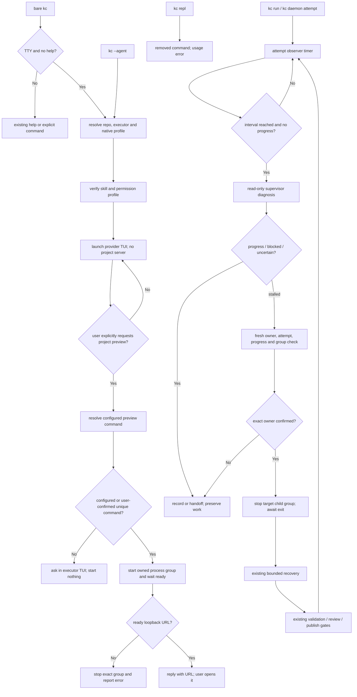

# PRD: KedaCode Agent 执行器入口、按需项目预览与停滞任务监督

> ✅ **交付前置**：无硬依赖，可立即开工。
> 结构化声明见 §8，那里是唯一依赖事实源。

> ⬜ **验收状态**：未开工。
> 本行投影 §9 Acceptance Checklist，那里是唯一事实源。

本文分两层：Part A 人审层（§1-4）说明用户价值与需确认事项；Part B 执行器层（§5-13）记录架构、实现和验收证据。

## Feature Overview (功能一览)

- **按配置启动 Agent 执行器**（FR-1）：裸 `kc` 在交互式终端直接启动所选的 Claude、Codex 或其他执行器原生对话界面；执行器由配置决定，`--agent` 可覆盖；移除旧 Keda REPL 与 `kc repl` 命令，不保留兼容入口。
- **执行器权限与上下文**（FR-2）：使用执行器自己的交互 profile、权限策略和终端 UI；注入 KedaCode operator skill 与仓库上下文，不创建 KC 网页聊天。
- **对话式项目预览**（FR-3）：只有用户在执行器对话中明确要求预览时，agent 才按仓库配置启动本地开发服务，并在终端回复可访问的 loopback URL；不猜命令、不自动打开浏览器。
- **注入 KedaCode 操作知识**（FR-4）：会话进入正确仓库，并能发现随包的 kedacode-operator skill 与启动指引。
- **定时监督活跃任务**（FR-5）：监督默认关闭；启用后默认每 30 分钟巡检，巡检周期、停滞阈值和监督执行器均可由人覆盖。
- **有界自动修复**（FR-6）：仅在确认停滞且进程归属明确时修复，仍经过既有恢复、验证和 review 门禁。
- **安全交班与兼容**（FR-7、FR-8）：需人工、跨机器或 owner 不明时停手；保留帮助、其他 CLI 和 loop-daemon 职责，移除旧 REPL。

# Part A · 人审层 (Review Layer)

## 1. Introduction & Goals

### Problem Statement

KedaCode 已能通过配置启动多个 coding-agent 执行器，也提供 operator skill，但裸 kc 在 TTY 下进入 Keda 自己的命令代理 REPL；要直接使用 Codex 或 Claude，用户必须另开命令、切目录并选择 agent。用户确认自己从未使用旧 REPL，且认为其价值有限，因此本需求直接移除旧实现和 `kc repl` 命令，不保留兼容入口。`kc console` 已有本地网页管理终端，但只管理 Runner 和 Issue，不提供 agent 对话，也不负责打开目标仓库的前端预览。现有 kc loop-daemon 按 recipe 创建新 Issue，不检查正在执行的任务。

执行链能检测 20 分钟没有 stdout/stderr 的 attempt 并终止子进程树；daemon 也能对账进程已死的僵尸任务。它们无法识别仍有输出但任务没有实质进展的情况。2026-10-08 归档的 Agent 调用追踪 PRD（#242）明确把停滞诊断和自动接管排除在范围外；用户本次明确重开该边界。

### Interpretation (解读回显)

#### 行为样例

| 验证方式 | 输入 / 操作 | 期望观察到的结果 |
|---|---|---|
| 👀 人审 + 自动验证 | 在交互式终端输入 `kc` | 按配置启动 Claude、Codex 或其他执行器的原生终端对话界面；使用当前仓库和 KedaCode operator skill；不启动 KC 网页聊天服务 |
| 👀 人审 + 自动验证 | 在执行器对话里说“打开这个仓库的前端” | agent 使用受限的预览能力启动仓库明确配置的开发命令，确认 loopback URL 已就绪后在终端回复中显示该 URL；用户自行访问，不自动打开浏览器。若命令或 URL 不唯一就先询问，不猜测、不访问远程地址 |
| 👀 人审 + 自动验证 | 输入 `kc --agent codex` 或 `kc --agent claude` | 打开所选执行器的原生终端交互界面；未安装/不支持交互时明确失败，不误跑非交互或自动批准 profile |
| 🤖 自动验证 | 输入 `kc repl`；在管道/脚本中无 TTY 地运行 `kc` | 旧 `kc repl` 命令已移除，调用时返回标准未知命令/usage error；无 TTY 裸 `kc` 仍输出帮助并返回既有非零状态 |
| 👀 人审 + 自动验证 | 启用本机监督，任务在停滞阈值内无阶段、调用或工作现场进展 | supervisor 诊断；若确认停滞且 owner 明确，先只停止该 attempt 的进程组，再经既有有界恢复修复并通过原验证门禁；同一 Issue 无并行 writer |
| 🤖 自动验证 | 监督器遇到用户输入/凭据需求、远端任务或不明进程归属 | 不抢进程、不写文件、不重置标签、不绕过门禁；留下可诊断原因和建议 |

上表每行成为 §7.6 验收 oracle；修改行为或结果格即修改验收标准。

#### 我默默定了这些

- 裸 TTY `kc` 读取默认 executor 配置并直接启动其原生交互 profile；`--agent` 选择其他已配置的执行器。
- 对话发生在执行器自己的终端 UI 中；KC 不启动网页聊天、session API 或第二个 writer。
- 执行器 profile 明确配置如何加载 KedaCode operator skill 与 bootstrap 指引；无法支持上下文注入时应明确告知，不伪称已加载。
- 旧 Keda REPL 与 `kc repl` 命令一并移除，不保留兼容别名；交互入口统一为裸 TTY `kc` 启动 provider 原生 TUI。
- 裸 `kc` 不启动项目开发服务；项目预览只响应明确的对话请求，并复用仓库显式 preview 配置，或先让用户确认唯一无歧义的开发脚本。
- 监督作为本机活跃 attempt 的一部分运行，不复用创建 Issue 的 kc loop-daemon，也不新建可并行写入的 runner。
- 每个停滞周期至多触发一次修复；恢复受既有预算、验证、review 和发布门禁约束。
- 新监督默认关闭，用户显式启用后才产生模型调用。

#### 我理解为不做

- 不把 loop-daemon 改成任务监控器，也不为巡检创建新 Issue。
- 不抢占远端/其他进程 owner 的任务，不做多机协调。
- 不新增 KC 网页聊天、session API、网页端 agent executor 或浏览器端对话同步功能。
- 不在 `kc` 启动时自动运行目标项目 dev server；不提供 KC 网页聊天、任意网页浏览或通用浏览器自动化。
- 不自动合并、发布或关闭 Issue，不跳过既有门禁。

目标是让 `kc` 按配置直接启动 Claude、Codex 等执行器的原生终端对话界面，并按用户要求启动受控的项目预览；再加上用户明确授权的本机监督器。KC 不提供网页聊天。它自愈的对象仅限自己拥有的活跃 attempt，不扫描任意 GitHub Issue 后抢占任务；任何并行修改同一 worktree、远端强制恢复或因输出少而跳过验证的实现都不符合本 PRD。

### What The User Gets

用户在仓库输入 `kc` 后，直接进入配置选择的 Claude、Codex 等执行器终端界面；执行器按 KedaCode operator skill 了解仓库、CLI 和安全边界。用户在对话中要求打开前端时，agent 可启动受配置约束的本地预览，并在终端回复中提供 URL；用户自行访问。用户还可开启后台监督，配置检查频率、停滞阈值和执行器。只有任务停滞且进程归属可证实时才会有界修复；遇到人工依赖就停下并说明。

### Measurable Objectives

- TTY 裸 `kc` 按默认配置启动匹配的原生交互 profile；`--agent` 可覆盖执行器；会话使用当前 repo cwd 并加载 operator skill。
- KC 不启动网页聊天或本地 session server；目标仓库预览只在用户明确提出后启动，URL 只接受 loopback 并在执行器终端回复中提供。
- 对话请求预览后，只有仓库白名单命令启动的子进程能被 KC 管理，目标 URL 需是该进程提供的本机地址。
- `kc --help` 和无 TTY 裸 `kc` 保持原路由与退出语义；旧 `kc repl` 返回标准未知命令/usage error。
- 未启用、未到周期、无活跃任务或任务已有进展时不调用监督模型。
- 修复前完成 attempt/owner/process-group fresh check；修复后走原验证链；同一 Issue 同时至多一个写入 executor。
- 需人工、跨主机或 owner 不明时不自动写入或终止，并可观察具体交班原因。

## 2. Human Review Map (介入与风险地图)

### 决定一：无人值守监督默认如何启用

后台模型调用和自动修复会产生费用，也可能停止正在运行的 agent。建议默认关闭，须由用户在仓库/全局配置显式启用；默认巡检周期为 30 分钟；巡检周期和停滞阈值分别有默认值且可由人覆盖。修改配置不启动后台进程，daemon 仍由用户按现有方式启动。

**已确认：** 监督默认关闭；启用后的默认巡检周期为 30 分钟，周期、停滞阈值与执行器可由人覆盖。

**验收：** 默认配置没有监督模型调用；显式启用并到达有效周期后才对符合条件的任务调用配置 executor。

### 决定二：停滞的活跃 agent 是否允许自动中断

建议仅当 KedaCode 能复核同一个 attempt、同机 owner 和该 attempt 专属子进程组时，才停止该组并交原恢复流程修复；不使用 daemon PID 或进程名猜测。若 snapshot 过期、任务仍有进展、claim 改变或无法证明组归属，就放弃修复并转人工。

**已确认：** 允许对判定停滞且 owner 与进程组均被确证的活跃 attempt 自动中断，然后由原流程进行有界修复。

**自动验收：** 通过受控 attempt 和真实子进程组验证只中断目标任务；healthy、owner unknown、状态过期及恢复门禁失败均不得误杀或继续交付。不要求为真实任务卡住、终止和修复过程采集人工现场材料。

### 决定三：执行器的权限策略

所选执行器沿用自己的权限、sandbox 和确认设置；KC 只注入 KedaCode 上下文，不附加无人值守 runner 中跳过确认的参数。权限提示由执行器原生终端界面呈现。

**验收：** 真实终端会话保留 provider 原有权限提示；生成 argv 不含无人值守 profile 的 skip-permission 参数。

### 决定四：裸 `kc` 的默认界面

裸 `kc` 按仓库/全局设置直接启动选定的 Codex、Claude 等执行器原生终端 UI；不启动 KC 网页聊天或 session server。用户可用 `--agent` 覆盖默认执行器；旧 Keda REPL 和 `kc repl` 命令移除，不保留兼容入口。只有用户在执行器对话中明确请求打开目标仓库前端时，才启动受控 dev server，并在执行器回复中提供 loopback URL；不自动打开浏览器。

**已按你的选择更新：** 对话留在执行器原生终端 UI，旧 Keda REPL 与 `kc repl` 命令一并移除，不保留兼容入口；KC 不实现网页聊天。

**验收：** 裸 `kc` 进入配置选择的 executor TUI 并注入当前仓库/skill；不会启动 KC Web chat 或项目 dev server。预览只在对话中明确请求后启动，成功后由执行器在终端回复 URL，用户自行访问。

**自动门禁，不需要逐项人工审阅**：配置合并、native interactive profile 能力声明、Typer/parser/schema 对齐、skill 安装冲突 fail-closed、预览进程归属、监督器进程所有权、恢复预算、验证门禁和文档同步由自动测试与独立 verifier 检查。Human-Confirmed 仅对应上述选择，不可由执行器视为已获授权。

**本次明确不涉及**：KC 网页聊天、登录/多用户体系、远程访问、完整 IDE 编辑器、保存并跨机器同步对话、多机接管、自动发布/合并策略变化。若无需新增持久化表，则不需 ER 图。

## 3. Usage And Impact After Implementation

**本地开发者 / KedaCode 操作者**：在初始化仓库输入 `kc`，按设置直接进入 Codex/Claude 等执行器原生终端界面；对话和权限由执行器管理。当前仓库作为 cwd，operator skill 随会话可用。skill 缺失时复用现有安全安装器；内容冲突时不覆盖用户文件。终端对话中可要求启动目标仓库前端，执行器回复中提供已就绪的 loopback URL，用户手动访问。

**任务提交者 / Agent Runner 操作者**：配置 [agent_runner.stall_supervisor] 后，用 kc run 或 kc daemon 启动任务。任务活跃时按监督间隔检查；仅无进展达到阈值才调用 supervisor。日志与 Issue attempt history 展示检查、诊断与恢复。关闭监督不改变已有执行/恢复行为。

**Reviewer / 发布操作者**：既有 pre-push review、独立 verifier、Draft PR、post-PR supervisor 与人工 review 条件不变；监督器不能代替 reviewer 接受发布结果。

**CI / 非交互 CLI 调用方**：无 TTY 的裸 `kc` 仍展示帮助并保留退出状态；`kc repl` 不再是有效命令，其他子命令保持原路由。交互 executor 只在本机 TTY 裸入口启动；监督默认关闭，因此已有 daemon automation 不会有新模型费用或终止副作用。

**执行器配置维护者**：通过 agent registry 声明默认 executor 与原生 interactive profile。仅配置非交互 run profile 的 agent 不会被猜测为支持交互 TTY；`--agent` 可选择其他已声明的交互执行器；能力缺失时给出可行动错误，不静默降级到权限更宽的执行方式。

**目标仓库前端开发者**：裸 `kc` 不启动项目服务。只有用户在执行器对话中明确提出预览时，才执行仓库显式配置的本地 dev command；未配置时先让用户确认唯一命令。KC 管理预览进程，并在执行器终端回复可访问 URL 与停止入口。

## 4. Requirement Shape

- **actor**：本地开发者、目标仓库前端开发者、任务提交者、daemon 操作者、发布 reviewer、执行器配置维护者、CI/非交互 CLI 调用方。
- **trigger**：TTY 下裸运行 `kc` 启动配置的原生执行器；在该对话中明确要求预览时才启动项目服务；或启用监督后，`kc run` / `kc daemon` 的活跃 attempt 到达配置检查周期。
- **expected behavior**：原生 TUI 会话使用当前仓库和 operator skill；本地预览仅执行已确认命令并在终端回复 loopback URL，用户自行访问；监督器仅在停滞且权限与进程所有权可证实时进入有限恢复；原门禁继续生效。
- **scope boundary**：不新增 网页聊天面；预览命令和 URL 限于本机；监督对象限于当前 KedaCode execution path 拥有的活跃 attempt；不跨主机抢占，不控制任意 agent 进程。

# Part B · 执行器层 (Build Layer)

## 5. Repository Context And Architecture Fit

### Existing Path / Reuse Candidates

- 裸入口是 src/backend/api/cli_typer_app.py::_app_callback：TTY 无子命令当前转发给旧 REPL；非 TTY 显示帮助并返回错误；--help 由 Typer 保留。本需求将 TTY 路由改为原生 executor，并移除旧 REPL 路径。
- 旧 REPL 路径包括 src/backend/api/cli_parsed_commands/agent.py::run_repl_command、src/backend/core/use_cases/repl_session.py 与 src/backend/engines/agent_runner/repl_command_executor.py；连同 `kc repl` 注册、专属配置和测试一起清理，不迁移旧 allowlist。
- Agent profile / 配置模型位于 `src/backend/core/shared/models/agent_spec.py`、`src/backend/infrastructure/config/agent_runner_settings.py`、`src/backend/engines/agent_runner/factory_config_builder.py`；`config.toml` 和仓库 `.kedacode.toml` 合并。为裸 `kc` 配置显式的原生 interactive profile；现有 Codex `exec`、Claude `-p` 形式不能直接冒充交互会话。
- `kc console` 通过 `src/backend/api/cli_typer_console.py` 提供 Runner 运维页面，与裸 `kc` 的原生执行器对话无关；本任务不改 Console 或 `frontend-public`。
- 裸 `kc` 通过前台子进程启动所选 executor，将 stdin/stdout/stderr、工作目录、信号和退出状态正确交给原生 TTY 会话；不托管聊天服务器。
- 项目预览沿用 `src/backend/infrastructure/process_runner.py` / `process_supervisor` 的进程组与生命周期模式；增加范围受限的 `kc preview` 入口及目标 URL 解析，不接受任意远程 URL 或任意 PID。
- 执行/恢复主路径为 src/backend/core/use_cases/run_agent_execution_loop.py、run_agent_once.py 与 run_agent_daemon.py；attempt 记录由 agent_runner_attempt.py / agent_runner_attempt_recording.py 组织。
- 子进程、进程组和 inactivity watchdog 位于 src/backend/infrastructure/process_runner.py；超时可按具体 Popen/group 终止。daemon 收 SIGTERM 会清理全部后代 agent 进程组，因此监督必须有 attempt→process-group 精确取消入口，不能借用 shutdown handler。
- src/backend/core/use_cases/agent_invocation_tracing.py、src/backend/infrastructure/persistence/console_store_invocations.py 与现有 Issue 日志/attempt history 是进展和审计复用候选；先确认事件，不重复存调用事实。
- 随包 skill 源位于 src/backend/engines/agent_runner/templates/skills/kedacode-operator/；安装使用 install_packaged_operator_skill。待办 #245 提供独立 kc skill install 入口，但无硬依赖；复用同一安装器。
- [agent_runner.daemon] 是任务/review daemon 设置；kc loop-daemon 读取 ~/.kedacode/loop-state.json 并创建 recipe Issue。监督放在共享 attempt 生命周期，不增加第二个工作队列 daemon。

### Architecture Constraints

- 遵守 api -> core -> engines -> infrastructure：停滞判定与恢复在 core，provider argv/profile 在 engines，TTY、subprocess 与 process group 在 infrastructure。
- Native profile 显式声明 TTY 能力、prompt/skill 交付方式，不能从 run profile 猜测。
- 修改 worktree 前等待旧 executor 退出，并重新核验 attempt id、claim owner、进程组和 worktree identity。
- 复用 recovery budget 与 validation/review gate，不加第二套预算；不保存完整 secret/environment 或冗余 prompt。
- 遵守 api -> core -> engines -> infrastructure；API 不直接拼 provider 命令，前端不承载进程控制策略。
- 对齐 Typer/parser/schema；不改 `frontend-public`、`frontend-admin` 或 Console 页面。预览进程通过窄 CLI 能力管理，并将 loopback URL 输出到 provider TTY 对话。

### Existing PRD Relationship

- Pending #245 P2-BUG-20261008-145100-kc-skill-reinstall-entry.md 改进 packaged skill 独立安装入口；共用安装函数但无先后依赖，不再开发第二套安装器。
- Pending #246 P1-PERF-20261008-161246-backlog-list-snapshot-swr.md 改 backlog snapshot；#247 P1-FEAT-20261008-165241-console-cli-parity-operations.md 改 `frontend-public` 与 Console API。本任务不改前端或 Console，只有共享配置/CLI 文件可能需要按实施时 HEAD 协调。
- Archived #242 P1-FEAT-20261008-015223-agent-invocation-tracing-and-stall-diagnosis.md 明确排除 stall detection/auto takeover。用户本次明确重开该边界；不改归档 PRD，也不把 invocation trace 当作停滞判定的充分证据。
- Archived #206 P1-FEAT-20260930-225000-daemon-crash-reconciliation-session-resume.md 已覆盖死进程/daemon 崩溃后的 claim 对账和续传；本次复用身份、标签和恢复概念，增加仍存活的同机进程监督。
- Roadmap：原生 kc 是 M1“完整交互终端体验”的子集，不代表 issue 浏览/选择/澄清完成；监督是 M3 恢复和 operator 审计时间线扩展，不改变里程碑顺序。交付同步校准 roadmap。

### Potential Redundancy Risks

- 不新增 task monitor daemon、独立任务队列或第二份 stale claim 数据。
- 不把 20 分钟 output inactivity watchdog 等同业务进展。
- 只保留一个裸 `kc` 原生 TUI 交互入口，不维护旧 REPL 或双入口兼容层；不把 lifecycle_agents.supervisor 的只读 PR 审核扩大成执行期写权限。
- 不硬编码跨版本参数；原生交互能力由 agent profile 明确声明并验证。
- 不新增网页聊天、session 服务或前端打包路径；复用已有 agent runner、预览进程监督和 attempt 生命周期。

## 6. Recommendation

### Recommended Approach

TTY 裸 `kc` 读取仓库/全局设置，解析默认 executor 与原生交互 profile，在当前 repo cwd 直接启动 Claude、Codex 或其他配置执行器的终端界面。对话和权限交给执行器本身；KC 不实现 Web chat、不创建 session server。`--agent …` 可覆盖默认 executor；旧 Keda REPL 和 `kc repl` 命令一并移除，不保留兼容入口。只有用户在对话中明确要求预览项目时，才按受控 preview profile 启动本地开发服务，并把验证过的 loopback URL 回复到执行器对话中；用户自行访问。

用户在执行器终端对话中明确要求预览项目时，agent 才调用受限的 `kc preview` 能力：先解析仓库显式预览配置；若不存在，则只在仓库内唯一发现一个开发入口时向用户确认。确认后的命令以目标仓库 cwd 启动为受管子进程，只接受其报告/配置的 loopback URL；agent 在终端回复该地址，用户自行访问。裸 `kc` 启动时不运行项目命令，KC 不自动打开浏览器。停止动作只针对 KC 持有的准确进程组。

监督作为共享 run-attempt 的低频 observer 并默认关闭。仅当阶段、调用与工作现场都无实质进展达到阈值才调用 read-only supervisor prompt。诊断后 fresh-check owner/attempt/process group；若需修复，仅停该 attempt 专属 child group，等待退出后通过既有 recovery 启动唯一 writer并复跑原验证与 review。无法证明时记录原因交人，不作猜测性写入。

### ROI 与范围取舍

停滞监督可以复用 agent registry、skill 安装器、watchdog、attempt history、有限 recovery、invocation tracing 和 daemon 单实例约束；不另建 supervisor 服务或任务队列。入口改造复用执行器已有的 TTY profile，把复杂度限制在默认 executor 选择、skill 注入和受控项目预览，不新增 Web 聊天、session API、前端 route 或并发会话安全层。用户在 Codex/Claude 原生交互界面中对话；项目预览仅在明确请求后启动并由终端返回 URL。建议现在做；监督默认关闭，避免额外模型费用和自动中断。

### Proposed Solution Summary (实现机制)

- **终端执行器入口**：裸 TTY `kc` 通过 agent registry 读取默认 executor 和原生交互 argv，以当前 repo cwd、TTY、signal 和退出码启动 provider CLI。`--agent …` 覆盖默认值；profile 缺失或不支持交互时 fail-fast，不回退到非交互或自动批准模式。
- **执行器设置**：配置区声明默认 executor、交互 argv、skill 加载方式与 bootstrap 指引。Codex、Claude 或其他 agent 由人选择/配置；不引入 ACP 或网页端对话；直接启动配置的原生 TUI。
- **对话式预览**：随包 `kedacode-operator` skill 说明只有用户明确要求时调用 `kc preview start`。命令读取 repo preview profile；若缺失，仅展示单一可识别候选并要求人确认。启动准确的进程组、等待 ready、校验 loopback URL 后把地址发回执行器对话，供用户手动访问；不调用系统浏览器，不接受任意 shell 文本。无唯一命令/ready URL 时交回对话澄清，不猜默认端口。
- **Skill/bootstrap**：复用 packaged operator skill fail-closed installer；通过 profile 支持的启动指引要求 agent 使用该 skill，并提供 repo root 和安全边界。冲突不覆盖用户内容。
- **监督器**：复用 attempt lifecycle、event/log 和 worktree 元数据；用单调时钟计算 interval 与无进展窗口。实质进展包括阶段推进、调用终态、新 commit/工作树变化、验证或 PR/Issue 状态变化。stdout 更新本身不算。候选快照只含必要状态摘要，不含凭据、环境变量或完整 prompt。
- **诊断/修复**：监督 executor 只读，返回 progress / blocked / stalled / uncertain。blocked/uncertain 交人；stalled 后 fresh-check claim、attempt、progress 和 child-group ownership。全匹配后精确停止该组、确认退出，向既有 recovery 注入诊断摘要。重进展后才可重置停滞窗口；原验证、review 和发布 gate 不变。
- **配置**：新增/扩展 [agent_session] 声明默认 executor 和 profile；[agent_session.preview] 仅配置可执行 argv、ready URL/timeout 等白名单能力。监督新增 [agent_runner.stall_supervisor]，含 enabled=false、check_interval_seconds=1800、stalled_after_seconds=1800；两项默认值均可由人覆盖、agent 默认为 lifecycle_agents.supervisor。仓库/全局配置可覆盖；数值须为正。attempt 监督复用已有 run context，不加会话历史表或第二事实源。
- **文档/分发**：同步 agent-runner/configuration guides、ROADMAP、mkdocs 导航、随包 operator skill 和 references；说明裸 `kc` 按配置启动 provider TTY、`--agent` 覆盖、旧 `kc repl` 命令移除与 `kc preview` 的边界。

### Alternatives Considered

- 只改裸 kc 不做监督：不满足周期诊断修复目标。
- 仅启动现有 `kc console`：它是 Runner Operations Console，不是 provider 原生对话入口。
- 让每个 provider 单独实现 KC 自建 provider 网页聊天：会增加 session、权限转发与前端维护面；复用 provider 原生 TUI。
- 裸 `kc` 同时启动两个独立 agent：用户输入与历史会分叉；只启动一个配置的 executor。
- KC 启动时自动运行仓库 dev server：增加启动耗时、资源占用和仓库任意脚本执行面；仅在用户对话中明确请求后启用。
- 新建 supervisor daemon 扫 GitHub label：与 kc daemon/run 争 claim，不能准确控制 live Popen，还需第二套状态。
- 重载 kc loop-daemon：破坏创建 recipe Issue 的既有语义。
- 只靠 stdout inactivity watchdog：区分不了长思考和持续输出无进展。
- 到时直接启动第二个写 agent：同 worktree 双 writer 可能覆盖未提交工作。
## 7. Implementation Guide

> 本节是 living implementation guide。若实现发现隐藏依赖、路径移动或更合适的复用方式，先更新本节和 Change Log。

### 7.1 Core Logic

TTY 裸入口 → resolve 当前 repo 与默认 executor → 验证 native interactive profile、operator skill 与权限边界 → 在当前目录以原生 TTY 启动 executor，并转发输入、输出、信号和退出状态。`--agent <name>` 选择其他已配置 executor；旧 `kc repl` 命令返回 usage error；help、其他显式子命令和无 TTY 行为保持既有路由。启动入口不创建 Web server，也不运行项目 dev command。

对话中用户明确要求预览项目时，skill 指引 agent 使用受限的 `kc preview`：加载 repo preview profile；配置不存在时只把唯一候选交给用户确认；启动精确 argv 为受管进程组，等待 ready 并校验 loopback URL；agent 在执行器终端回复 URL，用户自行访问。未就绪、地址非本机或命令不唯一时停止/交还澄清。停止动作只作用于 KC 持有的准确进程组。

共享执行中的每个活跃 attempt 以单调时钟检查。未到点，或 stalled threshold 内有阶段/调用终态/worktree/commit/验证/PR 状态变化时不调用模型。候选输入只包含 repo/issue identity、attempt id、事件、最近调用摘要、diff/commit 摘要及 Issue/PR/check 状态。监督 profile 只读，返回 progress / blocked / stalled / uncertain。

对 stalled 结论，重新读取 claim、attempt id、最后进展值和 child group owner；任何变化都丢弃 verdict。owner 确认后停止准确 child group、等待回收、记录结果，再启动原 recovery。旧 worktree 不得并发释放或复建。daemon 重启后的 dead-owner 继续由现有 reconcile 处理。

### 7.2 Change Impact Tree

```text
Database
└── no migration
    【总结】原生会话不保存 Keda transcript；attempt 复用现有 claim/event，不增加数据库和第二事实源

Infrastructure
├── src/backend/infrastructure/process_runner.py [按需修改]
│   【总结】为 attempt observer 暴露 heartbeat/精确 cancel，并管理按需预览 child group
│   └── 保持现有 timeout 和 daemon shutdown 语义
└── src/backend/infrastructure/config/agent_runner_settings.py [修改]
    【总结】解析 native interactive profile、preview allowlist 与 supervisor 配置

Domain
├── src/backend/core/shared/models/agent_runner.py [修改]
│   【总结】描述进展快照、监督结论、owner 与取消结果
├── src/backend/core/shared/interfaces/agent_runner.py [修改]
│   【总结】定义只读 supervisor 与 per-attempt process-control 契约
├── src/backend/core/use_cases/run_agent_execution_loop.py [修改]
│   【总结】在共享 attempt loop 插入 observer 与串行恢复
├── src/backend/core/use_cases/run_agent_once.py [修改]
│   【总结】将唯一 run/attempt context 传给监督器
├── src/backend/core/use_cases/agent_invocation_tracing.py [按需修改]
│   【总结】仅在现有事件不足时补进展关联，不复制调用记录
└── src/backend/core/use_cases/agent_runner_stall_supervision.py [新增，如需]
    【总结】分类进展/阻塞/停滞/不确定并协调单次修复

API / CLI
├── src/backend/api/cli_typer_app.py [修改]
│   【总结】TTY 裸入口启动配置的原生执行器；保留 help、非 TTY 与显式命令
├── src/backend/api/cli_typer_agent.py [按需修改]
│   【总结】增加/调整 `--agent` 入口并与 parser/schema 对齐，移除旧 `kc repl` 命令
└── src/backend/api/cli_typer_preview.py [新增或复用]
    【总结】让对话 agent 以受限命令管理项目预览并返回 loopback URL

Engines
├── src/backend/engines/agent_runner/interactive_agent_session.py [新增，如需]
│   【总结】使用声明式 native profile、skill/bootstrap 和 repo cwd 启动 TTY 会话
└── src/backend/engines/agent_runner/templates/skills/kedacode-operator/SKILL.md [修改]
    【总结】描述原生入口、按需 `kc preview`、监督诊断和安全边界

Tests
├── tests/test_cli_agent_session_entry.py [新增或扩展]
│   【总结】验证裸 kc 原生 profile、stdio/cwd/signal，并确认旧 `kc repl` 命令已移除
├── tests/test_kc_preview.py [新增]
│   【总结】验证明确请求、精确命令、loopback URL、ready timeout 与准确 stop
└── tests/test_agent_runner_stall_supervision.py [新增]
    【总结】验证进展阈值、精确取消、owner 复核、预算和负控

Docs
├── docs/guides/agent-runner.md [修改]
│   【总结】说明 TUI/Console/按需 preview 入口、旧 REPL 移除、监督配置和安全边界
├── docs/guides/configuration.md [修改]
│   【总结】记录默认关闭、间隔和阈值配置
└── ROADMAP.md [修改]
    【总结】校准 M1 原生终端入口与 M3 监督子能力，不把窄功能标为完整里程碑
```

### 7.3 Risk Classification Register

| Change point | Tier | Decisive reason / override | Intervention | Failure-discriminating oracle |
|---|---|---|---|---|
| native TTY 入口与 argv | R2 | 改变公开 CLI 模式并启动真实 provider | 验证裸 `kc` 路由、`--agent`、cwd、signal、help/no-TTY 与 fail-fast | rv-1、rv-2 |
| `kc preview` 命令与子进程组 | R2 | agent 可启动本地仓库脚本 | 必须配置/确认 argv；loopback URL 校验；只 stop 精确 group | rv-1 |
| operator skill/bootstrap | R2 | 缺失会导致 agent 误用 CLI 或安全边界 | fail-closed 安装；新会话核验 skill discovery | rv-1 |
| 默认关闭、定时成本和 executor config | R2 | 错误默认会造成费用与自主操作 | 新旧 TOML、关闭负控、无候选 zero-call | rv-4 |
| 活跃任务停滞判断 | R3 | 误判会中断用户长任务 | 只读诊断、多信号判断、fresh progress/claim check | rv-3 |
| 精确 process-group cancel 与串行 recovery | R3 | 错杀或双写可能破坏用户数据 | 真实 Popen/owner；unknown fail-closed；旧进程退出后 recovery | rv-3 |
| 原验证/review/publish gate | R2 | 自愈不可成为旁路 | 回原 orchestrator，失败负控仍阻断交付 | rv-3 |
| 配置、schema、docs 和发行 skill | R1 | 可机械验证的一致性风险 | 配置/schema/skill-package/mkdocs 检查 | rv-2、静态门禁 |

### 7.4 Core Flow



### 7.5 Executor Drift Guard

实现前用 `rg` 重新确认 `_app_callback`、旧 REPL 注册与实现的删除点、interactive/profile 合并、TTY stdio/signal/exit-code 转发、preview dev command 与进程 group、attempt start/finish event、recovery prompt 注入点、skill installer 和 global/repo config merge。不为裸 `kc` 增加网页 session/FastAPI route。若 invocation tracing 或 child cancellation 已被并行改动，不重复事件或状态，更新本 PRD。CLI/API 变化同步 Typer、parser/schema、模板 config、docs 和发行 skill。

### 7.6 Realistic Validation Plan

```yaml
- id: rv-1
  behavior: "真实 TTY 中裸 kc 进入配置的 provider 原生对话，加载当前 repo/operator skill；项目预览仅在对话中明确请求后启动并返回 loopback URL。"
  reviewer: human
  real_entry: "在隔离 clone 的真实 TTY 运行 uv run kc，使用当前配置的 Codex 或 Claude 原生 TUI 完成一轮对话；先确认目标仓库 dev server 未运行，再明确要求预览项目。另运行 uv run kc --agent <provider> 验证覆盖配置。"
  expected: "当前 repo 是 executor cwd；skill 可发现；provider 正常权限提示保留；裸启动不产生项目 server 进程。请求预览后只启动唯一已配置/确认的 repo dev command，ready 后在终端回复 loopback URL，浏览器保持未自动打开。"
  mock_boundary: "自动化可用 fake CLI 检查 argv、stdio、cwd 与生命周期；Human acceptance 需真实 provider 原生 TTY 会话和真实预览服务。不得 mock CLI dispatch、预览 process group、ready URL 或手动访问边界。"
  tier: R3
  test_layer: sandbox
  required_for_acceptance: true
  presentation: "tasks/evidence/P1-FEAT-20261009-123512-kc-agentic-entry-and-stall-supervision/rv-1-kc-terminal-preview.png；交付时提供真实终端会话截图/日志和启动前后进程证据。"
  critical_value_source: "实际 executor argv/cwd、skill discovery、权限提示、preview argv、owned child process 与 ready loopback URL。"
  must_cross: "真实 shell TTY → kc callback → repo/config → native provider TUI → operator skill → 对话中的 preview 请求 → kc preview CLI → owned process group/readiness → loopback URL 返回到 TTY。"
  forbidden_bypasses: "不可直接运行 provider 冒充 kc 路由；不可用 -p/exec 或假 skill 冒充原生 TTY；不可由裸 kc 自动运行项目脚本；不可用任意远程 URL、shell 文本或 PID 绕过 preview profile/process owner。"
  fresh_state_probe: "新 kc 进程启动前采集 preview 端口/进程；启动后再次确认没有项目 server；明确请求后确认目标子进程和 loopback URL；preview stop 后重新读取 PID/group registry 与端口，确认进程退出。"
  final_tree_evidence: "记录 provider/版本、repo、脱敏 argv/effective config、skill 位置、preview URL/process group、git tree 和 evidence SHA256；profile/preview 改动后重采。"
  negative_control: "对无 preview 配置或多个候选 dev command 的仓库请求打开前端；用 non-interactive-only profile 启动裸 kc。"
  expected_fail: "未确认唯一命令前不启动子进程；不支持 TTY 的 profile 在触碰项目进程前明确报错；裸 kc 不自动启动 preview 或浏览器。"

- id: rv-2
  behavior: "旧 kc repl 命令已移除；kc console 与无 TTY 裸 kc 保持原路由和退出语义；TTY 裸入口只启动原生 executor。"
  reviewer: verifier
  real_entry: "uv run kc repl --help；uv run kc console --help；printf question | uv run kc"
  expected: "kc repl 返回标准未知命令/usage error，旧 Keda REPL、allowlist 与 REPL 专属配置不再注册或执行；kc console 仍启动 Runner Operations Console；no-TTY 裸 kc 输出帮助且保留既有非零状态；Typer/parser/schema 一致。"
  mock_boundary: "provider/GitHub 可替换；真实 CLI dispatch、schema 和 TTY 检测不得 mock。"
  tier: R1
  test_layer: e2e
  required_for_acceptance: true

- id: rv-3
  behavior: "受控 attempt 的停滞诊断和有界恢复正确；healthy、unknown owner 和人工依赖状态不会被误中断或写入。"
  reviewer: verifier
  real_entry: "运行通过真实 CLI/use-case 与真实子进程组的本地 integration harness；用 fake executor 控制 progress、stalled、blocked 与失败状态，不连接 GitHub，不要求真实任务停滞。"
  expected: "仅 stalled 且 fresh owner/attempt/group 匹配的目标进程组被停止一次；确认退出后才调用既有 recovery；原验证/review gate 通过才成功。healthy、unknown owner、身份变化、人工依赖和验证失败均安全交班或失败。"
  mock_boundary: "executor verdict 与 GitHub 可替换；attempt owner 检查、CLI/use-case 路由、真实隔离 process group、取消、串行恢复和验证门禁必须经过。无需真实 provider 诊断调用。"
  tier: R3
  test_layer: integration
  required_for_acceptance: true
  presentation: "无单独人工呈递物；按常规自动化测试验证，无需为停滞场景生成专项报告、截图或录屏。"
  critical_value_source: "结构化 supervisor verdict、live attempt/claim/group identity、进程退出状态及 recovery/validation 调用结果。"
  must_cross: "CLI/use-case → active run attempt → 真实 child group → controlled progress snapshot → read-only supervisor verdict → fresh owner/progress probe → 精确取消 → existing recovery → 原验证/review gate。"
  forbidden_bypasses: "不可只测纯函数；不可 kill daemon PID/其他 group；不可旧 writer 未退就启动新 writer；不可 mock 子进程组冒充取消成功；不可绕过原验证/review gate。"
  fresh_state_probe: "取消前后二次读取 attempt id、claim owner 和 process-group membership；恢复前确认旧 writer 已退出；结束后确认同任务至多一个活跃 writer。"
  final_tree_evidence: "此项无单独证据要求；按仓库常规测试与代码审查流程执行，不另行整理或提交材料。"
  negative_control: "用 healthy attempt、unknown group owner、过期 snapshot、变化中的 claim、需人工输入和验证失败作为负控。"
  expected_fail: "负控不触发目标组外的终止或工作区写入；验证失败不报告修复成功。"

- id: rv-4
  behavior: "agent_session 与 preview profile 按层级配置；监督默认关闭且周期、阈值、executor 生效；非候选任务不调用模型。"
  reviewer: verifier
  real_entry: "uv run kc --help；uv run kc daemon --help；新 CLI 进程加载默认与 override TOML，分别触发 agent_session profile resolution、preview profile validation 及 supervisor tick。"
  expected: "旧配置加载时 TUI/preview 能力不会被猜测；global/repo provider 与 preview argv 按优先级合并；未知或非-loopback preview host、空 command、无效周期/阈值在启动 provider/进程前报错；监督默认关闭，未到点、有进展或无活跃 attempt 时 provider 调用数为零。"
  mock_boundary: "executor adapter 可记录调用数；真实 TOML loader/merge、CLI 和 scheduler 不得 mock。"
  tier: R2
  test_layer: integration
  required_for_acceptance: true
  critical_value_source: "新进程解析的 AppConfig effective values 与实际 native executor argv、preview process argv 和 scheduler call count。"
  must_cross: "global/repo TOML → config loader/merge → CLI/native session or daemon scheduler → registry/profile → adapter or process invocation count。"
  forbidden_bypasses: "不可只构造 settings model；不可 helper 替代 TOML/CLI；不可 mock 输出伪造 zero-call。"
  fresh_state_probe: "每种配置新建 CLI 进程，采集一次 tick 的 trace 和 adapter 记录以排除进程缓存。"
  final_tree_evidence: "归档原始配置、非秘密解析摘要、tick/trace 和 git tree；default/merge/scheduling 改动后重采。"
  negative_control: "临时 TOML 将 check_interval_seconds 设 0、stalled_after_seconds 设负值或 preview URL host 配为公网地址，从 CLI 启动。"
  expected_fail: "agent/provider/preview process 调用前报具体字段与允许范围，不静默回退、不绑定非 loopback host、不开始调度。"
```

失败排查顺序：先检查 config merge、native interactive profile、skill install root 与 preview process owner；监督故障先核对 attempt/claim id 与 group owner，不能只看 stdout 时间戳。

### 7.7 External Validation

| Topic | Source | Checked On | Relevant Finding | Impact On Recommendation |
|---|---|---|---|---|
| CodeBuddy Code CLI 交互入口参考 | [CodeBuddy CLI](https://www.codebuddy.ai/docs/cli) | 2026-10-09 | 用户提供的终端截图展示原生交互界面，并在终端列出可访问的本地 URL。 | 参考终端信息层级；本需求对话留在 provider TUI，不复刻网页聊天。项目预览 URL 仅在对话请求后返回。 |
| Codex CLI 本地入口 | [OpenAI Codex CLI README](https://github.com/openai/codex/blob/main/README.md) | 2026-10-09 | Codex CLI 在本机运行，正常入口是运行 codex。 | 配置 native interactive profile，不复用 codex exec；具体参数以目标版本实测。 |
| Claude Code 交互/非交互 | [Claude Code CLI reference](https://code.claude.com/docs/en/cli-usage) | 2026-10-09 | claude 启动交互会话，claude -p 是执行后退出的 query 模式。 | 单独配置 native interactive profile，不把 -p 当裸 kc 模式。 |
| 目录化 Agent Skill | [OpenAI Agent Skills guide](https://developers.openai.com/api/docs/guides/tools-skills)；[Claude Code Skills](https://code.claude.com/docs/en/skills) | 2026-10-09 | 两家均将 skill 作为含说明和可选资源的目录化工作流；加载细节由客户端决定。 | 使用 provider 原生 skill 路径并显式 bootstrap；须在新会话验证加载。 |

### 7.8 Prototype / Data Model

- **Frontend impact：无。** 不新增网页对话页、session API 或浏览器聊天；`frontend-public/` 和 `frontend-admin/` 不在本需求变更范围。只有用户在执行器 TUI 对话中明确要求预览时，才启动受限项目服务；agent 在终端回复 loopback URL，用户决定是否访问。
- 概念图片原型已登记：[KC 终端执行器与按需项目预览](../../docs/prototypes/kc-agent-terminal-preview.md)，原图为 [kc-terminal-agent-preview.png](../../docs/prototypes/assets/kc-terminal-agent-preview.png)，提示词和图片来源记录在同名 `.prompt.md`。它是 ImageGen 静态概念图，不是实际 Codex/Claude 截图、交互原型或实现证据。
- 交付验证从真实 `kc` TTY 入口走通原生 executor 与明确请求后的 preview；停滞监督按 §9.1 的常规自动化测试验证，不要求真实任务现场材料。概念图不能替代原生入口与 preview 验证。
- No interactive prototype implementation in this PRD.
- No persistent data model/migration required：执行器 transcript 由 provider 管理；preview process 与 attempt 使用现有进程所有权/生命周期，不引入聊天历史表。

## 8. Delivery Dependencies

### Delivery Dependencies

```yaml
depends_on_tasks_issues: []
gate_type: none
notes: "已检查 ROADMAP、pending 与 archive。#245 共用 skill installer，但没有先交付依赖；复用当前安装实现。#246/#247 不在本任务的前端变更范围内；共享配置/CLI 文件如有并行改动，按实施时 HEAD 协调。#242 明确排除了 stall diagnosis，本需求由用户重新打开该边界。"
```

无硬依赖，可开工；#247 建议先按其既定依赖顺序合并或在同一 frontend bundle 上协调实现。此区块是依赖唯一事实源，顶部 banner 仅作投影。

## 9. Acceptance Checklist

### 9.1 人读呈递区（Human Review Surface）

| 要看什么 | 呈递物 | 人如何快速确认 |
|---|---|---|
| 裸 `kc` 进入原生执行器 TUI；明确请求预览后在终端收到 URL | tasks/evidence/P1-FEAT-20261009-123512-kc-agentic-entry-and-stall-supervision/rv-1-kc-terminal-preview.png，交付时采集真实 TTY 截图/日志。 | 核对 provider、repo、skill 与权限提示；比较裸启动前后进程确认未自动启动项目服务；请求预览后确认 ready 并由终端回复 loopback URL。 |
| 停滞 attempt 的自动诊断与有界恢复 | 无单独人工呈递物；纳入常规自动化验证，不要求真实停滞任务现场材料。 | 此项不要求人工查看或提交专项证据；按受控 attempt/process-group 自动化测试验证安全边界。 |

verifier-only 组：旧 REPL 删除与剩余 CLI 路由、config/default/profile/schema、调用预算、脱敏、skill 包和静态架构门禁只有失败时升级。完成消息需报告本表各项状态；停滞监督不另附专项证据材料。

### 9.2 Acceptance Evidence Package

#### Human-Confirmed

- [ ] 确认原生 TTY 使用所选执行器的正常权限、sandbox 与确认配置；不附加无人值守 skip-confirm 参数。（§2 决定三；rv-1）
- [ ] 确认监督默认关闭；启用后默认每 30 分钟巡检，周期、停滞阈值和执行器均可通过配置覆盖。（§2 决定一；rv-4）
- [ ] 确认裸 `kc` 默认启动配置的 provider TUI；只用 `--agent` 覆盖执行器。项目预览只在对话请求时启动并返回 URL；已查看终端/preview 概念原型。（§2 决定四；rv-1）

#### Architecture Acceptance

- [ ] 旧 REPL 实现、`kc repl` 命令、专属白名单和配置均已移除；`kc console` 运维面板语义不变；证据 rv-2-cli-compat.txt。
- [ ] `kc preview` 只启动 repo profile 中精确 argv 或经用户确认的单一候选；URL 必须由 owner process 提供且 host 属于 loopback；停止动作只影响 KC 持有的 process group；rv-1。
- [ ] 中断 group 与 attempt 绑定；unknown/foreign group 不进入终止分支。
- [ ] 同一 Issue 的监督/恢复期间至多一名写 executor。
- [ ] 复用 invocation trace、claim、recovery 和验证事实，无重复表/队列；migration absence、依赖方向和仓库搜索证明。

#### Dependency Acceptance

- [ ] 与 #245 共存时仍调用同一 packaged skill installer；无第二份 skill-root 写算法；rg 与 installer contract 证据。

#### Behavior Acceptance

- [ ] 真实 TTY 中裸 `kc` 启动所选 Codex/Claude 原生多轮会话；新会话使用当前 repo、skill 与 executor 权限；rv-1。
- [ ] 仅有非交互 profile、provider 缺失或 skill 冲突时 fail-fast，不改用自动批准 profile 或覆盖 skill；rv-1 负控。
- [ ] TTY 路由、`--agent`、已移除的 `kc repl`、`kc console`、`kc --help`、no-TTY 在 Typer/parser/schema 一致；rv-2。
- [ ] 裸启动不运行项目 dev server；只有用户在对话中明确请求后，agent 才启动配置/确认过的 preview 命令，并在 TUI 回复 loopback URL；没有唯一命令时先询问；rv-1。
- [ ] 默认关闭时 daemon 无新增模型调用或取消；巡检周期默认 30 分钟且可覆盖；停滞阈值与 executor 也按配置优先级加载；rv-4。
- [ ] 每个停滞窗口至多一次调用；progress/blocked/uncertain 不写工作区；旧进程退出并复核 owner 后才 recovery；rv-3。
- [ ] 自愈复用 recovery budget、验证命令、pre-push review 与发布 gate；验证失败不报成功；rv-3。
- [ ] 人类输入、凭据、远端 claim 或 identity 改变时交班，目标进程和工作树不被监督轮改动；rv-3 negative control。

#### Documentation Acceptance

- [ ] docs/guides/agent-runner.md、docs/guides/configuration.md、随包 operator skill 与 references 同步；导航变化时更新 mkdocs.yml。
- [ ] ROADMAP.md 更新 M1 原生交互终端子项、M3 恢复/审计状态与「交互终端 / 管理 Dashboard」边界，不把 M1 全里程碑标完成。
- [ ] kc schema --json、kc --help 与发行包 skill 指引反映最终能力。

#### Validation Acceptance

- [ ] just test-changed 验本次改动：公开 CLI、旧 REPL 移除、interactive profile、监督并发/取消、配置合并与恢复验证链；结果写 evidence report。
- [ ] 若改全局 run lifecycle、process runner/interface、跨层契约或持久化，执行 just test all；核心档不能代替全量。
- [ ] just lint、just lint --reuse、mkdocs build --strict 和 PRD checker 通过；guard 失败修触发源，不改守卫放行。
- [ ] 独立 verifier PASS；R2/R3 代码变化后重跑相应 oracle，证据绑定最终 Git tree。
- [ ] 真实入口高保真验证：真实 Codex/Claude 原生 TTY + 明确请求后的 repo preview；受控进程组 integration 覆盖 stalled、healthy、unknown-owner；rv-1 至 rv-4。

#### Delivery Readiness

- [ ] CLI、配置、进程所有权、skill 文档/发行模板和安全门禁均到目标状态，无临时 façade 或未处理范围分歧。
- [ ] 自动化验证覆盖 native TTY、按需 preview 和受控 stall supervision；停滞监督不要求额外报告、截图、录屏、真实任务现场或 GitHub sandbox 材料。
## 10. Functional Requirements

- **FR-1 Native executor entry**：TTY 裸 `kc` 读取配置的默认 executor 和 interactive profile，并在当前 repo cwd 启动其原生 TUI；`--agent <name>` 可覆盖。正确转发 stdio、TTY、signals 和 exit code；不启动 KC chat server 或项目 dev server。profile 缺失/不兼容时报错，不静默切非交互或自动批准模式。
- **FR-2 Provider permissions and operator context**：沿用执行器正常权限与 sandbox；原生会话可发现 packaged `kedacode-operator` skill 并获得必要 bootstrap/repo 上下文。复用 fail-closed installer，不覆盖用户修改内容；冲突时停止并说明。
- **FR-3 Conversation-requested preview**：仅当用户在 executor TUI 对话中明确要求预览项目时，agent 才可调用 `kc preview start/status/stop`。默认只用 repo `agent_session.preview` 中声明的 argv；无配置时仅将唯一候选交用户确认。进程必须归 KC 所有且 ready URL host 属于 loopback；agent 在终端回复 URL，由用户决定是否打开浏览器。
- **FR-4 Operator skill bootstrap**：使用随包 `kedacode-operator` skill 和短 bootstrap 为 executor 提供 KedaCode 命令、仓库配置和安全边界；复用 fail-closed installer，不覆盖用户修改内容；skill 冲突时停止并说明。
- **FR-5 Per-attempt supervisor config**：新增默认关闭设置：`enabled=false`、`check_interval_seconds=1800`（30 分钟）、`stalled_after_seconds=1800`、`agent`。巡检周期和停滞阈值分别有默认值且可独立覆盖、校验。未启用、未到点、无活跃任务或有实质进展时不调用模型。
- **FR-6 Bounded diagnosis and repair**：监督只读，分类 progress/blocked/stalled/uncertain。仅 stalled 且 fresh attempt、claim、progress、group identity 全匹配时停止准确 child group；退出后注入诊断到既有 recovery。每个停滞窗口至多一次，仍经过原 gate 和预算。
- **FR-7 Safe handoff and audit**：owner 变化、人工/凭据依赖、远端控制或 identity 未知时不写/不杀；在现有 issue log/attempt trace 记录时间、摘要、reason 和分支；不记录 secret、完整 prompt 或冗余调用数据库。
- **FR-8 Compatibility and packaging**：移除旧 Keda REPL 实现、`kc repl` 命令、专属配置和 allowlist，不提供兼容别名；保持 `kc console`、`kc --help`、非 TTY 和其他 CLI/schema 合约；不改变 `kc loop-daemon` 创建 recipe Issue 的语义；同步 docs、roadmap、operator skill 和发行包配置，不新增静态聊天前端。

## 11. Non-Goals

- KC 网页聊天、session API、ACP-to-Web adapter、Console chat UI 或浏览器端对话同步。
- 裸 `kc` 启动时自动运行项目 dev server；通用远程网页浏览/任意 URL 打开、全自动浏览器交互。
- 多机 supervisor、远程 process kill、接管其他 runner 或任意手动后台 agent。
- 将 kc loop-daemon / loop 配方与 run attempt 状态机合并。
- 完整 IDE、代码编辑器、多用户登录、外网可访问的 Web UI、远程设备接管或跨机器 transcript 同步。
- 自动 merge/publish/close；扩大 fast-merge、direct-PR、auto-merge 或 bypass verification 权限。
- 保留旧 Keda REPL 或为 `kc repl` 提供兼容别名；无 TTY 默认开启交互。
- 默认开启后台调用，或无活跃任务时空转巡检。
- 通用停滞预测、成本平台、新数据库/事件系统。

## 12. Risks And Follow-Ups

| Risk | Outcome | Mitigation / follow-up |
|---|---|---|
| Provider CLI 更新改变 TUI argv/skill lookup | 入口失败或 skill 缺失 | 显式 profile、fake CLI contract、真实版本 smoke；不支持则 fail-fast |
| 裸入口或 preview command 越界 | 裸启动意外运行项目脚本，或 agent 启动非预期进程/返回公网 URL | 裸入口不启动项目服务；argv 使用数组配置并要求用户显式确认；repo cwd；精确 process group；ready host allowlist 仅 localhost/127.0.0.1/::1；按需 stop/reconcile |
| 误判健康长任务为停滞 | 中断有效工作 | 默认关闭、双阈值、read-only 多信号判断、fresh recheck、人工确认 |
| 把 stdout 当作实质进展 | 持续输出掩盖无交付 | 检查阶段、调用结果、worktree/commit/verification/PR 状态 |
| process group identity 失效 | 误杀或 orphan | 绑定 Popen 和 attempt；owner 不明就交班；支持 OS 实测 |
| supervisor 写命令造成循环/双 writer | 竞态或绕过预算 | diagnose profile read-only；修复只能由原 orchestrator 发起 |
| 日志快照泄露敏感内容 | 凭据/prompt 暴露 | 最小化摘要、脱敏、禁止传环境/密钥 |
| 全局与 repo 配置层级不清 | 用户误判有效设置 | configuration docs 和启动状态显示有效的非秘密摘要 |
| #245 同时触碰 installer | 文件冲突/重复实现 | 无硬依赖但复用现有 installer；执行前复核 pending 与 HEAD |

跨主机 owner、Console 时间线或成本统计应另行评估权限和持久化，不扩大本次范围。

## 13. Decision Log

| ID | Decision | Rationale | Rejected alternative |
|---|---|---|---|
| D-01 | 裸 TTY `kc` 启动配置的 provider 原生 TUI，`--agent` 覆盖执行器；删除旧 Keda REPL 与 `kc repl` 命令，不保留兼容入口 | 用户确认从未使用旧 REPL 且认为价值有限；只维护一个交互入口可减少重复实现、配置、文档与验证成本 | 保留双入口或 KC 自建聊天页，会带来重复状态、权限边界和持续维护成本 |
| D-02 | 项目预览只由对话中的明确请求触发，终端回复 loopback URL，不自动打开浏览器 | 大多数会话不需要前端；按需启动减少资源与任意项目脚本执行 | 裸 `kc` 自动启动项目服务或浏览器 |
| D-03 | 监督挂共享 attempt，不建第二个 claim daemon | 同一执行链拥有真实 process handle 与 recovery | 独立 daemon 重复队列和 claim，制造双 writer |
| D-04 | 监督默认关闭，巡检默认 30 分钟，周期与停滞阈值均可覆盖 | 避免静默费用和中断，同时保留按需调度 | 默认开启或无法覆盖频率 |
| D-05 | supervisor 只诊断，修复经原 bounded recovery 与 gates | 保持唯一 writer 与单一交付证据链 | 活跃时另起 writer 会覆盖未提交工作 |
| D-06 | owner/group 无法证实则 fail-closed | 本机不能安全控制别的机器 | 仅凭 label/age/PID 猜测后杀或重新入队 |
| D-07 | 用 operator skill + 短 bootstrap | 复用目录化交付物，减少 token 和规则漂移 | 每轮复制整份 CLI 手册进 prompt |

### Final Reconciliation

- Interpretation: 待实现后核对；目标为本机原生 executor TUI + 用户请求后启动的受控项目预览 + 本机活跃 attempt 有界监督。
- Public behavior and contracts: 待实现后核对；TTY 裸 `kc` 启动配置的 provider TUI，`--agent` 选择执行器，旧 `kc repl` 已移除且无兼容别名，`kc console` 与非 TTY 合约保留；预览 URL 仅在对话请求并成功启动后返回。
- Related PRD status: 已检查；#245 无硬依赖，#242 已归档且排除 stall diagnosis。
- Requirements and risks: §2 已记录监督默认关闭、巡检默认 30 分钟且可覆盖、执行器权限、精确中断和终端入口选择；Human-Confirmed 验收在实现后由人工确认。
- Reconciled differences:
  - none
