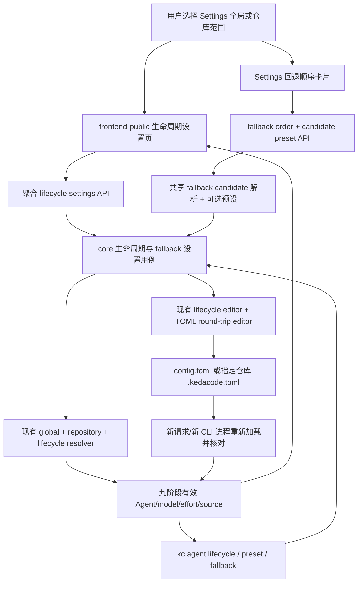

# PRD: 生命周期 Agent、模型与推理深度统一设置

> ✅ **交付前置**：无硬依赖，可立即开工。
> 结构化声明见 §8 Delivery Dependencies，**那里是唯一事实源**。

> ⬜ **验收状态**：未开工。
> 本行是 §9 Acceptance Checklist 的投影，**那里是唯一事实源**。

本文分两层：Part A 人审层（§1-4）说明需要解决的问题和需确认的选择；Part B 执行器层（§5-13）给出复用路径、实现边界与验收证据。

## Feature Overview (功能一览)

以下能力清单是 §10 Functional Requirements 的简要投影；用户可见行为以 §1 行为样例为准。

- **九个生命周期统一查看**（FR-1、FR-2）：同一张表呈现每阶段最终生效的 Agent、模型、推理深度、预设与来源。
- **全局与仓库设置放在一起**（FR-3）：专门设置页通过范围选择器查看和编辑全局默认或指定仓库覆盖；Backlog 可提供回到同一页的仓库快捷入口。
- **网页编辑阶段绑定和模型预设**（FR-4）：新建或编辑 Agent + 模型 ID + 推理深度预设，查看会受共享预设改动影响的阶段，并保存到当前配置范围。
- **CLI 查看并持久化设置**（FR-5）：批量列出所有阶段及有效值，提供 JSON 输出和有明确目标范围的预设/阶段绑定修改。
- **保留现有解析和覆盖规则**（FR-6）：继续使用全局、仓库、PRD 与命令级优先级；继承、未指定及 Agent 不支持的推理深度都明确展示。
- **配置错误提前失败**（FR-7）：未注册 Agent、未知预设或缺少必要参数模板时，拒绝保存/执行并说明具体字段，不静默忽略。
- **文档与随包操作知识同步**（FR-8）：更新用户指南、CLI 帮助和随包 `kedacode-operator` skill。
- **回退候选可选绑定预设**（FR-9，待人审）：让每个备用 Agent 可选使用匹配该 Agent 的模型预设；未绑定时保持 Agent 默认行为。

# Part A · 人审层 (Review Layer)

## 1. Introduction & Goals

### Problem Statement

KedaCode 已有 Agent 生命周期分配和模型预设：一个预设可以包含 Agent、模型 ID 与推理深度，也能绑定到九个生命周期阶段。但使用者不能在网页上一次看清所有阶段最终会用什么模型和推理深度。Settings 中原有 Agent-only 生命周期矩阵不能展示模型和推理深度，仓库配置入口又分散在 Backlog；需要用一个专门页面替换旧矩阵，并将全局与仓库范围合并到同一张有效配置表。命令行可列出预设或逐个诊断阶段，却没有完整生效矩阵的查看与持久化修改入口。

因此，用户需要在一处回答“这个阶段由谁执行、实际模型是什么、推理深度是什么、值来自哪一层”，并能把相同事实通过网页或 CLI 持久化到全局或指定仓库配置。配置缺省、继承、Agent 能力差异和 PRD/命令级覆盖都必须如实呈现。

### Interpretation (解读回显)

#### 行为样例

| 验证方式 | 输入 / 操作 | 期望观察到的结果 |
|---|---|---|
| 👀 人审 + 自动验证 | 打开专门的生命周期设置页，保持全局范围 | 一张表列出全部九个生命周期；每行可看出绑定预设、生效 Agent、模型 ID、推理深度及配置来源。没有显式模型/推理参数时明确标为 Agent 默认或未配置，不编造值。 |
| 👀 人审 + 自动验证 | 切换到一个仓库，编辑一个阶段的预设并保存，再回到全局范围 | 仓库范围显示本次覆盖和未改动阶段继承的全局值；保存后该仓库实际生效的值更新，全局值不变。页面显示被修改的共享预设会影响哪些阶段。 |
| 👀 人审 + 自动验证 | 用 CLI 请求完整生命周期 JSON，并将一个阶段绑定到已有预设 | 输出包含九个阶段及各自的有效 Agent、模型、推理深度、预设和来源；绑定命令写入明确选定的全局或仓库配置，新的 CLI 进程读回相同值。 |
| 👀 人审 + 自动验证 | 在 Settings 的回退顺序卡片中给一个备用 Agent 选同 Agent 预设，并保存 | 该 Agent 行显示预设和模型/推理深度；保存预览增加回退 Agent→预设映射；执行切换到该候选时使用这个预设，未绑定候选仍使用 Agent 默认值。 |
| 🤖 自动验证 | 把带模型或推理深度的预设绑定给缺少对应参数模板的 Agent，或引用不存在的预设 | 操作在调用 Agent 前失败，指出 Agent、字段或预设名；不静默忽略参数，也不留下部分写入。 |
| 🤖 自动验证 | 不使用新持久化设置，只用现有单次运行参数启动任务 | 单次参数仍只影响当前调用，不写入生命周期配置；既有命令、PRD 覆盖和 `fix/closeout` 继承行为保持不变。 |

以上行为样例是当前验收口径，并分别对应 §7.6 的验收 oracle；修改任一结果格即修改相应验收标准。

#### 我默默定了这些

- 专门页面放在 Settings 下，以范围选择器组合全局和仓库设置；Backlog 仓库入口只作为指向该页的快捷入口，不再维护另一份生命周期编辑器。
- 页面按所选范围显示有效基线；仓库行同时标出本仓库覆盖、全局继承、既有配置或内置默认的来源。
- 命名预设仍是模型与推理深度的配置单元；阶段通过绑定预设获得三元组，修复和收尾在没有独立预设时继承实现阶段的选择。
- 回退预设按候选 Agent 绑定；只有实际切换到对应回退候选时才应用，不改变阶段主 Agent、回退顺序或切换预算。预设的 Agent 必须与候选一致。
- PRD 级与命令级覆盖仍在其上下文中查看；本页展示全局/仓库基线，并提示更高优先级覆盖可能改变单个 PRD 或调用的最终值。
- 不替用户推断 Agent CLI 的默认模型或推理深度；无法从配置中确定时会明确显示“Agent 默认 / 未显式指定”。

#### 我理解为不做

- 不新增一个通用 TOML 编辑器，也不把生命周期配置搬进数据库。
- 不在本页编辑 PRD 文件头覆盖；PRD 覆盖继续跟随具体 PRD 上下文。
- 不改变现有单次运行覆盖的优先级或已有 Agent 执行语义。

本需求读作：将目前已经存在的九阶段 Agent/模型预设能力做成一个可看、可编辑的全局与仓库统一入口，并补上可脚本化的完整查看和持久化配置命令；同时评审是否扩展现有回退顺序卡片，让每个备用 Agent 可选绑定匹配的命名预设。每个阶段都要展示有效 Agent、模型、推理深度及来源；显式值可通过现有命名预设设置，未显式配置或 Agent 不支持的值必须如实标记。它不要求系统猜测外部 Agent CLI 的默认模型，也不把一次性覆盖写进长期配置。任何模型参数模板缺失、Agent 未注册、回退预设与候选 Agent 不匹配或目标范围不明确的操作都必须失败并保留原配置。

### What The User Gets

用户可以在 Settings 的一个专门页面切换全局和仓库范围，并一次查看九个生命周期的 Agent、模型、推理深度及配置来源。页面可新建或编辑命名预设、绑定到阶段，并提示共享预设影响的阶段。Settings 的回退顺序卡片可为每个候选选择匹配的模型预设。用户也可以从 CLI 获得完整的表格或 JSON 生效视图，并把预设定义、阶段绑定或回退预设映射写入明确的配置范围。

### Measurable Objectives

- 页面和 CLI 输出始终包含固定九个生命周期键；每行同时提供预设、有效 Agent、模型值/缺省状态、推理深度值/支持状态及来源。
- 全局与仓库范围的读写准确映射到现有配置层；更改仓库后同一仓库的新进程读到新值，而全局和其他仓库不变。
- `fix` / `closeout` 未绑定独立预设时展示并保留其从实现阶段继承的 Agent、模型和推理深度。
- 当模型或推理深度无法由 Agent 注册模板注入时，页面和 CLI 明确指出不支持；拒绝不能生效的显式推理设置。
- 持久化写入仅修改点名的预设/阶段键；TOML 其余注释、未知键和格式不变；失败时配置文件不发生部分改动。
- 现有预设列表、单阶段诊断、单次命令覆盖及 PRD 覆盖语义保持有效。
- 回退候选未绑定专用预设时仍使用现有 Agent 默认模型与推理深度；绑定后模型/effort 来源和候选 Agent 一致且可诊断。
- 桌面与 400px 窄屏均能查看和操作完整设置，不依赖横向滚动来发现阶段字段。

## 2. Human Review Map (介入与风险地图)

### 决定一：全局与仓库配置的主要入口

建议采用 Settings 下的独立生命周期设置页，页面顶部切换全局/仓库并选择目标仓库；原 Settings Agent-only 矩阵退役，只保留指向该页的单一入口。Backlog 仓库齿轮进入同一页面并预选该仓库。这样两种范围共享一套编辑器和来源呈现，不会并存两套生命周期矩阵。

**请确认：** 是否接受 Settings 中的统一页面作为主入口，并把 Backlog 仓库操作收敛为指向该页的快捷入口？

**验收：** Settings 主页面不再显示旧 Agent-only 矩阵；单一入口和 Backlog 仓库齿轮都打开统一页面，且仓库入口预选对应仓库。

### 决定二：CLI 持久化写入的目标范围

建议查询默认显示当前仓库的有效视图（仓库上下文无法唯一确定时显示全局视图并说明），而所有修改命令必须明确选择全局或仓库范围；仓库修改还要明确指定目标仓库。这样查看方便，同时不会让脚本或用户在不知情时改错配置层。

**请确认：** 是否接受 CLI 修改必须显式指定全局或仓库范围，并要求仓库修改显式指定目标仓库？

**验收：** 缺少/错误范围或仓库 ID 的修改在触碰文件前失败；给出目标范围的写入只影响该层。

### 决定三：九个阶段是否必须全部显式锁定模型与推理深度

建议九个阶段都显示完整的最终有效信息，并允许逐阶段绑定预设；缺省阶段继续遵循当前 Agent 默认和 `fix/closeout` 继承语义，明确标记“未显式指定”。部分 Agent 没有推理深度参数模板，系统不能伪造推理档位；若强制每阶段锁定，可能要求改变现有 Agent 选择或执行行为。

**请确认：** 是否接受“所有阶段都可单独配置并可见，但未设置/不支持时保留并明确标记默认状态”，而不是强制九个阶段都必须指定模型和推理深度？

**验收：** 九行均显示有效值或明确的缺省/不支持原因；未配置值不被悄悄替换，实际设置值通过预设生效。

### 决定四：回退候选是否允许绑定模型预设

建议允许每个 `agent_fallback_order` 候选可选绑定一个现有命名预设。下拉只列出 `preset.agent` 与候选 Agent 相同的预设；绑定后仅在该 Agent 作为回退候选执行时应用预设的模型和推理深度，未绑定时保持现有 Agent 默认值。配置随回退顺序使用的同一 scope 保存，顺序和最大切换次数语义不变。CLI 提供 fallback list 与 preset set/unset，写入仍需显式 scope。

**请确认：** 是否接受每个备用 Agent 可选绑定同 Agent 的命名预设，并由回退候选执行时应用？

**验收：** Settings 能选择/清除匹配预设并显示最终模型/推理深度及来源；未知 preset 或 Agent 不匹配时拒绝写入；无绑定的候选和回退顺序保持既有行为。


原型截图验证层级：**interactive prototype**。图中展示 `claude-sonnet-5-5 / max`、`kimi-k2.6 / high`、`gpt-5.4 / xhigh`；仅作具体的预设示例，不代表当前仓库已配置对应的 Agent 参数模板或账号可用性。生产行为与配置范围仍待本决定确认。

**自动门禁，不需要逐项人工审阅**：阶段键闭集、预设和 Agent 校验、配置层合并、TOML 保留式写入、HTTP 请求校验、CLI 参数/JSON 稳定性、静态前端构建、文档和随包 skill 同步由自动检查与独立 verifier 验证。人工确认只针对上述四个仍影响用户选择和安全感知的产品取舍。

**本次明确不涉及**：自动查询供应商可用模型目录、为用户选模型、每阶段新增独立 fallback 顺序链、外网模型调用健康检查、PRD override editor 重做、数据库/迁移、改变一次性 CLI 覆盖或 Agent 调用授权。回退候选可选预设属于单独的待确认项（FR-9），不改变顺序或切换预算。

## 3. Usage And Impact After Implementation

**生命周期配置维护者**：从 Settings 打开生命周期设置，切换全局范围或某个仓库范围；在九行表格查看当前生效 Agent、模型、推理深度和来源。编辑共享预设时先看受影响阶段，再保存；只想调整一个阶段时创建预设并只绑定该阶段。回退顺序卡片可给每个备用 Agent 单独选择匹配的预设。

**CLI 使用者与脚本**：通过 CLI 查看全生命周期矩阵，需要机器处理时使用 JSON。持久化更新通过命名预设和阶段绑定命令完成，并指明全局或仓库目标；回退候选预设也能通过 fallback list/set/unset 操作。一次性模型/推理参数仍只用于当前调用。

**仓库开发者**：在全局范围保存的配置供仓库继承；仓库级设置覆盖同键全局值。Backlog 的仓库快捷入口将当前仓库作为页面范围，无需再找另一套仓库矩阵。

**PRD 作者与审阅者**：仍在具体 PRD 的现有覆盖控件/配置中查看该 PRD 的生命周期预设；全局/仓库页面会解释更高优先级覆盖来源，避免把基线误当成某个 PRD 的最终配置。

## 4. Requirement Shape

- **actor**：全局 Agent 配置维护者、仓库维护者、CLI/自动化脚本调用方、PRD 作者和审阅者。
- **trigger**：用户打开生命周期设置页面；或请求查看/修改某阶段预设、模型参数或配置范围。
- **expected behavior**：一次读取返回九个阶段的有效配置和来源；同一命名预设提供 Agent、模型 ID、推理深度；通过所选范围安全地持久化最小变更；缺省、继承与错误状态可解释。
- **scope boundary**：覆盖全局与仓库级现有配置中的生命周期 Agent、阶段预设绑定、预设定义，以及同 scope 的回退候选预设映射；不覆盖 PRD 级配置、瞬时旗标、Provider 模型目录或数据库状态。

# Part B · 执行器层 (Build Layer)

## 5. Repository Context And Architecture Fit

### Existing Path / Reuse Candidates

- 配置事实源已经存在：`[agent_runner.presets.<name>]` 定义 Agent/模型/推理深度，`[agent_runner.lifecycle_presets]` 将预设绑定到九阶段；仓库同键预设整体覆盖全局预设。不得创造平行数据库或第二种预设语法。
- `src/backend/core/use_cases/lifecycle_agent_resolution.py` 已负责生命周期 Agent 与预设解析；`src/backend/engines/agent_runner/factory_config_merge.py` 已合并全局/仓库生命周期绑定和预设。
- `src/backend/core/use_cases/lifecycle_agents_console.py` 已返回生命周期矩阵与来源，并校验写回；`src/backend/api/routes/agent_runner_lifecycle_agents.py` 已提供 `GET/PUT /agent-runner/lifecycle-agents`。当前视图尚不能完整表达每个字段的独立来源与预设编辑写回。
- `src/backend/infrastructure/config/toml_section_editor.py` 是 TOML 保留式 round-trip 与原子替换的共享原语；新增写入复用 `create_lifecycle_settings_editor`/该原语及其仓库/全局解析，不复制 tomlkit 实现。
- CLI 已有 `kc agent presets` 和单阶段 `kc agent doctor --lifecycle <key>`；生命周期检查器可解析一个阶段，但没有全矩阵、JSON 来源视图或持久化设置命令。
- `agent_fallback_order` 被实现、校验、审核、监督等候选流程复用；现行 fallback 会丢弃主 Agent 的模型预设并使用所选候选 Agent 的默认模型/推理深度。FR-9 如获确认，给候选增加可选的 `agent_fallback_presets` 映射，未绑定行为保持兼容。
- Settings 页面当前包含 Agent 标签与旧生命周期 Agent 矩阵；Backlog 仓库行已有仓库设置入口；PRD override 另有上下文抽屉。本需求以统一页面入口替换旧矩阵，保留标签设置和 PRD 上下文覆盖。
- 当前 Agent capability 是声明式参数模板：七个内置 Agent 都声明模型参数模板；`reasoning_effort_args` 目前只有 CodeBuddy、Qoder、Pi 声明。预设中的推理值为字符串，不能把未声明模板当作“已应用”。

### Architecture Constraints

- 继续遵循 `api -> core -> engines -> infrastructure`。HTTP 和 CLI 负责参数解析/呈现；生命周期解析、合并视图及输入校验归 core；Agent 调用模板保持 engine 责任；TOML 读写落 infrastructure。
- API 与 CLI 调用同一 core 用例和配置编辑器；CLI 不通过本机 HTTP 调用自身，也不复制模型解析逻辑。
- 继续使用现有全局/仓库/PRD/单次调用优先级。页面显示的是所选全局或仓库基线；必须明确提醒单个 PRD 或单次命令可能覆写。
- 全局和仓库设置沿用现有配置发现与仓库 registry。仓库写入不自动创建一个绕过现有注册/路径语义的新入口。
- 新增用户界面属于 `frontend-public/`（Next.js App Router、静态构建后由 `kc console` 同源托管）；`frontend-admin/` 不受影响。Playwright E2E 是独立 TypeScript/Node 包，使用 `pnpm` 和其自身 README。
- 不新增数据库表或 schema migration；不存在 ER 图需求。

### Existing PRD Relationship

- 归档 PRD `P1-FEAT-20260918-110027-lifecycle-agent-matrix.md` 建立全局/仓库 Agent 矩阵、来源和 TOML 写回原语；本 PRD扩展同一配置能力到完整 Agent/模型/推理值。
- 归档 PRD `P1-FEAT-20260930-130445-agent-model-preset-switching.md` 已定命名预设、阶段绑定、继承、模板缺失 fail-fast 和 CLI 一次性参数语义。本 PRD 复用这些语义，不重新定义引擎参数。
- Pending PRD `P1-FEAT-20261008-165241-console-cli-parity-operations.md` 已覆盖 CLI 一次性启动参数与若干 Console 操作，不包含长期生命周期配置；可能共同触及 CLI 定义文件和静态前端 bundle，属于文件协调软重叠。
- Pending PRD `P1-PERF-20261008-161246-backlog-list-snapshot-swr.md` 与本 PRD 的 Backlog 仓库快捷入口相邻，但不改变 backlog 数据流；没有语义依赖。
- Pending PRD `P1-FEAT-20261009-123512-kc-agentic-entry-and-stall-supervision.md` 也会修改 Agent 配置文档和静态前端 bundle；与本需求无核心逻辑依赖，交付时协调 shared bundle/rebase。

### Potential Redundancy Risks

- 不新增独立模型预设注册表、数据库模型、客户端配置缓存或 generic settings CRUD API。
- 不保留第二份生命周期矩阵编辑逻辑：Settings 的旧 Agent-only 矩阵由统一页面入口取代；Backlog 仓库齿轮只负责打开同一页面并预选仓库。既有 API 若仍被 PRD drawer/旧 client 使用，只保留兼容行为并委派同一 core/editor。
- 新生命周期页面的确需要新的聚合读写载荷，因为现有矩阵 API 只涵盖 Agent 行，不包含预设定义与最终三元组；范围应严格限定生命周期 Agent/预设，不推广为任意 TOML 编辑接口。

## 6. Recommendation

### Recommended Approach

在既有 lifecycle settings core/editor/API/CLI 路径中扩展一个“全阶段生命周期设置”用例，集中返回九阶段有效快照、每个字段来源和适用能力；由 Console 页面与 CLI 分别调用同一用例。预设仍是 (agent, model, reasoning_effort) 原子定义，生命周期阶段指向预设；直接 Agent 默认值和 `fix/closeout` 继承按当前 resolver 执行。保存仅提交用户改动的键，复用 TOML round-trip editor。

网页新增 Settings 子页面 `/app/settings/lifecycle/`；页面的全局/仓库选择器管理当前文件范围。Backlog 仓库齿轮改为进入该页面并预选仓库，不再独立提供一张编辑器。保留 PRD override 抽屉。页面表格显示九阶段和生效信息，预设卡片显示绑定阶段；共享预设编辑前提示所有受影响阶段。Settings 中现有回退顺序卡片增加候选预设下拉，选项只包含同 Agent 预设，保存预览同时呈现回退顺序/预算和 preset mapping。

CLI 扩展 `kc agent` 命令面：

```text
kc agent lifecycle list [--scope effective|global|repository] [--repo-id <id>] [--json]
kc agent lifecycle set <stage> --preset <name> --scope global|repository [--repo-id <id>]
kc agent lifecycle unset <stage> --scope global|repository [--repo-id <id>]
kc agent preset set <name> --agent <agent> [--model <id>] [--reasoning-effort <value>] --scope global|repository [--repo-id <id>]
kc agent fallback list [--scope effective|global|repository] [--repo-id <id>] [--json]
kc agent fallback preset set <agent> --preset <name> --scope global|repository [--repo-id <id>]
kc agent fallback preset unset <agent> --scope global|repository [--repo-id <id>]
```

`list` 默认按当前 cwd 可唯一解析的仓库显示 effective view；没有唯一仓库上下文时显示 global，并在表头/JSON 标明 scope。所有写命令必须显式给 `--scope`；repository scope 必须显式给注册 `repo_id`。`lifecycle set` 只绑定指定的命名预设；`lifecycle unset` 只删除当前层该阶段的 preset binding，仓库层清除后恢复全局层，global 清除后恢复既有直接 Agent/legacy/default 解析。要设置 Agent/model/effort 三元组，先用 `preset set` upsert preset 再绑定。预设 `set` 是 upsert：未提供 model/effort 表示该预设不显式设置该字段。现有 `kc agent presets` 列表命令保留；可扩展 JSON 输出但不得删除/改名既有入口。单次运行旗标不调用这些持久化命令。

本页和新增 CLI 通过命名预设设置生命周期阶段的 Agent/model/effort；预设只填写 Agent 时，表示使用该 Agent CLI 默认的 model/effort。现有直接 Agent 配置仍按 resolver 生效，但新增的页面/CLI 不把它和预设绑定的优先级重写成新规则。若绑定预设包含模型或推理深度但 Agent 缺少对应参数模板，则拒绝写入或标错为无效，并阻止执行。

回退候选预设拟使用 `[agent_runner.runner.agent_fallback_presets]` 表，按候选 Agent 名称映射到现有 `[agent_runner.presets.<name>]`。该映射与 `agent_fallback_order` 使用同一配置 scope；保存时要求 Agent 已注册、预设存在且 `preset.agent` 与候选一致。运行时仅当 shared fallback chain 选中该候选时应用预设；候选被选为主 Agent 或通过 one-shot `--agent` 显式选择时，不应用此映射。模型/effort 参数模板校验复用现有 lifecycle preset validation。

### ROI 与范围取舍

这不是再造模型选择器：`kc agent presets`、`doctor`、resolver、scope merge 和 TOML writer 都已在项目中。新增成本集中在一个跨全局/仓库的汇总读写载荷、Settings 页面和 CLI 持久化入口。相较人工在多处文件中查九个阶段并手动追继承关系，这会让常见配置排查和调整更直接，也减少“模型/推理参数看似已设、实际没有注入”的误判。继续只用 TOML/doctor 的成本更低，但无法满足统一网页和批量 CLI 查看；通用配置编辑器或 DB 则增加无关抽象，回报有限。

该目标是一组不可分的设置闭环：页面、CLI 和配置解析必须展示并修改同一事实源。拆开交付会留下一个已展示但无法持久化，或一个已持久化却网页仍不完整的中间态，因此保留单一 PRD。当前范围不扩展为全仓通用配置系统。

### Proposed Solution Summary (实现机制)

core 组合已解析的 global/repository config，为每个阶段返回预设绑定、生效 Agent/model/effort、继承/默认状态、每个字段来源和 Agent 参数模板能力；更新命令先校验全部请求，再通过既有 lifecycle editor/TOML 原子写回 sparse changes。CLI 与 HTTP 同用该 core 路径。Frontend 在一个 Settings 页面按全局/仓库范围加载快照、编辑预设/绑定并提交，保存后重新读取服务端视图。Backlog shortcut 只传仓库选择状态。

旧 `lifecycle-agents` API 如需维持兼容，继续响应旧的 Agent-only 形状并复用同一个 core/editor；新页面调用单一聚合生命周期设置端点。不要让旧 route 和新 route 各自拥有一份写回逻辑。

### Alternatives Considered

- **仅补充 CLI 文档或逐阶段 doctor 输出**：没有统一网页，也要人工组合九个命令，不能解决范围切换与预设影响关系。
- **直接在生命周期行内保存 model/effort 字符串**：重复已存在的命名预设语义，产生绑定优先级之外的第二种模型来源；不推荐。
- **每个范围复制全量预设和阶段配置到数据库**：重复 TOML 事实源并引入迁移、同步、导入导出冲突；不推荐。
- **扩展现有 Agent-only API 作为聚合载荷**：可以向前兼容添加字段，但预设列表/编辑与 scope snapshot 语义将让 lifecycle-agents 名称继续承载无关写入面；保留旧 API 并新增一个专用聚合 endpoint，复用同一个用例/editor。

## 7. Implementation Guide

> 本节是 living implementation guide。若实现发现新的复用路径或隐藏依赖，先更新本节与 Change Log，再继续交付。

### 7.1 Core Logic

1. 固定九个生命周期键来自 `LIFECYCLE_AGENT_KEYS`；不得在 UI、CLI 和 API 各自维护不同顺序/闭集。
2. `scope=global` 基于 global config 解析；`scope=repository` 基于现有 merge config 展示仓库有效值与字段来源。响应至少包含：`key/label`、`preset_name`、`effective_agent`、`model`、`reasoning_effort`、`field_sources`、`is_inherited`、`follows_implementation`、`model_supported`、`reasoning_effort_supported` 及绑定预设的影响阶段列表。
3. 缺少显式 `model` 或 `reasoning_effort` 时，区分“Agent CLI 默认”与“该 Agent 不支持该参数”；不能显示空白或猜测真实供应商默认值。当前模型/effort 通过注册块 `model_args` / `reasoning_effort_args` 模板是否存在来判定可注入性。
4. 预设仍为原子合并：仓库同名预设整体覆盖全局，不做字段级混合；仓库预设不覆盖全局同名时可引用已有全局预设。绑定预设整体决定 Agent/model/effort；未绑定继续使用直接 lifecycle Agent / 既有键 / builtin。`fix` / `closeout` 未自绑时沿用实现阶段解析结果。
5. 新页面的 scope 是用户当前编辑文件范围，不等于一次具体运行的最终 override：说明 PRD header/CLI flags 可能进一步覆盖。CLI `--json` 有稳定字段名和 deterministic lifecycle 顺序；表格和 JSON 都包含 scope/repo id 与来源。
6. 对写请求先解析/校验全体 stage/preset/agent/template/field，再通过既有 `toml_section_editor.update_toml_table_keys` 写入；复用全局/仓库 `lifecycle_editor` 的目标路径和原子替换，不复制 round-trip。失败不得改文件；成功后从 fresh config 重载并返回生效视图。
7. `agent preset set` 更新预设时会提示/返回该预设当前绑定的阶段；Web 页面保存共享预设前展示受影响阶段。若只改一阶段，提示先复制/新建 preset 并单独绑定。该提示不改变原子预设语义。
8. API 用一个聚合生命周期 settings endpoint 提供 snapshot/patch；patch 只包含用户修改的键。scope/repo 校验、旧 HTTP response 兼容及错误码由 routes 做协议映射，业务规则在 core。
9. CLI mutations 都需要显式 scope；读取 `effective` 在 registry path 能唯一解析时按仓库读取，否则按 global 读取并打印所选 scope。错误的 repo id、未知 lifecycle key、缺失 preset、unsupported effort template 应在写入或执行前返回可诊断非零错误。
10. FR-9 若经 Human Review 接受：在 `[agent_runner.runner.agent_fallback_presets]` 按 fallback Agent 名称映射到既有命名预设，scope 与对应 fallback order 配置一致。写入前校验 Agent 已注册、预设存在且预设 Agent 与候选一致；候选执行时使用该预设，未绑定继续用 Agent 默认。显式主 Agent / one-shot `--agent` 不消费这张表。

### 7.2 Change Impact Tree

```text
Database
└── 无数据库变化
    【总结】全局 config.toml 与仓库 .kedacode.toml 保持单一持久化事实源，不新增表或 migration

Infrastructure
├── src/backend/infrastructure/config/agent_runner_settings.py [按需修改]
│   【总结】按需增加 runner fallback Agent→preset 配置字段及生命周期设置载荷校验
├── src/backend/infrastructure/config/toml_section_editor.py [复用]
│   【总结】复用唯一 round-trip/原子 TOML 写回原语，不新增平行写入器
└── src/backend/engines/agent_runner/factory_config_merge.py [复用]
    【总结】复用已有的全局/仓库 preset 与 lifecycle binding 合并

Core
├── src/backend/core/use_cases/lifecycle_agents_console.py [修改]
│   【总结】构建完整九阶段 Agent/model/effort/source/能力视图并校验聚合更新
├── src/backend/core/use_cases/lifecycle_agent_resolution.py [按需修改]
│   【总结】仅补齐 UI/CLI 视图缺失的有效选择或来源信息，不复制已有解析优先级
├── src/backend/core/use_cases/agent_candidate_fallback.py [按需修改]
│   【总结】为共享 fallback candidate 构建路径提供可选 preset 解析，未绑定时保持原候选
├── src/backend/core/use_cases/agent_runner_orchestrate.py [按需修改]
│   【总结】Issue 执行跨 Agent 切换时应用该候选的 fallback preset
├── src/backend/core/use_cases/run_verifier_agent.py [按需修改]
│   【总结】校验候选顺延时使用对应 fallback preset，并保留独立性与失败顺延语义
├── src/backend/core/use_cases/agent_review.py [按需修改]
│   【总结】审核候选顺延时应用对应 fallback preset
├── src/backend/core/use_cases/pr_supervisor.py [按需修改]
│   【总结】监督候选顺延时应用对应 fallback preset
└── src/backend/engines/agent_runner/lifecycle_editor.py [修改]
    【总结】把经过 core 校验的 sparse preset/binding 变更委派给既有 TOML editor

API / CLI
├── src/backend/api/routes/agent_runner_lifecycle_agents.py [修改]
│   【总结】新增聚合生命周期 snapshot/patch，并扩展现有 fallback-order endpoint 读写候选预设映射；保持旧响应兼容
├── src/backend/api/cli_typer_agent.py [修改]
│   【总结】新增 lifecycle list/set、preset upsert 和 fallback list/preset set/unset 命令，旧 doctor/presets 保持兼容
└── src/backend/api/cli_schema.py [按需修改]
    【总结】若 schema 暴露命令树，同步帮助和机器可读命令定义

Frontend: frontend-public
├── frontend-public/app/(app)/app/settings/lifecycle/page.tsx [新增]
│   【总结】新增 Settings 生命周期设置真实页面及全局/仓库范围导航
├── frontend-public/app/(app)/app/settings/page.tsx [修改]
│   【总结】移除旧 Agent-only 生命周期矩阵，改为统一设置页入口并保留 Agent 标签/回退顺序及可选预设选择
├── frontend-public/components/agent-runner/lifecycle-settings-page.tsx [新增]
│   【总结】承载九阶段矩阵、来源、预设编辑、受影响阶段和写入状态
├── frontend-public/components/agent-runner/repository-agent-matrix-sheet.tsx [修改]
│   【总结】将仓库齿轮作为同一设置页的预选仓库快捷入口，不维持第二套编辑状态
├── frontend-public/lib/api/lifecycleSettings.ts [新增]
│   【总结】封装聚合 lifecycle settings API 与作用域/更新类型
├── frontend-public/lib/api/lifecycleAgents.ts [修改]
│   【总结】兼容既有 Agent-only 调用方并避免创建并行写回路径
└── frontend-public/types/agentRunner.ts [修改]
    【总结】同步全阶段 tuple、来源和 capability response types

Tests
├── tests/test_lifecycle_agents_console_api.py [修改]
│   【总结】覆盖聚合视图、来源、scope 更新、TOML 持久化、无部分写入和旧接口兼容
├── tests/test_agent_model_presets.py [修改]
│   【总结】覆盖仓库 preset 原子覆盖、共享预设影响阶段和模板不支持 fail-fast
├── tests/test_lifecycle_agent_resolution.py [修改]
│   【总结】覆盖九行有效三元组及 fix/closeout 继承行为
├── tests/test_agent_runner_cli.py [修改]
│   【总结】覆盖 lifecycle/fallback list、显式范围、preset upsert/bind/unbind、回退候选映射与错误退出码
├── tests/playwright-e2e/tests/workflows/lifecycle-settings.spec.ts [新增]
│   【总结】通过生产 Settings 页面验证生命周期 scope、阶段绑定、回退预设编辑、保存与窄屏布局
└── tests/playwright-e2e/tests/workflows/prototype-screenshots.spec.ts [修改]
    【总结】仅当正式原型截图需要重采时同步新生命周期设置画面的来源采集

Docs
├── docs/guides/model-presets.md [修改]
│   【总结】记录阶段矩阵和预设持久化 CLI、新页面范围及支持/缺省显示语义
├── docs/guides/agent-runner.md [修改]
│   【总结】说明页面入口、配置来源及 PRD/单次覆盖边界
├── src/backend/engines/agent_runner/templates/skills/kedacode-operator/SKILL.md [修改]
│   【总结】同步生命周期配置查看和设置命令，避免随包 agent 继续引用旧能力
├── src/backend/engines/agent_runner/templates/skills/kedacode-operator/references/setup-and-config.md [修改]
│   【总结】提供 list/set/json 示例和显式 scope 规则
└── docs/prototypes/lifecycle-agent-matrix.md [按需修改]
    【总结】保留目标原型链接并说明其与正式页面、旧 Backlog 快捷入口的关系
```

实现过程中若触及未列路径，以 `rg -n "build_lifecycle_agents_view|lifecycle_presets|agent presets" src/backend frontend-public docs` 重新定位后补回本树；本树是起点，不是假装穷尽的 allowlist。

### 7.3 Risk Classification Register

| Change point | Tier | Decisive reason | Intervention | Failure-discriminating oracle/gate |
|---|---|---|---|---|
| 生命周期三元组、回退候选 preset 与 global/repository 解析、继承、TOML 更新 | R2 | 跨 core/config/runtime/CLI/HTTP，持久化配置会影响后续 Agent 执行 | Executor + real-entry oracle；Section 2 对未指定/不支持、fallback 行为与目标范围由人确认 | `rv-1` fresh CLI + file reread；`rv-2` browser save + fresh read；无效模板/不匹配 Agent 负控 |
| CLI `lifecycle` / `preset` / `fallback` 表面及 JSON | R2 | 新增持久化命令；目标范围/退出语义易使用户修改错误文件 | Executor + CLI contract and fresh-process oracle | `rv-1` 真实 CLI 调用、显式错范围负控、`kc agent presets` 兼容 |
| Settings 页面、fallback card、scope selector、仓库快捷入口 | R2 | 新的跨层写入界面，可能把 global/repository 来源显示错或保存到错误目标 | Executor + production-route browser E2E + 人审 | `rv-2` 真实页面/端点/磁盘/fresh config 链路与桌面/窄屏呈递 |
| 现有 PRD/单次覆盖及旧 endpoint 兼容 | R1 | 行为既有且可通过优先级/兼容测试明确区分 | Executor + targeted test | `rv-3` 旧命令及配置回归断言 |
| 文档、静态前端类型与原型入口同步 | R0 | 机械同步，可立即回滚 | Executor + lint/docs build and prototype Hub navigation | `rv-3` 文档/静态构建与 Hub 路径门禁 |

### 7.4 Core Flow



### 7.5 Executor Drift Guard

- 不得给每个生命周期建立新的 Agent/model/effort 存储结构；必须复用 `lifecycle_presets` 与 `presets`。
- 不得只呈现 preset 名称而省略最终生效 Agent/model/effort 或来源。
- 不得把 `None`、Agent CLI 默认和“参数模板不支持”混为一个空字符串。
- 不得修改 CLI 单次旗标或 PRD override 优先级；persistent setting 和 one-shot setting 不能共用写入路径。
- 不得把仓库页面快捷入口保留成另一套独立表单/缓存/写入 API。
- 不得在没有 `reasoning_effort_args` 时宣称推理深度已传给 Agent；不调用外部模型目录来“验证”随意输入的模型 ID。
- Fallback preset 只在 shared fallback chain 选中备用 Agent 时应用；primary Agent 与 one-shot `--agent` 不消费 `agent_fallback_presets`。
- 不允许 fallback Agent 引用其他 Agent 的 preset；未绑定 fallback preset 必须保留现有默认行为。
- 不得运行由 PRD 新增的通用配置编辑器、通用数据库设置层或第二 TOML writer。

### 7.6 Realistic Validation Plan

```yaml
realistic_validation:
  - id: rv-1
    behavior: "CLI 能列出九阶段和 fallback 有效配置，并在显式范围内持久化阶段绑定、预设定义与回退候选预设映射。"
    reviewer: human
    real_entry: "uv run kc agent lifecycle list --scope repository --repo-id <fixture-repo> --json；随后设置并绑定 review-test，验证后 unset。再运行 uv run kc agent fallback list --scope global --json、uv run kc agent preset set fallback-test --agent claude --model example-model --scope global、uv run kc agent fallback preset set claude --preset fallback-test --scope global，fresh list 后执行 unset。"
    expected: "Lifecycle JSON 有固定九行和稳定字段；fallback JSON 有顺序、切换预算、映射与来源。Lifecycle 写入只落 fixture repo 的 .kedacode.toml；fallback global 映射只落 global config.toml。新 CLI 进程 list 返回相同值；缺省与不支持字段有明示状态。"
    mock_boundary: "可使用临时注册仓库与外部 Agent 可执行器 stub；真实 Typer 命令树、配置发现、TOML parser/merge/editor、文件和 JSON stdout 不得 mock。"
    tier: R2
    test_layer: smoke
    required_for_acceptance: true
    presentation: "tasks/evidence/P1-FEAT-20261009-133425-lifecycle-agent-model-settings/rv-1-lifecycle-cli.txt；交付时用 open 打开终端记录，快速检查九行、scope/repo id 和写后 fresh process 输出。"
    critical_value_source: "CLI 输出中的实际 stage/preset/model/effort/source 与 fixture repo TOML 的写入内容；不得从预先拼好的 JSON 生成 evidence。"
    must_cross: "真实 CLI entry → config discovery → existing global/repository merge → core lifecycle/fallback snapshot/update → lifecycle/fallback candidate preset validation → editor → toml_section_editor → 写入文件 → 新 CLI 进程 fresh read。"
    forbidden_bypasses: "不得直接调用 core helper 代替命令；不得构造 AppConfig 假装来自文件；不得 mock TOML editor、stdout、exit code 或写后读取。"
    fresh_state_probe: "绑定和 preset upsert 完成后启动独立 uv run kc 进程重新请求 JSON；并从磁盘重新读取 global 与 repository 文件，确认仅目标层/键变化。"
    final_tree_evidence: "保存 stdout、退出码、fixture 配置 before/after 摘要与 git tree；CLI/config/resolver 改动后重跑。"
    negative_control: "省略写命令 --scope、对 repository scope 省略 repo_id、使用未知 preset、把别的 Agent 的 preset 绑定给 Claude，及对不支持 effort 参数模板的 Agent 设非空 effort。"
    expected_fail: "分别在文件写入前返回非零错误并指出缺失/未知项、候选 Agent 不匹配或不支持模板；目标 TOML 字节内容不变。"

  - id: rv-2
    behavior: "Settings 生命周期页可切换 global/repository 范围、展示九阶段最终值与来源、编辑预设/绑定；Settings 回退卡片可设置候选预设并持久化到正确范围。"
    reviewer: human
    real_entry: "just e2e tests/playwright-e2e/tests/workflows/lifecycle-settings.spec.ts；生产路径 /app/settings/lifecycle/，使用本机 Console 的真实认证与 API。"
    expected: "桌面与 400px 窄屏页面均能操作完整九阶段；选择仓库后显示真实继承来源；回退候选预设只显示同 Agent 选项、保存后行内模型/推理深度与来源更新；global/repository 持久化目标正确，重新打开页面及 fresh CLI 都读到相同值；页面不把 PRD/one-shot override 冒充为当前基线。"
    mock_boundary: "可 stub provider CLI/模型请求；不得 mock 前端 API client、HTTP route、core resolver、真实 TOML editor 或页面持久化写入。使用隔离 fixture config。"
    tier: R2
    test_layer: e2e
    required_for_acceptance: true
    presentation: "tasks/evidence/P1-FEAT-20261009-133425-lifecycle-agent-model-settings/rv-2-lifecycle-settings-desktop.png、rv-2-settings-fallback.png 与 rv-2-lifecycle-settings-mobile.png；交付时检查选中范围、九行字段和来源，并打开 Settings 回退卡片图核对 Agent 下拉、模型摘要和写入预览。"
    critical_value_source: "浏览器在真实 Settings 页面中展示的 API response 值、保存后的文件以及 fresh CLI response；截图必须从浏览器实际生产路由截取。"
    must_cross: "Settings route/fallback card → typed API client → canonical lifecycle/fallback endpoints → core scope selection/validation → TOML editor → fresh API GET + fresh CLI read；Backlog shortcut → 同一 lifecycle Settings route 并携带当前 repo id。"
    forbidden_bypasses: "不得用 component preview、静态截图/mock data、手工注入 React state 或直调 core 替代页面入口；不得经旧 Agent-only endpoint 保存预设；不得只截图不复读配置。"
    fresh_state_probe: "保存后关闭/重载 Settings 页面发起新 GET，并在新 CLI 进程查选中 repo；截图与 response 中 scope/repo_id/model/effort/source 对齐。"
    final_tree_evidence: "保存 E2E trace、desktop/mobile screenshots、API 请求记录的非敏感摘要、配置前后摘要和 git tree；页面/API/editor 修改后重跑完整路径。"
    negative_control: "在真实页面提交未知 preset、Agent 不匹配 preset 或 unsupported reasoning effort，然后再提交有效 repository-only lifecycle override。"
    expected_fail: "无效请求显示可操作错误且不改变配置；有效请求仅改变选中的 scope，global 和其他 repo fresh read 不变。"

  - id: rv-3
    behavior: "历史查询、PRD 覆盖、单次运行旗标、无 fallback preset 映射时的既有默认行为及既有 Agent-only API 保持兼容，模板缺失仍 fail-fast。"
    reviewer: verifier
    real_entry: "uv run kc agent presets；uv run kc agent doctor --lifecycle verifier --json；既有 lifecycle-agents API contract；uv run kc run --help / uv run kc ask --help。"
    expected: "原有命令/响应仍有效，one-shot 参数未写持久配置；PRD header precedence、仓库同名 preset 原子覆盖、fix/closeout inheritance 与 unsupported template error 均符合现有 contracts。"
    mock_boundary: "外部 Agent CLI 可以 stub；既有 CLI parser、配置加载/merge、API schema 与 core resolver 必须真实。"
    tier: R1
    test_layer: integration
    required_for_acceptance: true
```

失败排查顺序：先核对配置输入 scope 与 repo id，再核对 TOML 全局/仓库层内容及 preset 原子覆盖，之后核对 lifecycle resolver 对 fix/closeout 的继承，最后检查 Agent 注册块是否提供 model/effort 参数模板。UI 显示正确但 fresh CLI 不同，优先排查保存目标文件和配置发现，不要重建前端计算逻辑。

### 7.7 External Validation

不需要外部验证。模型预设格式、Agent 参数模板和范围合并语义均由仓库现有配置、实现与归档 PRD 定义；本功能不承诺外部 provider 的实时模型目录或模型可用性。

### 7.8 Frontend / Prototype / Data Model

- **Frontend impact**：`frontend-public/` 新增 `/app/settings/lifecycle/`，承载 global/repository scope、九阶段矩阵、preset editor 与影响阶段说明；Settings 原 Agent-only 矩阵由单一入口替换，Backlog 仓库 gear 打开同一页面并预选 repo。`frontend-admin/` 无影响。
- **Target prototype**：已登记在 Prototype Hub 的 [生命周期 Agent / 模型统一设置原型](../../docs/prototypes/lifecycle-agent-matrix.html?screen=lifecycle-settings)；回退预设交互可从 [三条 fallback preset 演示态](../../docs/prototypes/lifecycle-agent-matrix.html?screen=settings&demo=fallback-preset) 打开，保存结果见 `docs/prototypes/assets/lifecycle-agent-matrix/preview-fallback-settings.png`。验收关键状态为全局初始矩阵、切换仓库后显示继承与覆盖、编辑/保存预设、回退候选预设及 400px 窄屏。实现 PR 中每个状态都提供匹配 viewport 的目标原型图与生产页面截图；原型标注 `interactive prototype`，生产页面截图标注实际 e2e/手动验证层级。
- **Prototype files changed in this PRD preparation**：prototype change log 在 `docs/prototypes/lifecycle-agent-matrix.md` 列出全部原型、registry、索引、静态底图 provenance 与导航变更。
- **No data model changes in this PRD.** Global/repository TOML 是唯一持久化配置；无需 ER diagram 或 migration。

## 8. Delivery Dependencies

### Delivery Dependencies

```yaml
depends_on_tasks_issues: []
gate_type: none
notes: "已检查 pending/archive。#247 console/CLI parity、#246 backlog snapshot 和 kc agentic entry PRD 与本任务仅有 shared CLI/frontend bundle 的文件协调软重叠，无语义或构建硬依赖；生命周期矩阵与模型 preset 两份归档 PRD 是本需求的既有约定来源。"
```

无硬依赖，可独立开工。若相关 PRD 并行改动 CLI/router/static frontend bundle，提交前协调 rebase 与同一套变更入口。该块是依赖唯一事实源，顶部 banner 仅作投影。

## 9. Acceptance Checklist

### 9.1 人读呈递区（Human Review Surface）

| 要看什么 | 呈递物 | 人如何快速确认 |
|---|---|---|
| CLI 生命周期与回退预设查看/持久化 | `tasks/evidence/P1-FEAT-20261009-133425-lifecycle-agent-model-settings/rv-1-lifecycle-cli.txt`。交付时运行 `open tasks/evidence/P1-FEAT-20261009-133425-lifecycle-agent-model-settings/rv-1-lifecycle-cli.txt`。 | 查看 JSON 是否有九个生命周期键和 fallback 顺序/预算/映射；核对 repository lifecycle 与 global fallback 写入后 fresh CLI 进程仍返回相同值。 |
| Settings 生命周期与回退预设编辑 | `rv-2-lifecycle-settings-desktop.png`、`rv-2-settings-fallback.png` 与 `rv-2-lifecycle-settings-mobile.png`，位于 `tasks/evidence/P1-FEAT-20261009-133425-lifecycle-agent-model-settings/`。交付时打开 desktop 与 fallback 图。 | 生命周期图检查九行字段、来源和仓库选择；回退图检查 Agent 匹配下拉、模型/推理深度和写入预览；窄屏图检查字段可读且无横向滚动依赖；按报告核对 fresh API/CLI。 |

verifier-only 组：旧命令/route 兼容、invalid template fail-fast、PRD/one-shot 优先级、TOML 未变化负控、静态类型/lint/docs 门禁若失败才升级。人审仅呈递以上两个 oracle，不把纯日志当成产品体验证据。

### 9.2 Acceptance Evidence Package

#### Human-Confirmed

- [ ] 确认 Settings 独立生命周期页面是主入口，Backlog 仓库快捷入口打开同一页面并预选该仓库。（§2 决定一；rv-2）
- [ ] 确认 CLI 所有持久化修改显式指定 global/repository，repository 修改显式提供 `repo_id`。（§2 决定二；rv-1）
- [ ] 确认九阶段都可查看/编辑，但缺省与不支持的模型/推理深度保持如实标记，不强制更改现有运行默认。（§2 决定三；rv-1、rv-2）
- [ ] 确认回退顺序中的每个备用 Agent 可选绑定同 Agent 的命名预设，未绑定时沿用 Agent 默认配置。（§2 决定四；rv-1、rv-2）

#### Architecture Acceptance

- [ ] CLI 与 API 使用同一 core snapshot/update use case；没有第二模型 resolver、通用 config CRUD API、数据库存储或第二 TOML writer；依赖方向保持 `api -> core -> engines -> infrastructure`。
- [ ] nine lifecycle keys 来自 `LIFECYCLE_AGENT_KEYS`；effective value 与 field source 来自 existing resolver/merge，而不是 UI/CLI 硬编码映射。
- [ ] 每次写操作先完整校验，再 sparse-update 现有 TOML table；注释、未知键和未指定配置保持不变，验证失败文件不变。
- [ ] global 与 repository 的同名 preset 原子替换；仓库未设置的 stage 仍继承 global；`fix/closeout` 在无独立绑定时跟随实现预设。
- [ ] 无 migration、新模型表、新后台服务或额外配置副本。

#### Behavior Acceptance

- [ ] `kc agent lifecycle list` 输出九行；`--json` 字段稳定且包含所选 scope/repo id、绑定 preset、effective Agent/model/effort、来源/缺省/支持状态。
- [ ] lifecycle set 和 preset set 都需要显式 scope；未知 repo、未知 stage/preset、未注册 Agent、unsupported effort template 在写入前非零退出并返回字段级错误。
- [ ] 新 preset 可仅设置 Agent，model/effort 字段可缺省；提供模型/effort 时只有对应 Agent arg template 存在才允许绑定/显示为已生效。
- [ ] Fallback preset mapping 只引用已存在且 Agent 相同的 preset；候选执行时应用模型/推理深度，未绑定时保持 Agent 默认；显式 primary/one-shot Agent 选择不消费此映射。
- [ ] `kc agent fallback list` 显示有效顺序、最大切换次数与 preset mapping；fallback preset set/unset 要显式 scope，repository 写入必须给 `repo_id`。
- [ ] Settings 初始 global matrix 展示九阶段全部字段、继承/来源；repository scope 仅编辑所选 repo 文件，保存后页面和新 CLI 进程读回一致值。
- [ ] 编辑共享 preset 前明确展示其绑定生命周期；保存后所有绑定阶段的有效值随 preset 一起变化；新建 preset 并单独绑定只影响所选阶段。
- [ ] Backlog repo gear 打开同一 Settings 路由并预选 repo；PRD override 保持原入口与高于 repository base 的语义。
- [ ] 现有 `kc agent presets` / `kc agent doctor --lifecycle` 输出仍兼容；单次 `--preset/--model/--reasoning-effort` 不写 persistent TOML。
- [ ] 400px 窄屏和桌面真实 Settings 页面均能完成 scope 切换、stage preset 绑定和保存；关键字段无需横向滚动才能发现。

#### Documentation Acceptance

- [ ] 更新 `docs/guides/model-presets.md` 与 `docs/guides/agent-runner.md`：列出生命周期和 fallback 命令示例、范围语义、默认/unsupported 显示及 PRD/one-shot precedence。
- [ ] 同步 `src/backend/engines/agent_runner/templates/skills/kedacode-operator/SKILL.md` 与 `references/setup-and-config.md`；CLI 新子命令/旗标/JSON 语义不能只记在用户文档。
- [ ] 配置 schema/help/命令文档与正式行为一致；更新文档导航时同步 `mkdocs.yml`。

#### Validation Acceptance

- [ ] 按 §7.6 完成 rv-1/rv-2/rv-3；rv-1/rv-2 保存 fresh CLI/API 与最终目标配置摘要。
- [ ] 跑受影响 Python 核心/API/CLI tests、`just test-changed`；修改核心生命周期 resolver 或跨层契约时额外跑 `just test all`。
- [ ] 运行 `just e2e tests/playwright-e2e/tests/workflows/lifecycle-settings.spec.ts`，验证真实 Settings route、API、保存和 400px 窄屏；无 `.env.local` 时报告缺失的认证入口，并执行同一真实 Console 手动 fallback，不以 component preview 代替。
- [ ] 执行 `just lint`、`just lint --reuse`、`mkdocs build --strict` 与 PRD/CLI schema 检查；按仓库守卫约定修复源代码，不放宽守卫。
- [ ] 独立 verifier 对 R2 evidence PASS；resolver、writer、API、CLI 或 UI 行为变化后重跑受影响 oracle，最终 evidence 绑定待交付 Git tree。

#### Delivery Readiness

- [ ] API、CLI、页面、文档与随包 skill 都指向同一生命周期配置事实源；没有临时 façade 或未处理的失败路径。
- [ ] 最终 PR 证据包含 rv-1 CLI 输出、rv-2 桌面/窄屏实现截图和与目标原型匹配图；prototype 明确标注为设计目标，不冒充生产验证。
- [ ] 按仓库 PRD 工作流收集证据、独立 verifier PASS、完成 Final Reconciliation，并随代码变更将 PRD 从 `tasks/pending/` 归档至 `tasks/archive/`；人工确认留待 Human-Confirmed。

## 10. Functional Requirements

- **FR-1 Lifecycle snapshot**：API/core 返回九个固定生命周期 stage 的 effective agent/preset/model/reasoning effort、逐字段来源、继承状态和 Agent parameter-template capability；顺序来自 core 常量。
- **FR-2 Accurate resolution**：应用现有命名 preset、global/repository 原子覆盖、`fix/closeout` implementation inheritance 和已有 fallback/legacy 语义；页面说明 PRD header 与 one-shot CLI 可进一步覆盖当前基线。
- **FR-3 Unified Settings scope**：新增 `/app/settings/lifecycle/`，全局与选中仓库在同一页面读取/编辑；Backlog repo shortcut 指向同一 route 并预选 repo；PRD override 保持 context-specific。
- **FR-4 Preset editor**：可 upsert 命名 preset 的 agent/model/reasoning_effort，并绑定/解绑 stage preset；展示被共享 preset 影响的 stage；未设置字段、Agent 默认和不支持字段有不同显示。
- **FR-5 CLI persistent lifecycle settings**：新增全矩阵 list table/JSON、stage preset set/unset、preset upsert 和 fallback list/preset set/unset；所有写入显式指定 scope，repository 写入显式提供 repo id；既有 `kc agent presets` 和 doctor 保持兼容。
- **FR-6 Targeted safe persistence**：复用现有 TOML round-trip/atomic writer，只更新用户指定键，写前校验完整 payload，写后 reload 并返回 fresh view；失败不写入。
- **FR-7 Fail-fast capability validation**：未知 stage/preset、未注册 Agent、model/effort 模板缺失均产生可操作错误；不静默忽略模型参数、不错误标为已应用、不调用 Agent。
- **FR-8 Docs and packaged skill sync**：同步使用指南、命令帮助和随包 `kedacode-operator` skill/reference；schema/CLI JSON contract 同步。
- **FR-9 Fallback candidate preset mapping**：每个 `agent_fallback_order` 候选可选绑定一个同 Agent 的命名预设；Settings 可选择/清除并展示模型/推理深度，CLI 可 list/set/unset；未绑定时继续使用 Agent 默认配置，顺序和切换预算语义不变。

## 11. Non-Goals

- 以数据库、API setting cache 或其他新文件保存生命周期配置。
- 通用化为任意 TOML 读写界面、全局所有配置的管理面板或任意 Agent 参数编辑器。
- 自动查询外部模型目录、验证供应商账户权限、推荐模型或发起模型调用探测。
- 为每个 stage 增加独立 fallback 顺序或改变现有 Agent fallback order / switch budget 语义；回退候选预设绑定仅按 FR-9 提案处理，是否纳入由 Human Review 决定。
- 重做 PRD override editor、改写 PRD 文件头格式、改变 PRD 与 CLI 优先级。
- 改变 `kc run` / `ask` / `review` 等 one-shot flags 的语义，或把单次参数持久化。
- 保证 Agent CLI 内部默认模型/推理档可从本仓库读取；缺少显式配置时展示未知/默认。
- 保证模型 ID 在线有效；显式字符串经现有 Agent 参数模板传递，供应商验证由实际 Agent CLI 执行时负责。

## 12. Risks And Follow-Ups

| Risk | Outcome | Mitigation / follow-up |
|---|---|---|
| 只显示绑定 preset 而不解析继承 | 用户把未绑定 stage 误读为无模型/无 Agent | 使用现有 resolver 输出 effective tuple；`fix/closeout` 做专门覆盖测试 |
| `reasoning_effort` 在 Agent 注册块无参数模板 | UI 看似已配置，真实 CLI 未应用或报错 | response 显示 capability；写前拒绝；failure oracle 覆盖真实 CLI command build |
| 修改共享 preset 同时影响多个 lifecycle | 用户意外改动多个阶段 | UI 和 CLI 回显所有绑定 stage；提供新建 preset 并单阶段绑定路径 |
| repository scope 写到错误文件或 global 被覆盖 | 多仓库 Agent 行为扩散 | Mutation 要求明确 scope/repo id；fresh process 同时核对目标与非目标文件 |
| PRD/one-shot override 高于页面基线 | 用户比较时看到不同 Agent/模型 | 页面明确标为 global/repository baseline，列出更高优先级覆盖入口；`doctor --lifecycle` 保持 stage 诊断 |
| fallback Agent 没有显式模型预设 | 切换到备用 Agent 后使用该 Agent 自己的默认模型和推理深度，可能与主阶段预设不同 | §2 决定四待确认每个候选是否可选绑定匹配预设；若纳入，验证 Agent 一致与模型/effort 能力，未绑定保持现有默认行为 |
| 新 UI 与旧仓库 drawer 变成两套编辑器 | 状态和写入路径漂移 | Backlog gear 导航到同一 page/state；不得另造 repository-only form/API |
| UI 与 CLI 并行修改配置 | 某一字段值被最后写入覆盖 | sparse update 使用现有 writer 每次从最新磁盘文档 round-trip；返回 fresh snapshot；同一键并发仍按最后成功写入者为准并记录此限制 |
| frontend-public 静态 bundle 与相关 pending PRD 冲突 | rebase/发布冲突 | 提交前核对 #246/#247 和 agentic-entry PRD 状态，协调同一 static build 输出 |

如用户决定必须让九阶段都显式锁定可验证的模型和推理深度，应另行评估 Agent template capability 覆盖率及启动时的缺省配置策略；不在本 PRD 默认写入未经用户选定的模型。

## 13. Decision Log

| ID | Decision | Rationale | Rejected alternative |
|---|---|---|---|
| D-01 | Settings 单页管理 global/repository；Backlog 只提供 repo 预选快捷入口 | 用户要把分散的仓库与全局设置放在一起，单一 editor 降低漂移 | 两处页面各自保存一套矩阵 |
| D-02 | CLI 只读可推断 effective scope，所有写入必须显式 scope，repo 写入必须给 repo_id | 避免脚本 cwd/context 不明时修改错误文件 | 修改命令静默默认为 global 或 cwd repo |
| D-03 | 九阶段都显示 effective value，但没有显式配置/Agent 不支持时如实标记 | 复用现有可选 preset/Agent 行为，不把外部 CLI 默认值猜成事实 | 随 PRD 默认强行写入九个未经用户选择的 preset |
| D-04 | 以现有 `presets` 与 `lifecycle_presets` 为唯一模型设置语法 | 已有三元组是 agent/model/reasoning_effort；复用已有 resolver 和 CLI template | 按 stage 另存一份 model/effort |
| D-05 | 旧 lifecycle-agent route 作为兼容入口，聚合页面用专门 settings route；两者共用 core/editor | 旧 API 仍为旧矩阵和 PRD 相关入口服务，聚合页面需要完整预设载荷 | 不兼容改写旧 route response 或维护第二套 writer |
| D-06 | 建议每个 fallback candidate 可选绑定同 Agent preset；确认前保持 Human-Confirmed 未勾选 | 主 Agent 的模型预设在切换 Agent 时会被丢弃；候选独立映射可明确回退模型且不改变回退顺序 | 所有候选继续使用 Agent CLI 默认，或把一个阶段的预设强行套给不同 Agent |

### Final Reconciliation

- Interpretation: 初稿锁定用户要求的九阶段 Agent/模型/推理深度统一视图、同页 global/repository 设置与 CLI 查看/持久化操作；新增回退 candidate preset 作为第四项待确认决策。
- Existing behavior/compatibility: 复核 `model-presets.md`、resolver、console API 与 TOML editor；PRD/one-shot precedence、preset tuple、仓库原子覆盖、`fix/closeout` inheritance 仍按现行语义。
- Public surfaces: proposed Settings route `/app/settings/lifecycle/` 与现有 Settings fallback card；CLI lifecycle/fallback list/set/upsert 命令由 §6/§10 唯一描述；implementation 时若 Typer naming 冲突先修本节和 Change Log。
- Related PRD status: 已检查 pending/archive；#247、#246 和 `kc-agentic-entry-and-stall-supervision` 仅有软文件重叠，无构建/语义硬依赖。
- Requirements, risks and overview: FR-1 至 FR-9 在 Feature Overview 均有锚点；fallback 配置由 rv-1 CLI 和 rv-2 页面 oracle 一并覆盖；不新增 DB/schema。
- Reconciled differences: fallback candidate preset 是新增提案，不标记为已确认；最终是否纳入由 Human-Confirmed 决定。

## Change Log

### 初稿：生命周期设置统一化
- Type: scope / architecture / evidence
- Before: 用户分别通过 Settings、Backlog 仓库入口、TOML、preset list 和逐阶段 doctor 获取生命周期配置。
- After: 新增单一 Settings 页面和全生命周期 CLI view/persistent edit 目标，移除旧 Agent-only 生命周期矩阵入口，保留现有 preset/resolver/TOML 事实源。
- Reason: 用户要求每阶段明确 Agent、模型与推理深度，并把全局/仓库设置与 CLI 查看/设置收敛到可发现入口。
- Impact: 需要后端聚合视图、CLI 写入、frontend-public Settings 页面、文档/随包 skill 同步；无数据库变化。
- Review: 待用户评审 §1 Interpretation 与 §2 四项 Human Review 决定。

### 修订：补齐回退候选预设交互
- Type: scope / prototype / acceptance
- Before: Settings 回退卡片只编辑候选顺序和切换次数；PRD 将可选回退预设列为后续。
- After: 原型每个候选行可选同 Agent 的预设并展示模型/推理深度摘要，保存预览纳入映射；回退状态截图内嵌在 PRD 决定四；PRD 新增 FR-9 与第四项 Human Review 决定，覆盖配置、CLI、API、runtime 和真实入口验证。
- Reason: 评审发现原型没有呈现已讨论的 fallback preset 需求，无法对这项行为作出具象确认。
- Impact: 若 Human Review 接受，增加 fallback mapping 的 TOML/API/CLI/runtime 支持；未绑定行为、回退顺序和预算保持兼容。
- Review: §2 决定四待确认；本次只更新概念原型与 PRD，不实现生产行为。
