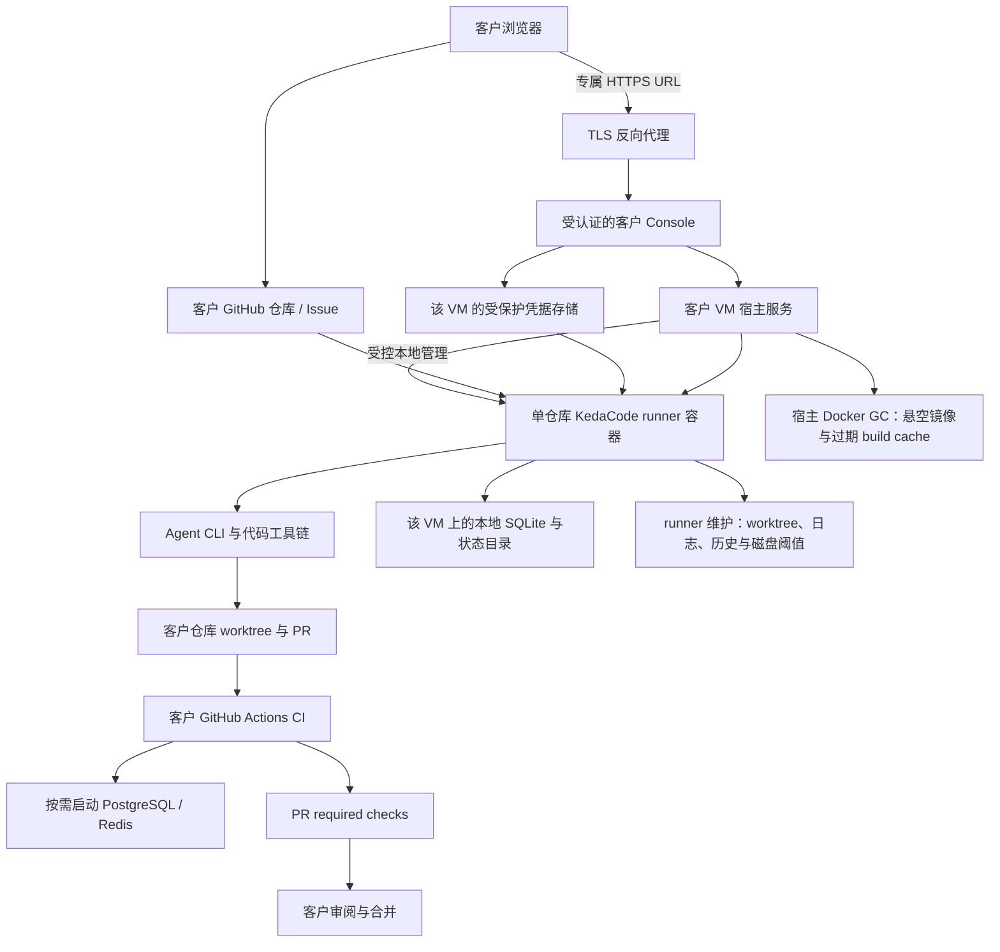

# PRD: KedaCode 托管 Runner 部署与自动资源清理

- GitHub Issue: https://github.com/ZataZhang/keda/issues/265

> ✅ **交付前置**：无，可立即开工。
> 结构化声明见 §8 Delivery Dependencies，**那里是唯一事实源**。
> ⬜ **验收状态**：未开工。
> 本行是 §9 Acceptance Checklist 的投影，**那里是唯一事实源**。

本文分两层：Part A 人审层（§1–4）说明用户价值、行为边界和待确认事项；Part B 执行层（§5–13）记录实现方案、架构与验收证据。

## Feature Overview (功能一览)

以下是 §10 Functional Requirements 的通俗摘要，不替代其验收定义；行为验收以 §1 行为样例为准。

- **本地使用继续免费**（FR-1）：个人和团队可以照常在自己的电脑运行 daemon，无需云端账户或托管服务。
- **客户专属托管入口**（FR-2、FR-12）：每个客户有独立部署和受保护的 Console URL；客户用运营者签发的一次性引导凭据进入界面完成首次设置，不接入共享多租户控制台。
- **代码任务与项目集成测试分开**（FR-3、FR-4）：runner 负责代码任务和快速验证；项目数据库等服务由客户 CI 按需启动，required checks 决定 PR 是否通过。
- **凭据可自助设置且隔离**（FR-5）：客户按引导取得并在 Console 设置、更新 GitHub 细粒度 token 与所选 Agent 的供应商 API key；凭据不会回显或进入日志，只交给该客户的 runner。
- **回收安全且范围明确**（FR-6、FR-7）：按保留策略回收安全的过期 worktree、日志和运行摘要，以及未被使用的镜像缓存；活动资源和客户持久数据受到保护。
- **磁盘与容器日志有界**（FR-8、FR-9）：空间不足时暂停领取新任务、保留运行中任务；容器日志轮转，避免长期运行无限增长。
- **清理结果可核查**（FR-10）：运营者能看到扫描、删除、跳过和失败数量及原因；部分失败不会被隐藏。
- **部署知识保持同步**（FR-11）：运维文档和随包 operator skill 说明托管边界、CLI 操作与清理行为。

# Part A · 人审层 (Review Layer)

## 1. Introduction & Goals

### Problem Statement

KedaCode 已能把单仓库 daemon 放进 Docker，但现有容器化方案主要面向开发者自己的电脑：目标仓库从本机路径挂载，认证从本机 agent CLI 快照导入，操作者通过本机 Docker 命令管理。

要将 daemon 部署在远程机器并为客户代管，当前缺少客户隔离的部署边界、适合无人值守的资源回收政策，以及“项目数据库测试交给 CI”的明确运行约定。现有 Issue 原始输出写到仓库挂载目录下的 `logs/agent-runner/issues/`，容器 Compose 没有日志轮转规则；daemon 的运行历史和审计记录另存于挂载的本地 SQLite 文件。应用日志已有 14 天保留策略，但它不覆盖上述所有数据。worktree 清理目前要求人工运行 `kc worktree cleanup`。

现有 Agent Runner Console 可以作为客户设置入口的 UI 基础，但它明确按本机单用户模式运行：服务只监听 `127.0.0.1`，当前登录接口不校验凭据。它不能直接通过公网 URL 提供给客户；托管模式需要单客户访问认证、凭据设置与安全传递，同时保留本地 Console 的现有信任边界。

### Interpretation (解读回显)

我把这项需求读作：在现有 Docker runner 和 Agent Runner Console 上增加面向托管部署的客户设置入口与自动资源卫生能力。每个客户收到自己的受保护 Console URL，在界面配置仓库和凭据；客户仍通过 GitHub Issue 提交代码任务、通过 PR/CI 验收。runner 容器只运行 agent CLI 与代码工具链，不启动客户项目的数据库、Redis、消息队列或其他中间件。

行为样例中，活动任务不被清理；当项目必须使用数据库测试时，由 PR 的 CI 工作流提供对应服务并报告检查状态。表中每一行的动作和可观察结果将成为对应的验收 oracle；修正行为单元格即修正验收标准。

| 验证方式 | 输入 / 操作 | 期望观察到的结果 |
|---|---|---|
| 👀 人审 + 自动验证 | 客户访问专属托管 Console，输入仅授权目标仓库的 GitHub token 和所选 Agent 的供应商 API key | 未登录访问被拒绝；无效或权限不足的凭据不能启用 runner；保存后仅显示状态，对应 runner 能使用该客户的凭据 |
| 👀 人审 + 自动验证 | 客户按 Console 来源说明创建单仓库 GitHub fine-grained PAT 和受支持 Agent 的 API key，再测试并启动 runner | 页面说明凭据来源、PAT 权限、API 账户/计费要求和同 runner 代码可读凭据的边界；模型测试先显示费用提示并由客户点击确认；删除 KedaCode 副本不会被描述为已撤销上游 key |
| 👀 人审 + 自动验证 | 未认证访问托管 Console API，或提交无效/过期登录凭据 | 请求被拒绝且不返回客户数据；本地 `kc console` 仍只监听 loopback 并保持本机模式 |
| 🤖 自动验证 | 托管 runner 处理一个代码 Issue；代码验证需要 PostgreSQL 或 Redis | runner 不安装、不启动、不连接项目中间件；PR 的 CI 检查使用工作流服务并成为合并前检查 |
| 👀 人审 + 自动验证 | 任务已合并且远端分支已删除；运营者查看资源清理预览后运行清理 | 只有关闭 Issue、无远端分支、干净且已合并的托管 worktree 会被移除；活动、脏或未合并的 worktree 明确跳过并说明原因 |
| 🤖 自动验证 | 宿主机剩余空间低于配置安全线，daemon 正在处理任务 | 当前任务继续；daemon 不领取下一项任务并输出可诊断的磁盘空间提示 |

**我默默定了这些**（没问你、我自己定的歧义点）

- 首个托管试点采用“每个客户一台专用 Linux VM、每个仓库一个 runner 容器”的隔离边界；不共用客户工作目录、认证目录或状态库。
- 每个客户有独立的 Console URL；客户通过登录后的界面新增、更新或删除 KedaCode 保存的凭据。上游 revoke 由客户在 GitHub/模型平台执行，不要求客户准备主机目录或手工配置容器挂载。
- 推荐首期由运营者在客户 VM 本地签发 24 小时有效、单次消费的一次性引导码，客户首次登录后设置 Console 管理员密码；不开放公开注册。具体访问方式待 D-03 确认。
- 每个仓库首期只选择一个 runner 镜像已预装的 Agent：Claude Code、Codex CLI 或 Kimi Code CLI；使用对应供应商 API key。客户从供应商账户平台创建 key 后直接在 Console 的敏感输入框提交。首期不接收 CLI 配置目录/凭据文件，不复用个人订阅 OAuth 会话，也不接受自定义 API Base URL。
- GitHub 凭据使用客户创建的 fine-grained personal access token；限定到目标仓库，并授予 KedaCode 完成代码提交、Issue 更新和 PR 创建所需的最小仓库权限。
- GitHub PAT 限定目标仓库，Agent API key 限定目标 CLI；两者按仓库保存和挂载。Agent/仓库代码运行于同一 runner 时可能读取该 runner 的 key，页面须明示此信任边界。
- 基础设施费由运营者收取；GitHub 与模型供应商 key 由客户持有并在对应供应商账户计费，此费用边界仍待 D-01 确认。
- 凭据由该客户 VM 上的服务加密保存，并在 runner 启动时解密到独立的内存文件系统，仅以该 runner 的原生认证文件挂载交付；用户不接触主机路径。密文与解密密钥分开保存，秘密不进入仓库、Compose 明文环境、Docker inspect 内容、命令行参数或日志。
- daemon 自己的 SQLite 是单机运行元数据，不是客户项目数据库中间件；保留必要状态，只对运行历史按已确认保留期清理。
- 首期仅托管代码任务的执行和 PR 流程，不替客户执行有状态数据库迁移，也不自动合并 PR。
- 自动清理默认只作用于显式开启托管维护配置的部署；普通本地 `kc daemon` 保持原样。

**我理解为不做**（你可能想要、但我读成不在范围内的）

- 不做多租户共享主机、跨客户共享的 SaaS 控制面、公开注册或自动计费；每客户独立部署的 Console URL 与凭据设置界面属于本次范围。
- 首期不支持消费级订阅账号/OAuth 会话导入、上传完整 CLI 配置目录、任意自定义模型网关或由 KedaCode 代客户创建/撤销供应商 API key；客户在 KedaCode 删除保存副本后，仍须到 GitHub/模型供应商账户撤销原 key。
- 不做在 runner 容器中为每个项目构建 PostgreSQL/Redis 等服务编排，也不把这些依赖从客户项目中“猜测”出来。
- 不自动删除未合并、未关闭、仍有远端分支或存在未提交改动的 worktree；不自动清除认证和 agent 会话数据。

**可证伪的需求解读：** 这是 KedaCode 现有 daemon 的可选托管运行方式。客户通过自己的 Console URL 配置凭据，通过自己的 GitHub 仓库和 PR 流程交付代码；项目集成测试在 CI 中运行。它不是共享多租户 SaaS 控制台、云端 IDE，也不是集中运行客户数据库的 PaaS。若一个任务必须依赖本地不可替代的数据库服务才能执行，它不属于首期托管执行目标，必须在 CI 或客户自己的环境补齐验证。托管模式与本地免费路径并存，不强制迁移或改变本地行为。

### What The User Gets

- 个人与团队可继续免费在自己的电脑运行 KedaCode daemon。
- 需要持续在线执行时，可让 KedaCode 运营者把 runner 部署在隔离的云主机上；客户仍从 GitHub Issue 发起工作，从 PR 和 CI 查看结果。
- 客户收到专属 Console URL 和一次性引导码，登录后按向导创建 GitHub fine-grained token、创建所选模型供应商的 API key，再把两者分别粘贴到 Console；页面提供对应官方创建说明和权限清单。客户无需 SSH 登录 VM、上传本地认证目录、编辑 `.env` 或配置宿主机挂载。
- 客户项目所需数据库测试由客户仓库的 GitHub Actions 等 CI 工作流启动，不占用 daemon 容器，也不需要在宿主机上长期运行中间件。
- 运营者得到明确的空间清理和磁盘保护策略，减少因长期驻留而人工登录清理的频率。
- 推荐以部署与维护基础设施为单位收费，模型供应商账户与用量由客户自行管理和支付；具体费用边界待 D-01 确认。

### Measurable Objectives

1. 不启用托管维护配置时，本地 `kc daemon` 的任务处理与现有测试结果一致。
2. runner 的 Compose 定义没有数据库/中间件服务、宿主 Docker socket 挂载或对外监听端口；执行不依赖 KedaCode 中心数据库。
3. 已配置 PostgreSQL/Redis 服务的 CI 工作流能在真实 PR 检查中运行项目集成测试；失败检查保持为失败状态，不被 runner 本地跳过或伪造为通过。
4. 清理预览和实删结果遵循同一组安全规则；脏、未合并、远端仍存在、活动或无法判断状态的 worktree 均保留。
5. 托管维护启用后，Issue 原始日志、运行历史和容器日志不超过各自配置保留策略；可保留的审计、配置、队列状态不会被日志清理误删。
6. 达到磁盘安全线后不再领取新的 Issue；daemon 记录磁盘使用量和恢复条件，当前任务不被强制终止。
7. 托管 Console 未认证请求被拒绝；凭据保存后不从 API 响应或日志回显，只能由该客户的 runner 使用；本地 `kc console` 的 loopback 默认与认证行为不变。

## 2. Human Review Map（需要你确认的选择）

### 决策一：首期托管服务的客户隔离与费用边界

推荐“运营者管理的专用 VM，每客户隔离部署；客户提供目标仓库专用 GitHub fine-grained token 和所选 Agent 的供应商 API key，模型用量直接由客户向供应商支付，基础设施服务费单独收取”。现有容器是一仓库一个 runner，专用 VM 可沿用该结构，避免首期先建设共享宿主机的跨客户安全隔离。API key 方式支持无交互、可验证的 runner 启动；代价是客户必须有对应供应商的 API 账户/余额，消费级订阅登录不适用于首期托管模式。

**请确认：** 首期是否采用专用 VM + 客户为目标仓库创建 fine-grained GitHub token、为所选 Agent 提供供应商 API key + 模型用量由客户直接支付？备选是客户自有主机（BYOC），由运营者收部署/维护费。多客户共享 VM 和消费级订阅/OAuth 凭据导入超出本 PRD 范围；若要支持它们，需另行评估权限、身份和轮换方案。

**验收：** 部署说明明确 VM 所有者、仓库与凭据边界、基础设施费与模型费用的承担方；验证报告证明一个客户无法读取另一客户的仓库、认证目录或 daemon 状态。

### 决策二：自动清理的保留周期与删除边界

推荐将详细 Issue 输出日志保留 14 天、运行/attempt 摘要保留 90 天；审计记录、队列配置、活动状态和客户认证不按日志策略删除。已关闭 Issue 只有在远端分支已删除、worktree 干净且已合并时才可自动删除；镜像仅清理悬空镜像与过期 build cache，不删 Docker volume。退订时由客户先在 GitHub/模型供应商平台 revoke 源 key，运营者停止 daemon 并删除 KedaCode 保存的副本，再按合同与客户确认的导出/删除流程处置该客户全部数据。较短保留期降低磁盘和敏感输出留存，较长保留期便于故障追溯。

**请确认：** 是否接受 14 天原始输出、90 天运行摘要并永久保留审计记录直到退订？可以调整日志/摘要周期或要求退订前先导出数据。

**验收：** 清理预览准确显示拟删内容、时间范围与跳过原因；执行后边界内旧文件/摘要消失，审计、活动任务和未满足安全条件的 worktree 仍可读取。

### 决策三：客户如何进入托管 Console 并完成首次设置

推荐每客户独立 URL，由运营者在客户 VM 上运行 `kc console bootstrap-token create --expires-in 24h` 生成 256-bit 随机引导码：命令只显示一次；服务端按部署绑定只保存哈希；24 小时过期、成功消费后原子失效。运营者通过独立安全渠道把原码交给客户，客户只在网页表单输入、不放入 URL。首次成功后客户设置该部署的管理员密码；管理员密码只认证 Console，不交给 runner。引导码丢失/过期时，运营者在 VM 本地使旧码失效并重新签发，保留审计记录。首期不开放注册，也不建跨客户账号目录。GitHub PAT 与 Agent API key 由客户按 Console 官方链接自行创建并提交；服务按仓库加密保存，运行时只交给匹配 runner。这样避免普通用户操作主机目录，代价是运营者仍需安全传递和重发引导码。

**请确认：** 是否接受“每客户独立 URL + 运营者本地签发的一次性引导码（24 小时、单次使用、只存哈希）+ 每个部署一个客户管理员”的首期访问模型？替代方案是让客户使用自己的 SSO/身份代理；公开注册和多客户统一门户不在首期范围。

**验收：** 未认证远程请求被拒绝；有效管理员可以完成引导并设置凭据；无效、过期或已撤销的访问凭据不能进入 Console；本地 Console 仍维持 loopback 单用户模式。

### 自动门禁，不需要逐项人工审阅

CI 工作流、CLI 参数与 Compose 配置由失败可区分的自动验证覆盖；托管 UI 与认证必须经过真实浏览器和 staging URL 验证；当前本地运行路径的兼容性通过回归验证。

**本次明确不涉及：** 计费系统、跨客户共享门户、公开注册、共享宿主机、自动合并，以及项目数据库服务。除以上三项产品选择外，具体 CLI 输出、配置组织和日志轮转参数由执行者按仓库既有模式落实。

## 3. Usage And Impact After Implementation

### 个人开发者

继续使用安装好的 `kc daemon` 和现有 GitHub / agent CLI 配置。在自己机器上运行不需要新增云端账号、容器或费用；本地 daemon 不启用托管专用的自动清理行为。

### 托管服务运营者

在客户专用 Linux VM 上部署 Console 与仓库 runner，配置 HTTPS 反向代理和专属 URL；运营者在 VM 本地执行 `kc console bootstrap-token create --expires-in 24h`，通过约定的独立安全渠道把一次性码交给客户。客户首次进入后设置 Console 管理员密码，再按 Console 向导输入目标 `owner/repo`，前往 GitHub 创建只授权该仓库的 fine-grained PAT（`Metadata: read`、`Contents: read/write`、`Issues: read/write`、`Pull requests: read/write`），并在 Anthropic Console、OpenAI API Platform 或 Kimi Platform 开通 API 使用、创建所选 Agent 的 API key。客户把 key 粘贴到各自字段；GitHub key 只做只读身份/仓库/权限检查，Agent key 仅在客户显式确认潜在费用后执行最小模型连通性请求。验证通过后服务按仓库加密保存，并在启动 runner 时写入仅该 runner 可挂载的 tmpfs 原生认证配置。客户不需要 SSH 登录主机、传 `.env`/CLI 认证目录或准备容器挂载目录。运营者通过主机侧工具管理部署、查看维护摘要与处理退订；GitHub Actions secrets、项目数据库账号和 TLS 私钥有各自的保管位置，不录入 Console。

客户退订时，客户先分别在 GitHub 与模型供应商账户撤销源 key；运营者停止 daemon、删除 KedaCode 的加密凭据副本和 Console 登录，再按已确认的导出/删除规则清理客户数据并释放 VM。若客户只在 Console 删除了本地副本，上游 key 仍有效，必须另外 revoke。

### 托管服务客户（代码任务提交者与 PR 审阅者）

在授权的 GitHub 仓库创建或标记代码 Issue。agent 通过现有 daemon 执行代码、跑配置好的快速本地检查并创建 PR；GitHub Actions 运行所需数据库集成测试。客户从 Issue、PR、CI 检查看到结果并进行代码评审。CI 失败继续显示为失败；KedaCode 不会把“已创建 PR”表述为“已经通过项目验收”。

### 项目维护者与 CI 配置者

为数据库集成测试维护仓库自己的 CI service 配置和必需检查项；daemon 的 `verification_commands` 只列 runner 可执行的快速检查。仓库若没有配置必需的 CI 检查，KedaCode 不推断数据库依赖，也不保证项目集成测试已在云端执行。

### 对现有行为的影响

- 普通本地 `kc daemon`、本地容器化使用和现有 Issue/PR 状态契约继续可用；托管自动维护通过明确配置启用。
- 托管仍沿用一个容器执行一个仓库 daemon 的方式；新增的是每客户独立的 Console 设置入口，不是跨客户共享 SaaS 控制面。
- daemon 自身 SQLite 状态仍位于客户专用宿主机的持久化状态目录中；不新增网络数据库服务。
- 现有日志目录路径与 `LOG_RETENTION_DAYS` 应保持兼容；新增清理必须补上 Issue 原始日志和运行摘要，并明确每类数据的策略。
- 不改变本地验证先于提交的流程；托管仓库应将不能在 runner 内运行的集成测试配置为 CI 检查。

## 4. Requirement Shape

- **actor**：本地 KedaCode 用户、托管服务运营者、托管客户管理员、客户仓库 CI 维护者、Issue 提交者和 PR 审阅者。
- **trigger**：客户收到专属 Console URL 后完成首次访问设置和凭据配置，随后要求托管 daemon 持续处理代码 Issue。
- **expected behavior**：按客户隔离部署 Console 与 runner；通过受认证界面设置凭据；把代码改动与完整数据库集成测试分开；自动清理有限的临时资源；磁盘不足时停止领取新任务；本地免费路径不变。
- **explicit scope boundary**：首期托管代码 Issue → agent → PR → CI 流程，并提供每客户 Console URL 和凭据配置；不托管项目运行时，不实现跨客户共享控制面或计费产品。

# Part B · 执行器层 (Build Layer)

## 5. Repository Context And Architecture Fit

### 现有能力与事实

- `src/backend/engines/agent_runner/templates/runner_container/Dockerfile.runner` 已预装 Python、Node、agent CLI、GitHub CLI、uv、just、git 和 KedaCode。
- `docker-compose.runner.yml` 已是单仓库 runner；没有 DB/Redis sidecar、没有公开端口，也没有 Docker socket 挂载。它将仓库、container-auth 与 KedaCode 状态目录挂载进容器，重启策略为 `unless-stopped`。
- `kc container up/down/logs`、认证快照导入、dry-run 与宿主 daemon 互斥检查均已存在。`kc container up` 支持 `--repo`、`--repo-id`、`--gh-token` 和 `--build`；托管文档不得把密钥写进仓库 dotenv 或公开日志。
- `frontend-public/` 已有 Agent Runner 管理终端和 Settings 页面，但当前 `kc console` 固定监听 `127.0.0.1`；`src/backend/api/routes/local_auth.py` 对任何登录输入都返回固定 local operator，会话不具备公网访问认证。托管 Console 必须增加独立的真实认证模式，不能直接开放当前本机模式。
- 当前 Console 不提供客户通过界面保存 GitHub/Agent 凭据的 hosted onboarding；本地容器认证通过 `kc container auth import` 从用户快照生成。托管模式不复用本机 OAuth/session 快照：只支持目标仓库 fine-grained GitHub token 和 Claude/Codex/Kimi 的供应商 API key 表单；由服务按 provider 生成原生运行时认证文件，不要求客户上传认证目录或操作主机文件。
- 每日应用日志已有 14 天清理；Issue 执行输出写入目标仓库 `logs/agent-runner/issues/<repo_id>/`，需单独纳入策略。
- `src/backend/infrastructure/persistence/console_store.py` 将运行、attempt、审计、队列与监控数据写入本地 SQLite。此数据库是 daemon 自身元数据，不是客户项目的 DB middleware；首期只清理明确定义的运行摘要，不清理审计、设置或活动状态。
- `src/backend/core/use_cases/worktree_cleanup.py` 已有关闭 Issue、远端分支已删除、托管路径、干净且已合并等保护条件；`kc worktree cleanup` 默认 dry-run，支持既有人工检查结果。任何 daemon 自动化不得使用 `force` 绕过安全条件。
- daemon 同一仓库单进程锁在 `src/backend/core/use_cases/daemon_single_instance.py`；Issue 有独立认领状态与 worktree。自动清理需在一次执行批次完成、并发 worker 已退出后进行，并增加对活动认领的保护。
- runner 在提交前会运行 `.kedacode.toml` 的 `verification_commands`；CI 失败处理由既有 PR 检查和 `post_pr_supervisor` 能力承担。数据库服务应在客户 GitHub Actions job 中声明。

### 托管凭据的获取、验证与使用

托管 onboarding 涉及三类运行凭据和一类 Console 登录凭据。GitHub token 与 Agent API key 由客户从上游平台创建，再通过 HTTPS Console 的专用敏感输入框提交；表单只显示 provider、仓库、状态、创建/验证时间和到期提醒，不回显 secret。密码/session 仅用于 Console，不进入 runner。下面的 GitHub/Agent 凭据均按仓库保存；即使客户 VM 相同，也不得把一个仓库的凭据挂给另一个仓库的 runner。

| 用途 | 客户从哪里取得 | Console 要求与验证 | runner / 服务用途 |
|---|---|---|---|
| 首次 Console 管理员引导码 | 运营者在客户 VM 上运行 `kc console bootstrap-token create --expires-in 24h`；命令生成 256-bit CSPRNG 随机码，只输出一次。运营者通过独立安全渠道交给客户 | 客户在专属 URL 的引导表单输入；码只可用一次、24 小时过期、不可放在 URL；服务端只存带部署绑定的 hash，成功后原子消费并要求设置管理员密码 | 仅用于首次创建该 VM 的 Console 管理员；不交给 runner。管理员密码只用于该 Console，使用带盐密码哈希保存 |
| GitHub 仓库凭据 | 客户在 GitHub `Settings → Developer settings → Personal access tokens → Fine-grained tokens` 创建；Resource owner 选目标账户/组织，Repository access 只勾选目标仓库，设置到期时间。组织要求审批时，先等管理员批准。官方创建说明：[Fine-grained PAT](https://docs.github.com/en/authentication/keeping-your-account-and-data-secure/managing-your-personal-access-tokens) | 粘贴到 GitHub 专用字段。创建页显示最小仓库权限：`Metadata: read`、`Contents: read/write`、`Issues: read/write`、`Pull requests: read/write`。保存时只调用只读 API 检查 token 身份、目标仓库可见性和所需权限，不创建测试 Issue/PR；未通过时不能启用该仓库 runner | 只挂给该仓库 runner，用于 `gh` 读取 Issue、更新标签/评论、push 分支和创建 PR。运行于同一 runner 的 Agent 与仓库代码具有读取该 runner 凭据的能力；凭据不能跨仓库或客户共享 |
| Agent 模型凭据 | 客户先在所选供应商的平台开通 API 使用/计费，再创建 API key：Claude Code → Anthropic Console；Codex CLI → OpenAI API Platform；Kimi Code CLI → Kimi Platform（`platform.kimi.com` 或 `platform.kimi.ai`）。表单“如何创建”链接到各官方认证说明 | 客户选定镜像预装的一个 CLI（Claude Code、Codex、Kimi Code）后粘贴对应 API key。Console 检查所选 provider 与 key 格式匹配；只有用户显式点击“测试连接”并确认费用提示后，才发起一条最小真实模型请求。保存本身不调用模型；无效或额度不足的 key 不能启用 runner | 只挂给该仓库所选 Agent 的 runner。首期使用供应商 API key 和官方默认端点；不接受消费级订阅登录、交互式 OAuth/session、AWS/Vertex 等云身份或自定义 Base URL。运行于该 runner 的 Agent/仓库代码可能读取本 runner 的 key |

更新凭据时先验证新值；验证失败保留旧值，验证成功后原子替换，并重启对应 runner。删除凭据时，服务先停对应 runner、清除本地密文和该仓库 tmpfs 运行目录。Console 的“删除”只删除 KedaCode 持有的副本，不会调用 GitHub/模型供应商撤销 API；页面必须分开提供“删除 KedaCode 中的副本”和上游 revoke 指引，并给出对应平台入口。退订时，客户先在 GitHub/模型平台 revoke 原 key，再由运营者停服务并删除 VM。本地副本已删除不代表上游 key 已失效。GitHub token 过期、模型 key 失效或组织审批待处理时，对应 runner 停止领取新任务并显示可操作的修复提示。

凭据清单和持有人必须在 UI/运维手册中分清：Console 引导码只用于首次创建管理员且一次消费；管理员密码及 session cookie 只用于 Console 登录；GitHub fine-grained PAT 只授权一个目标仓库；Agent API key 只授权该仓库选中的 CLI；GitHub Actions secrets 由客户单独保存在 GitHub 仓库/组织 Settings，供 CI workflow 使用；客户项目数据库账号只在 CI service/job 中配置，不交给 runner/Console；反向代理 TLS 私钥由运营者保存在代理主机，仅保护 HTTPS。首期不收集 Actions secret、数据库账号、用户 SSH 私钥、客户自带 TLS 证书、GitHub App 私钥或任何个人 CLI 登录快照。

GitHub/Agent secret 以仓库为单位用该 VM 的数据密钥加密；解密密钥保存在该 VM OS 账户可读的独立路径（目录 `0700`、文件 `0600`）；secret 明文不得出现在 SQLite、仓库、Compose 或日志，密文仅存放在专用凭据文件中。runner 启动时只把本 runner 所需的原生凭据配置解密到 `/run/kedacode/runner-auth/<repo-id>/`（Linux tmpfs，目录 `0700`、文件 `0600`），再以专属 bind mount 交给容器：GitHub 使用隔离的 `GH_CONFIG_DIR` 文件配置；Claude/Codex/Kimi 分别使用各自 CLI 原生认证文件。Docker 配置只含 mount 目标和路径，不含 key 值；runner 退出、更新或删除凭据后清空该仓库的 tmpfs 目录。服务验证禁止 secret 出现在 Compose environment、`docker inspect` 环境值、命令行参数、日志、审计字段和 SQLite 中。宿主 root/运营者属于该客户 VM 的受信任边界；同一 runner 内运行的 Agent 和仓库代码可能读取本 runner 自己的 GitHub/Agent 凭据，UI 必须明确披露，并指导客户使用单仓库、低权限、可独立轮换的 key。

Provider adapter 固定映射按 runner 镜像锁定的 `CLAUDE_VERSION`、`CODEX_VERSION`、`KIMI_VERSION` 实现并验证：GitHub token 由宿主服务通过 stdin 输入 `gh auth login --with-token`，写入 repo 专属 `GH_CONFIG_DIR/hosts.yml`，容器不设置 `GH_TOKEN`；Claude API key 写入 tmpfs 的 Claude Code `settings.json` 中 `env.ANTHROPIC_API_KEY`；Codex API key 由 `codex login --with-api-key` 从 stdin 读取并生成 tmpfs 中的 `auth.json`；Kimi Code API key 写入 Kimi Code `config.toml` 的 `[providers.kimi].api_key`，不写 Kimi Code OAuth credentials。CLI 版本升级后重跑对应 adapter 和真实 runner 认证验证；未验证的版本或凭据格式必须 fail closed。

供应商参考： [GitHub fine-grained PAT 创建说明](https://docs.github.com/en/authentication/keeping-your-account-and-data-secure/managing-your-personal-access-tokens)、[Claude Code API key 认证](https://code.claude.com/docs/en/authentication)、[Codex API key 认证](https://learn.chatgpt.com/docs/auth) / [OpenAI API key 创建](https://platform.openai.com/api-keys)、[Kimi Code API key 登录](https://moonshotai.github.io/kimi-code/en/guides/getting-started.html) / [Kimi Code provider 配置](https://moonshotai.github.io/kimi-code/en/configuration/providers.html)。

### 架构边界

遵循 `src/backend/api/ → src/backend/core/ → src/backend/engines/ → src/backend/infrastructure/`：

- API/CLI 负责解析 `kc container gc` 的预览与执行选项。
- API 托管 Console routes 负责登录/引导和敏感 key 设置请求；core 编排受授权的仓库连接、凭据生命周期与 runner 配置，不能从请求参数接受任意主机路径或命令。`kc console bootstrap-token create --expires-in 24h` 是仅在 VM 本地执行的 operator CLI，用于签发首次引导码。
- core 管理托管维护策略、清理候选判定、磁盘准入和 daemon 批次空闲边界。
- engines 调用 Docker CLI 或复用现有 worktree 清理，不引入 Docker Python SDK。
- infrastructure 负责 SQLite 运行历史保留、日志清理、磁盘信息、托管凭据存储与配置读取；每客户实例的凭据密文/权限策略独立。
- daemon 不增加访问中央数据库或启动项目服务的基础设施依赖。
- 浏览器只能访问受认证的 Console API；只有 VM 宿主侧受限管理服务可调用 Docker CLI，Runner 不获 Docker socket。
- `kedacode-operator` 随包 skill 与 `docs/` 同步新增 CLI 和托管运维约定。

### Frontend Impact

**Frontend impact: `frontend-public/`.** 在现有 Settings 与登录界面基础上增加一次性引导码登录、GitHub fine-grained token 权限引导、Claude/Codex/Kimi API key 表单、显式计费提示的 Agent 连通性测试、更新/删除状态和供应商侧 revoke 指引；已保存 key 不可再次读取，不提供本地目录/文件上传。托管 URL 必须经过真实认证和 HTTPS 入口；普通本地 `kc console` 仍为 loopback 单用户模式。`frontend-admin/` 不属于本次范围。

### Existing PRD Relationship

- `tasks/archive/P2-FEAT-20260707-141659-iar-runner-docker-containerization.md` 已交付基础 Docker runner 与 `kc container` 命令。本 PRD 是其托管运维扩展，不重复实现容器化。
- `tasks/archive/P2-FEAT-20260610-144433-iar-worktree-cleanup.md` 已交付保守的 worktree 清理；本 PRD 只在托管配置下复用并自动触发，不改变本地命令默认值。
- `tasks/pending/P1-FEAT-20261009-133425-lifecycle-agent-model-settings.md` 和 `tasks/pending/P1-FEAT-20261009-123512-kc-agentic-entry-and-stall-supervision.md` 的范围不同，互不依赖；可独立实施。
- 不需要前置数据库或 API 层迁移 PRD。
- GitHub Issue [#257](https://github.com/ZataZhang/keda/issues/257) 跟踪本 PRD。

## 6. Recommendation

### Recommended Approach

在已有单仓库 Docker runner 和 Agent Runner Console 上补足托管设置入口、认证、凭据生命周期与无人值守资源回收。每个客户在独立 Linux VM 上有自己的 Console URL、加密凭据存储和 runner。运营者通过 VM 本地 `kc console bootstrap-token create --expires-in 24h` 签发一次性引导码；客户登录后粘贴目标仓库 GitHub fine-grained token 和所选 Claude/Codex/Kimi API key。Console 后端继续作为 VM 上的 `kc console` 服务运行并绑定 loopback，由 HTTPS 反向代理提供客户 URL；Console 通过宿主侧受限管理能力操作该 VM 的 runner，不把 Docker socket 暴露给前端或 runner。宿主服务只在 runner 启动期间把该 runner 所需凭据解密到 Linux tmpfs，再通过原生认证配置文件挂载，不把 key 值写入 Compose environment、命令行或 Docker inspect 环境。普通用户无需登录主机、准备目录或手工设置挂载。客户项目数据库/Redis 等服务仍由 CI workflow 按需创建。

首期继续使用每客户独立部署，不新增跨客户共享控制面、中央多客户数据库或自助注册。daemon 的运行状态继续使用该 VM 上已有 SQLite；凭据存储由托管实例单独保护，不得以明文写入 `config.toml`、普通运行记录、Compose 输出或日志。托管 Console 的认证/凭据实现不改变本地 `kc console` 的 loopback 默认。

### Why This Fits

容器化 runner 已提供工具链安装、单仓库挂载和生命周期 CLI；Console 已有可复用的客户管理界面。把访问边界放在每客户专用 VM 和每客户 URL 上，客户配置经 Console 写入该实例的受保护凭据存储，再由宿主服务按现有容器认证路径管理对应 runner。这样用户不需要触碰主机挂载，同时不用为首期引入跨客户 SaaS 控制面。daemon 批次空闲边界复用 worktree 清理，宿主机由现有 Docker CLI 管理镜像缓存。

### Redundant Abstractions To Avoid

- 不新增 Cloud Worker、消息队列、服务端任务数据库或容器编排层。
- 不把本机 no-op 登录直接暴露到公网；托管认证必须 fail-closed，且客户 secret 不能从前端 API 响应、浏览器日志或应用日志取回。
- 不要求客户上传认证目录或文件；Console 只接受受支持供应商的 API key 与 fine-grained GitHub token，通过固定 provider 映射验证、加密保存并交给对应 runner。个人订阅 OAuth、任意目录归档、自定义 Base URL 和未知 provider 均明确拒绝。
- 不复制一套 worktree cleaner；在现有清理用例上增加托管所需的活动认领保护和批次触发入口。
- 不在 runner 内安装 Docker daemon，也不把宿主 `/var/run/docker.sock` 挂进容器。
- 不把每种客户数据库封装成通用 middleware provisioning API。

### Proposed Solution Summary (实现机制)

运营者为每位客户创建独立 VM 和 Console URL，并运行 `kc console bootstrap-token create --expires-in 24h` 获取只显示一次的引导码。客户收到码后在登录页输入，设置管理员密码，再按 Console 页面提供的官方说明创建单仓库 GitHub fine-grained token（`Metadata: read`、`Contents: read/write`、`Issues: read/write`、`Pull requests: read/write`）和所选 Agent 的 API key（Claude Code/Codex/Kimi Code）。页面链接 Anthropic Console、OpenAI API Platform、Kimi Platform 的认证说明，并说明 API 账户/计费前置条件。客户把 key 粘贴进对应敏感字段；模型测试前显示可能产生供应商 API 费用的确认，只有显式确认后才调用。保存后页面仅显示 provider、仓库、状态、创建/验证时间和到期提醒，不回显 key。托管运行只使用 API key 模式；普通订阅账号、OAuth login 和认证文件不上传。宿主服务按仓库加密保存 key，runner 启动时只在 tmpfs 生成该 runner 自己的 GitHub/Agent 原生配置并挂载到对应容器。同一 runner 的 Agent/仓库代码可能读取自己的凭据。key 更新先验证再原子替换并重启 runner；删除本地副本前停止 runner、擦除 tmpfs，再提示客户去上游平台 revoke 原 key。用户不需要知道或手工配置宿主目录挂载。托管运行仍复用现有 `kc container up` 与 Compose runner，在托管配置打开维护策略。daemon 每完成一次工作批次、所有 Issue worker 退出后，调用现有安全 worktree cleaner；该批次同时清理过期 Issue 原始日志和运行摘要，并在领取下一项任务前检查磁盘剩余空间。空间不足时保留现有活动任务、不再领取新工作并记录原因。Compose 设置容器 stdout 日志轮转；宿主机 `kc container gc` 清理悬空镜像与超过保留窗口的 build cache，不删卷或活动镜像。CI 是项目集成测试的唯一运行位置，GitHub required checks 是 PR 合并前的门禁。

托管任务状态继续使用客户专用 VM 上的现有 SQLite；不创建中心化数据库或项目数据库服务。GitHub/Agent key 的密文放在专用托管凭据文件中，per-VM 解密密钥保存在 OS 权限保护的独立路径；不要把明文 key 或解密密钥写入 SQLite、`config.toml`、普通 `.env`、Compose、仓库或日志。运行时明文仅存在 Linux tmpfs 的 repo 专用目录，在容器停止、删除凭据或更新时清除。CLI OAuth/订阅会话和认证目录上传不属于首期支持路径。

### Alternatives Considered

1. **多客户共用 VM + 多个容器：** 单机成本更低，但当前 runner 并非经过跨租户安全评审；共享内核、挂载路径、Docker 守护进程与运营凭据扩大泄露影响面。首期不推荐。
2. **客户自有云主机（BYOC）：** 客户掌握代码和凭据，运营者可收部署/维护服务费，但运维权限、网络连通和版本管理要求更高。可作为替代，但不与首期托管试点同时做。
3. **让 daemon 启动项目数据库容器：** 每个项目的版本、迁移、初始化和生命周期都不同；会让长驻容器承载项目测试服务，增加资源和维护成本。CI 已有面向 PR 的环境和结果状态，ROI 较低。

## 7. Implementation Guide

This section is a living implementation guide based on current repository analysis. If implementation discovers additional affected files, hidden dependencies, edge cases, or a better path, update this PRD before proceeding.

### Core Logic

1. 运营者为客户创建独立 VM 和 HTTPS URL；在 VM 本地运行 `kc console bootstrap-token create --expires-in 24h` 签发 256-bit 随机一次性引导码。服务端只存带部署绑定的哈希；原码只显示一次，由运营者经独立安全渠道发送，客户在网页登录表单输入（不放 URL），成功后原子消费并设置管理员密码。托管 Console 通过 TLS 反向代理提供访问，session 失效、登出或密码撤销后拒绝后续请求。本地 Console 保持 `127.0.0.1`。
2. Console 首先要求客户填写目标 GitHub `owner/repo`，再引导客户到 GitHub Fine-grained tokens 页面创建 token：Resource owner 选仓库所有者，Repository access 仅选目标仓库，设置过期日，授予 `Metadata: read`、`Contents: read/write`、`Issues: read/write`、`Pull requests: read/write`。客户回到 Console 粘贴 token；后端只用只读 API 验证 token 身份、仓库可见性和权限，不发测试 Issue/PR。权限不足或组织审批未完成时不启用 runner，并提示客户修正或等待审批。
3. 客户选择 runner 镜像已预装的 Claude Code、Codex CLI 或 Kimi Code CLI；Settings 展示对应官方认证链接和步骤。客户须在对应供应商平台具备 API 使用权限/计费方式，创建 API key 后粘贴到该 provider 的敏感字段。首期不上传 CLI 配置/认证文件，不导入消费级订阅或 OAuth/session，不接受自定义 Base URL。保存只校验 provider/key 格式，不调用模型；客户显式点击“测试连接”、确认可能产生费用后，系统才发起一条最小模型请求。测试失败、额度不足或 key/provider 不匹配时不启用 runner。
4. 所有 secret 只经 TLS request body 到达后端；不得进入 URL、浏览器 localStorage、后续 GET、日志或审计明文。GitHub 与 Agent key 按仓库加密存储。更新先验证新 key 再原子替换并重启关联 runner；删除本地副本前先停 runner 并清空运行时副本。KedaCode 不代客户 revoke GitHub/模型 key，界面把“删除 KedaCode 副本”和“到上游平台撤销 key”作为两个明确步骤。
5. 宿主服务在客户 VM 上自动准备 repo checkout 和隔离工作目录，调用现有 `kc container up`/Compose 生命周期，并附带非敏感的 per-runner auth 路径。启动时只解密该 repo 所需 key 到 `/run/kedacode/runner-auth/<repo-id>/` 的 Linux tmpfs，通过容器 bind mount 提供 GitHub CLI 与所选 Agent 的原生认证文件；容器 environment 只含路径，不含 secret 值。停止、更新或撤销后清空目录。runner 不接触 Docker socket；客户不输入主机路径、不编辑 `.env`、不配置 volume。
6. daemon 按现有生命周期领取 Issue 并完成当前 work batch；等待所有并行 worker 退出后，若托管维护开关开启，执行一次有界清理。每个清理项均有类型、候选数、删除数、跳过原因和空间前后值。
7. worktree 清理必须遵循现有 `cleanup_iar_worktrees` 守卫，并确认该 Issue 没有活动 claim / worker。验证失败或 GitHub 状态不可查询时 fail-closed：保留 worktree，不尝试强制删除。
8. 日志清理删除超出已确认保留期的 per-Issue 输出和既有 app 日志；运行摘要仅删除终态且超过摘要保留期的数据。清理必须按显式表/文件类型执行，不能递归删除整个 `logs/`、状态目录或认证目录。
9. 周期维护检查宿主数据盘可用空间。在配置安全线下不启动新的 Issue；等待当前 worker 结束，打印 free/total 和停领原因。超过恢复线后自动恢复领取，避免频繁抖动。
10. `kc container gc --dry-run` 展示工作树、日志、运行摘要、容器日志轮转配置与 Docker host cache 的拟处理量；`--apply` 才执行删除。需要 host Docker 权限的操作只从 VM 宿主 CLI 运行；runner 容器中不提供 Docker socket。
11. CI workflow 按项目声明 Postgres/Redis 等 service containers，并把集成测试作为 PR required check。KedaCode 不伪造或覆盖 GitHub 检查结果。若项目只在 CI 才能验证，PR 保持等待或失败状态，沿用现有 supervisor 语义。

### Change Impact Tree

文件清单是按当前仓库搜索得出的预期落点；实现如发现新增关联文件，先更新本 PRD 并按 Executor Drift Guard 校准。

```text
.
├── Infrastructure
│   ├── src/backend/engines/agent_runner/templates/runner_container/docker-compose.runner.yml [修改]
│   │   【总结】为 runner 容器日志配置大小与文件数轮转，并承载托管模式的隔离认证挂载（repo 专属 `GH_CONFIG_DIR` 与 provider 原生认证文件的 bind mount，不含 secret 明文）；维持无端口、无 Docker socket、无项目 DB sidecar。
│   ├── src/backend/infrastructure/config/agent_runner_settings.py [修改]
│   │   【总结】声明默认关闭的托管清理、保留周期、磁盘停领阈值与恢复阈值配置。
│   ├── src/backend/infrastructure/logging/logger.py [修改]
│   │   【总结】复用应用日志保留实现并纳入托管周期清理。
│   ├── src/backend/infrastructure/persistence/console_store.py [修改]
│   │   【总结】提供仅针对终态运行/attempt 摘要的过期清理，保留审计、队列配置和活动状态。
│   ├── src/backend/infrastructure/persistence/console_store_invocations.py [修改]
│   │   【总结】按确认的运行摘要周期清理过期 invocation events，不删活动调用记录。
│   └── src/backend/engines/agent_runner/container_ops.py [修改]
│       【总结】封装宿主机 Docker 悬空镜像与过期构建缓存清理，并提供只读预览结果。
├── Hosted Console And Credentials
│   ├── src/backend/api/routes/local_auth.py [修改]
│   │   【总结】保留本地 loopback no-op 模式；为托管 Console 增加 fail-closed 的引导/会话认证。
│   ├── src/backend/api/routes/agent_runner_hosted_setup.py [新增]
│   │   【总结】提供受认证的仓库设置、GitHub PAT/三种 Agent API key 录入、校验/轮换/本地删除 API；响应只含状态，不回传 secret。
│   ├── src/backend/infrastructure/console/ [修改]
│   │   【总结】按仓库加密保存 PAT/API key、管理独立解密密钥与 provider adapter；只生成该仓库 runner 所需的 tmpfs 原生认证文件。
│   ├── frontend-public/app/(auth)/login/ [修改]
│   │   【总结】增加托管模式的真实登录/首次引导；本地 no-op 会话不用于托管 URL。
│   ├── frontend-public/app/(app)/app/settings/page.tsx [修改]
│   │   【总结】提供凭据来源链接、PAT 最小权限清单、provider API key 输入、计费确认、轮换/本地删除和上游 revoke 指引；不收文件/目录上传。
│   ├── frontend-public/lib/api/auth.ts [修改]
│   │   【总结】与 hosted login/session API 对接，支持登出与 session 失效处理。
│   └── frontend-public/lib/api/console.ts [修改]
│       【总结】调用受认证的凭据设置/状态 API，不持久化或回显 secret。
├── Domain / Core
│   ├── src/backend/core/use_cases/run_agent_daemon.py [修改]
│   │   【总结】在批次 worker 全部结束后执行可选维护，并在磁盘低于安全线时停止领取新 Issue。
│   ├── src/backend/core/use_cases/worktree_cleanup.py [修改]
│   │   【总结】为托管自动清理增加活动 claim 保护并始终复用关闭、无远端分支、干净、已合并守卫。
│   ├── src/backend/core/shared/interfaces/container_runner.py [修改]
│   │   【总结】声明容器 GC 预览、执行与空间状态所需的 core 端口类型。
│   └── src/backend/core/use_cases/agent_runner_container.py [修改]
│       【总结】编排 GC 预览/执行请求，不绕过现有 Docker ops 和依赖方向。
├── Hosted Console Validation
│   ├── tests/ [新增/修改]
│   │   【总结】覆盖未认证拒绝、凭据不回显、轮换/撤销和本地模式兼容。
│   └── tests/playwright-e2e/ [修改]
│       【总结】通过真实 Console 页面完成首次登录、凭据设置和错误状态验证。
├── API
│   ├── src/backend/api/cli_typer_console.py [修改]
│   │   【总结】增加 VM 本地 `kc console bootstrap-token create --expires-in 24h` 引导码签发入口；不把原码写日志或交给 runner。
│   ├── src/backend/api/cli_typer_container.py [修改]
│   │   【总结】增加 `kc container gc` 的 `--dry-run` / `--apply` CLI 入口。
│   └── src/backend/api/cli_parsed_commands/container.py [修改]
│       【总结】呈现清理分类、拟删数量、跳过原因和磁盘空间摘要。
├── Tests
│   ├── tests/test_worktree_cleanup.py [修改]
│   │   【总结】覆盖活动 claim、关闭状态、远端分支、脏状态、合并状态和 fail-closed 自动清理。
│   ├── tests/test_daemon_parallel_concurrency.py [修改]
│   │   【总结】证明维护只在批次 worker 全部退出后运行，磁盘低位不领取下一项工作。
│   ├── tests/test_cli_container.py [修改]
│   │   【总结】验证 GC dry-run/显式 apply 参数路径与密钥不回显。
│   ├── tests/test_agent_runner_config.py [修改]
│   │   【总结】验证托管维护配置默认关闭、保留期边界与高低水位校验。
│   ├── tests/test_console_store.py [修改]
│   │   【总结】证明只清理超期终态运行摘要，不误删审计、设置和活动队列。
│   └── tests/test_agent_runner_agent_invocation.py [修改]
│       【总结】验证 invocation events 只按终态与保留窗口安全清理。
└── Docs And Packaged Skill
    ├── docs/prototypes/hosted-runner-onboarding.html + .md [新增]
    │   【总结】呈现受认证首次设置、仓库连接和凭据管理的目标交互。
    ├── docs/prototypes/assets/prototype-hub.js [修改]
    │   【总结】在 Prototype Hub registry 注册托管 onboarding 原型（入口、可用状态、关联原型）。
    ├── docs/guides/agent-runner.md [修改]
    │   【总结】说明托管 VM 部署、CI/数据库分界、凭据管理、清理预览/周期及退订删除步骤。
    ├── docs/getting-started/installation.md [修改]
    │   【总结】说明本地免费路径与可选托管服务的定位，不将托管描述为使用前置条件。
    ├── src/backend/engines/agent_runner/templates/skills/kedacode-operator/SKILL.md [修改]
    │   【总结】同步 operator agent 的托管部署、GC 命令、安全边界和 CI 约定。
```

`mkdocs.yml` 已导航到 Agent Runner 和安装指南，预期只更新正文；若实现需要新增文档入口，再同步导航。

### Risk Classification Register

| 变更点 | 层 | 等级 | 决定因素 | 介入方式与失败区分门禁 |
|---|---|---|---|---|
| 托管 Console URL、认证、客户凭据设置与向 runner 交付 | API / infrastructure / frontend | R3 | 公网访问和可调用客户代码/模型的凭据暴露会造成客户账号与代码泄露 | 人工确认 D-03；rv-4 经真实 HTTPS staging URL 验证未认证拒绝、secret 不回显/落日志、repo runner 归属及本地副本删除/上游 revoke 的区别；不接受 component preview 作为通过证据 |
| 客户 VM、repo 与 credentials 隔离，容器不挂 Docker socket | infrastructure / API | R3 | 凭据和跨客户安全信任边界 | 人工确认 D-01；rv-1 必须在 staging VM 检查真实挂载与权限，并以第二客户作为越权负例 |
| 日志、SQLite 摘要与 worktree 自动删除 | core / infrastructure | R3 | 不可逆数据删除与并发状态 | 人工确认 D-02；rv-2 对安全候选实删并证明 dirty/active/unmerged 负例保留 |
| 不在 daemon 容器跑 DB tests、由 GitHub CI service 与 required checks 验收 | core / docs | R2 | 跨越 daemon、GitHub Actions 和 PR 合并状态 | 执行器 + rv-3 staging PR required-check 烟测与失败负例 |
| GC CLI 与预览输出 | API | R1 | 限定在容器命令组的新增 CLI 行为 | `tests/test_cli_container.py` 失败区分 dry-run 与 apply，验证 secret 不回显 |
| Compose stdout 日志轮转 | infrastructure | R1 | runner 的单服务容器配置 | `docker compose config` 检查实际日志 driver/limit 且没有端口、socket、DB 服务 |
| 托管部署和 packaged skill 文档 | docs | R0 | 信息同步 | 文档引用与 CLI schema 静态检查 |

### Executor Drift Guard

开始实现前重新搜索以下语义锚点，若实现位置或事实变化，先更新 PRD 再改代码：

- `rg -n "cleanup_iar_worktrees|run_agent_daemon|daemon-locks|worktree.*claim" src/backend`
- `rg -n "per_issue_log_path|log_retention_days|SqliteConsoleStore|attempt_records|audit_logs" src/backend`
- `rg -n "container up|container down|container logs|docker-compose.runner.yml" src/backend/api src/backend/engines/agent_runner`
- `rg -n "verification_commands|post_pr_supervisor|services:" docs/guides/agent-runner.md .github/workflows`
- 检查 `tasks/pending/` 与 `tasks/archive/` 是否出现更新的重叠托管、清理或 docker PRD。

### Flow / Architecture Diagram



**No project/central database changes in this PRD.** SQLite 继续承担每客户 VM 的现有运行状态；托管访问会话采用 D-03 确认的本地认证存储，GitHub/Agent secret 使用每 VM 密钥保护的独立加密凭据存储，并按仓库区分。若实现确需新增 SQLite schema，executor 必须更新本 PRD、迁移计划与 ER Diagram；不引入外部数据库 middleware。

**Low-Fidelity Prototype:** 实现前在现有 `frontend-public` Settings 与登录视觉体系上补充 `docs/prototypes/hosted-runner-onboarding.html` 原型，至少覆盖一次性引导码与密码设置、GitHub PAT 来源/权限清单、Agent provider 选择/API key 获取说明、测试连接前的计费提示、保存状态、认证失败、本地删除与上游撤销指引。验收呈递并排展示原型与 staging URL 的真实浏览器截图；截图使用虚构凭据和测试仓库，不包含客户 secret。

**Interactive Prototype Change Log:** 原型尚待创建；实现前按 `docs/prototypes/hosted-runner-onboarding.html` 创建并在 `docs/prototypes/hosted-runner-onboarding.md` 记录关键状态与评审结论，同时注册到 Prototype Hub（更新 `docs/prototypes/assets/prototype-hub.js` 的 registry）。

**External Validation:**

| Topic | Source | Checked On | Relevant Finding | Impact On Recommendation |
|---|---|---|---|---|
| GitHub fine-grained PAT 权限模型 | [GitHub Docs: Managing your personal access tokens](https://docs.github.com/en/authentication/keeping-your-account-and-data-secure/managing-your-personal-access-tokens) | 2026-10-10 | fine-grained token 可按仓库限定访问并授予细粒度权限，官方推荐替代 classic token | 支撑"单仓库、最小权限、按仓库隔离保存"的凭据模型 |
| Claude Code API key 认证 | [Claude Code Docs: Authentication](https://code.claude.com/docs/en/authentication) | 2026-10-10 | `ANTHROPIC_API_KEY` 是官方认证方式之一；settings 文件的 `env` 块可注入环境变量 | adapter 将 key 写入 tmpfs 的 `settings.json` env，容器 environment 不含 key 值 |
| Codex CLI API key 认证 | [Codex Docs: Authentication](https://learn.chatgpt.com/docs/auth) | 2026-10-10 | `codex login --with-api-key` 从 stdin 读取并缓存到 `~/.codex/auth.json`；API key 按 OpenAI Platform 标准费率计费、不占订阅额度 | adapter 用 stdin 输入避免命令行泄露；测试连接前的费用提示与真实计费口径一致 |
| Kimi Code provider 配置 | [Kimi Code Docs: Providers](https://moonshotai.github.io/kimi-code/en/configuration/providers.html) | 2026-10-10 | API key 写入 `config.toml` 的 `[providers.kimi].api_key`；OAuth 凭据独立于 provider 配置 | adapter 只写 provider api_key、不写 OAuth 凭据；平台入口为 `platform.kimi.com` / `platform.kimi.ai` |

需要 operator-owned staging URL、HTTPS 反向代理和 disposable 测试租户；不使用客户生产仓库或凭据。

### Realistic Validation Plan

#### rv-1：托管部署隔离与凭据边界

```yaml
- id: rv-1
  behavior: "客户专用 VM 上通过 hosted Console 设置单仓库 runner；secret 加密保存在 host，运行期间只以 repo 专属 tmpfs 原生认证文件交给该 runner；另一个仓库/客户无法读取这些路径。"
  reviewer: verifier
  real_entry: "在专用 staging Linux VM 的真实 hosted Console 完成 pilot 仓库和 disposable PAT/API key 设置，再用同 VM 的另一仓库身份和独立第二客户身份尝试读取；由 hosted runner manager 启动 pilot runner，并用 `docker compose config`、`docker inspect` 和宿主 `/run/kedacode/runner-auth/pilot/` 检查实际 mount、运行时文件权限与停止后的 tmpfs 清理。"
  expected: "持久层只含加密 secret；运行容器只挂载 pilot 的仓库/状态和 pilot tmpfs 凭据文件，不发布端口、不挂载 Docker socket；key 不出现在 Compose environment、docker inspect 环境值、进程参数或日志。runner 停止后 tmpfs 中 pilot 认证目录消失；同 VM 的另一仓库与第二客户 VM/账号无法读取 pilot 的持久或运行时路径。"
  mock_boundary: "必须使用真实 Docker Engine、打包后的 runner Compose、provider auth adapter 和隔离 staging VM；GitHub/模型 key 使用 disposable staging 凭据，不能 mock Compose 配置解析、加密存储、tmpfs 生命周期或实际 mount 权限。"
  tier: R3
  test_layer: sandbox
  required_for_acceptance: true
  critical_value_source: "从 hosted credential API 实际保存的 disposable key、加密存储记录、服务运行时生成的 repo 专属 tmpfs 路径、provider 原生认证文件和真实 compose mount 派生；不得从 PRD 手工重建 key/path。"
  must_cross: "客户 Console key 提交 → 加密凭据存储 → host runner manager 解密到 tmpfs → provider adapter / GitHub CLI auth config → packaged compose mount → Docker Engine runner → 同 VM 另一仓库与第二客户 OS 身份读取负例。"
  forbidden_bypasses: "不允许只断言静态 YAML；不允许 mock docker inspect/mount/encryption/provider adapter；不允许使用同一客户 shell 身份证明跨客户隔离；不允许把凭据打印在 `--gh-token` 参数、Compose 展开结果、docker inspect 环境值或命令输出中。"
  fresh_state_probe: "runner 运行时从新进程验证 GitHub/Agent auth 可用；stop 后重新查 host tmpfs 路径确认消失；再从同 VM 另一仓库服务身份及独立第二客户用户/VM 检查加密存储、挂载路径和可见性。"
  final_tree_evidence: "保存加密存储权限摘要、Compose config、docker inspect 脱敏摘要、tmpfs 生命周期检查与 staging VM 标识；provider CLI 版本、auth adapter、credential store、Compose/Dockerfile 变化后重跑，并记录最终 Git tree。"
  negative_control: "在测试边界把第二客户 mount 指向 pilot state-home 后重跑隔离断言；负例必须被权限/挂载检查拒绝。"
  expected_fail: "第二客户身份能列出或读取 pilot 的 credential/state/tmpfs 文件、持久文件是明文，或 key 出现在 Compose/inspect/argv/log 时 rv-1 为红。"
- id: rv-2
  behavior: "托管 GC 预览和执行只回收已确认保留期的日志、终态摘要及安全 worktree，保护活动/脏/未合并/远端仍存在的数据。"
  reviewer: human
  real_entry: "在隔离 fixture repo 中通过真实入口运行 `uv run kc container gc --repo <fixture-repo> --dry-run`，检查清理摘要；确认后运行 `uv run kc container gc --repo <fixture-repo> --apply`。"
  expected: "dry-run 只列出超期且满足全部规则的候选；apply 后这些候选消失；活动、dirty、未合并、远端仍存在的 worktree、审计记录和认证文件仍存在，输出逐类给出删除/跳过数量和原因。"
  mock_boundary: "真实 CLI、临时 Git repo/worktree、真实文件删除与 SQLite fixture 必须执行；GitHub Issue/PR API 可在 IGitHubClient 边界替身以固定 closed/open 状态，Docker Engine 只在 host-cache 子项使用可用时的 sandbox smoke。"
  tier: R3
  test_layer: integration
  required_for_acceptance: true
  presentation: "tasks/evidence/<prd-stem>/rv-2-gc-preview.txt；交付时在人读呈递区展示该终端输出，并指出 dirty/active 项的跳过原因。"
  critical_value_source: "候选文件 mtime/retention setting、真实 `git worktree list` 与 `git status`、从 GitHub boundary 返回的 Issue 状态、真实 SQLite audit/run 行；预览所打印的路径必须来自清理器扫描结果。"
  must_cross: "kc container gc CLI → parser/core 清理策略 →真实临时文件和 git worktree → GitHub 状态 boundary → 删除完成后的新进程文件/SQLite 查询。"
  forbidden_bypasses: "不得直接调用内部清理函数替代 CLI；不得只 mock 文件系统或 Git；不得通过 `--force` 绕过 worktree 守卫；不得只查看进程返回值而不从 fresh process 重新查询文件与 SQLite；不得删除认证目录、客户仓库、volume 或 audit_logs。"
  fresh_state_probe: "apply 后以新 CLI 进程重新扫描目录、`git worktree list --porcelain` 和 SQLite audit/run 查询；验证删除与保留集合。"
  final_tree_evidence: "保存 dry-run、apply 和 fresh probe 输出及 fixture manifest，标注最终 Git tree；worktree cleaner、保留策略或 CLI 任何改动都会使该证据失效。"
  negative_control: "在 fixture 中加入一条仍有远端分支或未提交修改的 worktree，并将其标成活动 claim；预期 dry-run 将该条列入 skipped，apply 后目录与分支仍存在。"
  expected_fail: "若清理预览把活动、脏、未合并或远端仍存在的候选标为可删除，或 apply 删除其中任一项，rv-2 为红。"
- id: rv-3
  behavior: "数据库依赖集成测试在客户 PR 的 GitHub Actions service 中执行，CI failure 不被 daemon 本地成功状态覆盖。"
  reviewer: verifier
  real_entry: "授权 staging 仓库创建一个代码 Issue 并运行托管 daemon；agent 创建 PR 后观察该 PR 的 GitHub Actions required checks。"
  expected: "runner Compose 中没有数据库服务；CI job 启动 workflow 声明的 PostgreSQL/Redis service 并运行集成测试；故意失败的测试让 required check 失败且 PR 保持未通过。"
  mock_boundary: "staging 验收必须经过真实 GitHub Actions 与真实服务容器；Agent 模型调用可用受控测试账号或跳过此 smoke，普通 CI 回归通过本仓库的 workflow/static contract tests，不依赖客户凭据。"
  tier: R2
  test_layer: manual
  required_for_acceptance: true
  critical_value_source: "从 staging PR 的 Checks 页面/API 实际读取 workflow、service health、测试 job 状态与 required status；不从 runner 日志推断 CI 结果。"
  must_cross: "客户 GitHub Issue → daemon 创建 PR → GitHub Actions workflow → service container ready → 数据库集成测试 → PR required check 汇总。"
  forbidden_bypasses: "不允许本地 mock CI status、跳过 required check、把 daemon 的 verification_commands 绿色当作数据库集成通过，或只验证 workflow YAML 格式而不执行 staging job。"
  fresh_state_probe: "在真实 PR 中先跑绿的服务测试，再推送一个故意失败的测试变更；通过独立 PR Checks 页面/API 确认状态转红且 required merge gate 未放行。"
  final_tree_evidence: "保存 staging PR URL、workflow run URL、测试结果和 repo branch-protection required-check 摘要；影响 workflow/daemon CI 状态语义的改动后重跑。"
  negative_control: "在 staging PR 测试分支让集成断言失败，保持 required check 设置不变。"
  expected_fail: "workflow 未启动服务、测试没有运行或故意失败仍显示 required check 成功时 rv-3 为红。"
- id: rv-4
  behavior: "客户经专属 HTTPS Console URL 用一次性引导码完成认证，按官方说明创建单仓库 GitHub fine-grained token 和一个受支持的 Agent API key；未授权访问被拒绝，secret 只交给匹配仓库的 runner。"
  reviewer: human
  real_entry: "在真实浏览器打开专用 staging URL，经实际 TLS 反向代理输入一次性引导码并设置管理员密码；按官方说明创建 disposable 单仓库 GitHub PAT 和 provider API key，粘贴后查看权限检查；显式确认可能计费后运行一次最小 Agent 连接测试，再启动 runner、轮换 key、删除 KedaCode 本地副本，最后在供应商平台 revoke 测试 key。"
  expected: "一次性引导码成功消费且不能重用；缺权限 PAT、错误 provider key 或未通过 Agent API key 测试不能启用 runner；模型测试需用户确认并真实调用 provider；未认证/API 请求被拒绝；保存后 key 不在响应、浏览器 console、服务日志、Compose environment 或 Docker inspect 环境值中；runner 只获得所属仓库的 GitHub key 和所选 Agent key，stop/删除后 tmpfs 消失；删除 KedaCode 副本后 runner 不再使用本地 key，但上游 key 仍有效，直到客户显式 revoke；revoke 后 provider 拒绝旧 key；第二客户或另一仓库身份无法读取 pilot 凭据；本地 `kc console` 仍 loopback 且不要求 hosted 登录。"
  mock_boundary: "必须使用 production frontend build、真实 hosted auth/API、真实 HTTPS proxy、真实加密 secret store、tmpfs 和 runner handoff；用 disposable staging repo 与可撤销 API keys。模型测试用一条最小真实调用，预先显示成本提示；不得 mock 认证、权限检查、key 持久化、provider adapter、轮换/删除或 runner 凭据交付。"
  tier: R3
  test_layer: sandbox
  required_for_acceptance: true
  presentation: "tasks/evidence/<prd-stem>/rv-4-console-onboarding.png 与 rv-4-console-onboarding.md；另附同 viewport 的原型图，截图仅用虚构仓库和测试凭据。"
  critical_value_source: "真实浏览器网络请求/响应、bootstrap-token consumption record、hosted session、脱敏的 PAT 权限信息、加密 secret store、tmpfs 原生认证文件、runner 实际 GitHub/provider 请求，以及上游 revoke 后的新进程探测。"
  must_cross: "VM 本地 bootstrap-token CLI → 客户浏览器 → HTTPS reverse proxy → hosted auth → credential API → GitHub/provider credential test → 加密 storage → host runner manager/provider adapter → tmpfs bind mount → Compose runner → GitHub test repository 与模型 provider。"
  forbidden_bypasses: "不得只直接调用 API 或渲染组件；不得在截图、测试报告、命令行、Compose environment、docker inspect 环境值或日志中输出 secret；不得用本地 no-op auth、mock secret store、mock provider check 或 mock runner handoff 代替真实边界；不提交用户订阅/OAuth 会话或生产 key。"
  fresh_state_probe: "引导码消费后再次提交必须失败；登出后新浏览器会话必须被拒绝；保存后由新后端进程/runner 从加密存储重建 tmpfs 凭据并成功请求；删除 KedaCode 副本后重启 runner 必须因凭据缺失而不能启动 Agent，tmpfs 已清空；此时上游 key 仍有效，单独 revoke 后用新进程确认 provider 拒绝该 key；用另一个仓库和独立客户身份再次检查隔离。"
  final_tree_evidence: "保存原型图、staging 页面截图、脱敏 HTTP/auth/permissions/storage/handoff 证据、低额模型调用结果和 staging deployment identity；bootstrap command、provider CLI 版本/adapter、credential store、runner mount、前端构建或 proxy 配置变化后重跑。"
  negative_control: "分别使用缺少 Pull requests: write 权限的 PAT、错误 provider API key、清除 hosted session 后的 credential API 请求、已消费 bootstrap code 重放和第二客户 session 读取 pilot key metadata；各自都应被拒绝。"
  expected_fail: "一次性码可重用、权限不足或未验证的 Agent key 仍启用 runner、模型测试不显示费用提示、无 session 仍可读写、secret 出现在可见面、tmpfs stop 后仍保留、另一个仓库/客户可读 pilot 凭据、删除本地副本后 runner 仍能使用 key，或上游 revoke 后 provider 仍接受旧 key 时 rv-4 为红。"
```

**失败排查：** rv-1 先检查 VM / state-home 的实际 mount 和目录权限，再检查 compose 的 environment 展开；rv-2 先检查 Issue claim、`git status`、远端分支和时间阈值；rv-3 先检查 Actions service health log、测试命令和分支保护 required checks；rv-4 先检查外部认证边界、cookie/CSRF 配置、secret 持久层权限和 runner handoff，不要通过回显 secret 排障。

### Usage And Impact After Implementation

#### 托管部署的操作脚本

1. 为客户建立独立 Linux VM 和 OS 用户，不与其他客户共享工作目录、凭据存储或状态路径；配置 HTTPS 反向代理、专属 URL 与托管登录。代理 TLS 私钥留在运营者代理主机，不录入 Console。
2. 在该 VM 本地运行 `kc console bootstrap-token create --expires-in 24h`；安全保存终端唯一一次显示的原码，并经独立安全渠道交给客户。客户在网页登录表单输入（不能把码放进 URL），设置 Console 管理员密码。过期/丢失时运营者在 VM 本地使旧码失效并重新签发；不开放注册。
3. 客户在 Console 填写目标 `owner/repo`。按照官方链接创建 GitHub fine-grained PAT：Resource owner 选仓库所有者、Repository access 只选目标仓库、设置到期日，授予 `Metadata: read`、`Contents: read/write`、`Issues: read/write`、`Pull requests: read/write`。组织审批尚未完成或权限不足时先处理审批/权限，不启动 runner。
4. 客户选择 Claude Code、Codex 或 Kimi。按照对应 Anthropic Console、OpenAI API Platform 或 Kimi Platform 说明开通 API 使用并创建该供应商 API key，粘贴到匹配的敏感字段。GitHub token 的检查只调用只读 API；模型 key 的“测试连接”会真实请求模型并可能计费，必须在用户显式确认后运行。未测试成功的 Agent key 不能启用 runner。Actions secrets、数据库账号、SSH key、TLS 私钥及本机 OAuth 登录文件都不输入该表单。
5. 服务按仓库加密保存 PAT/API key；每 VM 解密密钥放在 OS 权限保护的独立路径，secret 不进 SQLite、普通 `.env`、仓库、Compose environment、命令行、Docker inspect 环境值或日志。启动对应 runner 时，宿主服务只把所需原生认证文件解密到 repo 专属 `/run/kedacode/runner-auth/<repo-id>/` tmpfs 并 bind mount。代码和 Agent 在该 runner 中运行，可能读取该 runner 自己的 key；客户应使用单仓库、低权限、可轮换 key。
6. 新 key 先验证，成功后再原子替换并重启关联 runner；验证失败保留旧值。删除按钮只删 KedaCode 密文并停止对应 runner、清空 tmpfs，不会 revoke 上游 key；客户必须另到 GitHub/模型平台撤销。页面分别显示本地副本状态与上游撤销说明。
7. 客户为需要数据库服务的测试配置 GitHub Actions service 和 required check；daemon `verification_commands` 只运行 runner 内可执行的快速检查。运营者用 `kc container gc --dry-run` 查看维护候选，再按约定显式执行；摘要记录分类计数、跳过原因、保留期和磁盘空间，不记录 secret。基础设施费用由运营者按约定收取，模型用量归客户供应商账户。
8. 退订时，客户先到 GitHub 和模型供应商平台 revoke PAT/API key；运营者随后停止 runner、删除 KedaCode 密文与 Console 登录，按数据导出/删除约定清理客户数据并释放 VM。删除 VM 前核对上游 revoke 已完成；Console 删除副本不能代替这一步。

#### 客户 CI 配置者的任务脚本

在客户仓库的 GitHub Actions workflow 中声明需要的 service container（例如 PostgreSQL），等待 health check 成功后运行真实集成测试，并把 workflow job 配置为 PR required check。daemon 只执行本地快速命令和代码任务，不在 runner 里“临时凑出”数据库服务。

#### Compatibility And Migration

- 无既有用户需要迁移；托管功能是 opt-in。普通 `kc console` 保持 loopback/no-op 本机认证；托管认证只在明确启用的部署配置中生效。
- 不更改 `.kedacode.toml` 现有 `verification_commands` 默认语义。本地/容器用户需自行把数据库集成命令移入 CI workflow，才具备无需本地 DB 的托管体验。
- existing `kc container up/down/logs` 语法保持不变；`container gc` 是新增 CLI surface，必须同步 CLI skill 与 docs。客户托管设置从 Console UI 进入，不要求客户使用容器 CLI。
- 如果用户关闭托管维护，日志和 history 保持现状；容器 Compose 的日志轮转只限制 Docker stdout/stderr，不删除 volume 或 bind-mounted 文件。

### ER Diagram

No data model changes in this PRD.

### Decision Log

D-01 follows the recommended isolated managed-host model, pending the customer isolation and billing choice in Section 2. D-02 follows the recommended retained data periods, pending the data cleanup choice in Section 2.

## 8. Delivery Dependencies

### Delivery Dependencies

- Depends on tasks/issues:
  - none
- Gate type: none
- Sequence: via-main
- Notes: This PRD extends the archived Docker runner and worktree-cleanup work. It can be implemented independently of the unrelated pending lifecycle-settings and agentic-entry PRDs.

## 9. Acceptance Checklist

### 9.1 人读呈递区（Human Review Surface）

| 人需要看的结果 | 呈递内容 | 10 秒自检 |
|---|---|---|
| 托管 GC 预览能说明哪些过期输出会删除，以及活动、脏或未合并 worktree 为什么保留 | `tasks/evidence/<prd-stem>/rv-2-gc-preview.txt`；交付时在 PR evidence comment 或完成消息中嵌入对应终端输出；本地打开：`open "tasks/evidence/<prd-stem>/rv-2-gc-preview.txt"` | 查输出中的 `eligible`、`deleted`、`skipped` 分类数量；dirty/active fixture 应在 `skipped` |
| 自动清理执行后审计可读、凭据仍只对授权 runner 可用，安全候选才消失 | `tasks/evidence/<prd-stem>/rv-2-gc-apply.txt` 与 `rv-2-gc-probe.txt`；本地打开：`open "tasks/evidence/<prd-stem>/"` | 对照 dry-run manifest；确认 dirty/active 路径存在、超期 safe 路径不存在，凭据值不可从 Console/API 读取 |
| 客户能安全完成托管 Console 首次设置和凭据配置 | `rv-4` staging URL（交付时写入 evidence report）+ `tasks/evidence/<prd-stem>/rv-4-console-onboarding.png`；用 `just prd review tasks/pending/P1-FEAT-20261009-161453-kc-hosted-runner-deployment.md`（归档后为 `tasks/archive/` 同名文件）打开评审包，在浏览器访问 staging URL 并与同 viewport 原型截图并排审阅 | 能看懂引导码交付、PAT 来源/权限、三种 Agent key 来源/计费和撤销边界；未登录不能读写；secret 不出现在截图、网络日志或服务日志 |

`reviewer: verifier` 且不需人工看图的结果不放在本区：rv-1 隔离/Compose 资源证明、rv-3 GitHub Actions required-check 结果、配置和单测/静态检查。若没有私有 staging 证据发布权限，执行者须在交付说明中给出受限访问的单一 review 入口，不得公开客户凭据或代码。

### 9.2 Acceptance Evidence Package

#### Human-Confirmed

- [ ] **D-01 托管边界**：人工确认专用 VM / BYOC / 共享主机选择，并确认基础设施费与模型用量的承担方；记录来自 `rv-1` 的隔离检查和部署示例。选择结果需回填 PRD Decision Log。
- [ ] **D-02 数据保留**：人工确认原始日志、运行摘要与退订时的数据删除周期；记录来自 `rv-2` 的预览和 fresh-state 删除/保留证明。选择结果需回填配置示例与 Decision Log。
- [ ] **D-03 Console 访问模型**：确认一次性引导凭据 + 每部署一个客户管理员 + 不开放注册；审阅 rv-4 的未登录拒绝、登录与登出结果，并将选择写回 Decision Log。
- [ ] **托管 Console 人读呈递区审阅**：在真实 staging URL 查看首次设置、凭据已保存/撤销状态和错误提示；对照原型与实际截图，确认表单解释清楚且没有凭据回显。
- [ ] **GC 人读呈递区审阅**：查看 rv-2 清理预览与执行后的新进程探测结果，确认终端显示和实际清理集合一致。

#### Architecture Acceptance

- [ ] runner Compose 与 `docker inspect` 证明没有 DB/middleware sidecar、对公网端口或 Docker socket；Console 的外部入口经 HTTPS 和真实认证保护，服务端本地管理接口不开放给任意网络来源。
- [ ] 本机 Console 默认仍绑定 `127.0.0.1` 并维持本机模式；托管登录不能退化为 `local_auth.py` 的 no-op 会话。
- [ ] `just lint` 中现有 architecture 检查通过，证明后端依赖仍为 `api → core → engines → infrastructure`。

#### Dependency Acceptance

- [ ] `pyproject.toml` 与锁文件没有新增 Docker SDK、外部 scheduler 或服务端数据库依赖。

#### Behavior Acceptance

- [ ] 托管维护关闭时，本地 `kc daemon` / `kc container up` 不进入新清理分支；配置默认关闭并有对应的回归证据。
- [ ] 有效关闭 Issue 的安全 worktree 在 worker 全部结束后被清理；活动、dirty、unmerged、remote-exists 和 GitHub 状态不可用候选都被保留。
- [ ] 达到磁盘阈值时 active worker 不被杀；该 daemon pass 结束后停领并输出已用/可用空间，空间恢复越过高水位后继续领取。
- [ ] 过期运行摘要按确定的 keyset/事务边界删除；audit、queue settings、活动队列、已保存凭据和 Console sessions 不受清理策略误删。
- [ ] 首次引导码由 VM 本地 CLI 生成、只显示一次、24 小时过期、单次消费且服务端只存哈希；过期或重放均拒绝。
- [ ] Console 准确指导客户创建单仓库 fine-grained PAT（`Metadata: read`、`Contents: read/write`、`Issues: read/write`、`Pull requests: read/write`）和 Claude/Codex/Kimi provider API key；错误、权限不足、未测试成功或组织待审批的凭据不能启用 runner。
- [ ] 模型连通性测试在显式费用提示确认后才发起真实最小调用；保存本身不调用模型。Console 提供 API 使用/计费前置条件和上游官方创建/撤销入口。
- [ ] 凭据可新增、验证、轮换和删除 KedaCode 副本；API/页面只返回状态，不回显 secret。验证失败保留旧值；轮换成功后 runner 只用新值；删除停止对应 runner、清除密文/tmpfs，但明确提示上游 key 仍有效，直到客户主动 revoke。
- [ ] GitHub/Agent 凭据按仓库隔离；只有匹配 runner 获得对应 auth 文件。测试证明另一个仓库/客户不能读取，并明确披露同一 runner 内的 Agent/代码可读取本 runner 自己的 key。
- [ ] GitHub Actions secrets、项目 DB 凭据、SSH 私钥和反向代理 TLS 私钥不会进入 hosted credential API；自动清理不会删除加密凭据存储。
- [ ] Compose JSON log driver 的最大文件尺寸/数量有界；host GC 只清理悬空镜像与过期 build cache，不运行 volume prune，不删除活动容器正在引用的镜像。

#### Documentation Acceptance

- [ ] `docs/guides/agent-runner.md` 和 `docs/getting-started/installation.md` 明确本地免费路径；引导码由谁、如何发放；PAT 创建入口、仓库范围和精确权限；Anthropic/OpenAI/Kimi API key 获取入口、API 账户/计费条件和显式测试费用；密码/session、Actions secrets、DB 凭据、SSH/TLS key 的归属；加密保存/tmpfs 交付、runner 内代码读取风险、本地删除与上游 revoke 的区别；CI、磁盘和退订步骤。
- [ ] `src/backend/engines/agent_runner/templates/skills/kedacode-operator/SKILL.md` 同步 `kc console bootstrap-token create --expires-in 24h` 的签发/重发边界、凭据交付、`kc container gc` 参数、dry-run/apply、默认关闭和“绝不挂 Docker socket”边界。
- [ ] `mkdocs.yml` 导航与文档实际位置一致，不添加重复入口。

#### Validation Acceptance

- [ ] rv-1 的实际 Compose config、docker inspect、跨客户权限负例和 final tree 标识通过；改动挂载、启动或凭据处理后重跑。
- [ ] rv-2 真实 `kc container gc` dry-run → 显式 apply → 新 CLI 进程 probe 通过；证据 manifest 证明 dirty/active/unmerged 数据保留。
- [ ] rv-3 staging PR 的 DB-backed CI service 测试绿；负例能让 required check 红，PR merge gate 不放行。
- [ ] rv-4 真实 hosted URL 浏览器流程通过；负例证明未认证/API session 失效、引导码重放、PAT 权限不足、错误 provider、未通过 Agent API key 测试时均拒绝；secret 不回显/落日志；删除 KedaCode 副本后 runner 无法再使用本地 key，上游 revoke 后 provider 拒绝旧 key；与原型图并排的真实截图经过人审。
- [ ] `uv run pytest tests/test_worktree_cleanup.py tests/test_daemon_parallel_concurrency.py tests/test_cli_container.py tests/test_agent_runner_config.py tests/test_console_store.py tests/test_agent_runner_agent_invocation.py -q` 与 `just lint` 通过；相关行为变更后重跑。
- [ ] `uv run kc container gc --repo <fixture-repo> --dry-run` 真实 CLI 入口退出成功；相同候选的 `--apply` 只在明确指定后执行，fresh process 结果符合 rv-2。该证据与最终实现 Git tree 绑定。

#### Delivery Readiness

- [ ] 实施、文档和随包 skill 均完成；部署命令与数据保留行为没有未决生产阻断项；失败或外部 staging 不可用时如实记录并保持未归档。
- [ ] PR 描述/evidence comment 或完成消息逐字呈现 9.1 的三项结果与可执行 review 入口；证据只对授权评审人可见，没有公开客户代码/凭据；托管 UI 原型和真实截图同时呈现。
- [ ] 非人工验收项全勾选或按仓库 PRD 流程记录 `[~]` 有理由；Final Reconciliation 完成；本 PRD 随实现归档，`Human-Confirmed` 保留开放复选框等待人工验收。

## 10. Functional Requirements

- **FR-1: Local free mode**：本地 `kc daemon` 继续独立运行；托管功能及维护策略默认关闭，不要求新增云端账户或云端连通。
- **FR-2: Single-tenant hosted runner**：每个客户部署在独立 Linux VM，支持每仓库一个 Docker runner；客户 Console 有独立 HTTPS URL 并需要认证，runner 容器不对公网开放端口。仓库、状态和运行时凭据由托管服务按客户隔离。
- **FR-3: No project middleware in runner**：KedaCode runner Compose 不安装、启动或连接客户项目 Postgres/MySQL/Redis/队列；不挂载 Docker socket。客户自行在 CI workflow 声明集成测试服务。
- **FR-4: CI gate remains authoritative**：代码任务在 runner 内完成所配置的快速验证并创建 PR；项目级数据库检查必须由 PR CI 执行。GitHub required check 未绿时不得声称 PR 已通过集成验收，也不得绕过现有 merge/status 门禁。
- **FR-5: Credential handling**：Console 说明并接收客户创建的单仓库 fine-grained GitHub PAT 与 Claude Code/Codex/Kimi provider API key；列明创建入口、精确权限、API 账户/计费条件、显式模型测试费用提示和同 runner 代码可读凭据的信任边界。不接收 OAuth/session 或认证文件。PAT 通过只读 API 检查；Agent key 只有在显式确认计费后经最小真实模型请求验证。secret 按仓库加密保存并只通过 tmpfs 原生配置交给匹配 runner；不进入 URL、浏览器本地存储、SQLite、日志、Compose environment、inspect 环境值或命令行。更新先验证并原子替换；Console 删除只清理 KedaCode 副本，不代替用户在上游 revoke。Actions secrets、项目 DB 凭据、SSH key 与代理 TLS key 不由此 API 收集。
- **FR-6: Hosted resource cleanup**：托管维护启用后按已确认周期清理 per-Issue raw logs 和过期终态运行/attempt 摘要；复用 worktree cleaner 的所有安全条件并增加活动认领保护；保留 audit、active state、settings 和 credentials。
- **FR-7: Safe host Docker cleanup**：`kc container gc` 支持 dry-run 和显式 apply，报告候选、理由、磁盘空间与结果；host cleanup 只处理不被容器引用的悬空镜像和超期 builder cache，不删 volume、bind mount 或活动镜像。
- **FR-8: Daemon disk guard**：每轮领取新 Issue 前查看可用空间；低于 configured low-water mark 时暂停新的领取、不杀现有 worker，并给运营者输出容量和恢复条件；越过 recovery watermark 后恢复领取。
- **FR-9: Bounded container logs**：Compose 为 stdout/stderr 配置有界轮转，避免 Docker daemon log 文件在无人值守运行中无限增长。
- **FR-10: Operational visibility**：GC 输出逐类展示 scanned/eligible/deleted/skipped/failed 数量、保留期限、跳过原因和错误；部分清理失败返回可监控的非零状态，不掩盖失败。
- **FR-11: Docs and CLI knowledge**：更新部署/CI/退订文档与随包 `kedacode-operator` skill，CLI schema/help、配置名和文档保持一致。
- **FR-12: Hosted Console onboarding**：每位客户获得独立、受认证的 Console URL。VM 本地 `kc console bootstrap-token create --expires-in 24h` 签发一次性引导码；码经独立渠道交付、只在网页登录表单输入、服务只存哈希、成功消费后设置管理员密码。不开放注册；未认证或已失效 session 不能读写配置；普通本地 `kc console` 保持 loopback 本机模式。重发必须在 VM 本地使旧码失效并留审计记录。

## 11. Non-Goals

- 客户自助公开注册、跨客户共享 SaaS 控制台/控制面、集中式多客户数据库、自动发票/收款或用量计费；每客户独立 Console URL 与客户凭据设置界面属于范围。
- 将客户项目数据库、消息队列、浏览器或服务依赖部署到 daemon 容器。
- 将该 VM 作为可供客户任意 SSH/shell 的通用云开发机或云 IDE。
- 多客户共享同一个 VM/容器/认证目录/状态目录的首期实现。
- PR 自动合并、分支保护自动配置、CI 凭据自动签发。
- 清除 customer repo、GitHub remote 分支、active/dirty/unmerged worktree、Docker volumes、运行中的镜像或 credentials。
- 为 daemon 内部 SQLite 建立独立的数据库服务。
- 默认开启本地 daemon 的托管垃圾回收行为。

## 12. Risks And Follow-Ups

- **托管安全责任：** 专用 VM 隔离仍要求宿主机安全更新、最小权限、磁盘加密与备份策略；PRD 验证证明部署隔离，不替代云主机日常安全运营。
- **公网 Console 与凭据责任：** 当前 local auth 是 no-op，不能直接用于公网。托管 URL 必须使用已确认的真实登录/引导模式和 HTTPS；凭据需要被持久保存并交给 runner，必须防止 session 盗用、CSRF、secret 回显、日志泄露与退订后继续可用。宿主 root/运营者仍属于每客户 VM 的受信任边界，产品说明需明确。
- **凭据工具兼容性：** Agent CLI 认证格式会随 CLI 版本变化；首期仅支持 runner 镜像预装并锁定版本的 Claude Code、Codex、Kimi API key adapter。镜像升级时核验原生认证文件、真实认证和失败关闭行为；其他 provider、OAuth/session、认证文件上传与自定义端点明确提示不支持。
- **首次访问恢复：** 一次性引导码丢失或过期会阻断客户入门；运营者需在客户 VM 本地可审计地使旧码失效并重发，不能通过公开注册或弱默认密码绕过。
- **凭据轮换与客户退订：** 首期排除可续期的订阅/OAuth session；GitHub PAT 与 Agent API key 更新先验证再原子替换，旧 key 从 KedaCode runner 摘除但在上游 revoke 前仍有效。退订流程必须将客户上游撤销与 KedaCode 本地删除分为两步并分别留证。
- **CI 配置因仓库而异：** daemon 无法推断数据库版本、迁移顺序或种子数据；CI 没配置 required check 时会造成项目集成测试缺口，部署前 checklist 必须提醒客户。
- **清理与诊断取舍：** 14/90 天是推荐值，需由人工确认；改动期限后必须同步说明实际影响。审计和退订数据仍需受限访问。
- **磁盘门槛：** 一项任务可能大于剩余空间；设计应避免新任务启动后立即失败，必要时由运营者扩容后自动恢复，不能自动删除未知客户文件来腾空间。
- **本地路径与单仓库限制：** 当前 Compose 通过宿主路径挂载一个 checkout，首期运维脚本按单仓库 VM 边界执行；多仓库共用 VM 要等隔离和容量有证据后再评估。

## 13. Decision Log

| ID | 决策问题 | 当前推荐 | 替代方案 | 原因 | 状态 |
|---|---|---|---|---|---|
| D-01 | 首期托管隔离与模型用量如何归属？ | 每客户专用 VM；客户为目标仓库创建 fine-grained PAT、为 Claude/Codex/Kimi 所选 provider 创建 API key 并直接支付模型费用；运营者收基础设施服务费 | BYOC；多客户共享 VM；运营者包模型费用 | 复用现有单仓库容器并把跨客户边界放到 VM；使用可轮换、无交互的上游凭据，避免先建共享沙箱和用量计费 | 待人工确认 |
| D-02 | 原始日志、运行摘要及退订数据如何保留/删除？ | 原始日志 14 天、运行摘要 90 天、审计保留至退订；safe worktree 与 host cache 自动回收 | 更长保留、退订前强制导出或自定义周期 | 现有 app log 默认 14 天；摘要足以追踪近期任务，审计独立于普通日志 | 待人工确认 |
| D-03 | 客户如何首次访问托管 Console？ | 每客户专属 URL；VM 本地 CLI 签发 256-bit、24 小时、单次使用引导码，服务只存部署绑定哈希；独立渠道交付，首次使用后设管理员密码；不开放注册 | 客户自有 SSO/身份代理；每客户多用户邀请 | 不需要中央账号目录，普通用户可用浏览器完成配置；降低自助注册滥用与跨客户账号复杂度 | 待人工确认 |

### Final Reconciliation

- Interpretation: updated 2026-10-10 to define the customer-side credential acquisition steps, exact first-run bootstrap handoff, supported GitHub/Agent credential types, runtime delivery, billing prompt, and local deletion versus upstream revocation; pending implementation.
- Public behavior and contracts: local `kc console` remains loopback-only; hosted access requires D-03 auth model and never returns saved secret values.
- Related PRD status: reviewed against repository state on 2026-10-09.
- Requirements and risks: pending implementation.
- Reconciled differences:
  - the prior draft excluded customer UI and described operator-prepared host paths; this revision includes a dedicated hosted Console setup flow while keeping shared multi-tenant control plane, public signup, and central customer DB out of scope.
  - hosted credentials are customer-created GitHub fine-grained PATs and provider API keys only; no OAuth/session or auth-file upload. GitHub Actions secrets, project DB credentials, SSH keys, and proxy TLS keys remain in their existing owner-managed locations.
  - Console deletion removes KedaCode's encrypted copy and runner access; only the upstream GitHub/provider revoke action invalidates the source key.

## Change Log

### 托管 Console 客户设置流程纳入范围（补记 2026-10-10 范围修订）
- Type: scope
- Before: 初稿把托管需求读作"Docker runner 上的运维约定与资源清理"，凭据由运营者准备主机路径，客户没有自助设置入口。
- After: 增加每客户受认证 Console URL、一次性引导码与管理员密码、GitHub fine-grained PAT 与 Claude/Codex/Kimi API key 的在线设置、按仓库加密保存与 tmpfs 交付（FR-2/FR-5/FR-12、D-03、rv-4）。
- Reason: 客户需要在不接触主机路径与 `.env` 的前提下自助完成凭据设置；跨客户共享控制面与公开注册仍在范围外。
- Impact: 新增 hosted Console 认证/凭据链路及对应 oracle；本地 `kc console` 的 loopback no-op 模式保持不变。
- Review: 范围与 D-03 待人工确认；本次仅为补记，与 Final Reconciliation 一致。

### 结构合规修复与 Issue 正文同步
- Type: doc
- Before: 章节标题、解读回显块与 FR 条目格式不符合 prd skill 检查器；Issue #257 正文为旧解读且 Realistic Validation 清单缺 rv-4。
- After: §1 标题改为 `Introduction & Goals`；"我默默定了这些 / 我理解为不做" 改为模板粗体块；FR 条目改为 `- **FR-N: 标题**：` 格式；补 Prototype Hub 注册行、External Validation 来源表和 §9.1 打开命令；同步 Issue #257 正文（含 rv-4）。
- Reason: 归档门禁 `check_prd_acceptance_checklist.py` 会拒绝原结构；执行 agent 以 Issue 正文为真相源，缺失 rv-4 会使托管 Console 主链不被验收。
- Impact: 仅格式与记录修复，不改行为、范围与验收语义；验收仍以 §7.6 与 §9 为准。
- Review: 已重跑检查器确认三项结构错误消除（未开工条目与验收横幅状态除外）。
