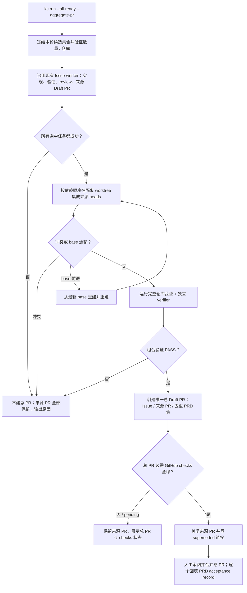

# PRD: 夜间任务批次聚合为单一总 PR

- GitHub Issue: https://github.com/ZataZhang/keda/issues/258

> ✅ **交付前置**：无硬依赖，可立即开工。
> 结构化声明见 §8 Delivery Dependencies，**那里是唯一事实源**。

> ⬜ **验收状态**：未开工。
> 本行是 §9 Acceptance Checklist 的投影，**那里是唯一事实源**。

本文分两层：Part A 人审层（§1-4）界定夜间批次的可见结果与验收选择；Part B 执行器层（§5-13）给出仓库落点、失败边界与验证证据。

## Feature Overview (功能一览)

以下清单是 §10 Functional Requirements 的行为投影；具体验收以 §1 行为样例为准。

- **显式启动一个多任务批次**（FR-1）：单次队列运行可选择汇总；普通运行不改变行为，也可预览批次候选。
- **只在整批任务成功后集成**（FR-2、FR-3）：合并全部来源分支到一个新分支，并验证组合后的完整代码树。
- **生成唯一正式总 PR**（FR-4、FR-6）：正文列出每个来源 Issue、PR 和去重后的 PRD 路径；合并总 PR 接受其中全部 PRD。
- **收起来源 PR**（FR-5）：总 PR 创建且组合验证和必需的 GitHub 检查均通过后，自动关闭来源 PR 并写明取代关系；来源分支保留。
- **失败时保全来源并支持重试**（FR-2、FR-7）：任务失败、冲突、验证失败或 GitHub 写入失败时不提前关闭来源 PR，并输出可复制的重试命令。
- **同步操作说明与验收约定**（FR-8）：命令行帮助、PRD 多 PRD 验收语义、仓库指南和随包操作说明保持一致。

# Part A · 人审层 (Review Layer)

## 1. Introduction & Goals

### Problem Statement

当前每个 Agent Runner Issue 独立完成 worktree、验证、push、Draft PR 与可选的 PR 后监督，因此晚上跑多个任务后会留下多份 PR，早晨需要逐一打开并分别判断范围和证据。仓库虽有一次处理多个待领任务的队列入口，但每轮默认只领取一项；即使提高批量上限，每个 Issue 仍各自发布 PR。现行 PRD 合并验收正文契约也只接受单个 PRD 路径，无法把多个 PRD 的交付与验收明确绑定到一个总 PR。

这让自动执行省下的时间又消耗在重复切换 PR 上，也没有一个能代表“这一组任务整体通过”的组合验证结果。

### Interpretation (解读回显)

#### 行为样例

| 验证方式 | 输入 / 操作 | 期望观察到的结果 |
|---|---|---|
| 🤖 自动验证 | 操作员在同一仓库的一次队列运行中选择汇总 3 个任务，3 个 Issue 均通过现有流程 | 系统在一个新批次分支上组合 3 个来源分支，验证组合后的代码树；总 PR 的必需 GitHub 检查也通过后，关闭 3 份来源 PR、保留其分支。 |
| 🤖 自动验证 | 操作员进行普通队列运行，没有选择汇总 | 仍按现有规则逐 Issue 处理并发布来源 PR；不创建批次分支、不关闭来源 PR。 |
| 🤖 自动验证 | 已选择汇总的任务中有一个 Issue 执行失败，或来源分支冲突 / 组合验证失败 | 不创建总 PR，也不关闭任何来源 PR；命令说明失败位置。任务失败时提示先用现有执行流程修复该 Issue；组合阶段失败时给出只重试聚合的命令。 |
| 🤖 自动验证 | 操作员只选择 1 个 Issue 汇总，或同时选择会跳过既有审核 / 验证的发布方式 | 在认领任务前以使用错误退出，说明汇总至少需要 2 个任务且不能旁路既有门禁；不创建分支或 PR。 |
| 🤖 自动验证 | 总 PR 已创建，但其必需 GitHub 检查失败或仍在运行 | 总 PR 保持 Draft，来源 PR 保持打开；命令显示检查状态，允许在检查成功后只重试来源收尾。 |
| 👀 人审 + 自动验证 | 打开批次总 PR，检查正文、验收证据与来源 PR 状态 | 总 PR 列出全部来源 Issue/PR 和每个唯一 PRD 路径一次；明确“合并即接受所列 PRD”；来源 PR 标为被总 PR 取代并已关闭，来源分支仍存在。 |

以上行为行分别成为 §7.6 的验收 oracle；更改一个行为或结果单元格，就会更改对应的验收标准。

#### 我默默定了这些

- 批次边界是一次明确启用汇总的队列运行实际选中的同仓库 Issue 集合；不跨多次运行或不同仓库猜测成员关系。
- 聚合是显式 opt-in；普通运行、后台常驻任务和定时任务保留现状。候选不足 2 个时在认领前拒绝，避免意外产生单任务总 PR。
- 来源任务各自继续走现有实现、验证、审核和来源 PR 发布流程；只有所有选中任务成功后才构造总分支。
- 总 PR 使用配置的目标分支并保持 Draft 状态，供用户统一审阅；系统不自动合并总 PR 到目标分支。
- 来源 PR 只在组合树验证通过且总 PR 创建成功后关闭，并附“已由总 PR 取代”的说明；来源分支与 Issue 历史保留。
- 一次总 PR 可以包含多个不同 PRD；相同 PRD 在多个来源 Issue 出现时按路径去重。普通单任务 PR 的现行单 PRD 验收契约继续兼容。
- 组合、验证、总 PR 发布或来源 PR 收尾失败时，来源分支和可重试状态会保留，操作员可用单独的聚合命令重试而不重跑 Agent；若任务本身失败，先按现有方式修复该任务，再聚合完整集合。

#### 我理解为不做

- 不把不同仓库或不同时间运行的 Issue 自动推断为同一夜间批次。
- 不增加新的夜间调度器、跨调用批次数据库或常驻等待“所有任务都完成”的服务。
- 不自动合并总 PR，也不自动解决代码冲突或部分成功后发布子集总 PR。

本需求读作：用户在一次队列运行中明确选择一个批次；系统等该批次的每个任务都通过既有门禁后，把所有来源分支组合到新分支，重新验证完整树，发布唯一正式总 PR，然后关闭并标注其来源 PR。若任何任务或组合验证失败，系统保留来源 PR 供修复和追溯。总 PR 的正文与证据必须覆盖完整 Issue/PR 集及去重后的 PRD 集；总 PR 合并才是这些 PRD 的共同正式交付与验收事件。它不读作跨夜累积任意 PR、不读作跳过质量门禁，也不读作自动合并到主分支。

### What The User Gets

夜间一次队列运行完成后，用户只需打开一个总 Draft PR，就能看到本批次的所有 Issue、来源 PR、唯一 PRD 列表、逐任务证据和整批组合验证结果。来源 PR 已标记为被总 PR 取代并关闭，分支仍保留以便追踪。用户只需对总 PR 作一次审阅和合并决定；任务失败或改动冲突时，系统不会藏起来源 PR，也不会把不完整批次伪装成成功总 PR。

### Measurable Objectives

- 汇总默认关闭；未选择汇总的现有单任务和队列运行保持相同 PR 数量、目标分支和标签行为。
- 在 2 个或更多来源任务全部成功的批次中，最终只有一份开放的正式 PR；正文包含所有来源 Issue / PR 和所有唯一 PRD，组合分支包含每个来源提交。
- 总 PR 创建前，组合分支上的仓库验证和独立 verifier 必须通过；任何来源失败、Git 冲突或组合验证失败都不创建总 PR、不关闭来源 PR。
- 每个来源 PR 在总 PR 发布、组合验证和必需的 GitHub 检查均成功后才会关闭，并能从其评论/正文追溯到总 PR；来源分支未被删除或改写。
- 多 PRD 总 PR 合并验收契约拒绝漏列 PRD、重复路径或证据 / 最终树不匹配；既有单 PRD 验收正文仍通过校验。

## 2. Human Review Map (介入与风险地图)

### 决定一：一个总 PR 是这一批 PRD 的共同验收事件

你已明确确认：总 PR 是唯一正式 PR；其合并成为正文列出的所有唯一 PRD 的共同交付与验收事件。错误地少列一个 PRD 会让该 PRD 的需求似乎已验收但没有经过同一次人工审阅；多列或重复列出则会模糊合并者实际接受的范围。实现完成后，最终审阅只需核对真实总 PR 的 PRD 列表与证据是否一一对应。

**请确认：** 在最终总 PR 中，是否完整列出了你本次要审阅的所有 PRD，且正文清楚说明合并总 PR 会接受这组 PRD 的人审决策和可见结果？（需求口径已按你本轮回答锁定。）

**验收：** 真实总 PR 的去重 PRD 路径集合与所选 Issue 的 PRD 集合一致；每个 PRD 都随总 PR 归档并保留待人工验收状态，合并授权句明确覆盖整组。

### 决定二：总 PR 成功后关闭来源 PR，保留可追溯记录

你已确认自动关闭来源 PR，并标记为被总 PR 取代。关闭必须发生在总 PR 已创建、组合验证和必需的 GitHub 检查都通过之后；提前关闭会在冲突、CI 失败或 GitHub 发布失败时失去可直接审阅的来源入口。来源分支和 Issue 记录仍保留，关闭说明附总 PR 链接；如总 PR 验证未通过，来源 PR 保持打开。

**请确认：** 审阅实际批次时，是否能从总 PR 正文找到全部来源 PR，并确认它们只在总 PR 通过验证并成功创建后关闭、且保留来源分支？（该关闭策略已按你本轮回答锁定。）

**验收：** 本地组合验证或总 PR 必需的 GitHub 检查失败 / 未完成时来源 PR 仍打开；全部通过后每个来源 PR 都关闭并注明总 PR 编号，来源分支仍可读取。

**自动门禁，不需要逐项人工审阅**：默认兼容、候选数与参数互斥、依赖排序、组合树完整性、冲突处理、全树验证、重复 PRD 去重、失败原子性、命令行输出与新旧正文契约由自动验证和独立 verifier 负责。

**本次明确不涉及**：前端、数据库 schema、跨仓库汇总、自动合并，以及总 PR 关闭未合并后的自动 reopen 服务。

## 3. Usage And Impact After Implementation

### 仓库操作员 / CLI 调用者

操作员在目标仓库把至少两个 Issue 标记为可执行，并启动：

```bash
kc run --all-ready --aggregate-pr --max-issues 4
```

此调用从当前仓库本轮实际选中的 Issue 中组成批次；`--max-issues` 或现有并发配置需要允许至少两个候选。操作员可以先用 `--dry-run` 查看候选 Issue、可确定的 PRD 路径和预计批次大小；来源 PR 链接在对应任务完成并发布来源 PR 后显示。批次成功时终端给出唯一总 Draft PR 链接、来源 PR 关闭结果及复制友好的恢复命令；遇到失败则逐项指出阻断原因，不声称存在完整总 PR。现有 `kc run --all-ready` 不带 `--aggregate-pr` 时保持原行为。

如果只在组合分支 / 最终验证阶段失败，操作员执行输出的 `kc pr aggregate --issue <N> --issue <N>` 重试，不需要重新运行已通过的任务 Agent。若来源代码或 PRD 集本身变化，操作员先修复对应 Issue / 来源 PR，再重新聚合。

### 夜间任务发起者

发起者仍使用现有 Issue 队列、Agent、验证和审核流程；新增参数只在单次显式调用中启用聚合，不改变后续 daemon / loop 的默认发布方式，也不把未来才出现的 Issue 暗中纳入已经结束的批次。

### PR 审阅者与 PRD 作者

审阅者查看总 PR 一处即可阅读本批次的任务、PRD、逐任务证据与组合验证结果。PRD 作者保留每份 PRD 独立的 oracle、证据目录和 `Human-Confirmed` 记录；总 PR 合并只为明确列出的 PRD 提供共同验收事件，不替代各 PRD 的逐项证据或合并后的验收记录。

### 兼容性影响

现有 `kc run`、单 Issue / PRD 执行、daemon、loop 和普通 PR 的合并验收行为保持不变。新的聚合入口为显式选择；只有批次总 PR 使用多 PRD 新契约。没有数据库、用户配置迁移或前端改动。

## 4. Requirement Shape

- **Actor**：KedaCode 仓库操作员、批次 Issue 的 PRD 作者、总 PR 的人工审阅者，以及维护 PRD 合并验收规则的仓库维护者。
- **Trigger**：操作员显式以聚合选项启动一个包含至少两个 Issue 的同仓库队列运行；或对已完成 Issue 显式发起 / 重试聚合。
- **Expected behavior**：等待全部选中任务成功，按依赖顺序组合各来源 PR 分支，验证组合树，创建唯一总 Draft PR，再关闭来源 PR 并提供一次审阅入口；总 PR 多 PRD 合并验收明确列出适用集合。
- **Scope boundary**：只聚合一组明确指定的同仓库 Issue 和其唯一合格来源 PR；不跨调用自动分批、不容许未验证 / 冲突内容、不自动合并到目标分支。

# Part B · 执行器层 (Build Layer)

## 5. Repository Context And Architecture Fit

### Existing Path / Reuse Candidates

- **最近的执行入口**：`kc run --all-ready` 经 CLI parsed command 进入 `run_once`，按本轮发现的 ready / resumable Issue 选择数量及并发，再调用 `_process_single_issue`。每项现有路径已负责 issue worktree、Agent、验证、push、来源 Draft PR 和可选 PR 后监督。
- **编排扩展点**：`src/backend/core/use_cases/agent_runner_orchestration_runtime.py` 在当前串行循环或线程池全部完成后已有准确的“本轮处理集合与每项结果”，适合在全体 join 后调用聚合用例。聚合不得在任一 worker 尚未返回时开始。
- **Git 发布复用点**：`src/backend/core/use_cases/agent_runner_git.py` 已有目标分支解析、fetch / push 与安全 Git 操作；`agent_runner_publish.py` 和 `IGitHubClient` / `github_client.py` 提供现有 Draft PR、body、远程 PR 查询和 base SHA 能力。应扩展它们，不直接拼接无边界 `git` / `gh` shell 流程。
- **正文契约扩展点**：`agent_runner_pr_body_contract.py` 当前对带 `PRD path:` 的普通 Issue PR 检查 v1 marker 与单个关联 PRD；v2 聚合正文需独立识别唯一 PRD 集，并继续接受普通 v1 正文。
- **CLI 扩展点**：`cli_parser_runner_commands.py` 与 `cli_typer_runner.py` 暴露 `kc run` 两种 CLI 入口；`cli_parsed_commands/runner.py` 负责运行参数校验和分发，`cli_typer_app.py` 汇总 Typer 子应用。`cli_schema.py` 负责机器可读 CLI schema。
- **已有并发能力**：`max_issues` 默认 1，`max_concurrent_issues` 默认 1；运行时可按 `--max-issues` / `--concurrency` 选择批次规模与并发，不应另造并行调度器。

### Architecture Constraints

- 继续遵守 `api -> core -> engines -> infrastructure` 依赖方向：候选校验和批次策略在 core；临时 worktree / Git 在既有 Git 边界；GitHub PR 关闭 / 创建通过 infrastructure 实现的 `IGitHubClient` 契约。
- 组合分支从一份固定的远程 base SHA 建立，与每个 `issue-<N>` 来源分支隔离；只创建并推送批次分支，不 checkout / merge 到操作员当前分支或远程目标分支。
- 组合顺序先满足显式 PRD / Issue 依赖，再用 Issue 编号打破无关任务的平局；如果依赖环、来源 PR 有歧义、base 不一致或来源无法读取，fail closed。
- 所有来源任务原本的质量门禁照跑；组合树还须运行仓库配置的验证命令和现有独立 verifier。任何失败都禁止将该批次呈现为可验收总 PR。
- GitHub 更新具有部分失败可能。先完成组合构建和本地验证，再发布总 Draft PR 并确认总 PR 的必需 GitHub checks 为成功，之后才逐个关闭来源 PR；关闭失败要可重试、逐项报告，不丢失来源分支，也不能把部分关闭报告成全部完成。
- 总 PR 的 PRD 集按仓库相对路径去重且排序稳定；每个被接受的 PRD 必须在总分支已归档、具备自己的验证证据，并由 v2 声明明确列出。source PR 关闭本身不满足任何 PRD 的 Human-Confirmed。

### Frontend Impact

**No frontend impact**：本需求只扩展仓库 CLI、后台编排、GitHub PR 集成与文档；没有新增或改变面向浏览器的 Keda 管理页面。

### Existing PRD Relationship

- `tasks/pending/P1-FEAT-20261009-123512-kc-agentic-entry-and-stall-supervision.md` 与本需求可能共享 CLI 编排区域，但目标是 stall supervision / agent entry，不依赖本需求；实现时协调同一 runtime 文件即可。
- `tasks/pending/P1-FEAT-20261009-133425-lifecycle-agent-model-settings.md` 会扩展共享 CLI / 文档面，但处理模型与阶段配置，与 PR 汇总无语义或构建依赖。
- `tasks/pending/P1-FEAT-20261009-161453-kc-hosted-runner-deployment.md` 与本需求可能共享 daemon / CLI 运行边界，但托管部署、资源清理和磁盘准入并不依赖批次总 PR；实现时协调共同触及的 runner runtime 和操作文档即可。
- `tasks/archive/P1-FEAT-20260703-105322-autopilot-merge-queue-fast-profile.md`、`tasks/archive/P1-FEAT-20260625-101522-iar-daemon-parallel-issue-execution-live-view.md` 与 `tasks/archive/20260527-234531-prd-agent-runner-pr-context-approval-gate.md` 分别提供现有发布门、同轮多 Issue 并发和 PR checks 读取约定。
- **关系结论**：本 PRD 不重复、不依赖或阻塞现有 pending PRD；有共享文件的软协调，不建立交付顺序依赖。

### Potential Redundancy Risks

- 不另造任务队列、daemon、批次数据库或跨进程 scheduler；批次成员来自一次运行的已发现 Issue 集，手动 retry 用显式 Issue 编号。
- 不复制单任务 push、Draft PR、正文补锚点或验证逻辑；只新增“汇总已有合格 PR 分支并发布一个集合 PR”的 core 用例。
- 不删改来源 PR 分支或把 aggregate merge commit 推回 issue 分支；来源记录用于追溯和修复。
- PRD 单件契约 v1 不升级或重写；新增 v2 仅描述批次来源和多 PRD 集，避免更改历史 PR 的判定。

## 6. Recommendation

### Recommended Approach

为 `kc run --all-ready` 增加默认关闭的 `--aggregate-pr`；在本轮全部 Issue worker 完成并分别通过原有检查后，调用共享的 core 批次聚合用例。另提供 `kc pr aggregate --issue <N> ...` 对已完成来源 PR 做显式聚合或失败重试。两条入口复用同一套资格验证、依赖排序、临时集成分支、组合验证、总 PR 正文构建与来源 PR 收尾逻辑。

总 PR 是唯一正式审阅与 PRD 验收 PR。组合验证通过后发布总 Draft PR，随后读取该 PR 的必需状态检查；检查全绿后才使用既有 GitHub 客户端边界关闭来源 PR，并写明总 PR 链接。不删除来源分支。组合失败时不创建总 PR、也不关闭来源；总 PR checks 失败 / 未完成或 GitHub 在关闭多个 PR 时部分失败，则保留总 Draft PR 和所有未收尾的来源 PR，允许重跑聚合命令完成检查和幂等收尾。

批次集成在隔离 worktree 中从远程目标分支的固定 SHA 起步，按 PRD / Issue 依赖顺序将来源 head 合入。组合分支验证完成后才创建 Draft 总 PR。若目标 base 在运行中前进，则基于最新 base 重新构建并重跑组合验证；若重建仍有冲突或验证失败，不发布合格总 PR。流程不自动合并至 base。

**新模块理由**：整批资格、GitHub 来源 PR 取回、Git 集成、v2 正文列表、部分失败恢复和来源关闭形成一个完整操作生命周期。把它全部塞进已承担线程池调度的 `agent_runner_orchestration_runtime.py` 会增加新的生命周期状态分支；独立 `agent_runner_batch_aggregate.py` 可由一次运行入口与重试入口共同复用。Git 与 GitHub 的底层原语仍沿用当前 interface / infrastructure，不新增第二套客户端。

### ROI 与范围取舍

夜间批量运行的收益是把早晨的审阅切换从 N 个 PR 降到一个总 PR，并让组合后的验证结果代表用户真实要合并的树。投入主要是一个显式 CLI flag、一个共享聚合用例、既有 GitHub 客户端增加关闭操作，以及多 PRD 验收正文的 v2 兼容；运行失败时保留来源 PR，日常路径仍由原逻辑承担。对于一次批次里多个 PR 的高频场景，这比每天逐个阅读、再人工判断分支组合关系成本更低。

更重的跨调用批次表、常驻等待服务和 Loop 集成能自动收集多次运行产生的 PR，但需要持久化批次身份、取消 / 超时 / 重启规则和跨调用恢复；当前诉求没有要求这些生命周期。一次调用即可给出可靠批次边界，手工 retry 命令补足聚合失败恢复，是当前最小闭环。CLI 批次入口与多 PRD 验收契约不能拆成独立交付：缺少任一项都会分别留下多个待审 PR，或留下无法证明共同验收范围的总 PR，因此保留为一个完整目标态。

设计挑战检查：若不同时间运行产生的 PR 被自动凑成一组，系统无法从现有 Issue 状态可靠判断哪些属于同一晚；因此只取显式的一次队列调用，跨调用成员由操作员明确传入。若在组合分支验证前关闭来源 PR，失败恢复会迫使用户重开多个 PR；因此关闭延后到总 PR 的本地门禁与 GitHub 检查均成功之后。

### Proposed Solution Summary (实现机制)

CLI 由操作员提供 opt-in 聚合声明及同仓库批次范围；`kc run` 把本轮明确选出的 Issue 集交给 core，core 不推断未来任务或其他进程成员。每个 Issue 仍走现有 runner 生命周期并产生来源 Draft PR；全体成功后，新 `agent_runner_batch_aggregate.py` 按来源 PR 解析合格 branch、source head、目标 base、Issue 依赖和 `PRD path:` 锚点，构建隔离的 batch branch，跑组合树验证与独立 verifier，再通过既有发布边界创建总 Draft PR。总 PR 以 `iar:merge-acceptance version=2` 声明去重 PRD 集，并带来源 Issue / PR 清单；同一成功边界之后才关闭来源 PR。批次命令复用相同 core 路径做显式 retry。复杂度刻意控制为不新增数据库、scheduler、前端、自动合并或来源分支改写。

### Alternatives Considered

- **保留所有来源 PR 打开**：拒绝；多个 PR 仍留在待审列表，不满足早晨只审一个总 PR 的目标。来源分支和 PR 记录会保留，但来源 PR 关闭并链接总 PR。
- **每个 Issue 改成不发布来源 PR，只保留 branch 到最终汇总**：拒绝；它要求重写当前 Issue 发布 / supervisor / recovery 生命周期，并会减少失败时可直接审阅的来源记录。先复用现有发布再在完整批次成功后收起来源 PR，改动更小且回退更清晰。
- **验证后自动合并总 PR 到配置 base**：拒绝；用户要求醒来审一个总 PR，自动合并会跳过这次人工审阅和统一验收。
- **新建常驻批次协调服务或数据库记录跨调用收集 PR**：拒绝；用户可显式指出同一次队列调用或在 retry 时提供 Issue 编号，不需要额外的批次存储和 daemon 生命周期。

## 7. Implementation Guide

> This section is a living implementation guide based on current repository analysis. If implementation discovers additional affected files, hidden dependencies, edge cases, or a better path, update this PRD before proceeding.

### 7.1 Core Logic

1. `--aggregate-pr` 只与 `kc run --all-ready` 组合；`--direct-pr` 和 `--fast-merge` 继续被拒绝。dry-run 在认领前展示候选 Issue、可确定的 PRD 路径及预计批次大小，不写 Issue、branch 或 PR；来源 PR 只有在对应任务完成后才会出现。
2. 聚合模式在开始处理前确认候选至少 2 个且属于同一目标仓库；手动 `kc pr aggregate` 至少接收两个显式 Issue。两种入口拒绝非终态、失败、无唯一合格来源 PR、来源 PR 必需检查非 SUCCESS、base 不一致或来源已无可读取 branch 的项。
3. 一次调用选择的 Issue 集是冻结批次。所有选中项各自现有流程都返回成功且来源 PR 可供审阅后，才能进入 aggregate；一个失败就结束此批次，不从成功子集发布总 PR。
4. 每个来源 PR 从 GitHub 读取 head、base、状态及 Issue body 的 `PRD path:`；显式依赖构成拓扑顺序，同级按 Issue 编号排序。环、缺依赖、多个候选 PR、来源不可信或 PRD 路径不能在 branch tree 解析时均 fail closed。
5. 聚合使用隔离 worktree / 新的 `batch-*` branch，从固定 base SHA 集成来源 head；不使用本地当前分支作为基线，不 checkout 到 base，不强推 issue 分支。已经包含的祖先 head 幂等跳过；任一 merge conflict 立即停止并保留来源。
6. 组合后按完整 tree 跑仓库 `verification_commands` 与当前配置的独立 verifier；只在二者 PASS 后创建总 Draft PR。base SHA 在集成期间变化时，以新的 SHA 重建并重新验证；若持续变化、冲突或命令失败则不创建总 PR。
7. 总 PR body 包含所有来源 Issue 与 PR 的稳定链接、去重有序的 PRD 路径、批次验证摘要、base/head/tree 证据，以及 `<!-- iar:aggregate-pr version=1 issues=... source_prs=... -->` 来源标记和 `<!-- iar:merge-acceptance version=2 -->`。同一 PRD 路径只列一次，任何来源 PRD 缺失、未归档、或其证据不齐均拒绝发布。总 PR 创建后读取现有 PR context / 必需 checks；只有 required checks 全 SUCCESS 时才进入来源 PR close。
8. 对 PRD-backed 的总 PR，v2 正文合同必须检查 PRD 路径集合与来源集合完整匹配，并明确“合并总 PR 会接受列出的所有人审决策 / 可见结果，并授权逐个记录验收”。合并后的 acceptance record 仍须按每份 PRD 的最终 Git tree 和证据单独回填；总 PR 的 merge 不省略任何单份 oracle 或 evidence gate。普通 v1 单 PRD 验收规则不变。
9. 总 PR required checks 仍 pending 或失败时保持 Draft、来源 PR 保持打开，输出检查链接和只重试聚合命令。checks 全绿后再逐个调用 GitHub close API 关闭来源 PR，并在每份来源 PR 留下总 PR 编号、取代说明及保留分支说明。来源关闭需可重试；若部分关闭失败，输出完整成功 / 待重试列表和同一 `kc pr aggregate` 命令，不报告批次收尾完成。
10. 成功输出只突出总 PR 链接作为正式审阅入口，并列出来源 PR 已关闭状态、批次 Issue / PRD 数量、base SHA、组合 head/tree、验证和 verifier 结果。总 PR 保持 Draft；人工审阅和合并由用户执行。

### 7.2 Change Impact Tree

```text
Infrastructure
├── src/backend/core/shared/interfaces/agent_runner.py [修改]
│   【总结】在现有 GitHub client 契约中增加可诊断、可重试的关闭来源 PR 操作
├── src/backend/infrastructure/github_client.py [修改]
│   【总结】把新增的关闭 PR 能力接入既有 GitHub client
└── src/backend/infrastructure/github_pr_ops.py [修改]
    【总结】实现带取代评论的 PR 关闭和结果读取，保留现有 gh/API 错误处理边界

Core
├── src/backend/core/use_cases/agent_runner_batch_aggregate.py [新增]
│   【总结】共享批次资格校验、依赖排序、隔离分支集成、整树验证、总 PR 发布和来源 PR 收尾
├── src/backend/core/use_cases/agent_runner_orchestration_runtime.py [修改]
│   【总结】在一轮所有 Issue worker 完成后按 opt-in 结果调用批次聚合
├── src/backend/core/use_cases/agent_runner_git.py [按需修改]
│   【总结】复用并补齐从固定远程 base SHA 建立 / 丢弃隔离集成 worktree 的 Git 原语
├── src/backend/core/use_cases/agent_runner_publish.py [修改]
│   【总结】复用现有 Draft PR 发布契约发布含完整来源和 PRD 列表的总 PR
└── src/backend/core/use_cases/agent_runner_pr_body_contract.py [修改]
    【总结】新增聚合 PR v2 的多 PRD 集合校验，同时保留普通 PR v1 语义

API / CLI
├── src/backend/api/cli_parser_runner_commands.py [修改]
│   【总结】增加 `kc run --aggregate-pr` 参数及 `kc pr aggregate` 显式重试入口
├── src/backend/api/cli_parser_pr_commands.py [新增]
│   【总结】为 `kc pr aggregate` 声明 Issue 多选和 dry-run 参数
├── src/backend/api/cli_parser.py [修改]
│   【总结】注册新的 PR 命令解析器并沿用现有 CLI 参数 / 错误处理
├── src/backend/api/cli_parsed_commands/runner.py [修改]
│   【总结】校验 opt-in flag 的目标、至少两项规则和禁止的绕过参数组合
├── src/backend/api/cli_parsed_commands/aggregate_pr.py [新增]
│   【总结】将显式来源 Issue 聚合 / retry 命令接到共享 core 用例
├── src/backend/api/cli_parsed_commands/__init__.py [修改]
│   【总结】将新的聚合 parsed command 接到既有 CLI dispatch 表
├── src/backend/api/cli_typer_runner.py [修改]
│   【总结】让 Typer `kc run` 同样公开 opt-in 聚合参数
├── src/backend/api/cli_typer_pr.py [新增]
│   【总结】公开 Typer `kc pr aggregate` 命令和参数 help
├── src/backend/api/cli_typer_app.py [修改]
│   【总结】注册 `kc pr aggregate` 子应用并保持命令 help 一致
└── src/backend/api/cli_schema.py [按需修改]
    【总结】同步机器可读命令 schema 和稳定 flag / 参数语义

Tests
├── tests/test_agent_runner_batch_aggregate.py [新增]
│   【总结】验证完整批次成功、依赖排序、整树检查、冲突回滚、失败保全与可重试来源收尾
├── tests/test_agent_runner_pr_body_contract.py [修改]
│   【总结】覆盖 v1 向后兼容、v2 唯一 PRD 集、漏项 / 重复项拒绝及接受声明
├── tests/test_agent_runner_cli.py [修改]
│   【总结】通过真实 CLI dispatch 验证 flag 默认、互斥、dry-run 和显式 retry 入口
├── tests/test_agent_runner_orchestrate.py [修改]
│   【总结】证明并发 worker 全部完成后才触发聚合且单项失败阻止聚合
└── tests/test_github_client.py [修改]
    【总结】验证来源 PR 关闭 / 评论经既有 GitHub client 边界传递

Docs / Skills
├── AGENTS.md [修改]
│   【总结】把“一份 PR 唯一关联一份 PRD”的一般规则扩展为普通 PR 单件、总 PR 明确列多件的例外
├── docs/guides/agent-runner.md [修改]
│   【总结】文档化批次命令、来源关闭边界、失败恢复、分支与多 PRD PR 正文合同
├── docs/guides/prd-standard.md [修改]
│   【总结】说明 Keda 聚合 PR 对通用 PRD 合并验收规则的窄范围扩展和逐 PRD 回填要求
└── src/backend/engines/agent_runner/templates/skills/kedacode-operator/SKILL.md [修改]
    【总结】同步随包 CLI 用法、约束参数组合和失败恢复命令

Frontend
└── No frontend changes
    【总结】行为入口是本地 CLI 和 GitHub PR，不涉及浏览器产品界面

Database
└── No data model changes in this PRD
    【总结】批次成员由本轮选中项或重试命令显式传入，不新增持久表或 migration
```

### 7.3 Risk Classification Register

| Change point | Tier | Decisive dimension / override | Intervention | Failure-discriminating oracle / gate |
|---|---|---|---|---|
| CLI opt-in、批次规模与旁路 flag 组合 | R1 | 单一 CLI 边界，兼容行为可直接断言 | Executor + automated gate | `rv-1` 证明默认路径不变、候选不足和不兼容旗标在认领前失败 |
| 多分支顺序、隔离集成、base 漂移与全树验证 | R2 | 跨 Issue 的正确性、依赖顺序与并发 base 更新，失败可能发布不完整代码 | Executor + automated gate | `rv-2` 组合 head/tree、冲突 fail closed、base 改变后重建并重跑验证 |
| 整批失败 / 部分 GitHub close 的幂等恢复 | R2 | 多对象外部状态变更；中途网络失败可能留下重复开放 PR | Executor + automated gate | `rv-3` 验证 PR 创建失败时不关闭来源、关闭失败时可重试且来源分支存在 |
| v2 multi-PRD merge acceptance 与唯一正式 PR | R3 | PRD 验收记录、外部 PR 与多个任务的集合一致性；错误可形成错误的验收结论 | Human confirmation + negative control | `rv-4` 最终真实 PR 的全集合匹配；漏列 / 未归档 PRD 必须在创建总 PR 或关闭来源前失败 |

### 7.4 Core Flow



### 7.5 Executor Drift Guard

实现前重新检索 `kc run` parser、Typer、dispatch 与 `run_once` 注册链；已有 `kc pr` 根命令与否必须以当前 CLI registry 为准，不可另做平行解析器。合并验收约定存在多个入口，更新时需覆盖仓库政策、指南、正文 contract 和随包 operator skill，并保留 v1 用例。可用以下搜索核实旧引用及新入口：

```bash
rg -n "merge-acceptance version=1|唯一关联该 PRD|唯一 PRD|PRD path:|--all-ready|def run_once" AGENTS.md docs src/backend/core/use_cases src/backend/api src/backend/engines/agent_runner/templates/skills/kedacode-operator/SKILL.md
```

`mkdocs.yml` 当前导航已经包含 `docs/guides/agent-runner.md` 与 `docs/guides/prd-standard.md`；本 PRD 不新建页面，因此只有在实际增加独立文档页时才扩展导航。

### 7.6 Realistic Validation Plan

```yaml
- id: rv-1
  behavior: "批次聚合默认关闭；聚合候选少于两个或与 direct-pr / fast-merge 并用时，在认领前给出明确使用错误；普通 all-ready 行为不变。"
  reviewer: verifier
  real_entry: "生产 CLI 调用 `kc run --all-ready --aggregate-pr --max-issues 1 --repo-id aggregate-fixture`；随后调用普通 `kc run --all-ready --max-issues 1 --repo-id aggregate-fixture`。"
  expected: "非法聚合请求返回 usage exit code，fake GH 不见 claim/write；普通命令未启用聚合阶段且沿用逐 Issue 发布路径。"
  mock_boundary: "真实 kc parser、dispatch、core 资格校验与临时 Git；仅将 GitHub / gh CLI 边界替换为有状态、fail-loud fake。"
  tier: R1
  test_layer: integration
  required_for_acceptance: true

- id: rv-2
  behavior: "同一批次所有任务成功后，来源分支按依赖顺序进入以配置 base 为起点的隔离总分支，并对组合后的完整代码树重新运行仓库验证和独立 verifier。"
  reviewer: verifier
  real_entry: "生产 CLI 调用 `kc pr aggregate --issue 101 --issue 102 --repo-id aggregate-fixture`。"
  expected: "真实本地 Git tree 含两条来源 head 的全部非重复提交，依赖先于依赖方；组合验证针对 batch worktree 执行；目标分支与 issue 分支无 ref 变更。冲突时无 total PR。"
  mock_boundary: "真实 CLI、core aggregator、Git、bare remote 与验证命令；仅 GitHub issue / PR 数据和发布写入经 fake client 注入。"
  tier: R2
  test_layer: integration
  required_for_acceptance: true
  critical_value_source: "CLI 提交的两个真实 fixture Issue 编号；source heads 从 fake GitHub PR 响应的 head SHA 读取；base SHA 从测试 bare remote 的配置目标分支读取。"
  must_cross: "CLI parser -> parsed dispatcher -> batch aggregate use case -> fresh isolated worktree -> dependency ordering -> source-head Git merge -> verification_commands -> independent verifier adapter -> GitHub client publish boundary -> fresh fake-GitHub PR read。"
  forbidden_bypasses: "禁止直接调用 branch-merge helper 替代 CLI；禁止预先写入完成的 batch branch；禁止假 Git 操作、跳过验证命令或用 PR mock 的 success 摘要代替总树验证。"
  fresh_state_probe: "关闭聚合进程后重新执行 kc PR lookup 和 git ls-remote，从 fake GitHub 返回记录与 bare remote 读取已发布的 source/head/base，并比较本地 source refs 未变。"
  final_tree_evidence: "保存组合前后 head/tree、base SHA、source PR head 列表及验证命令摘要；实现、集成入口或 Git 合并规则变化后重新采集，并将最终 tree 记入 verifier report。"

- id: rv-3
  behavior: "来源任务失败、Git 冲突、组合验证失败、总 PR 发布失败或总 PR 的 GitHub checks 失败 / pending 时，不提前关闭来源 PR；任务失败提示先修复任务，聚合阶段失败在来源齐全时给出只重试聚合的完整 Issue 列表。"
  reviewer: verifier
  real_entry: "生产 CLI 调用 `kc run --all-ready --aggregate-pr --max-issues 2 --repo-id aggregate-fixture`。"
  expected: "对每类预置失败，CLI 非零退出并列明阻断项；来源任务 / 本地集成 / 创建总 PR 失败时没有总 PR且来源 PR 都仍开着；总 PR required check failure / pending 时总 Draft PR 存在但来源 PR 都仍开着。source branches 与 Issues 始终可追溯。任务失败时不输出聚合重试命令；所有来源 PR 均已就绪而组合阶段或 source close 失败时输出 `kc pr aggregate --issue ...`。"
  mock_boundary: "真实 kc CLI、core runner、临时 Git、GitHub client 调用顺序；仅在 fake GitHub / verifier process 边界注入失败，不改 production failure switch。"
  tier: R2
  test_layer: integration
  required_for_acceptance: true
  critical_value_source: "候选 Issue 集来自本轮 fake GitHub ready 队列响应；来源分支内容来自独立 bare remote；失败信号来自 fake GitHub 操作或组合 verifier 进程的真实返回码。"
  must_cross: "kc run -> ready discovery / claim -> 每项完整 worker -> batch join -> isolated branch build -> configured combined-tree verifier -> total PR create -> actual required-check lookup -> child close boundary only after SUCCESS -> new-process inspection of Issues, PRs and refs。"
  forbidden_bypasses: "禁止只测 aggregate helper；禁止让失败在 Issue worker 启动前被单测分支短路；禁止用同一个内存对象断言发布前状态；禁止先关闭来源 PR 再注入失败。"
  fresh_state_probe: "新进程通过 GitHub client 与 `git ls-remote` 分别读取总 PR、required-check 状态、每个来源 PR 的 open/closed 状态、superseded 链接、Issue state 和 source refs。"
  final_tree_evidence: "逐种失败保存终端输出、PR 状态快照与远程 refs；每次相关的编排、发布、GitHub close 或错误恢复改动后重跑，并在 evidence report 记录最终实现 tree。"

- id: rv-4
  behavior: "成功批次最终呈现唯一总 PR，正文列出完整来源集合和每个唯一 PRD 路径一次；明确该 PR 的 merge 接受列出的全部 PRD；仅在该总 PR 的组合验证和必需 GitHub checks 均成功后关闭来源 PR，保留来源分支。"
  reviewer: human
  real_entry: "生产 CLI 调用 `kc run --all-ready --aggregate-pr --max-issues 2 --repo-id aggregate-fixture`；交付后用真实 GitHub Draft PR 链接人工复核。"
  expected: "fresh GitHub PR body 的 source Issue / PR 集合与入选项完全一致，PRD path 集合唯一且完整，含 v2 merge-acceptance 声明和批次验证/tree 摘要；总 PR required checks 均 SUCCESS 后，来源 PR 关闭评论才指向总 PR，来源分支仍存在；v1 普通 PR contract 仍通过。"
  mock_boundary: "组合算法、PRD 集合校验、真实 CLI、本地 Git 与 body 构造均运行真实代码；隔离验证只 fake GitHub API 写入 / 读取，最终交付另提供用户授权测试仓库中的 opt-in 实际 Draft PR 证据。"
  tier: R3
  test_layer: integration
  required_for_acceptance: true
  presentation: "交付总 PR 的 GitHub URL + 稳定 evidence comment；约 10 秒自检：数一次正文的唯一 `PRD:` 路径并与 batch issue 列表比较，再看每个来源 PR 是否显示 `Superseded by #<total>`。"
  critical_value_source: "入选 Issue 的 `PRD path:` 行与来源 PR 的 head/base SHA 来自本轮 GitHub 响应；用户最终打开的 URL 取自 `kc run` 实际输出，而非测试常量。"
  must_cross: "真实 kc command -> Issue discovery / existing gates -> aggregate tree validation -> v2 body builder and contract gate -> Draft PR create -> required GitHub checks SUCCESS read -> each source PR close/comment -> fresh GitHub reads -> final PR URL shown to reviewer。"
  forbidden_bypasses: "禁止把 issue-body fixture 的 PRD 列表直接当总 PR body；禁止只验单个 `contains(path)`；禁止用闭包前的内存状态冒充 GitHub closed state；禁止将 closed child PR 误作 merge acceptance。"
  fresh_state_probe: "完成命令后启动新进程按实际 PR URL 拉取总 PR body，并分别查询每个来源 PR 的 state / body、bare remote refs 和每份 PRD 在 batch tree 中的 archive 路径及证据状态。"
  final_tree_evidence: "验证报告记录 PR number、verified head、record-path-excluded tree、所有 source heads 和 PRD paths；与正文合同、PR 发布或 close 顺序有关的最终改动后重新采集，真实合并验收前再次核对 merged tree 等价性。"
  negative_control: "在 fake GitHub 来源中令一个已选 Issue 的 PRD 路径指向未进入组合树 / 未归档的文件，然后运行同一真实 CLI 聚合命令。"
  expected_fail: "总 PR create 调用次数为 0、来源 PR close/comment 调用次数为 0；命令非零退出并明确指出缺失 / 未归档的 PRD 路径。"
```

**失败排查顺序**：先核实 ready 候选集和各 Issue 的最终状态，再比对 source PR 的 base/head、依赖顺序和固定 base SHA，然后查看冲突文件与组合验证命令；最后检查 PRD 路径去重集合、v2 正文标记和 GitHub close 操作返回值。凭证化真实仓库 smoke 属 opt-in；无凭证默认验证仍通过本地 bare remote、真实 CLI / Git 和 fake GitHub boundary 完成。

**人工交付面**：成功验证后，9.1 与结尾消息应直接呈现 GitHub 总 PR URL、唯一 PRD 列表、来源 PR 收尾结果和 verifier / CI 证据链接；不要只给证据文件名。

### 7.7 External Validation

No external validation required; repository evidence was sufficient.

### 7.8 Frontend / Prototype / Data Model

- No frontend impact; 该功能入口与结果都在 CLI / GitHub PR。
- No interactive prototype file changes in this PRD.
- No data model changes in this PRD.

## 8. Delivery Dependencies

### Delivery Dependencies

- Depends on tasks/issues:
  - none
- Gate type: none
- Sequence: via-main
- Notes: 与现有 pending CLI / agent-runner PRD 有共享文件的软协调，不构成交付前置。

## 9. Acceptance Checklist

### 9.1 人读呈递区（Human Review Surface）

| 要看什么 | 展示入口 | 约 10 秒自检 |
|---|---|---|
| 总 PR 正文、批次 PRD / 来源 Issue / 来源 PR 清单，以及每份来源 PR 的被取代状态。 | 在交付 PR 的 evidence comment 打开 **GitHub 总 Draft PR URL（交付时填入真实链接）**；这是认证后的网页入口，不依赖本机路径。 | 数总 PR 正文中的唯一 PRD 路径并与来源 Issue 列表对照；来源 PR 页面显示 `Superseded by #<total>` 且状态为 closed。 |

总 PR 的必需 GitHub 检查通过后才关闭来源 PR；检查失败或仍 pending 时，来源 PR 必须保持打开。

`reviewer: verifier` 的候选边界、Git tree 集成顺序、base SHA 变化重建、失败保全、验证命令、CLI 默认兼容和 v1/v2 contract 回归属于机器证据，不列为人读呈递项；仅在失败时升级给人。

### 9.2 Acceptance Evidence Package

证据顺序：首先是 §2 的共同 PRD 验收范围与来源 PR 收尾结果；其次是 R3 的 v2 PR 正文 / 真实 GitHub 状态，再是 R2 的 batch tree、固定 base、冲突和失败恢复；最后附 CLI 兼容、默认关闭与 v1 合约门禁。

### Human-Confirmed (来自 Part A 风险地图)

- [ ] **总 PR 是这一批 PRD 的唯一正式交付 / 验收事件**：evidence comment 中的总 PR body 列出所有唯一 PRD；每份 PRD 在组合 tree 中归档、有独立证据，并由明确 v2 合并声明覆盖。人工合并前保持待验收，最终 Git tree 等价后逐个回填 acceptance record（§2 决定一）。
- [ ] **来源 PR 只在聚合成功后关闭并链接总 PR**：PR 状态快照与来源分支 `ls-remote` 证明总 PR 创建前失败，或总 PR 必需检查失败 / pending 时不关闭来源；检查全绿后来源 PR 显示 superseded 链接且 branch ref 保留（§2 决定二）。
- [ ] **9.1 Human Review Surface 已呈递**：交付评论内能直接打开真实总 PR；人工核对 PRD 集完整、来源 PR 全部关闭 / 可追溯和批次验证结果。呈递 URL 与 §9.1 表一致。

### Architecture Acceptance

- [ ] `agent_runner_batch_aggregate.py` 仅持有批次整合生命周期；编排、Git 和 GitHub 仍遵守 `api -> core -> engines -> infrastructure` 方向，且未创建第二个 CLI / GitHub client 或 scheduler。
- [ ] 新建 / 重试聚合均从配置目标 base SHA 和隔离 worktree 构建；审查 `git diff --name-only`、source refs 与远程 base ref，确认未把批次改动写入 base 或 Issue branch。
- [ ] 依赖拓扑无环且可排序；来源 PR 歧义、base 不一致、缺失依赖、无唯一来源分支或无有效 PRD tree 都 fail closed。

### Behavior Acceptance

- [ ] `kc run --all-ready` 无 `--aggregate-pr` 时逐项行为、PR 数量和 PRD v1 body 与改动前相同（`rv-1` evidence）。
- [ ] 成功批次包含全部选中来源 head 的提交与内容，任务间共享祖先不重复合入；整树 `verification_commands` 和配置 verifier 都针对总分支执行（`rv-2` evidence）。
- [ ] 任一 Issue 失败时不聚合成功子集，并提示先按既有流程修复失败任务；组合冲突、全树验证失败或总 PR 创建失败时无合格总 PR 且来源 PR 全部保留。若仅来源 PR 收尾部分失败，重复聚合命令能完成剩余关闭而不重跑 Agent（`rv-3` evidence）。
- [ ] 总 PR PRD 集稳定排序、去重且完整，Issue / 来源 PR 的关系清晰；正文声明的验收集合与实际 archive PRD / evidence 集逐项相同。
- [ ] 总 PR 保持 Draft，不自动合并；GitHub `Closes #N` / Issue 生命周期只在用户合并总 PR 后按平台规则完成。

### Documentation Acceptance

- [ ] `AGENTS.md` 与 `docs/guides/prd-standard.md` 明确普通 PR 仍只接受一个 PRD，只有带完整来源和 v2 集合契约的总 PR 才可共同验收多个唯一 PRD。
- [ ] `docs/guides/agent-runner.md` 与 `kedacode-operator/SKILL.md` 同步准确的命令、参数约束、候选预览、source PR 关闭时点和 retry 操作；CLI help / schema 输出一致。
- [ ] `rg -n "merge-acceptance version=1|merge-acceptance version=2|aggregate-pr|kc pr aggregate" AGENTS.md docs src/backend/engines/agent_runner/templates/skills/kedacode-operator/SKILL.md src/backend/core/use_cases` 显示普通 v1 和 aggregate v2 的边界没有过期或冲突描述；现有 MkDocs 导航无需变更，因为只改已有页面。

### Validation Acceptance

- [ ] `uv run pytest -o addopts="" tests/test_agent_runner_batch_aggregate.py tests/test_agent_runner_cli.py tests/test_agent_runner_pr_body_contract.py tests/test_agent_runner_orchestrate.py tests/test_github_client.py -q` 全绿；记录各失败矩阵、dry-run、默认兼容、v1 和 v2 的证据。
- [ ] 按 `rv-2` 和 `rv-3` 从实际 `kc run` / `kc pr aggregate` CLI 入口跑完整隔离场景；验证 fake 只在 GitHub / verifier 边界，Git、worktree、parser、core、完整组合命令与 fresh-process probe 均真实执行。
- [ ] 独立 verifier 对 final batch branch `HEAD` 和 PRD record paths excluded Git tree 给出 `PASS`；验证计划、evidence report、verifier report 记录匹配的 source head、base SHA 和 `rv-id` 证据。
- [ ] `rv-4` 的负控漏掉一个未归档 PRD 时在创建总 PR / 关闭任何来源 PR 前失败；恢复合法输入后再收集最终结果。
- [ ] 以用户授权的隔离 GitHub 测试仓执行 opt-in smoke：核实实际 Draft PR body / GitHub close comment / 保留 branch；未启用凭证时本项明确记录为未执行（不得用 mock 冒充真实 GitHub 验证）。

### Delivery Readiness

- [ ] 最终 aggregate PR body 对齐每个 PRD 的 §2 决策、§9.1 人读呈递和 §9.2 evidence；稳定 comment 发布 verifier verdict、要求门禁、head/tree 与所有来源链接。
- [ ] 如果 agent execution 出错、base 在验证期间改变或来源 PR close 部分失败，结尾消息明确说明状态、保留的 PR / branch 和可复制的 retry 命令；不把部分完成报告为唯一正式总 PR 已就绪。
- [ ] 独立 verifier `PASS` 后，非人工 checklist 项均有可追踪 evidence；执行侧 Final Reconciliation 与 banner / §9 状态一致，再将本 PRD 随交付改动从 `tasks/pending/` 归档到 `tasks/archive/`。
- [ ] 完成消息原样呈递 9.1 表的真实总 PR URL、PRD 集核对结果、来源 PR 关闭 / 分支保留结果和证据链接。

## 10. Functional Requirements

- **FR-1: 显式批次入口与预览**：提供默认关闭的 `kc run --all-ready --aggregate-pr`，以本轮实际选中的同仓库 Issue 作为批次；至少 2 项。提供 `kc pr aggregate --issue <N> ...` 用于指定已完成来源 PR 和失败重试，并在 dry-run 中显示候选 / 来源 / PRD 集而不产生副作用。聚合 option 与 `--direct-pr`、`--fast-merge` 冲突；不传 option 的所有现有流程不变。
- **FR-2: 全批成功门禁**：队列模式下，所有选中的 Issue 均须完成现有实现、验证、审核、push 和来源 Draft PR 流程，来源 PR 唯一且已有必需 GitHub checks 为 SUCCESS；一项失败就不开始总分支发布，不发布成功子集总 PR。
- **FR-3: 隔离分支集成与完整验证**：从配置 base 的固定远程 SHA 建立隔离 batch branch；按显式 Issue / PRD 依赖拓扑并以 Issue 编号稳定排序集成来源 heads；冲突、base 漂移后无法重新验证、来源 head 改变、循环或来源不一致时 fail closed。完整总树通过仓库验证命令及独立 verifier 后才可发布。
- **FR-4: 唯一总 Draft PR**：总 PR body 列出所有来源 Issue / PR、唯一 PRD 路径集合、批次验证摘要 / base-head-tree provenance；有 PRD 时带 `iar:merge-acceptance version=2` 声明合并接受整个集合。总 PR 保持 Draft，不自动 merge。普通单 PRD `version=1` contract 保持向后兼容。
- **FR-5: 来源 PR 收尾**：仅在总 PR 创建成功、全树验证通过且该 PR 必需 GitHub checks 全 SUCCESS 后关闭每个来源 PR，附总 PR 链接与 superseded 说明；不删除来源 PR branch 和 Issue 记录。checks pending / failed 或收尾中断时保留未关闭来源并可幂等重试、逐项报告。
- **FR-6: 多 PRD 验收正确性**：总 PR v2 PRD 集必须等于来源 Issue 的唯一 PRD 路径集合；每条路径须存在于已集成 tree 且已归档，并带有各自 evidence。普通来源 PR 的打开、关闭或非总 PR merge 不能接受该集合。合并总 PR 是集合内每份 PRD 的共同人工接受事件；合并后需按每份 PRD 及最终 tree 分别回填记录。
- **FR-7: 失败可解释和恢复**：对选中任务失败、冲突、验证失败、GitHub 发布 / 关闭失败返回非零且准确指出 Issue、PR 或阶段；总 PR 创建前不关闭来源 PR。Issue 本身失败时指出先修复 / 重跑该 Issue；只有所有来源 PR 已合格而聚合或收尾失败时，才输出可复制的 `kc pr aggregate --issue ...` 命令并安全重试，不重跑已经成功的 Agent。
- **FR-8: 文档与随包知识同步**：更新现有 Agent Runner 指南、Keda PRD 验收补充说明、仓库入口政策、CLI help / schema 与随包 `kedacode-operator` skill，声明默认 / 范围、v1/v2、多 PRD merge acceptance、关闭时序、失败恢复及不自动合并。

## 11. Non-Goals

- 不自动发现或累积跨多条 `kc run`、daemon、loop、仓库或夜晚的批次。
- 不新建常驻 coordinator、批次数据库或面向前端的批次看板。
- 不让聚合模式跳过单 Issue 现有 Agent review、仓库命令、PRD evidence 或 verifier；也不支持 `direct-pr` / `fast-merge` 绕过。
- 不自动把总 PR 合到 base，不自动解决代码冲突，不对失败批次成功子集创建正式 PR。
- 不删除来源 PR / branch、不把批次 merge commit 写回 Issue branch；不在总 PR closed-unmerged 时运行常驻自动 reopen 监听器。
- 不在总 PR 的 merge authorization 之外自动勾选 PRD oracle 或伪造 PRD 的人工记录；每份 PRD 仍需自己的证据与最终 tree 核对。

## 12. Risks And Follow-Ups

- **目标 base 在验证中移动**：可能产生过期集成树。解决策略是在发布前重新读 base SHA，变化后重建并重跑验证；不能以旧 PASS 创建新 tree PR。
- **GitHub 多次写操作非事务**：总 PR 创建后来源 PR 可能只关闭一部分。使用稳定的 aggregate marker 与来源编号执行幂等重试；终端及 PR 注释呈现精确收尾状态。在所有来源关闭前将 aggregate 保持 Draft 并标出未完成收尾。
- **总 PR 关闭但未合并**：来源 PR 已关闭，用户可能需要重开来源 PR 或基于保留分支重新发起聚合。重试入口仅接受带本系统 superseded 标记的 closed sources；不可把用户手动关闭的任意 PR 当作可恢复成员。
- **多 PRD 合并声明覆盖面扩大**：漏掉路径可能造成未经过人审的 PRD 被登记验收。严格比对唯一集合、逐条保留证据与 final tree 校验是发布门；旧 v1 合约只对普通单件 PR 生效，聚合总 PR 要求 v2。
- **失败批次被误认为成功**：流程按单项、集成、发布、source close 分阶段输出，并只在所有成功后输出“唯一正式总 PR 就绪”；非 PASS 不允许 merge acceptance。

## 13. Decision Log

| ID | Decision | Chosen | Rejected | Rationale |
|---|---|---|---|---|
| D-01 | 批次如何划界和启用 | 由一次显式 opt-in `kc run --all-ready --aggregate-pr` 冻结本轮同仓库候选集；CLI 显式 Issue 入口只用于聚合 / retry | daemon / loop 跨调用持久化批次身份 | 一次调用已提供清楚成员边界并复用现有队列，不需要增加常驻状态和超时策略 |
| D-02 | 总 PR 与多份 PRD 的正式关系 | 用户已确认总 PR 是唯一正式 PR；v2 正文列出所有唯一 PRD，merge 作为该集合的共同接受事件 | 每个来源 PR 分别接受一份 PRD，或总 PR 仅作信息汇总 | 单一 PR 有一份完整集合的唯一正文和最终组合树，避免多次审阅 / 部分验收歧义 |
| D-03 | 原子 PR 如何收尾 | 用户已确认：总 PR 创建且整树验证通过后自动关闭来源 PR、标记 superseded；保留 branch 与 Issue | 来源 PR 永远保持 open，或只取消发布来源 PR | 关闭 open PR 才能让用户一眼只看到一个正式待审入口；保留 branch、PR 和关闭评论支持回溯 / 恢复 |
| D-04 | 合并策略和重试 | 总 PR 保持 Draft、需要人工 merge；保留一个显式 Issue-list retry 命令 | 自动 merge 总 PR；失败后重新跑所有 Agent | 请求目标是统一人工审阅；复用完成任务的来源分支能避免重复执行成本 |

### Final Reconciliation

- Interpretation: 待实现后核对；目标为同仓库一次显式 opt-in 批次生成唯一总 Draft PR，组合验证后由用户统一审阅与合并。
- Public behavior and contracts: 待实现后核对；默认队列行为保持不变；总 PR 列出完整来源 Issue / PR 与去重 PRD 集，v2 merge-acceptance 覆盖该集合；来源 PR 仅在总 PR 创建且必需 GitHub checks 全 SUCCESS 后关闭并标记 superseded。
- Related PRD status: 已检查当前 pending 与 archive；`kc-agentic-entry-and-stall-supervision`、`lifecycle-agent-model-settings` 和 `kc-hosted-runner-deployment` 只有共享 CLI / runtime 文件的软重叠，没有语义或交付硬依赖。
- Requirements and risks: Part A 六个行为样例映射 §7.6 四条 oracle，FR-1—FR-8 与 overview 对齐；用户已确认唯一正式总 PR 及来源 PR 自动关闭策略。当前没有实现、运行结果或外部 PR 证据，交付时须按最终 CLI、PR 正文、来源 PR 状态与最终 Git tree 重做核对并更新验收证据和横幅。

## Change Log

### 初稿：夜间任务批次总 PR
- Type: scope
- Before: 夜间多 Issue 各自生成 PR，PRD 合并验收仅接受单 PRD 正文。
- After: 为同仓库显式批次生成唯一总 Draft PR，验证完整集成树并用 v2 契约接受一组唯一 PRD。
- Reason: 用户希望夜间任务结束后早晨只审一份总 PR，并确认总 PR 为唯一正式 PR、来源 PR 自动关闭并标记取代。
- Impact: 增加 opt-in 队列集成与显式 retry CLI、多分支组合验证、多 PRD acceptance contract 和来源 PR 收尾；不改默认队列、不自动 merge。
- Review: 用户已确认多 PRD 共同验收和来源 PR 收尾决定；PRD 内容 / 证据仍待实现与人工审阅。
