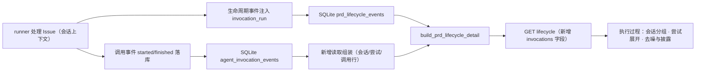

# PRD: 生命周期时间线接入调用明细与展示去噪

- GitHub Issue: https://github.com/ZataZhang/keda/issues/273

> ✅ **交付前置**：无，可立即开工。结构化声明见 §8 Delivery Dependencies，**那里是唯一事实源**。
>
> ⬜ **验收状态**：未开工。本行是 §9 Acceptance Checklist 的投影，**那里是唯一事实源**。

本文 Part A 用于确认行为，Part B 用于执行。当前为需求规划，尚未实现。

## Feature Overview (功能一览)

以下为 §10 的投影，行为验收以 §1 样例为准。

- **尝试内部不再黑盒**（FR-1、FR-3）：执行过程按「执行会话 → 生命周期阶段 → Agent 尝试 → 调用」分层；阶段固定显示实现、修复、收尾、校验、审核、监督，每次尝试可展开看到真实进程调用序列（执行器、结果、耗时、重试链）。
- **执行会话可辨**（FR-2）：runner 生命周期事件带所属执行会话标识，重复领取/重启不再表现为无法解释的重复行。
- **展示去噪**（FR-4）：同秒的「开始执行/被领取」合并为一行，「重试」成为尝试行标记，观测事件徽章不再显示「未开始」。
- **诚实降级**（FR-5）：调用账本不可用、旧数据无会话归属、读取截断三类缺口在页面显式披露，绝不推测回填。
- **先原型后实现**（FR-6）：目标形态先更新既有交互原型并呈递确认，再进入前端实现。
- **兼容不变**（FR-7）：现有端点只新增字段；CLI、日志标记、耗时口径与执行语义不变。

# Part A · 人审层 (Review Layer)

## 1. Introduction & Goals

### Problem Statement

用户在一次夜间值守的真实运行中打开 PRD「执行过程」标签，看到的时间线无法回答"这个 agent 这几个小时到底在做什么"：

- 一次 Agent 尝试（01:18）之后近 3.5 小时没有任何事件，直到出现 Token 用量行与下一次尝试——尝试内部完全是黑盒；
- 「开始执行 + 被领取」永远同秒成对出现，且该运行中出现两组相隔 9 分钟、无法区分的重复对（重复领取、进程重启还是并发领取，页面没有任何线索）；
- 「重试」与「Agent 尝试 #2」同秒同内容重复成两行；
- 「Token 用量」观测事件的徽章显示「未开始」，与事实不符。

仓库事实：调用级账本已经存在并持续写入本机 SQLite——每次真实进程调用一对开始/结束事件，带阶段、角色、执行器、结果、耗时、模型与重试链——但**没有任何读出口接入这个视图**（无 API 字段、前端零引用）。细数据在库里，视图只消费了里程碑级事件。受影响的是所有需要在运行后复盘"卡在哪、为什么慢、是否需要接管"的值守与排障角色。

### 用户补充的阶段展示要求（2026-10-10）

执行过程不能只显示笼统的「Agent 尝试」。主展示按六个生命周期阶段明确归类，顺序与生命周期 Agent 配置键一致：**实现**（`implementation`）→ **修复**（`fix`）→ **收尾**（`closeout`）→ **校验**（`verifier`）→ **审核**（`review`）→ **监督**（`supervisor`）。阶段行显示状态、耗时、执行器与调用数；展开后查看每次调用的结果、模型与重试关系。未触发阶段明确显示「未触发」，不能从相邻 attempt 推断阶段。阶段列表默认收起；展开的阶段占满整行，避免调用明细被挤入窄列。

### Interpretation (解读回显)

#### 行为样例

| 验证方式 | 输入 / 操作 | 期望观察到的结果 |
|---|---|---|
| 👀 人审 + 自动验证 | 打开一个有两次执行会话的 PRD「执行过程」 | 两次会话各自成组且可区分（会话开始时间与标识可见），不再出现两组无法解释的重复「开始执行/被领取」 |
| 👀 人审 + 自动验证 | 展开一次 Agent 尝试 | 展开项显示该尝试的真实调用序列：每次调用的阶段、执行器、结果、耗时与重试关系；行数与后端账本逐条一致 |
| 🤖 自动验证 | 查看同秒发生的开始与领取、尝试与重试 | 「开始执行/被领取」合并为一行；「重试」成为尝试行上的标记而不是重复事件行 |
| 🤖 自动验证 | 查看 Token 用量等观测事件行 | 徽章为中性观测语义，不出现「未开始」等阶段标签；事件抽屉仍显示原始字段 |
| 🤖 自动验证 | 查看调用账本上线前执行的旧 PRD，或该 PRD 没有关联 Issue | 时间线其余部分照常展示；调用明细区明确说明无调用记录/无法归属，不使用时间窗口猜测分组、不生成假调用 |
| 🤖 自动验证 | 调用账本读取失败，或返回条数达到读取上限 | 页面分别披露「调用明细不可用」与「已截断」，其余区域照常渲染 |
| 👀 人审 + 自动验证 | 对一次真实 runner 运行核对页面与账本 | 页面调用行与账本（独立新进程 fresh read）逐条一致；失败与回退调用独立呈现，不被合并成一次成功 |

这些行为样例逐项成为 §7.6 的验收 oracle：样例中的操作与期望观察被转写为 oracle 的 `real_entry` / `expected`，修正任意样例单元格即修正验收标准，说明见 §7.6。

#### 我默默定了这些

- 展示层级固定为「执行会话 → 实现 / 修复 / 收尾 / 校验 / 审核 / 监督 → Agent 尝试 → 调用」，不跨会话混排、不做第二种排列；阶段来自调用账本显式 `phase`。
- 旧事件没有会话标识时不猜测分组：回落为现状平铺时间线，并在调用明细区说明"无归属"，不按时间窗口反推。
- 调用读取沿用账本现有上限（默认 500 条事件）；达到上限即披露"已截断"，本 PRD 不做分页、过滤或搜索。
- 调用行只展示账本已经落库的字段（阶段/角色/执行器/结果/失败类别/耗时/模型请求与报告/用量/重试链/日志定位），不新增采集、不改用量统计口径。
- 去噪只发生在展示层：账本原始事件不改写、不删除；事件抽屉仍展示原始 detail。
- 观测事件（Token 用量）继续保持"不占时长、不推进阶段"的既有语义，只修正徽章文案。
- 读取失败静默降级为空并在页面披露，不影响页面其余部分（沿用旁路观测语义）。
- 不改任何 CLI 表面、日志标记与随包 operator 文档中的 grep 读法。

#### 我理解为不做

- 不做跨机器/多主机调用聚合或远端遥测（本机账本口径由调用观测交付限定）。
- 不做独立的"调用"页面、调用级分页或全文检索。
- 不改 runner 调度、重试策略、验证/合并门禁等任何执行语义。

本次读为"把已经落库的调用事实接进既有的 PRD 执行过程视图，并对既有事件做展示层去噪与诚实降级"，不是"重新设计生命周期数据模型、新增事件类型、重做统计页或新开一个调用中心"。目标行为：调用事实可归组、可展开、可核对；缺口如实披露。

### What The User Gets

值守者打开 PRD 的「执行过程」，无需 grep 日志即可看到每次尝试内部真实发生的调用序列（什么阶段、谁在跑、结果与耗时、失败与回退发生在哪一步），并且清楚知道哪些信息没有观测到——既不黑盒也不造假。

### Measurable Objectives

- 目标场景不再出现同秒重复行（开始/领取合并、尝试/重试折叠），观测事件行不再出现阶段语义徽章；两条均为可断言的 DOM 检查。
- 任意一次尝试展开后的调用行与账本逐条一致（字段级比对，含尝试编号、结果、耗时、模型三态）。
- 三类缺口（不可用、无归属、截断）各有显式、可断言的页面披露，且不阻断其余区域渲染。
- 接入与去噪完成后，账本原始事件与既有耗时口径零变化（回归断言）。

## 2. Human Review Map (介入与风险地图)

### 决策：调用明细按「会话 → 生命周期阶段 → 尝试 → 调用」分层接入，缺口显式披露

建议把已落库的调用事实接进既有「执行过程」视图：按"执行会话 → 实现 / 修复 / 收尾 / 校验 / 审核 / 监督 → Agent 尝试 → 调用"分层；每个阶段显示状态、耗时、执行器与调用数，展开阶段及尝试后看到真实调用序列。同时把三类缺口——旧数据无会话归属、调用账本读取失败、读取达到上限——在页面显式披露，而不是猜测或静默省略。这是值守者直接看到的产品形态与信任口径：最坏的情况是视图"看起来完整"、但调用序列被错误归组或静默缺失，让人误判 agent 行为并耽误接管；反向的风险是披露泛滥淹没关键信息，因此披露只限上述三类。

目标形态先按仓库既有约定更新交互原型，经确认后再进入前端实现。

**请确认：** 是否同意按「会话 → 六阶段 → 尝试 → 调用」形态接入调用明细，阶段固定按实现 → 修复 → 收尾 → 校验 → 审核 → 监督排序，并接受"缺口必须显式披露、不得推测回填"的降级口径？
**验收：** 在一次真实运行上打开执行过程：可以看到六个阶段及状态/耗时/执行器/调用数，展开尝试看到调用序列；会话分组、同秒去重正常；旧数据与不可用场景有明确披露文案。

自动门禁，不需要逐项人工审阅：会话标识注入、读取组装与 DTO 扩展、六阶段分组与调用明细展示、前端去噪、类型同步、架构与行数门禁、pytest 与浏览器 e2e、原型 Hub 往返与文档同步，均由执行器 + 自动门禁负责，证据见 §7.6 与 §9.2。

本次明确不涉及：数据库结构变化（无迁移、无新表）；CLI 表面变化；调度、重试与门禁等执行语义变化；统计页变化。

## 3. Usage And Impact After Implementation

- 值守/操作者（入口：Console 的 Backlog → 选中 PRD → 「执行过程」标签）：看到会话分组与实现、修复、收尾、校验、审核、监督六阶段；阶段内 Agent 尝试可展开调用序列；同秒重复行消失；观测事件徽章中性；三类缺口有披露。以下保持不变：四项耗时卡片口径、当前阶段徽章、事件抽屉原始字段、空态与"数据不完整"告警语义。
- runner / daemon（写入侧）：其执行期内写入的生命周期事件在 detail 中多一个"所属执行会话"标识；业务行为、重试、门禁、失败与阻塞语义完全不变；账本写入失败照旧旁路降级、不阻断运行。
- CLI 使用者与日志读者：无变化——CLI 表面、per-Issue 日志的调用标记（`[iar-invocation-*]`）与文档中的 grep 读法保持原样。
- 维护者：新增一个 core 读取组装模块与两个 DTO；调用账本仍是调用事实的唯一来源，不产生第二份调用数据。

## 4. Requirement Shape

- actor：Console 值守/操作者（主要受益人）；runner 写入链路（提供会话标识）；维护者/扩展开发者。
- trigger：打开某个 PRD 的「执行过程」；runner 处理 Issue 时写入带会话标识的生命周期事件。
- expected behavior：见 §10 FR-1..FR-7——调用事实按会话/尝试可归组展示、三类缺口显式披露、展示去噪、原型先行、兼容不变。
- scope boundary：端点增量字段 + core 读取组装 + 前端视图改造 + 原型与文档同步；不含 schema、CLI、调度与统计变化。

# Part B · 执行器层 (Build Layer)

## 5. Repository Context And Architecture Fit

### 现状模块与可复用路径

- 调用账本（写侧已完成）：`src/backend/core/use_cases/agent_invocation_tracing.py`——`start_invocation` / `finish_invocation` 在真实进程边界成对发事件；`build_invocation_timeline` 做起止配对与 `unclosed` / `incomplete` 解读；`resolve_invocation_store` 做账本能力探测；`bound_invocation_trace_context` 绑定每次 Issue 处理会话的 `run_id`。
- 调用账本存储（已完成）：`src/backend/infrastructure/persistence/console_store_invocations.py`——`agent_invocation_events` 表（schema v9）与 `list_issue_invocation_events(repo_id, issue_number, limit)` 跨 run 读取。
- 生命周期账本（已完成）：`src/backend/core/use_cases/agent_runner_lifecycle.py` 的 `record_lifecycle_event`（唯一写入点，detail 为结构化 JSON）与 `build_prd_lifecycle_detail`（详情组装）。
- 端点（已完成）：`src/backend/api/routes/agent_runner_backlog.py` 的 `GET /agent-runner/backlog/prds/{encoded_path}/lifecycle`，响应经 `_serialize` 递归序列化 dataclass，新增嵌套 dataclass 字段无需改路由逻辑。
- DTO（已完成）：`src/backend/core/shared/models/backlog.py` 的 `PrdLifecycleDetail` / `PrdLifecycleEventView`。
- 前端（已完成）：`frontend-public/components/backlog/prd-lifecycle-view.tsx`（容器，由 `frontend-public/components/backlog/prd-detail.tsx` 注册为「执行过程」标签）；`frontend-public/lib/api/backlog.ts` 的 `fetchPrdLifecycle`；`frontend-public/lib/api/types.ts` 的 `PrdLifecycle*` 类型（注释声明与后端 DTO 镜像）。
- 测试（已完成）：`tests/test_prd_lifecycle.py`；`tests/playwright-e2e/tests/smoke/backlog-prd-lifecycle.spec.ts`（读端点 fixture 顶替、Next.js 页面与浏览器真实）。

### Existing Path / Reuse Candidates

- 关联键已经存在：生命周期 ATTEMPT 事件 detail 有 `attempt_number`；调用事件本身按 `run_id + attempt_number` 组织。缺口只有一个：生命周期事件 detail 还没有会话标识，补一处小注入即可确定性归组，无需任何推断。
- 复用 `list_issue_invocation_events`（跨 run 读取）、`build_invocation_timeline`（起止配对与未闭合语义）、`resolve_invocation_store`（能力探测）。
- 端点与序列化机制复用；不新增路由。

### Architecture Constraints

- 依赖方向 `api -> core -> engines -> infrastructure`：读取组装在 core，SQL 细节留在 infrastructure 既有实现，core 只经既有端口/鸭子类型访问。
- 文件长度上限为硬约束：`agent_invocation_tracing.py` 非空行已 800+，不得继续加行；`prd-lifecycle-view.tsx` 已 580 行——读取组装放新模块，分组渲染拆新组件。
- 前端类型与后端 DTO 逐字段对齐；后端 DTO 新字段必须带默认值，避免破坏既有构造点。

### Frontend Impact

`frontend-public`（Next.js App Router，`kc console` 同源托管）：修改 `prd-lifecycle-view.tsx`（挂接调用明细、渲染降级披露），新增 `prd-lifecycle-timeline.tsx`（会话/六阶段/尝试/调用四层分组、展开交互与去噪规则），同步 `types.ts`。不改路由；不改 `frontend-admin/`。

### Existing PRD Relationship

- 归档 `P1-FEAT-20261008-015223-agent-invocation-tracing-and-stall-diagnosis`（Issue #242，PR #243 已合并）：交付调用账本与起止解读，其 non-goals 明确"若后续实际使用证明直接读日志仍费劲，再评估看板或统计聚合"。本 PRD 正是该触发条件的跟进——读法从日志 grep 升级为 Console 视图，不改变其本机口径与不虚构约束。
- 归档 `P1-FEAT-20260921-161621-prd-lifecycle-observability`（PR #153 已合并）：定义了「执行过程」信息层级与事件闭集，本次是同一视图的增强，不改变其耗时口径与事件语义。
- `tasks/pending/P1-FEAT-20261009-123512-kc-agentic-entry-and-stall-supervision.md`：明确不改 Console 与 `frontend-public`，与本 PRD 独立、可并行。
- `tasks/pending/P1-FEAT-20261009-161453-kc-hosted-runner-deployment.md`：计划对 `console_store_invocations.py` 增加保留期清理——同一文件的潜在触达点，实施时按 HEAD 协调；其清理造成的"历史被截断"正由本 PRD 的截断披露语义覆盖。
- `tasks/pending/P1-FEAT-20261009-133425-lifecycle-agent-model-settings.md`：设置页方向，与本视图无交集。

### Potential Redundancy Risks

- 不建第二套调用表或第二份 join 逻辑：读取组装复用既有账本与解读函数；不在 lifecycle 表新增事件类型来"镜像"调用。
- 不在前端按时间窗口猜会话归属；不把调用事实复制进事件 detail。
- 不重做统计页、不引入新依赖。

## 6. Recommendation

### Recommended Approach

三处小改动闭环：(1) 写侧在 `record_lifecycle_event` 单点注入"所属执行会话"标识；(2) core 新增一个读取组装模块，把既有调用账本解释为可归组的展示行，挂到既有详情 DTO；(3) 前端把时间线改为会话→六个生命周期阶段→尝试→调用分层渲染并应用去噪规则。阶段以调用账本显式 `phase` 为事实来源；恢复/修复类子阶段在对应生命周期阶段下保留原始 phase，不推测回填。目标形态先更新既有交互原型并呈递确认，再进入前端实现。

### Proposed Solution Summary (实现机制)

- 写侧注入：`record_lifecycle_event` 在活动调用观测上下文存在、且调用方 detail 未提供 `invocation_run` 键时，把当前会话 run id 写入 detail。语义是"该事件发生在哪次执行会话内"——runner 处理期内的开始/领取/尝试/验证/审阅/阻塞等事件自动获得标识；roadmap 侧事件（promote/merged 等）在上下文之外，不写该字段（语义正确）。
- 读取组装：新 core 模块 `prd_invocation_detail.py` 用能力探测取账本读端，按 `repo_id + issue_number` 拉取最近调用事件（沿用既有上限），用 `build_invocation_timeline` 解读为每次调用一行，再合并 finish detail 的展示字段（`attempt_number`、模型三态、token 用量、失败类别、`exit_code`、`retry_of` / `retry_reason`、`log_locator`），产出 `PrdInvocationDetail{available, truncated, rows}`。
- 组装点与传输：`build_prd_lifecycle_detail` 在存在 `issue_number` 时调用组装器，把结果挂到 `PrdLifecycleDetail.invocations`（新字段、默认 `None`、向后兼容）；现有端点响应自然多出 `invocations`。
- 前端：`prd-lifecycle-view.tsx` 保持容器与指标，时间线渲染下沉到新组件；分组全部基于显式字段（事件 `detail.invocation_run` 与调用行 `run_id`、`attempt_number`、`phase`），不做时间窗推断；阶段按实现 → 修复 → 收尾 → 校验 → 审核 → 监督显示，去噪规则仅作用于渲染，抽屉与原始 detail 不变。
- 明确不做：新表/迁移、新端点、新事件类型、CLI/配置变化、统计页变化。

### Alternatives Considered

- **独立"调用明细"端点 + 懒加载子面板**：多一次请求、多一处状态，而数据与生命周期详情同源同刷新节奏；除非实测体量证明必要，否则拒绝。
- **读侧按时间窗口推断会话归属（不改写侧）**：省一处注入，但会产生假关联，违背"观测不虚构"的既有约束，拒绝。
- **保持只读日志（维持 #242 的收窄结论）**："直接读日志仍费劲"的触发条件已由用户实测成立（本 PRD 来源），按该 PRD 自身预留的升级路径接入 Console 读出口。

## 7. Implementation Guide

> This section is a living implementation guide based on current repository analysis. If implementation discovers additional affected files, hidden dependencies, edge cases, or a better path, update this PRD before proceeding.

### Core Logic

1. **会话标识注入（写侧）**：在 `record_lifecycle_event` 内读取 `active_invocation_trace_context()`；非空且 detail 中不存在 `invocation_run` 键时注入 `{"invocation_run": context.run_id}`；不得覆盖调用方已提供的同名键。不改变 event_key / phase / status / reopen 逻辑；不引入 infrastructure 依赖；无上下文时行为与现状一致。
2. **读取组装（新 core 模块 `prd_invocation_detail.py`）**：`build_prd_invocation_detail(*, store, repo_id, issue_number, limit=500)`：
   - 能力探测失败（store 不支持读端）→ `available=False`、`rows=[]`；
   - 调用 `list_issue_invocation_events`；读取异常 → `available=False`；
   - `build_invocation_timeline(events)` 得到每次调用一行；行顺序沿用事件流顺序（同秒不按字符串重排）；
   - 从 finish detail 合并展示字段；`outcome` 保留 `ok/failed/timeout/error/unclosed/incomplete` 闭集语义（未闭合不得虚构结束时间）；
   - `len(events) >= limit` → `truncated=True`。
3. **DTO 扩展**：`core/shared/models/backlog.py` 新增 `PrdInvocationRow` 与 `PrdInvocationDetail`；`PrdLifecycleDetail` 增 `invocations: PrdInvocationDetail | None = None`。
4. **详情组装**：`build_prd_lifecycle_detail` 在 `run_record.issue_number` 非空时调用组装器；组装异常（防御性捕获）只把 `invocations.available` 置为 `False`，不得把整个详情降级为空态。
5. **端点**：不改路由逻辑；响应新增 `invocations` 字段。旧客户端忽略未知字段；旧响应（无该字段）时前端按"无调用明细"处理。
6. **前端分组与渲染**：
   - 会话：按事件 `detail.invocation_run` 分组（出现顺序）；无该字段的事件进入"未归属"回落组（现状平铺 + 一行披露说明）。
   - 尝试：会话内 `attempt` 事件；尝试行摘要 = `#N`、agent、失败类型、耗时、恢复标记、调用数；展开 = 同会话内 `attempt_number` 相同的调用行；`attempt_number` 为空的调用行挂在会话级"其他调用"。
   - 调用行：阶段（中文）、角色、执行器、结果徽章、耗时、模型（请求/报告/未提供三态）、重试链标记、用量摘要；复用既有事件抽屉展示原始字段，原始 detail 不改写。
   - 去噪：`claimed` 紧跟 `started` 且同 `occurred_at` 且 detail 相同 → 合并为一行（"已领取并开始执行"）；`retry` 紧随同秒同 detail 的 `attempt` → 折叠为该尝试行标记；`agent_token_usage` 徽章走中性"观测"覆盖，禁止回落到阶段标签。
   - 可访问性：展开/收起用 button + `aria-expanded`；键盘可达；未知事件类型与损坏 detail 渲染为"未知"并保留行，不抛错。
7. **口径不变量**：不改 `classify_durations`、不改事件闭集与 status/phase 映射、不改观测事件的占位行为；事件抽屉与原始数据保持原样。
8. **规模守卫**：读取组装独立成模块、分组渲染独立成组件；提交前确认相关文件非空行未超 1000 上限（接近时继续拆分）。

### Change Impact Tree

```text
.
├── src/backend/core/use_cases/agent_runner_lifecycle.py [修改]
│   【总结】record_lifecycle_event 单点注入所属执行会话标识，详情组装挂接调用明细
│
├── src/backend/core/use_cases/prd_invocation_detail.py [新增]
│   【总结】把已落库的进程调用事件解读为可归组的展示行，并披露可用性与截断
│
├── src/backend/core/shared/models/backlog.py [修改]
│   【总结】新增 PrdInvocationDetail / PrdInvocationRow DTO 并扩展 PrdLifecycleDetail
│
├── frontend-public/lib/api/types.ts [修改]
│   【总结】同步 invocations 契约类型（镜像后端 DTO）
│
├── frontend-public/components/backlog/prd-lifecycle-view.tsx [修改]
│   【总结】容器与指标不变，时间线改挂新组件并渲染三类降级披露
│
├── frontend-public/components/backlog/prd-lifecycle-timeline.tsx [新增]
│   【总结】会话→六阶段→尝试→调用四层分组、展开交互与展示去噪规则
│
├── tests/test_prd_lifecycle.py [修改]
│   【总结】覆盖会话标识注入、读组装挂接与向后兼容
│
├── tests/test_prd_invocation_detail.py [新增]
│   【总结】覆盖读取组装、关联字段、三类降级与未闭合语义
│
├── tests/playwright-e2e/tests/smoke/backlog-prd-lifecycle-invocation.spec.ts [新增]
│   【总结】新契约 fixture 下的会话分组、展开、去噪与披露的浏览器断言
│
├── docs/guides/agent-runner.md [修改]
│   【总结】补充执行过程调用明细的读取口径、降级说明与既有 grep 读法关系
│
├── docs/prototypes/prd-lifecycle-observability.html [修改]
├── docs/prototypes/assets/prd-lifecycle-observability.js [修改]
├── docs/prototypes/assets/prd-lifecycle-observability.css [修改]
├── docs/prototypes/prd-lifecycle-observability.md [修改]
├── docs/prototypes/assets/prototype-hub.js [修改]
│   【总结】原型升级到目标形态（会话分组/展开/降级场景）并同步 registry 与说明
│
└── tasks/evidence/<prd-stem>/scripts/ [新增·不进 diff]
    【总结】真实入口 harness：隔离环境真实 runner + 真实 SQLite + 真实页面截图
```

文件列表基于当前代码树，是起点而非穷尽的 allowlist；执行器必须用下方 Drift Guard 的 `rg` 命令重新定位实际语义点，并在发现遗漏时先更新本 PRD。既有 `tests/playwright-e2e/tests/smoke/backlog-prd-lifecycle.spec.ts`（旧响应无 `invocations` 字段）不修改，作为"缺字段兼容"回归保留。

### Risk Classification Register

| Change point | Tier | 决定性原因 | Intervention | Oracle / gate |
|---|---|---|---|---|
| 会话标识注入（core 写侧单点） | R1 | 附加字段、读取方容错；但会进入所有生命周期事件 detail | 无上下文不写 + 注入回归断言 | `tests/test_prd_lifecycle.py` 注入用例 |
| 读取组装 + DTO + 端点字段（core/api） | R2 | 跨账本关联的展示诚实性；错误关联会误导接管判断 | 人工确认形态 + 显式字段关联 + fresh-state 核对 | rv-1、rv-2 |
| 前端分组/展开/去噪渲染 | R1 | 展示层、可回滚 | e2e DOM 断言 + 旧 spec 兼容回归 | rv-4、旧 spec |
| 三类降级披露（可用性/无归属/截断） | R1 | "看起来完整"是主要失败模式，但仅只读视图 | 显式字段 + 页面披露断言 | rv-3 |
| 原型与文档同步 | R1 | 用户可见但局部可回滚 | 原型先确认 + mkdocs strict + Hub 往返 | §9.1 原型行 |

### Executor Drift Guard

```bash
rg -n "def record_lifecycle_event|active_invocation_trace_context|invocation_run" src/backend
rg -n "list_issue_invocation_events|build_invocation_timeline|resolve_invocation_store" src/backend tests
rg -n "PrdLifecycleDetail|PrdLifecycleEventView|_serialize" src/backend frontend-public tests
rg -n "prd-lifecycle-view|PrdLifecycleView|EVENT_TYPE_LABELS|agent_token_usage" frontend-public
rg -n "lifecycle|invocation" docs/architecture/system-design.md docs/guides/agent-runner.md
rg -n "record_lifecycle_event\(" src/backend
```

- 开工前重读在途 `P1-FEAT-20261009-161453` 与 `P1-FEAT-20261009-123512` 的当前状态与触达文件；若其已合并，按 HEAD 重定位。
- 不假定 Change Impact Tree 穷尽：搜索 `record_lifecycle_event` 全部调用点，确认注入对所有事件类型生效且不覆盖调用方 detail 键。
- 若账本保留期/清理语义已由在途 PRD 改变，截断披露文案需与之对齐，不新增"历史一定完整"的假设。
- 前端不硬编码 fixture 文案与事件 id；分组算法必须容忍未知事件类型与损坏 detail。
- 检查 `docs/architecture/system-design.md` 的端点契约章节，如已记录该端点则同步 `invocations` 字段。

### Flow / Architecture Diagram



### ER Diagram

No data model changes in this PRD.（仅为既有 `detail_json` 负载新增一个键；无表结构、迁移或索引变化。）

### Realistic Validation Plan

真实入口使用隔离 HOME / `IAR_CONFIG` 与真实 runner、真实 SQLite：外部执行器边界允许用确定性 fixture 可执行文件（计划驱动、含一次失败重试），Git / SQLite / HTTP / 浏览器必须真实。所有 RV harness 与采集脚本放 `tasks/evidence/<prd-stem>/scripts/`，一律不进代码 diff。计划先红后绿：oracle 先于实现编写并在未实现树上跑红，再进入实现。

```yaml
- id: rv-1
  behavior: "在真实 Console 打开有多次执行会话的 PRD「执行过程」：会话可分组，Agent 尝试可展开调用序列，同秒重复行消失"
  reviewer: human
  real_entry: "SKIP_CONSOLE_SYNC=1 bash tasks/evidence/P1-FEAT-20261010-092630-lifecycle-invocation-detail-timeline/scripts/capture_real_console.sh"
  entry_note: "该 harness 在隔离 HOME + IAR_CONFIG 下用真实 runner（外部执行器为确定性 fixture，含一次失败重试）写入真实两套账本，再启动真实 uvicorn（静态前端 + 真实 FastAPI + 真实 SQLite）用真实 Chromium 截图。`just e2e tests/smoke/backlog-prd-lifecycle-invocation.spec.ts` 是补充 UI 流程入口（读端点 fixture 顶替），不参与真实 SQLite 穿越判定。"
  expected: "页面展示会话与六个生命周期阶段分组，阶段内尝试可展开调用行；页面中的调用条数、阶段、结果、耗时与账本独立 fresh read 逐条一致；不再出现同秒重复的「开始执行/被领取」与重复「重试」行。"
  mock_boundary: "仅外部执行器可替换为 fixture；runner 编排、FastAPI 路由、core 组装、SQLite、Next.js 页面与浏览器交互必须真实。"
  tier: R2
  test_layer: e2e
  required_for_acceptance: true
  presentation: "tasks/evidence/<prd-stem>/rv-1-lifecycle-invocation.png；交付时内联本地图片并附可运行的 open 命令；约 10 秒自查：展开一个尝试，核对调用行阶段/结果/耗时与事件抽屉原始字段一致。"
  critical_value_source: "页面截图中的调用行（条数/阶段/结果/耗时）与 SQLite 账本的独立 fresh read 结果。"
  must_cross: "harness runner 运行（两套账本真实写入）-> SQLite fresh read -> GET lifecycle HTTP -> Next.js 页面 -> 浏览器渲染与交互 -> 截图。"
  forbidden_bypasses: "直接 INSERT 账本行作为真实运行证据；只渲染组件不走页面；用前端内嵌 fixture 顶替真实响应出图；绕过 HTTP 直接调 core。"
  fresh_state_probe: "运行结束后用新进程读取同一 SQLite 并请求同一端点，比对调用行数与字段后再截图。"
  final_tree_evidence: "最终相关代码树上重跑 harness，保存截图、端点响应 JSON、账本导出与 tree/脚本哈希到同一 evidence 目录。"
  negative_control: "实现前红跑同一 harness 断言（等待会话分组与调用行出现）；或在测试 fixture 边界把一个失败调用改成 ok，页面与账本比对断言必须变红。"
  expected_fail: "页面缺少调用行/分组，或比对断言不通过。"
- id: rv-2
  behavior: "端点新增字段与账本逐条一致：会话标识、尝试编号、结果、耗时、模型三态与重试链完整；旧事件无会话标识时不虚构分组"
  reviewer: verifier
  real_entry: "uv run pytest -q tests/test_prd_lifecycle.py tests/test_prd_invocation_detail.py -k 'invocation or degrade'"
  expected: "GET lifecycle 响应中的 invocations.rows 与预置账本逐条一致；无 invocation_run 的旧事件仍返回可用行且事件回落为未归属披露；available/truncated 语义正确。"
  mock_boundary: "使用真实临时 SQLite 与真实 HTTP 客户端；无需 GitHub 与真实执行器。"
  tier: R2
  test_layer: integration
  required_for_acceptance: true
  critical_value_source: "真实写入的调用事件与生命周期事件（含 attempt_number/run_id）与端点原始 HTTP 响应。"
  must_cross: "core 读取组装 -> 详情 DTO -> 路由序列化 -> 新进程 HTTP 读取同一 DB。"
  forbidden_bypasses: "直接调用组装函数冒充 HTTP 契约；手写 DTO 断言；用前端 fixture 反推字段。"
  fresh_state_probe: "写入完成后新起 HTTP 客户端读取同一仓库/PRD 的端点响应，与 DB 原始行比对。"
  final_tree_evidence: "最终树上重跑测试并保存 pytest 输出与一次 HTTP 响应样本（rv-2-*.txt/json）。"
- id: rv-3
  behavior: "三类降级显式披露且不阻断页面：账本不可用、旧数据无归属、读取达上限截断"
  reviewer: verifier
  real_entry: "uv run pytest -q tests/test_prd_invocation_detail.py -k 'unavailable or truncated' 与 just e2e tests/smoke/backlog-prd-lifecycle-invocation.spec.ts"
  expected: "available=false / truncated=true / 无归属三种状态在 API 与页面均有明确披露断言；页面其余区域渲染成功。"
  mock_boundary: "存储读故障与旧库在测试边界模拟；页面与 HTTP 真实。"
  tier: R1
  test_layer: integration
  required_for_acceptance: true
- id: rv-4
  behavior: "展示去噪生效且不篡改原始事实：同秒开始/领取合并、尝试/重试折叠、观测徽章中性"
  reviewer: verifier
  real_entry: "just e2e tests/smoke/backlog-prd-lifecycle-invocation.spec.ts"
  expected: "DOM 断言：无同秒重复行、重试为尝试行标记、agent_token_usage 行徽章为中性「观测」且不出现「未开始」；事件抽屉仍显示原始 detail。"
  mock_boundary: "读端点响应用确定性 fixture；Next.js 页面与浏览器真实。"
  tier: R1
  test_layer: e2e
  required_for_acceptance: true
```

失败排查顺序：先核对会话标识注入是否生效（事件 detail 是否有 `invocation_run`），再核对读取组装与账本原始行，再核对 HTTP 响应与前端类型，最后核对前端分组/去噪渲染；页面数值与账本不一致时禁止在前端修补口径。

### Low-Fidelity Prototype

- 更新既有交互原型 `docs/prototypes/prd-lifecycle-observability.html`（及 assets）到目标形态：会话与六阶段分组、阶段内尝试展开调用明细、去噪行、三类降级披露；扩展稳定 fixture 场景覆盖"调用明细正常"与"调用明细不可用/无归属"。
- 原型必须先于前端实现完成并经人工确认（§2 决策的一部分，沿用仓库既有原型评审约定）；实施期先加载仓库原型 skill，更新 Hub registry，保持返回 Hub 入口、审核工具条与稳定 fixture（无随机数/定时器）。
- 验收关键状态（PR 对比配对用）：(a) 会话分组 + 尝试展开调用明细（正常）；(b) 调用明细不可用/无归属（降级）。

### Interactive Prototype Change Log

| File Path | Change Type | Before | After | Why |
|---|---|---|---|---|
| `docs/prototypes/prd-lifecycle-observability.html` | Modify | 时间线为单层事件列表 | 增加会话分组/尝试展开/调用行与降级披露的目标形态 | 先确认目标形态再实现 |
| `docs/prototypes/assets/prd-lifecycle-observability.js` | Modify | 三套场景 fixture | 增加调用明细 fixture 与两套降级场景，保持稳定可重置 | 覆盖关键分支 |
| `docs/prototypes/assets/prd-lifecycle-observability.css` | Modify | 单层时间线样式 | 分组/缩进/展开与披露样式 | 呈现层级 |
| `docs/prototypes/prd-lifecycle-observability.md` | Modify | 说明三套场景 | 补充调用明细场景、降级口径与交互语义 | 保持原型可维护 |
| `docs/prototypes/assets/prototype-hub.js` | Modify | registry 指向旧形态 | 更新描述/版本/updatedAt | Hub 是唯一清单 |

### External Validation

No external validation required; repository evidence was sufficient.

## 8. Delivery Dependencies

### Delivery Dependencies

- Depends on tasks/issues:
  - none
- Gate type: none
- Sequence: via-main
- Notes: 非依赖的协同项——归档 Issue #242 / PR #243 与 PR #153 已在主线提供数据源与视图；在途 `P1-FEAT-20261009-161453-kc-hosted-runner-deployment` 预计触达同一账本存储文件（保留期清理），实施时按 HEAD 协调并复用本 PRD 的截断披露语义；`P1-FEAT-20261009-123512-kc-agentic-entry-and-stall-supervision` 明确不改 Console，可并行。

## 9. Acceptance Checklist

### 9.1 人读呈递区（Human Review Surface）

| 要查看的结果 | 呈递物（交付时填入最终路径） | 约 10 秒自检 |
|---|---|---|
| 执行过程时间线：会话与六阶段分组、阶段内尝试展开调用明细、去噪后的行 | `tasks/evidence/<prd-stem>/rv-1-lifecycle-invocation.png`；交付时内联本地图片并附 `open "<绝对路径>"` | 确认六阶段顺序与阶段状态；展开一个阶段内的 Agent 尝试，核对调用行阶段/结果/耗时与事件抽屉原始字段；确认不再出现同秒重复行 |
| 目标形态可点击原型 | `http://127.0.0.1:8000/prototypes/prd-lifecycle-observability.html`（`uv run mkdocs serve`） | 切换调用明细与其降级场景，确认展开交互与披露文案 |

Verifier-only 且不在本区逐项呈递：端点契约与关联完整性（rv-2）、三类降级断言（rv-3）、去噪 DOM 断言（rv-4）、lint/build/架构门禁与证据一致性；仅失败时向人工报告。

### 9.2 Acceptance Evidence Package

#### Human-Confirmed

- [ ] 人工确认 §2 决策：调用明细按「会话 → 六阶段 → 尝试 → 调用」分层接入，阶段按实现 → 修复 → 收尾 → 校验 → 审核 → 监督排列；缺口显式披露、不推测回填；证据：rv-1 呈递与原型审阅。
- [ ] 人工完成 §9.1 两个呈递物的一次性审阅，并记录可接受或差异。

#### R2 / Behavior Acceptance

- [ ] rv-1 真实入口：页面调用行与账本逐条一致（含会话分组、展开与去噪），证据 rv-1-*.png/json。
- [ ] rv-2 端点契约与关联完整性通过（含旧事件无会话标识的回退与诚实字段），证据 rv-2-*.txt/json。

#### R1 / Degradation And Rendering

- [ ] rv-3 三类降级（不可用/无归属/截断）披露通过且不阻断其余渲染。
- [ ] rv-4 去噪 DOM 断言通过；事件抽屉与原始 detail 未变。
- [ ] 旧 e2e spec（响应无 `invocations` 字段）原样通过：前端容忍缺字段。

#### Architecture & Compatibility Acceptance

- [ ] 无新表/迁移/事件类型；`uv run python hooks/shared/check_architecture.py` 通过；core 未 import infrastructure。
- [ ] 现有端点向后兼容（新增字段，旧客户端忽略）；CLI 表面与 `[iar-invocation-*]` 日志标记未变（rg 断言）。
- [ ] 行数守卫：修改文件非空行未超 1000 上限（新模块/新组件拆分生效）。

#### Frontend Acceptance

- [ ] `pnpm --dir frontend-public typecheck`、`build`、lint 通过；桌面与窄屏截图标注验证层级。
- [ ] 展开/收起键盘可达（`aria-expanded`）；未知事件类型/损坏 detail 渲染不抛错。

#### Documentation & Prototype Acceptance

- [ ] `docs/guides/agent-runner.md` 与相关 API/类型文档同步；`uv run mkdocs build --strict` 通过。
- [ ] 原型 Hub → 原型 → 关键场景 → Hub 往返通过（桌面与窄屏），说明文档同步更新。

#### Validation Acceptance

- [ ] `just lint --reuse`、`just lint --full`、受影响 pytest、`just e2e`（新增与旧 spec）、前端 typecheck/build、mkdocs strict 全绿；证据绑定最终代码树。
- [ ] 独立 verifier 对 rv-1..rv-4 的来源、真实边界、fresh-state 与反例审查为 PASS。

#### Delivery Readiness

- [ ] 实现与 §13 Final Reconciliation 一致，无未声明的推迟项；完成消息逐字携带 §9.1 内容（内联图片 + open 命令）。
- [~] PR 创建、独立审查与归档由 runner 在执行器交付门禁之后完成 — runner-owned gate: PR/review/archive。

## 10. Functional Requirements

- **FR-1**：生命周期详情接口必须返回该 Issue 的调用明细行（跨执行会话、按发生顺序），每行包含会话标识、阶段/角色、执行器、尝试编号、结果与失败类别、耗时、模型请求/报告、重试链与日志定位；账本不可用、旧历史缺失与超限截断必须显式披露，不得推测回填。
- **FR-2**：runner 执行期内产生的生命周期事件必须在 detail 中携带所属执行会话标识（`invocation_run`）；不得覆盖调用方已提供的同名键；无会话上下文的事件不得写入该字段。
- **FR-3**：执行过程必须按「执行会话 → 生命周期阶段 → Agent 尝试 → 调用」分组。阶段按固定顺序显示实现（`implementation`）、修复（`fix`）、收尾（`closeout`）、校验（`verifier`）、审核（`review`）、监督（`supervisor`）；阶段状态、耗时、执行器与调用数来自显式调用记录。未触发阶段标记为「未触发」，恢复/修复子阶段保留账本原始 `phase`，不从时间或相邻事件推断。每次尝试可展开查看真实调用序列；无会话归属的旧事件回落现有平铺展示并显式说明。
- **FR-4**：展示去噪——同秒的 `started`/`claimed` 合并为一行；同秒的 `attempt`/`retry` 折叠为尝试行标记；观测类事件（Token 用量）使用中性徽章，不得显示「未开始」等阶段语义。
- **FR-5**：账本读取失败、旧数据无归属、调用行截断三类缺口必须在页面显式披露，且不阻断其余内容渲染；原始事件与耗时口径不因去噪改变。
- **FR-6**：目标形态必须先更新既有交互原型并呈递确认，再进入前端实现；原型使用稳定 fixture，覆盖六阶段与阶段内调用明细。阶段默认收起；展开时占满内容区整行，调用字段保持可读。
- **FR-7**：兼容与同步——现有端点只新增字段；CLI 表面、日志标记与执行语义不变；前端类型、文档与测试同步。

## 11. Non-Goals

- 不新增/修改数据库表与迁移；不新增生命周期事件类型。
- 不做跨机器聚合、远端遥测、调用级分页/过滤/搜索或独立"调用"页面。
- 不改 runner 调度、重试、验证/合并门禁等执行语义与既有耗时口径。
- 不改 CLI 表面与 `[iar-invocation-*]` 日志标记；不重做 Stats 页。

## 12. Risks And Follow-Ups

- 账本保留期清理（在途 hosted-runner PRD）可能让旧调用从本机消失：读取侧只披露"已截断/无记录"，不尝试恢复；实施时与其对齐语义。
- 旧库/旧事件没有会话标识属预期：渲染必须回落而不能猜；若真实环境大面积无标识，首屏价值受限（本 PRD 已限定只对标识存在的数据分组）。
- 长驻 PRD 的调用量可能触及读取上限：本 PRD 用截断披露兜底；分页/过滤留待有实测需求再评估。
- 前端分组逻辑复杂度上升：拆新组件 + DOM/E2E 断言防回归；接近行数上限时继续拆分。

## 13. Decision Log

| ID | Decision | Rejected | Rationale |
|---|---|---|---|
| D-01 | 同一端点扩展 `invocations` 字段 + 同页分层渲染 | 独立端点/独立调用页面/懒加载子面板 | 数据与生命周期详情同源同刷新节奏，单请求即可满足，避免多一处状态与页面复制。 |
| D-02 | 关联口径 = 写侧注入会话标识（`invocation_run`）+ `attempt_number` 显式 join | 读侧按时间窗口推断归属 | 只使用显式 id/字段，避免假关联，维持"观测不虚构"的既有约束。 |
| D-03 | 三类缺口显式披露（available/truncated/无归属） | 静默空态或猜测回填 | 误判 agent 行为的代价高于空态；披露只限三类，避免淹没关键信息。 |
| D-04 | 去噪仅在展示层，账本原始事件不变 | 后端合并/删除重复事件或改写 detail | 账本 append-only；抽屉保留原始事实；避免历史语义与耗时口径变化。 |
| D-05 | 原型先于前端实现并经确认 | 直接实现再补原型 | 沿用仓库既有原型评审约定，目标形态先获得用户确认。 |
| D-06 | 六阶段作为调用明细的第一层业务分组，顺序固定 | 继续把所有调用显示为泛化「Agent 尝试」 | 用户明确要求区分实现、修复、收尾、校验、审核、监督；阶段必须来自调用账本显式 phase，不能按时间猜。 |

## 14. Change Log

### 创建 PRD（调用明细接入与展示去噪方案）

- Type: scope
- Before: 调用账本只写不读；执行过程时间线为单层里程碑事件（同秒重复对、观测徽章误导、尝试内部黑盒）。
- After: 规划会话标识注入、核心读取组装、会话→六阶段→尝试→调用四层分组与去噪渲染、三类降级披露与原型先行确认。
- Reason: 用户在真实运行中实测时间线"太粗"；细账本已在库中但没有任何读出口（并触发既有 PRD 预留的升级条件）。
- Impact: 新增 core 读取模块与 DTO 字段、前端时间线组件拆分、原型与文档同步；无 schema/CLI/执行语义变化。
- Review: 待用户确认 §1 解读与 §2 决策后开工。

### 补充六阶段明细展示要求

- Type: scope
- Before: 执行过程里的 Agent 活动以笼统 attempt 为主标题，无法快速区分实现、修复、收尾、校验、审核与监督。
- After: 人类可见的阶段组固定为实现 → 修复 → 收尾 → 校验 → 审核 → 监督；组内按显式账本调用展开，未触发阶段如实标记。
- Reason: 用户在查看执行过程时明确要求按生命周期 Agent 阶段展示详情。
- Impact: 更新本 PRD 的 FR-3、原型与前端分组要求；底层调用阶段与重试记录保持原始语义。
- Review: 已纳入原型待确认；前端实现仍按 §2 / FR-6 在原型呈递后开始。

### 调整六阶段展开布局

- Type: interaction
- Before: 首个阶段默认展开，且双列中的展开卡片保持单列宽度，调用明细窄到难以阅读。
- After: 阶段默认收起；点击阶段后卡片占满整行，调用明细保留可读宽度。
- Reason: 用户指出原型当前展开方式不合理，截图中的调用字段被挤成窄列。
- Impact: 更新交互原型、Hub 描述与 FR-6；生命周期数据与阶段顺序不变。
- Review: 待用户复核原型布局；生产前端仍按 §2 / FR-6 在确认后实现。
