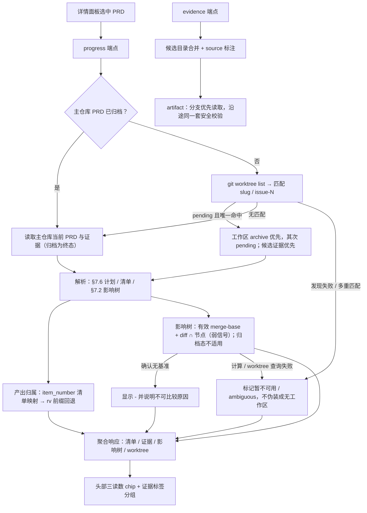

# PRD: Console 交付进度信号：验收证据「计划 vs 产出」与影响树触达

- GitHub Issue: https://github.com/ZataZhang/keda/issues/274

> ✅ **交付前置**：无，可立即开工。
> 结构化声明见 §8 Delivery Dependencies，**那里是唯一事实源**。

> ⬜ **验收状态**：未开工。
> 本行是 §9 Acceptance Checklist 的投影，**那里是唯一事实源**。

本文分两层：Part A 人审层（§1-4）界定「详情页能不能看到交付进度、这些数字怎么读」的可见口径与验收选择；Part B 执行器层（§5-13）给出读取边界、解析移植、失败降级与验证证据。

## Feature Overview (功能一览)

以下清单是 §10 Functional Requirements 的行为投影；具体验收以 §1 行为样例为准。

- **运行中读数来自执行工作区**（FR-1、FR-5、FR-7）：详情面板一次拉取聚合读数（清单/影响树/证据/工作区），成功定位时证据与进度分支优先读取、主仓库兜底；发现失败或多重匹配显示不可用，不冒充无工作区；运行中证据带「未合并」来源标注。
- **证据计划解析**（FR-2）：「计划 N 项」取 PRD 验证计划（§7.6）里的条目（编号、摘要、人验/机验），不拿验收清单条数冒充。
- **计划 vs 产出与报告状态**（FR-3、FR-4）：产出归属优先用结构化证据清单（`evidence.json`，声明映射 + 磁盘存在性校验），缺失时按验证编号文件名前缀回退，两种口径都在界面标注为弱信号；验证计划 / 证据报告 / 独立验证报告三件套的「是否已产出」并列展示（不解析结论文本）。
- **影响树触达**（FR-6）：按 PRD 影响树与分支实际改动求交，显示 `~触达/可判定`（无法判定节点以 `?n` 披露）；无工作区、无基准或计算不可用时显示 `-` 并说明状态，不编造分母。
- **详情头部进度摘要**（FR-8）：清单勾选、影响树触达、证据计划/产出三个读数常驻详情头部，带弱信号提示文案。
- **证据标签明细升级**（FR-9）：按验证条目分组列文件、标注未产出与未合并、空态不伪造；其他文件（报告、附件）归入「其他」。
- **兼容与降级**（FR-10）：端点字段只增不改；无工作区、无验证计划、无结构化清单的老 PRD 优雅降级，读取失败与成功空结果区分；CLI 表面、磁盘证据约定与数据库结构不变。

# Part A · 人审层 (Review Layer)

## 1. Introduction & Goals

### Problem Statement

操作员在看板详情里最关心的两个问题——「这条 PRD 计划要验证几项、现在已经产出了几项」与「计划要改多少文件、实际落盘了多少」——页面都不回答：

- 「验收证据」标签只是一张平铺的文件列表：正在执行的 PRD，页面只显示主仓库里的执行锁文件（「共 1 个文件」），而它的执行工作区里其实已经躺着结构化证据清单与多份验证产物——运行中的证据和进度从来看不见，只有合并之后才出现。
- 页面通篇不解析 PRD 的验证计划，也不解析影响树：同一条 PRD 在命令行看板上有「触达进度」读数，在详情页里没有任何对应物，两个界面各说各话。
- 结果是：值守时想知道「跑到哪了」，只能开命令行或进工作区翻目录；「已产出多少」这类问题在页面上无法回答。

受影响的是所有在页面上盯运行进度、做验收前复核的操作员与验收人。

### Interpretation (解读回显)

#### 行为样例

| 验证方式 | 输入 / 操作 | 期望观察到的结果 |
|---|---|---|
| 👀 人审 + 自动验证 | 打开夹具中正在执行的 PRD：验收清单 12 项、其中 3 项勾选；影响树 14 个节点中 12 个可判定、7 个已触达、2 个无法判定；验证计划有 rv-1…rv-3，rv-1 与 rv-3 各有产物，共 4 个可读取文件 | 头部显示「清单 3/12」「影响树 ~7/12 ?2」「证据 2/3」；证据标签显示「计划 3 项 · 已产出 2 项（共 4 个文件）」；rv-1、rv-3 分组有文件并标注「未合并」 |
| 👀 人审 + 自动验证 | 打开主仓库已归档、但仍有遗留工作区副本的 PRD | 归档副本是事实来源；影响树读数显示 `-`，证据来自主仓库并可预览、下载，不显示遗留分支的「未合并」标注 |
| 👀 人审 + 自动验证 | 打开没有验证计划、也没有工作区的旧 PRD；证据目录有 2 个可读取文件，其中只有证据报告存在 | 头部计划和产出显示 `-`，文件汇总显示「共 2 个文件」，报告状态只将证据报告标为已产出；不把「没有计划」显示成「计划 0 项、已产出 0 项」 |
| 🤖 自动验证 | 同一夹具分别使用有效、缺失和损坏的结构化产物清单；有效清单的条目编号与名称分开，例如编号 1、名称「真实页面截图」 | 有效清单按条目编号归属；缺失或损坏时回退按验证编号归属；M 只计算计划内已有文件的不同条目，未计划文件归入「其他」；两种归属来源都标为弱信号 |
| 🤖 自动验证 | 对证据文件发起越界或畸形请求；对不存在的 PRD 请求进度 | 越界/畸形请求被拒绝且不泄露仓外内容；不存在的 PRD 返回明确错误而不是 500 |
| 👀 人审 + 自动验证 | 打开有有效比较基准、含无法判定节点的 PRD；再打开相同影响树但没有可用 merge-base 的 PRD | 有基准时按夹具显示 `~7/12 ?2`；没有基准时显示 `-` 并说明无法比较，不显示 `~0/12`；成功确认无工作区时也显示 `-`，worktree 查询失败则显示不可用 |

以上行为行即验收样本：修正任一行为的「输入 / 操作」或「期望观察到的结果」格即同步修正对应验收标准，oracle 明细在 §7.6。

#### 我默默定了这些

- 「计划」口径 = PRD 的验证计划条目（编号 + 摘要 + 人验/机验）；不拿验收清单条数冒充证据计划。
- 「已产出 M 项」= 计划中至少有一个可读取文件的不同条目数；计划外文件不增加 M，归入「其他」；「共 K 个文件」= 主仓库与工作区合并去重后、接口实际允许展示的文件数。同名文件取工作区版本。
- 产出归属优先结构化产物清单的编号映射；清单没有该文件映射、缺失或损坏时回退按验证编号归属；若两种方法都使用，来源显示「混合」。两者都明确标注为弱信号（文件归属 ≠ 验证通过）。
- 报告三件套（验证计划 / 证据报告 / 独立验证报告）只显示「是否已产出」；本 PRD 不解析验证结论文本。
- 运行中的 PRD 优先读真实执行工作区，同名文件取工作区版本，主仓库独有文件兜底；主仓库已有归档副本时它是终态事实来源，忽略遗留工作区副本。
- 影响树进度只在有工作区、影响树和有效比较基准时给出；无法判定节点以 `?n` 披露、不进分母；无工作区、无影响树或无有效基准时显示 `-`，绝不把无法测量伪装成零触达。
- 读取失败与确认无数据分开表达：只有成功读取且没有文件时才显示零；工作区发现、目录读取或基准计算不可用时显示「暂不可用」或 `-` 并说明原因。
- 头部摘要与证据标签复用同一份后端聚合读数（打开详情拉取一次，不轮询）。
- 影响树的解析在服务端按命令行同口径正向实现，并加一致性测试防漂移。
- 弱信号一律带文案披露（`~` 前缀与提示文案），不用进度条或颜色暗示「已完成」。

#### 我理解为不做

- 不做节点级影响树明细（不列出每个文件改没改）。
- 不解析验证结论、不做「证据通过率」的强判定；权威结论仍看证据报告与独立验证。
- 不改任何命令行表面与磁盘证据约定；不做历史 PRD 的命名回填或迁移。
- 不为其他仓库定制证据布局（沿用既有配置解析）。

本需求读作：把「已经存在、但页面看不见」的交付进度——验证计划与产出、影响树触达——接进 PRD 详情页，并让运行中的读数来自真实执行工作区（主仓库兜底），每一处进度都按弱信号口径向人披露。它不读作验收判定系统、不读作证据体系改造、不读作命令行能力扩张。

### What The User Gets

打开任意一条 PRD 的详情，先看到三个数字：验收清单勾了多少、影响树计划触碰的文件被分支碰了多少、验证计划几项已有对应产出。正在执行的 PRD 也能看到工作区里尚未合并的证据，并明确标出「未合并」；合并后来源自动变回主仓库。「验收证据」标签从一张平铺列表升级为按验证条目分组的清单：哪几项已有文件、哪几项还空着、报告三件套是否产出，一眼可见。所有进度都按弱信号读法标注（不代表通过、不代表改对）。

### Measurable Objectives

- 运行中夹具（清单 3/12、影响树 7/12 且另有 2 个无法判定节点、计划 3 项中 2 项有产物、4 个可读取文件）：页面分别显示「清单 3/12」「影响树 ~7/12 ?2」「证据 2/3」及「计划 3 项 · 已产出 2 项（共 4 个文件）」。
- 主仓库已归档且仍有遗留工作区的夹具：页面读主仓库归档内容，影响树为 `-`，证据来源为主仓库。
- 无计划旧 PRD（有 2 个可读取文件、仅证据报告存在）：页面显示文件数和报告状态，计划/产出为 `-`；读取不可用和确认无文件有不同呈现。
- 影响树读数与「分支实际改动 ∩ 影响树」逐字段一致；无法判定节点以 `?n` 披露；缺失 merge-base 时为不可比较态而非零触达。
- 越界、隐藏文件、符号链接逃逸、超限文件、畸形请求全部被拒绝且不泄露仓外内容。
- 命令行行为、磁盘证据约定、数据库结构不变；目标测试与 lint 全绿。

## 2. Human Review Map (介入与风险地图)

### 决定一：运行中 PRD 的进度与证据改读执行工作区（分支优先、主仓库兜底）

现在页面只读主仓库：正在执行的 PRD 在页面上只有一把执行锁，工作区里的证据与进度完全不可见。本 PRD 把读取口径升级为「先定位该 PRD 的真实执行工作区（按 PRD 标识匹配），分支优先；没有工作区或分支上还没有时回落到主仓库」，并在页面上把分支来源标注为「未合并」。主仓库已有归档副本时，以归档副本为终态事实来源，即使遗留工作区仍存在也不显示它；主仓库仍为 pending 时，工作区归档副本优先于工作区 pending 副本。这会扩大服务端可读文件的边界（读到未合并的工作区目录），因此必须沿用既有的安全校验：文件名必须是纯文件名、只允许证据目录的直接子文件、符号链接逃逸与超限文件一律拒绝。

**请确认：** 接受「唯一匹配时分支优先、主仓库兜底；主仓库归档副本为终态；发现失败或多重匹配时显示不可用」的读取口径，且工作区文件在页面上以「未合并」明确标注。

**验收：** 打开一条正在执行的 PRD，证据标签能看到工作区里尚未合并的证据与分组；切到已归档 PRD，来源标注回到主仓库、读数不报错。

### 决定二：进度数字的呈现口径与弱信号披露

三个读数都是「帮助定位」的信号，不是验收结论，口径必须说清：「计划」取 PRD 的验证计划条目；「已产出」只计算计划内已有对应文件的不同条目，计划外文件归入「其他」，两种归属方式都只代表「有对应产物文件」，不代表验证通过；「影响树触达」在可计算时显示 `~触达/可判定`，无法判定的节点以 `?n` 披露且不计入分母。没有工作区、没有影响树或没有比较基准时显示 `-`；读取失败单独显示「暂不可用」，不伪装成 0。页面文案必须与这套弱信号口径一致：`~` 前缀与提示文案都要在场，不得用进度条或颜色暗示「已完成」。

**请确认：** 接受上述三个读数的口径与弱信号披露方式（文件归属 ≠ 通过；影响树触碰 ≠ 改对；确认无工作区/无基准时用 `-`，读取不可用单独披露，不编造分母）。

**验收：** 运行中与归档两种 PRD 的截图中，三个读数与文案口径符合上述约定；无计划的旧 PRD 不出现伪造数字。

### 自动门禁，不需要逐项人工审阅

- 工作区定位、归档来源优先级、分支/主仓库候选解析、清单与文件名两条归属路径、影响树解析与求交、报告状态识别及不可用态区分，均由执行器实现并以单测与集成用例验证；影响树在有效基准下与命令行对照。
- 端点契约、前端类型同步、页面渲染（含空态与错误降级）由类型检查、构建与 smoke 用例验证。
- 读取安全（越界、隐藏文件、符号链接、超限、畸形编码）由既有攻击面测试扩展覆盖并全部拒绝。

### 本次明确不涉及

无数据库结构变更；无鉴权、计费与破坏性操作；不改命令行与 daemon 的任何行为；不做证据文件的写入、移动或清理。

## 3. Usage And Impact After Implementation

### Backlog 页面使用者（运行观察者）

打开任意 PRD 的详情：头部常驻「清单 / 影响树 / 证据」三个读数；「验收证据」标签按验证条目分组列文件。正在执行的 PRD 会显示工作区里尚未合并的证据，并标注「未合并」；合并后来源回落主仓库。读数全部为弱信号，页面文案与提示明确这一点。

### 人验收者

验收时先在头部扫三个读数，再到证据标签按验证条目逐一核对文件与报告三件套产出情况，最后按仓库既有验收流程看证据报告与独立验证结论。影响树触达只作定位参考，不作为验收判定。

### 仓库维护者 / 开发者

端点只增字段、不改旧字段语义；命令行（`just prd status` 的呈现与语义）不变；磁盘证据约定不变。新增的服务端解析模块带前端 smoke 用例与命令行一致性测试，维护者可据此回归。

### Impact On Existing Behavior

- 列表接口与既有详情接口的字段语义不变；证据清单接口为**新增字段**（每个文件带来源标注），旧消费方不受影响。
- 无工作区、无验证计划、无结构化清单的仓库与 PRD：行为与现状一致（空态/降级），不报错。
- 仅读取、无写入；不新增配置键、不新增存储。

## 4. Requirement Shape

- **Actor**：Backlog 页面使用者（运行观察者）、人验收者、仓库维护者/开发者。
- **Trigger**：在 Backlog 页面选中任意 PRD 打开详情面板（含运行中、待开始、已归档）。
- **Expected behavior**：详情头部显示清单 / 影响树 / 证据三个读数；证据标签按验证条目分组并标注产出与来源；运行中读数来自执行工作区、主仓库兜底；所有进度按弱信号口径披露；越界读取被拒绝。
- **Scope boundary**：不做节点级影响树明细；不解析验证结论；不改命令行、证据磁盘约定与数据库结构。

# Part B · 执行器层 (Build Layer)

## 5. Repository Context And Architecture Fit

### Existing Path / Reuse Candidates

- **证据读取（扩展点）**：`src/backend/core/use_cases/backlog_prd_evidence.py`（manifest 构造与受限 artifact 读取，`resolve_prd_evidence_dir` 走的 `resolve_evidence_dir` 是证据目录的单一解析入口）；路由 `src/backend/api/routes/agent_runner_backlog.py` 的 `GET .../evidence` 与 `GET .../evidence/{artifact_token}`；前端 `frontend-public/components/backlog/prd-evidence-view.tsx`、`frontend-public/lib/api/backlog.ts` 的 `fetchPrdEvidence` / `buildPrdEvidenceArtifactUrl`。
- **PRD 文本读取（复用）**：`src/backend/core/use_cases/prd_content_reader.py` 的白名单 + containment 语义（`tasks/pending|archive` 下的 `.md`）；清单解析复用 `src/backend/core/shared/prd_checklist.py` 的 `parse_prd_checklist`。
- **结构化证据清单（复用）**：`src/backend/core/use_cases/agent_runner_structured_evidence.py` 的 `load_evidence_manifest`（`evidence.json` → `EvidenceManifest`，item 含 `item_number`、`item_name` 与 `evidence_files`）；编号归属使用 `item_number`，名称只作说明；文件名回退模式参考同模块的 `rv-<n>` 前缀约定。
- **进程端口（复用）**：`IProcessRunner`（core 端口，`create_process_runner()` 在 `agent_runner_backlog.py` 已有装配先例）；git 调用样例见 `src/backend/core/use_cases/worktree_cleanup.py`（`merge-base`、`worktree list --porcelain` 的注释与用法）。
- **命令行参考实现（移植来源，不 import）**：`scripts/shared/just/prd_impact_tree.py`（§7.2 影响树解析 + 分支触达测量）、`scripts/shared/just/prd_locator.py`（worktree 匹配与分支副本语义）、`scripts/shared/just/prd_status.py`（FILES 列渲染口径）。
- **详情面板（扩展点）**：`frontend-public/components/backlog/prd-detail.tsx`（头部与标签容器）、`frontend-public/lib/api/types.ts`（`BacklogPrdEvidenceManifest` 等类型）。

### Architecture Constraints

- 依赖方向不变（`api -> core -> engines -> infrastructure`）；git 调用一律经 `IProcessRunner` 端口，不得在 core 直接 `subprocess`。
- 只读：不写证据目录、不移动文件、不删除任何内容；progress/evidence 端点每次请求 fresh 读盘，不复用缓存。
- 安全边界不下调：artifact 仍只接受纯 basename、必须是证据目录直接子文件、沿用 10 MiB 上限与隐藏文件禁令；新增的「分支候选目录」与主仓库候选目录接受同一套校验，且各自 containment 到本候选根。
- 服务多个仓库：worktree 目录布局由 `git worktree list --porcelain` 提供（覆盖 `.iar-worktrees/<branch>` 与 `just worktree` 的兄弟目录布局），不硬编码单一路径。
- 影响树解析在 backend 是**正向移植**（scripts 目录运行期不可 import，且 console 跨仓库、各仓 scripts 版本不同步）；一致性由测试对照 CLI 实现防漂移。

### Frontend Impact

- `frontend-public/`（Console，Next.js App Router，`kc console` 同源托管）：`prd-detail.tsx` 挂接头部进度摘要并一次拉取聚合读数；新增 `prd-progress-strip.tsx`（三个读数 + 弱信号提示）；`prd-evidence-view.tsx` 升级为计划分组 + 产出标注 + 来源徽标 + 空态；`lib/api/backlog.ts` / `lib/api/types.ts` 契约同步。`frontend-admin/` 无影响。

### Existing PRD Relationship

- 已检查 `tasks/pending/` 与相关归档。`P1-FEAT-20261010-092630-lifecycle-invocation-detail-timeline.md`（同一天创建）在同一详情面板与 `lib/api/backlog.ts` / `types.ts` 上软重叠，无顺序依赖；`P1-FEAT-20261010-011714-unified-auto-concurrency-ceiling.md`（执行中）与 `P1-FEAT-20261009-133425-lifecycle-agent-model-settings.md`（执行中）触及同一前端 bundle 与 API 客户端文件，同为软重叠；`P1-FEAT-20261009-123512-kc-agentic-entry-and-stall-supervision.md` 明确不改 Console，与本 PRD 独立。
- 归档 `P1-FEAT-20260916-122645-roadmap-prd-controls-evidence-autopilot.md` 是证据标签页与后端证据端点的历史来源；`P1-FEAT-20261008-165241-console-cli-parity-operations.md` 提供「console 对齐 CLI」的先例。
- **关系结论**：不重复、不依赖、不阻塞现有 pending PRD；共享前端与 API 客户端文件，提交前协调 rebase。

### Potential Redundancy Risks

- 不新建第二套证据目录解析：worktree 候选复用 `resolve_evidence_dir` 的同一规则（按任务子目录 / legacy 扁平语义）。
- 不复制清单解析逻辑：复用 `parse_prd_checklist`。
- 不引入新存储、新表、新配置键；不把影响树明细展开成第二条数据通道。
- 前端不解析 PRD 原文：所有解析在后端完成，前端只消费端点。

## 6. Recommendation

### Recommended Approach

在既有证据读取链路上扩展「候选目录」概念，新增一个只读聚合端点，详情面板与证据标签消费同一份读数：

1. **worktree 定位（新增小模块）**：非归档 PRD 使用 `git worktree list --porcelain` → `(branch, path)` 列表；主仓库归档 PRD 跳过候选匹配。匹配规则与 `prd_locator` 同序：先 slug（PRD 文件名最后一段与分支名或其最后一段相等），再 `issue-<N>`（PRD 的 GitHub Issue 锚点唯一时，匹配分支名 `issue-<N>`）；成功列出但未命中 = 无 worktree 信号；查询失败 = 不可用；多条匹配 = 歧义，不按顺序任选。
2. **PRD 文本（分支优先但服从归档终态）**：主仓库 PRD 位于 `tasks/archive/` 时直接读主仓库，不使用遗留 worktree 副本；主仓库 PRD 位于 `tasks/pending/` 时，worktree 内按 archive 副本优先、pending 副本兜底读取，找不到再读主仓库。分支副本只在文件确实不存在时回退；读取失败不得静默伪装成副本不存在。worktree 发现失败或匹配歧义时不选择主仓库作为替代事实来源。两侧都用既有白名单/containment 语义。
3. **计划解析（新增）**：解析已确定来源的 PRD 验证计划（§7.6）代码块里的顶层条目：`- id: rv-N` 锚定条目，条目内 `behavior:`（或 `summary:`）取摘要、`reviewer:` 取人验/机验；成功读取但无计划或块内无条目 → 空列表；PRD 来源不可用 → null，不伪造空计划。
4. **产出归属（新增）**：对每个候选证据目录独立加载 `evidence.json`（`load_evidence_manifest`）。按 `EvidenceBlock.item_number` 作为验证编号，`item_name` 仅作描述；`evidence_files` 给出文件归属。每个实际文件先精确匹配清单，未匹配时回退按文件名前缀 `^rv-(?P<n>\d+)[-.]` 归属；清单缺失或损坏时该目录内的文件均走前缀回退。工作区与主仓库合并时同名文件由工作区覆盖，主仓库独有文件保留。磁盘存在性始终是唯一事实；结构化清单和文件名前缀都未能归属的文件进入「其他」。
5. **报告状态（复用角色识别）**：三件套（验证计划 / 证据报告 / 独立验证报告）按既有文件名角色识别；完整读取时输出布尔状态，部分或失败读取时未知值为 null。
6. **影响树触达（移植）**：从已确定来源的 PRD 文本解析影响树（移植 `prd_impact_tree` 的解析语义：树枝符号、动作标记、注解剥离、多路径分隔、歧义排除、候选路径收敛），在有 worktree 时经 `IProcessRunner` 取 merge-base 候选（`main`/`master`/`origin/main`/`origin/master`）与 `git diff --name-only` + `ls-files`（含 `--others --exclude-standard`）求交，输出 `touched/judgeable/unresolvable`。主仓库已归档时 `impact: null`、状态 `terminal_archive`；pending PRD 成功发现无 worktree / 无影响树 / 无节点 / 无可用 merge-base 时 `impact: null` 并给出对应状态；查询或 Git 命令执行失败也不得折算为零触达。命令行一致性只比较有有效 merge-base 的样例；CLI 表面和输出仍保持不变。
7. **端点**：新增 `GET /agent-runner/backlog/prds/{encoded_path}/progress`（响应结构见 §7.1）；`/evidence` manifest 每个文件增加 `source`（`worktree`/`main`），artifact 端点按「分支优先、主仓库兜底」解析同名文件，校验规则不变。归档终态规则适用于 progress、manifest 与 artifact 三条读取链路。
8. **前端**：`prd-detail.tsx` 选中 PRD 时拉取一次 progress → 头部 `prd-progress-strip.tsx` 渲染三读数（不可用时显示对应状态，不阻塞面板）；证据标签用同一份 progress 渲染计划分组与产出标注，用 manifest 渲染文件清单与预览/下载。
9. **文档与原型**：更新 API 参考与原型登记（见 §7.8）。

**为什么最贴合现有架构**：证据目录解析、清单解析、结构化清单加载、进程端口都是既有件；新增的只有两个纯解析模块与一个聚合编排，以及一个只读端点。**拒绝冗余抽象**的理由：不引入新存储/缓存/服务，不改证据磁盘约定，不让前端承担解析。

### Proposed Solution Summary (实现机制)

服务端在既有证据读取链路上增加「分支候选」：先经 `git worktree list --porcelain` 定位 PRD 的执行工作区，把「分支证据目录 + 主仓库证据目录」作为候选序列；主仓库归档 PRD 是终态事实来源。worktree 查找成功未命中时可回落主仓库，查找失败/歧义时将来源相关读数标为不可用。聚合端点从已确定来源的 PRD 文本解析验证计划、清单进度与影响树，从候选证据目录做产出归属（按 `item_number` 映射，未映射文件或清单缺失/损坏时按文件名前缀回退）与报告状态识别，影响树触达经进程端口跑只读 git 命令求交；证据 manifest 为每个文件标注来源，artifact 读取分支优先但沿用原安全校验。前端详情面板拉取一次聚合读数渲染头部三读数，证据标签复用同一读数做分组展示。刻意避免：新表/迁移、缓存层、CLI 改动、前端解析、验证结论解析。

### Alternatives Considered

- **运行时 import 命令行脚本**（`scripts/shared/just/prd_impact_tree.py`）：console 服务多仓库、各仓 scripts 副本版本不同步，运行期依赖被服务仓库的工具目录不可接受；改为移植 + 一致性测试（D-04）。
- **让页面调命令行取数**：依赖 shell 工具链、慢、解析终端输出脆弱；拒绝。
- **计划数取验收清单条数**：清单是交付勾选，不是证据计划；两者条数常不一致；拒绝（D-01）。
- **前端直接解析 PRD 原文**：解析与安全校验必须收口在服务端；前端只消费 API；拒绝。
- **只扩展证据标签、不做头部摘要**：读数埋在标签里，值守扫一眼的成本仍然高；拒绝（D-05）。

## 7. Implementation Guide

> This section is a living implementation guide based on current repository analysis. If implementation discovers additional affected files, hidden dependencies, edge cases, or a better path, update this PRD before proceeding.

### 7.1 Core Logic

1. **worktree 定位**（新模块 `backlog_prd_worktree.py`）：
   - `list_worktrees(process_runner, repo_path)`：`git -C <repo> worktree list --porcelain`，按 `worktree ` / `branch refs/heads/` 行解析，detached 条目跳过；返回列表与 `available` / `unavailable` 查询状态。命令失败不能当作「没有工作区」。
   - `match_prd_worktree(worktrees, prd_stem, slug, issue_number)`：唯一 slug 相等（分支名或其最后一段）优先；否则唯一 `issue-<N>` 相等；多条匹配返回 `ambiguous`，不得按列表顺序随意选一条；都不中才是 `none`。唯一命中为 `matched`。
   - slug 解析沿用 PRD 文件名语义（`P{n}-{TYPE}-{date}-{slug}` 最后一段；解析失败回退 stem）。
2. **PRD 文本**：主仓库 PRD 已在 `tasks/archive/` 时始终读主仓库，不使用遗留 worktree 副本；主仓库 PRD 在 `tasks/pending/` 时，worktree 中 archive 副本优先、pending 副本兜底，两个位置都不存在才回退主仓库。文件不存在与读取失败分开处理；记录 `prd_source`，归档终态规则也用于证据目录候选选择。worktree 发现失败或匹配歧义时，不以主仓库内容冒充最终来源，来源相关读数标为不可用。
3. **清单进度**：对同一份文本 `parse_prd_checklist` + 勾选计数 → `checklist.checked/total`（成功读取但无清单区块时 `0/0`，前端显示 `-`；读取失败时 `checked/total = null` 且状态为 `unavailable`）。
4. **计划解析**（`backlog_prd_progress.py` 内）：
   - 定位 §7.6 代码块：标题正则接受 `Realistic Validation Plan` 与编号变体（`### 7.6 ...`）；截取标题后第一个围栏块。
   - 顶层条目锚：行首（允许前导空白）`- id: rv-<n>`；条目内 `behavior:`（引号剥离；没有时退 `summary:`）取摘要，长文本截断到 ~80 字符；`reviewer:` 值 `human`/`verifier`，其余或缺失记 `null`。
   - 无 §7.6、块内无条目 → `planned = []`。
5. **产出归属**：
   - 候选目录：按归档终态规则选定后，再使用 [worktree 证据目录, 主仓库证据目录]；目录解析复用 `resolve_evidence_dir`（同一 config、同一 legacy/子目录语义），每个目录分别校验 containment。
   - 对每个候选目录独立调用 `load_evidence_manifest`。归属编号使用 `EvidenceBlock.item_number`；`item_name` 只用于展示说明，不参与编号解析。`evidence_files` 声明文件名 → 编号映射；单个文件未映射，或清单缺失/损坏时，对相应文件回退文件名前缀 `^rv-(\d+)[-.]`（大小写不敏感），解析失败记日志但不使端点整体失败。
   - 文件集合：遍历候选目录一层普通非隐藏文件（沿用现有 manifest 过滤语义：符号链接、子目录、超限跳过）；同名文件工作区优先，主仓库独有文件保留；每个文件带 `source`。
   - 归属：对实际可读取的文件先按所属候选目录的有效清单精确匹配；未匹配时按文件名前缀回退；都无 → 未归属，归入「其他」。
   - 输出 `produced_ids`（磁盘上确有文件的全部编号；manifest 的 `item_number=n` 对应计划 id `rv-n`）、`produced_planned_count`（`planned` 与 `produced_ids` 交集的不同编号数）、`file_count`（合并去重后接口允许展示的文件数）、`attribution_source`（可归属到验证编号的文件均来自清单为 `manifest`、均来自前缀为 `filename`、两者都用为 `mixed`、没有可归属项为 `none`）。无法归属的文件进入「其他」，不影响此来源值；计划外编号不增加 `produced_planned_count`。
   - `evidence.status` 成功完整读取为 `complete`；若目录枚举或文件读取不完整，为 `partial` / `unavailable`，相应未知的文件数和产出数为 `null`；只有完整读取且没有文件时才返回 `0`。worktree 发现不可用或匹配歧义时，不以主仓库空目录替代，证据状态为 `unavailable`。
   - 报告状态：按文件名后缀识别三件套（沿用既有角色分类），`reports.verification_plan/evidence_report/verifier_report` 在完整读取时为布尔，不完整读取时未知项为 `null`。
6. **影响树触达**（`backlog_prd_impact.py`）：
   - 解析：移植 `prd_impact_tree` 的 `extract_impact_tree_lines` / `parse_impact_tree` / `_build_candidate_paths` 等语义（树枝符号、`[新增|修改|删除]` 内联与下一行两种写法、注解剥离、多路径分隔、`{}*<>` 歧义排除、候选路径按祖先后缀生成）。
   - 测量：worktree 命中时 `resolve_base_commit`（`main`/`master`/`origin/main`/`origin/master` 依次 `merge-base HEAD <base>`）→ `git diff --name-only <base>` + `git ls-files` + `git ls-files --others --exclude-standard`（全部在 worktree cwd）；`measure_impact_progress` 逻辑照移植（目录节点也算触达；不可判定节点只计数）。
   - 主仓库 PRD 已归档 → `impact: null`、`impact_status: terminal_archive`，即使有遗留 worktree 也不计算；pending PRD 成功发现无 worktree / 无树 / 无节点 / 无有效 merge-base → `impact: null`，分别记录 `no_worktree` / `no_tree` / `no_nodes` / `no_base`；worktree 查询或 git 子命令执行失败记 `unavailable`，不得以空触达集合计算 `0/y`。
7. **进度端点** `GET /agent-runner/backlog/prds/{encoded_path}/progress?repo_id=`：

```json
{
  "prd_path": "tasks/pending/P1-FEAT-....md",
  "prd_stem": "P1-FEAT-...",
  "prd_source": "worktree",
  "worktree_status": "matched",
  "worktree": { "branch": "issue-256" },
  "checklist": { "status": "available", "checked": 3, "total": 12 },
  "evidence": {
    "planned": [
      { "id": "rv-1", "summary": "运行中详情显示交付读数", "reviewer": "human" },
      { "id": "rv-2", "summary": "读取边界与工作区优先级正确", "reviewer": "verifier" },
      { "id": "rv-3", "summary": "影响树读数与 CLI 一致", "reviewer": "verifier" }
    ],
    "produced_ids": ["rv-1", "rv-3"],
    "produced_planned_count": 2,
    "file_count": 4,
    "attribution_source": "manifest",
    "status": "complete",
    "reports": { "verification_plan": true, "evidence_report": false, "verifier_report": false }
  },
  "impact_status": "available",
  "impact": { "touched": 7, "judgeable": 12, "unresolvable": 2 }
}
```

   - `worktree_status` 为 `matched` 表示唯一匹配，`none` 表示成功检索但没有匹配项，`unavailable` 表示无法检索，`ambiguous` 表示多条匹配，`not_applicable` 表示主仓库归档终态无需匹配；`worktree` 不返回本地路径。`prd_source` 为 `worktree`/`main`/`null`。主仓库已归档时直接用主仓库内容，设置 `prd_source=main`、`worktree_status=not_applicable`、`impact_status=terminal_archive`，不受 worktree 查询失败影响。主仓库仍为 pending 时，发现失败或匹配歧义令 `prd_source=null`，`checklist`、`evidence.planned`、产出计数为 null 且状态为 `unavailable`；成功匹配但读取失败也不得回退到看似空的主仓库内容。`checklist.status` 使用 `available` / `unavailable`，`evidence.status` 使用 `complete` / `partial` / `unavailable`；仅成功读取的空清单计 `0/0`，失败时读数为 `null`。`reports` 中完整读取时是布尔，不完整读取时未知项为 `null`。`impact` 为 null 时由 `impact_status`（`terminal_archive` / `no_worktree` / `no_tree` / `no_nodes` / `no_base` / `unavailable`）说明原因。读取异常通过各字段的状态表达；未知值为 `null`，不得用空数组/零伪装成功读取。PRD 路径非法/不存在沿用 `400`。
8. **证据端点变更**：manifest 每个文件新增 `"source": "worktree" | "main"`；`exists` = 任一有效候选目录存在；`evidence_dir` 字段语义不变（主仓库相对路径，用于空态提示）。候选查找或枚举不完整时增加读取状态，不能把读取失败返回为空 manifest。artifact 端点：按 token 解码后依次在每个候选目录做既有校验（纯 basename、直接子文件、大小上限、隐藏文件禁令、containment 到本候选根），第一个命中即返回；都不中 → 400；候选读取本身失败应返回可区分的不可用错误，而非伪装成文件不存在。
9. **前端**：
   - `lib/api/backlog.ts`：`fetchPrdProgress(repoId, prdPath)`；`PrdEvidenceFile` 类型加 `source`。
   - `prd-detail.tsx`：选中 PRD 时拉取 progress（AbortSignal 取消），渲染 `<PrdProgressStrip>`；请求失败或响应不可用时显示「暂不可用」及原因，不阻塞其余标签。
   - `prd-progress-strip.tsx`：三读数 chip——`清单 a/b`、`影响树 ~x/y ?n`、`证据 m/n`；`title`/提示文案带弱信号口径；确认无计划/无工作区/无基准等不可比较条件显示 `-`，读取失败显示「暂不可用」，不混为零。
   - `prd-evidence-view.tsx`：顶部汇总行「计划 N 项 · 已产出 M 项（共 K 个文件）· 报告 plan/report/verifier」；按 rv 分组（未产出显示「待产出」占位）；其余文件归「其他」；worktree 来源文件带「未合并」徽标；无计划时隐藏计划区不伪造；目录读取不完整时显示「暂不可用」或部分结果标记，不能显示为零文件；空态沿用既有文案并补充来源提示。
10. **文档与原型**：`docs/api/references.md` 新增 progress 端点与 evidence 字段变更；原型登记见 §7.8。

### 7.2 Change Impact Tree

```text
Core
├── src/backend/core/use_cases/backlog_prd_worktree.py [新增]
│   【总结】worktree 列表解析与 PRD 匹配（slug 优先、issue-<N> 兜底）
├── src/backend/core/use_cases/backlog_prd_impact.py [新增]
│   【总结】§7.2 影响树解析与分支触达测量的 backend 移植（经 IProcessRunner）
├── src/backend/core/use_cases/backlog_prd_progress.py [新增]
│   【总结】验证计划解析、产出归属（清单优先/前缀回退）、报告状态与聚合
└── src/backend/core/use_cases/backlog_prd_evidence.py [修改]
    【总结】候选目录（分支优先）合并清单 + source 标注 + artifact 分支优先解析

API
└── src/backend/api/routes/agent_runner_backlog.py [修改]
    【总结】新增 /progress 端点；evidence 两端点接线 worktree 候选（process runner 注入）

Frontend
├── frontend-public/components/backlog/prd-progress-strip.tsx [新增]
│   【总结】详情头部三读数 chip 与弱信号提示
├── frontend-public/components/backlog/prd-detail.tsx [修改]
│   【总结】选中 PRD 拉取聚合读数并挂接进度摘要，向证据标签下传
├── frontend-public/components/backlog/prd-evidence-view.tsx [修改]
│   【总结】计划/产出汇总、按验证条目分组、未合并徽标与降级空态
├── frontend-public/lib/api/backlog.ts [修改]
│   【总结】fetchPrdProgress 客户端与类型同步
└── frontend-public/lib/api/types.ts [修改]
    【总结】BacklogPrdProgress 等新类型；证据文件加 source

Tests
├── tests/test_backlog_prd_worktree.py [新增]
│   【总结】worktree 列表解析与 slug/issue 匹配（含 detached/命令失败降级）
├── tests/test_backlog_prd_impact.py [新增]
│   【总结】影响树解析与求交；与 CLI 实现的一致性对照
├── tests/test_backlog_prd_progress.py [新增]
│   【总结】计划解析、两条归属路径、报告状态与端点契约（含降级）
├── tests/test_backlog_prd_evidence.py [修改]
│   【总结】候选目录合并、source 标注、artifact 分支优先与逃逸负控
└── tests/playwright-e2e/tests/smoke/backlog-prd-progress.spec.ts [新增]
    【总结】详情头部三读数与证据分组渲染（读端点 fixture 顶替，页面真实）

Docs / Prototype
├── docs/api/references.md [修改]
│   【总结】progress 端点契约与 evidence 字段增补
├── docs/prototypes/assets/prototype-hub.js [修改]
│   【总结】更新 roadmap-controls-evidence 的版本、日期与目标态说明
├── docs/prototypes/roadmap-prd-controls-evidence-autopilot.md [修改]
│   【总结】登记进度摘要与证据分组的泛化目标态及各状态设计图
├── docs/prototypes/assets/roadmap-prd-controls-evidence-autopilot-progress-running.png [新增]
├── docs/prototypes/assets/roadmap-prd-controls-evidence-autopilot-progress-running.prompt.md [新增]
├── docs/prototypes/assets/roadmap-prd-controls-evidence-autopilot-progress-archived.png [新增]
├── docs/prototypes/assets/roadmap-prd-controls-evidence-autopilot-progress-archived.prompt.md [新增]
├── docs/prototypes/assets/roadmap-prd-controls-evidence-autopilot-progress-degraded.png [新增]
└── docs/prototypes/assets/roadmap-prd-controls-evidence-autopilot-progress-degraded.prompt.md [新增]
    【总结】三种验收关键状态的目标图与生成提示词旁车

Database
└── No data model changes in this PRD.
    【总结】只读端点与解析，无表结构或迁移
```

### 7.3 Risk Classification Register

| Change point | Tier | Decisive dimension / override | Intervention | Failure-discriminating oracle / gate |
|---|---|---|---|---|
| worktree 定位与分支优先读取（含 artifact） | R2 | 安全/读取边界扩大 + 未合并内容可见性 | Human-confirm（决定一）+ 自动门禁 | rv-2（含逃逸负控与回退探针） |
| 计划/产出计数口径与弱信号呈现 | R2 | 用户可见语义，误读会误导验收判断 | Human-confirm（决定二）+ 人审呈递 | rv-1 + 文案断言 |
| 影响树解析移植与求交 | R1 | 展示性弱信号，单模块可判别 | Executor + 自动门禁 | rv-3（与 CLI 对照） |
| 聚合端点与清单/报告状态组装 | R1 | 新端点聚合，只读 | Executor + 自动门禁 | `tests/test_backlog_prd_progress.py` |
| 前端三读数与证据分组 UI | R1 | 展示层，可回滚 | Executor + 自动门禁 + 人审呈递 | smoke 用例 + rv-1 |
| 文档与原型登记 | R0 | 静态一致性 | Executor + 自动门禁 | §7.5 搜索断言 |

### 7.4 Flow Or Architecture Diagram



### 7.5 Executor Drift Guard

实现前重新检索以下锚点；文件清单是起点而非全集：

```bash
rg -n "build_evidence_manifest|resolve_prd_evidence_dir|read_evidence_artifact|resolve_evidence_dir" src/backend tests
rg -n "fetchPrdEvidence|PrdEvidenceView|prd-evidence-view|PRD_EVIDENCE_TAB_ID" frontend-public tests
rg -n "parse_prd_checklist|_parse_acceptance_progress" src/backend tests
rg -n "parse_impact_tree|measure_branch_impact_progress|collect_branch_touched_paths" scripts/shared/just tests/guards/shared
rg -n "worktree list --porcelain|list_linked_worktree_branches" scripts/shared/just src/backend tests
rg -n "load_evidence_manifest|EvidenceManifest" src/backend tests
rg -n "roadmap-controls-evidence|roadmap-prd-controls-evidence-autopilot-progress" docs/prototypes
```

- console 静态前端由 `just console-sync` 同步（构建产物 gitignored）；**新增后端路由后必须重启 `kc console` 进程**，否则页面已更新而新端点 404——只同步静态资源不够。
- worktree 布局不硬编码：`.iar-worktrees/<branch>`（issue 流程）与兄弟目录 `just worktree` 布局都靠 `git worktree list` 覆盖；不要用目录拼接猜测。
- `tests/test_backlog_prd_evidence.py` 的 `keda-main` 是历史夹具 repo id，保留夹具语义；攻击面用例（穿越、隐藏文件、符号链接、超限）必须继续全绿并扩展分支候选变体。
- 影响树移植不得依赖行号或 CLI 模块运行期 import；一致性对照只在测试内用 importlib 加载 CLI 模块（先例见 `tests/test_agent_runner_prd_activity.py`）。
- 前端 smoke 沿用既有模式：读端点 fixture 顶替、页面与浏览器真实（先例 `tests/playwright-e2e/tests/smoke/backlog-prd-lifecycle.spec.ts`）；不新增真实 GitHub 依赖。

### 7.6 Realistic Validation Plan

```yaml
- id: rv-1
  behavior: "运行中与已归档 PRD 的详情页显示三读数与证据分组，运行中证据来自工作区并标注未合并，弱信号口径与降级态正确。"
  reviewer: human
  real_entry: "隔离 IAR_CONFIG + 真实 `uv run kc console --no-browser`（真实 API、真实文件系统；fixture 仓库含 tasks/pending PRD、`.iar-worktrees/issue-<N>` 工作区与 evidence.json + rv-* 证据文件；另建主仓库 archive 与遗留 worktree 同时存在的 fixture）"
  expected: "运行中 PRD fixture 固定为清单 3/12、影响树 7/12 且另有 2 个无法判定节点、计划 rv-1…rv-3 中 rv-1 与 rv-3 各至少一份产物、共 4 个可读取文件；页面显示「清单 3/12」「影响树 ~7/12 ?2」「证据 2/3」和「计划 3 项 · 已产出 2 项（共 4 个文件）」，rv-1 与 rv-3 分组均显示工作区文件及「未合并」。归档 fixture 即使残留工作区副本，也读取主仓库 archive、来源为主仓库、影响树为 `-` 并说明归档终态不参与分支比较。无计划旧 PRD fixture 有 2 个可读取文件且仅证据报告存在，计划/产出显示 `-`，文件数为 2。另用无 merge-base fixture 验证影响树显示 `-` 并说明无法比较，不显示 `~0/12`。"
  mock_boundary: "无 mock：真实 console 进程、真实端点、真实 git worktree 与磁盘证据目录。"
  tier: R2
  test_layer: e2e
  required_for_acceptance: true
  presentation: "交付目录 `tasks/evidence/P1-FEAT-20261010-093054-console-prd-progress-signals/` 保存 `rv-1-running-detail.png`、`rv-1-archived-detail.png`、`rv-1-degraded-no-plan.png`、`rv-1-no-base-detail.png`；运行中、归档、无计划三态分别与 `docs/prototypes/assets/roadmap-prd-controls-evidence-autopilot-progress-{running,archived,degraded}.png` 目标图配对；无基准截图复用降级目标图并标清不可比较原因。全部在交付消息中内嵌呈递并标注 design intent / real console verification。10 秒自检：运行中页面的精确读数为 3/12、~7/12 ?2、2/3 和「计划 3 项 · 已产出 2 项（共 4 个文件）」；archive 即使有残留工作区仍为主仓库来源；无计划显示 `-` 而总文件数为 2；无基准显示 `-` 并说明无法比较。"
  critical_value_source: "浏览器页面从真实端点读取并渲染的读数与文件列表，数据来自 fixture 磁盘上的真实 PRD 文本、evidence.json 与证据文件。"
  must_cross: "浏览器 → 详情面板组件 → typed API client → 真实 GET /progress 与 /evidence → worktree/主仓库磁盘读取 → 渲染。"
  forbidden_bypasses: "不得用组件预览、mock 响应或手工注入前端状态替代真实 console；不得直接调端点后声称页面通过。"
  fresh_state_probe: "重载页面发起新请求复核同一读数；另起只读终端核对 fixture 工作区内的 evidence.json、item_number 映射与 rv-* 文件清单逐项一致，并核对 archive fixture 的主仓库终态来源。"
  final_tree_evidence: "保存截图、端点响应摘要、fixture 文件清单与 git tree；页面/端点/解析任一改动后重跑。"
  negative_control: "在未实现本改动的 console 构建上运行同一 fixture：详情头部无进度读数、证据标签平铺文件无计划分组——证明该验证能判别缺失。"
  expected_fail: "负控下头部没有三个读数 chip、证据标签没有「计划 N 项 · 已产出 M 项」行。"

- id: rv-2
  behavior: "进度与证据端点分支优先读取运行中 PRD 的工作区，同时保持既有安全边界：越界/畸形请求全部 4xx 且不泄露仓外内容；无工作区时回落主仓库。"
  reviewer: verifier
  real_entry: "隔离 IAR_CONFIG + 真实 `uv run kc console --no-browser --port <p>`，用 curl 访问真实 /progress、/evidence 与 /evidence/{token}（fixture 同时含 worktree 与主仓库同名异构文件、item_number 与 item_name 值不同的有效清单、缺失/损坏清单、符号链接、越界文件名与超限文件）"
  expected: "运行中 PRD：progress 返回唯一命中的 worktree 信息与分支读数；有效清单即使 item_name 是描述文本也按 item_number 归属，且有效清单样例 attribution_source=manifest；manifest 文件同名时取工作区版本并标 source=worktree，主仓库独有文件标 source=main，artifact 返回分支内容。另一组缺失/损坏清单按 rv 前缀回退并标 filename；两侧合并且同时用到 manifest 与前缀时标 mixed。M 只数有可读文件的不同计划条目，K 只数合并去重后的可展示文件。成功检索但无 worktree 时回落主仓库；worktree 查询失败或多重匹配时来源与计数不可用，不伪装成主仓库空结果。工作区文件读取失败时显示 unavailable/partial；无验证计划的旧 PRD planned 为空且不伪造分母。主仓库 archive 与遗留 worktree 并存时以 archive 为事实来源。路径逃逸、隐藏文件、符号链接、超限文件、畸形 token 请求一律 4xx 且不泄露内容。"
  mock_boundary: "无 mock：真实 console 进程、真实 git worktree、真实磁盘。"
  tier: R2
  test_layer: integration
  required_for_acceptance: true
  critical_value_source: "curl 拿到的真实 HTTP 响应与 worktree/主仓库磁盘上的文件内容（同名异构文件、逃逸构造与超限文件均为真实落盘物）。"
  must_cross: "curl → FastAPI 路由 → worktree 定位（git worktree list）→ 分支/主仓库候选解析 → containment 校验 → 文件内容；全链只读。"
  forbidden_bypasses: "不得直接调用 core 函数代替 HTTP 端点；不得只测主仓库路径而跳过分支优先；不得跳过逃逸与超限负控。"
  fresh_state_probe: "分两种变化探针重发请求：从 worktree 列表成功移除匹配项后，应回落主仓库；保留匹配记录但令工作区目录不可读时，应标 unavailable/partial 且不得伪装成主仓库空结果。用两侧文件内容哈希确认正常情况下同名文件读的是工作区版本。"
  final_tree_evidence: "保存 curl 请求/响应原文、两侧文件哈希与 git tree；端点/解析/containment 改动后重跑。"

- id: rv-3
  behavior: "有效 merge-base 下影响树触达进度的服务端计算与命令行同口径；无 merge-base 时报告不可比较态而非零触达。"
  reviewer: verifier
  real_entry: "pytest 集成用例：构造含 §7.2 影响树与真实 git 分支改动的临时仓库（真实 git 命令）；分别经（a）console /progress 端点与（b）importlib 加载 `scripts/shared/just/prd_impact_tree.py` 的 CLI 实现测量"
  expected: "有效 merge-base fixture 上两侧输出逐字段一致（touched/judgeable/unresolvable）；含 {a,b}.py 或通配符的节点两侧均计入 unresolvable 而不进分母。另一个无 merge-base fixture 的端点返回 impact=null、impact_status=no_base，界面显示 `-` 并说明无法比较；成功发现无 worktree 时 impact=null、impact_status=no_worktree。CLI 输出不因本功能改变。"
  mock_boundary: "无 mock：真实 git 仓库与分支；仅夹具构造为脚本。"
  tier: R1
  test_layer: integration
  required_for_acceptance: true
```

失败排查顺序：先核对 fixture 的 worktree 是否被 `git worktree list` 列出、分支名与 slug/issue 是否按序匹配；再核对 PRD 文本取自哪个副本（`prd_source`）；再看 evidence.json 是否被解析成功（回退会改 `attribution_source`）；最后检查 console 是否已重启（新端点 404 说明进程未重启，而非路由缺失）。

### 7.7 External Validation

- `No external validation required; repository evidence was sufficient.`

### 7.8 Frontend / Prototype / Data Model

- **Frontend impact**：`frontend-public/`（Console）：`prd-detail.tsx` 挂接头部进度摘要并一次拉取聚合读数；新增 `prd-progress-strip.tsx`；`prd-evidence-view.tsx` 升级分组与来源标注；`lib/api/backlog.ts` / `lib/api/types.ts` 契约同步。`frontend-admin/` 无影响。
- **Target prototype**：既有已注册原型 [Roadmap 单 PRD 控制、验收证据与 Autopilot 草图](../../docs/prototypes/roadmap-prd-controls-evidence-autopilot.md)（Hub id `roadmap-controls-evidence`）为版式底本；实现时把单 PRD 详情更新为「头部三读数 + 证据分组」目标态，更新原型页与 Hub registry（版本/日期/流程说明），并为运行中、已归档、无计划降级三态各交付目标图及 `.prompt.md` 旁车。原型更新属于实现交付，不设置中途人工确认门；交付时将各状态目标图与真实 console 截图配对呈递，目标图标注 `design intent`，截图标注真实验证层级。无基准状态若由同一 `-` 降级样式表达，可在运行中/无基准验证截图中核对并记录原因。
- **Interactive prototype change log（计划，随实现落实）**：`docs/prototypes/assets/prototype-hub.js`、`docs/prototypes/roadmap-prd-controls-evidence-autopilot.md`、`docs/prototypes/assets/roadmap-prd-controls-evidence-autopilot-progress-{running,archived,degraded}.png` 与各自 `.prompt.md` 旁车。
- **No data model changes in this PRD**：只读端点与解析，无表结构或迁移。

## 8. Delivery Dependencies

```markdown
- Depends on tasks/issues:
  - none
- Gate type: none
- Sequence: via-main
- Notes: 已检查 pending/archive；与 `lifecycle-invocation-detail-timeline`、`unified-auto-concurrency-ceiling`、`lifecycle-agent-model-settings` 在 frontend-public bundle 与 lib/api/backlog.ts、types.ts 上软重叠，无交付顺序依赖。
```

无硬依赖，可独立开工。同一前端 bundle 与 API 客户端文件的并行改动在提交前协调 rebase。该块是依赖唯一事实源，顶部 banner 仅作投影。

## 9. Acceptance Checklist

### 9.1 人读呈递区（Human Review Surface）

| # | 你要看什么（对应 oracle） | 呈递物（交付时填实际路径） | 想自己复核？ |
|---|---|---|---|
| 1 | 详情页交付进度：运行中 PRD 的三读数与证据分组（含未合并标注）、已归档 PRD 的来源回落、无计划旧 PRD 与无基准的降级 | `tasks/evidence/P1-FEAT-20261010-093054-console-prd-progress-signals/rv-1-running-detail.png`、`rv-1-archived-detail.png`、`rv-1-degraded-no-plan.png`、`rv-1-no-base-detail.png`；每态与 Hub 登记的目标图配对；交付时打开 evidence 目录并在交付消息内嵌呈递全部目标图和真实页面截图 | 运行中截图精确显示「清单 3/12」「影响树 ~7/12 ?2」「证据 2/3」和「计划 3 项 · 已产出 2 项（共 4 个文件）」；rv-1 与 rv-3 文件带「未合并」。归档截图即使存在遗留工作区仍显示主仓库来源、影响树 `-`。无计划截图显示计划/产出 `-`、共 2 个文件；无基准截图显示 `-` 并说明无法比较。10 秒自检：选中不同 PRD 后重载页面，读数与对应 fixture 一致 |

**以下项不需要你看**（`reviewer: verifier`，agent 自验 + verifier 复核，挂了会自己红）：工作区定位与分支优先读取、安全边界负控（rv-2）、影响树口径与 CLI 对照（rv-3），以及单测、类型检查、构建与文档搜索断言。它们的证据在 §9.2。

### 9.2 Acceptance Evidence Package

1. **人审项的 oracle 跑绿证据**（对应 §9.1）：四态真实页面截图，每态均与 Prototype Hub 中对应目标图配对；附端点响应摘要与 fixture 文件清单。交付消息逐张内嵌图片，并标出 `design intent` 或 `real console verification`；真实截图标注验证层级。
2. **verifier-only 项结果**：rv-2 curl 原文与逃逸/超限 4xx 证据；rv-3 一致性对照输出。
3. **风险地图对账 Predicted → Reconciled**：实现中有无未预测到的读取边界或解析降级被触发，如何处理。
4. **对抗自检**：对弱信号披露（伪造成「已完成」的可能性）、空态（无计划/无工作区/无清单）、安全校验（分支候选是否绕过 containment）的反方检查结论。
5. **对锁定契约的 diff**：progress 响应结构、manifest 新字段、artifact 解析顺序 vs 前置约定的 diff。
6. **低风险门禁结果（折叠）**：`just test`、lint、前端 typecheck/build、smoke 用例结果。

#### Human-Confirmed (来自 Part A 风险地图)

> Part A 第 2 节每个「必须人工确认」的决策点，这里都有对应的确认项；oracle 跑绿是机器层前提，**不是**人工勾选对象。
> 本组条目归**人**回答；在你回复之前它们一直保持 `- [ ]`，执行工具不得代勾、也不得改写成 `[~]`。
> 本组**不拦归档**：归档只要求本组之外的条目全部 `[x]`/`[~]`；本组仍有空框时 PRD 带着 🧍 归档，人确认后才勾选并把横幅改为 ✅ 已验收。

- [ ] 接受「分支优先、主仓库兜底」的运行中读取口径与「未合并」来源标注。（§2 决定一）
- [ ] 接受三个读数的口径与弱信号披露方式（文件归属 ≠ 通过；影响树触碰 ≠ 改对；缺分支用 `-`）。（§2 决定二）
- [ ] §9.1 呈递区各项已亲眼看过（四态目标图/真实截图配对与自检结果）。

#### Architecture Acceptance

- [ ] worktree 定位经 `git worktree list --porcelain`（不硬编码目录拼接）；匹配规则 slug 优先、`issue-<N>` 兜底（`rg -n "match_prd_worktree|issue-" src/backend/core/use_cases/backlog_prd_worktree.py` 复核）。
- [ ] git 调用全部经 `IProcessRunner`；core 无直接 `subprocess`（`rg -n "subprocess" src/backend/core/use_cases/backlog_prd_impact.py src/backend/core/use_cases/backlog_prd_worktree.py` 应无命中）。
- [ ] 依赖方向保持 `api -> core -> engines -> infrastructure`；`just lint` 全绿。

#### Behavior Acceptance

- [ ] 计划解析：`planned` 条目的 id/摘要/reviewer 与 PRD §7.6 逐项一致；无 §7.6 时为 `[]`（rv-1、rv-2 + 单测）。
- [ ] 产出归属：清单按 `item_number` 映射（`item_name` 仅作描述），有效时 `attribution_source=manifest`；缺失/损坏时回退 `filename`；若合并文件使用两种来源则为 `mixed`；磁盘存在性始终为唯一事实。`produced_planned_count` 是有文件的不同计划条目数，`file_count` 是合并去重后可展示文件数（rv-2 + 单测）。
- [ ] 影响树：有效 merge-base 时 `touched/judgeable/unresolvable` 与 CLI 对照一致；`?n` 不进分母；无工作区/无树/无节点/无基准时 `impact=null` 且状态可区分，计算失败不能返回零（rv-3）。
- [ ] 清单进度读数与 PRD 勾选状态一致；无清单区块为 `0/0` 且前端显示 `-`（单测 + rv-1）。
- [ ] manifest 每个文件带 `source`；同名文件分支优先；artifact 分支优先读取（rv-2）。
- [ ] 安全边界：越界、隐藏文件、符号链接、超限、畸形 token 全部 400 且不泄露仓外内容（rv-2 + 既有攻击面用例扩展）。
- [ ] 不存在的 PRD 路径 → 400；读取异常（无权限、worktree 查询或目录枚举失败等）→ 字段状态为 unavailable/partial 且未知计数为 null，不伪装成空读数（单测）。

#### Frontend Acceptance

- [ ] `prd-progress-strip.tsx` 渲染三读数；空值显示 `-`；提示文案包含弱信号口径。
- [ ] `prd-evidence-view.tsx` 显示「计划 N 项 · 已产出 M 项（共 K 个文件）」、按验证条目分组、未产出占位与「未合并」徽标；无计划时不出现伪造数字。
- [ ] `just frontend-public typecheck` 与 `just frontend-public build` 通过；`just console-sync` 后真实页面可见新 UI。
- [ ] `tests/playwright-e2e/tests/smoke/backlog-prd-progress.spec.ts` 通过（读端点 fixture 顶替、页面真实）。
- [ ] 原型-实现配对：目标态图与真实截图按四态（运行中/已归档/无计划/无基准）配对并标注 `design intent` / 验证层级；无基准可复用降级目标图，但截图须说明原因。

#### Documentation Acceptance

- [ ] `docs/api/references.md` 新增 progress 端点契约与 evidence `source` 字段说明，与实现一致。
- [ ] 原型登记（Prototype Hub registry、原型页）与三张状态目标图及提示词旁车同步（§7.8）。
- [ ] `rg -n "progress" docs/api/references.md` 复核新端点文档在场；无过期字段描述。

#### Validation Acceptance

- [ ] 按 §7.6 完成 rv-1…rv-3；rv-1 负控红证（未实现构建上无读数）已保存；证据绑定最终 Git tree，相关改动后重跑。
- [ ] 目标测试集通过：`tests/test_backlog_prd_worktree.py`、`tests/test_backlog_prd_impact.py`、`tests/test_backlog_prd_progress.py`、`tests/test_backlog_prd_evidence.py`，以及 `just test`（跨层契约时 `CI=true just test all`）。
- [ ] 真实入口：真实 console 进程 + curl（rv-2）与浏览器四态（rv-1）；不把 mock 结果冒充真实入口。
- [~] 独立 verifier 对 R2 证据复核 PASS — runner-owned gate: 独立验证
- [~] PR 评审与归档按仓库 PRD 工作流执行 — runner-owned gate: 发布与归档

#### Delivery Readiness

- [ ] PR 证据包含 9.1 呈递内容、原型-实现配对与逐条命令；完成消息逐字携带 9.1 呈递区内容及内嵌截图。
- [ ] 全部非 Human-Confirmed 项完成并可机械复核；Human-Confirmed 留待人工。
- [ ] 无残留旧口径引用（`rg` 搜索断言）；文档、原型与页面一致。

## 10. Functional Requirements

- **FR-1**：worktree 定位——按 `git worktree list --porcelain` 列出执行工作区，slug 优先、`issue-<N>` 兜底匹配 PRD；成功检索但未命中是 `none`，查询失败与多重匹配分别为 `unavailable` / `ambiguous`，不能混为无工作区。
- **FR-2**：验证计划解析——从已确定来源的 PRD 文本解析 §7.6 顶层条目（编号、摘要、人验/机验）；成功读取且无计划时为空列表，来源不可用时为 null。
- **FR-3**：产出归属——候选证据目录里按 `EvidenceBlock.item_number` 匹配 `evidence.json` 声明映射（`item_name` 仅作描述，且校验文件确实存在），文件未映射或清单缺失/损坏时回退 `rv-<n>` 文件名前缀；输出 `produced_ids`、交集计数 `produced_planned_count`、可读文件数 `file_count` 与 `attribution_source`（`manifest` / `filename` / `mixed` / `none`）。
- **FR-4**：报告状态与清单进度——三件套报告的「是否已产出」状态（成功读取时布尔，读取不完整时未知/null）；清单勾选读数复用 `parse_prd_checklist`，不可用与成功读到 0/0 分开。
- **FR-5**：聚合端点——`GET .../progress` 返回清单/证据/影响树/worktree 与 `prd_source`，fresh 读盘、无缓存；各子域有可用状态，未知数字为 null；非法路径 400。
- **FR-6**：影响树触达——服务端移植 §7.2 解析与「分支实际改动 ∩ 节点」求交；有效基准下无法判定节点以 `unresolvable` 披露、不进分母；归档终态、无工作区/树/节点/基准或执行失败时为 null 并报告不同原因。
- **FR-7**：证据清单与受限读取支持分支——manifest 每文件带 `source`（分支优先、主仓库兜底）；artifact 端点分支优先解析，安全校验规则不变。
- **FR-8**：详情头部进度摘要——三个读数 chip（清单 / 影响树 / 证据），带弱信号提示文案；不可比较显示 `-`，读取失败显示「暂不可用」与原因，不阻塞面板。
- **FR-9**：证据标签明细升级——计划/产出汇总、按验证条目分组、未产出占位、「未合并」来源徽标、其他文件归组、空态不伪造。
- **FR-10**：兼容与降级——既有端点字段语义不变（仅增字段）；无工作区/无计划/无清单的 PRD 与仓库优雅降级，工作区发现/读取失败与真正空结果区分；CLI、磁盘证据约定与数据库结构不变。

## 11. Non-Goals

- 不做节点级影响树明细（不列出每个文件改没改、不给文件级颜色）。
- 不解析验证结论（verifier PASS/REJECT 文本）、不做证据通过率或验收判定。
- 不改命令行表面（`just prd status` 的列、语义与输出）；不把影响树读数搬回 CLI。
- 不做历史 PRD 命名回填、迁移或批量重命名；旧命名低报以界面文案披露。
- 不新增配置键、存储、缓存或后台任务；不做进度轮询或推送。
- 不改证据磁盘约定与 prd skill 的 Machine Contract。

## 12. Risks And Follow-Ups

- **弱信号误读**：进度数字可能被读成「完成度/通过率」。以 `~` 前缀、`?n` 披露与提示文案三层约束；UI 不使用进度条或完成色。
- **旧 PRD 文件名命名不全**：按前缀归属会低报产出。`attribution_source` 与文案披露口径；不做迁移。
- **worktree 生命周期竞态**：成功发现工作区后它被并发清理/删除，可能造成数据源不完整；该次请求标 unavailable/partial，不以主仓库读数伪装为工作区结果；成功查询且没有匹配项时才正常回落主仓库。探针用例覆盖（rv-2 fresh_state_probe）。
- **发现或读取失败被误报为空**：`git worktree list`、目录枚举、PRD 文件或 evidence 文件读取失败都必须保留状态与 null 计数；只有成功读取后确认没有对象，才能报告空集合或零。
- **缺失 merge-base 被误报为零触达**：无有效比较基准显示不可比较态 `-`；CLI 对照只要求有效基准用例逐字段一致，CLI 行为与输出保持不变。
- **前端 bundle 与后端版本漂移**：新增路由后必须重启 `kc console` 再 `console-sync` 验证；只同步静态资源会出现「页面新、端点 404」。
- **解析移植与 CLI 漂移**：一致性测试对照 keda 仓库内的 CLI 实现；模板仓（`zata_code_template`）副本的语义漂移不在本 PRD 防线内，发现时按各自仓库流程更新。
- **读取成本**：每次打开详情触发一次聚合读取（数条只读 git 命令 + 一层目录扫描）；无轮询，量级可忽略。

## 13. Decision Log

| ID | Decision | Chosen | Rejected | Rationale |
|---|---|---|---|---|
| D-01 | 「计划」的取数口径 | PRD §7.6 验证计划条目 | 验收清单条数；不显示计划数 | 清单是交付勾选、不是证据计划；§7.6 是机器契约 |
| D-02 | 运行中读数的来源 | 唯一命中时分支优先、主仓库兜底；主仓库归档终态优先且跳过 worktree 匹配；pending 下发现歧义/失败则不可用 | 仅主仓库（现状）；仅分支；歧义时随意择一 | 运行中证据在工作区；合并后回落；主仓库归档是终态事实来源 |
| D-03 | 产出归属规则 | `item_number` 清单映射优先、文件名前缀回退；按不同计划条目计 M、按可展示文件计 K | 仅清单；仅文件名；按文件数冒充条目数 | 保留旧 PRD 兼容；名称与编号字段用途不同；两种来源都标注弱信号 |
| D-04 | 影响树实现路径 | 服务端正向移植；仅有效基准用例与 CLI 比对；缺基准显示不可比较 | 运行期 import 命令行脚本；页面调 CLI；无基准当 0 | console 跨仓库、scripts 版本不同步，运行期依赖不可接受；没有基准不能代表零触达 |
| D-05 | 展示落点 | 详情头部三读数 + 证据标签分组 | 仅证据标签内；卡片列表 | 值守需要「扫一眼」的常驻读数，标签内埋读成本高 |
| D-06 | 进度呈现强度 | 弱信号（`~` 前缀、`?n`、提示文案） | 百分比进度条/完成色 | 触碰 ≠ 改对、文件 ≠ 通过；避免误导验收 |
| D-07 | 报告展示深度 | 三件套「是否已产出」布尔 | 解析 verifier 结论文本 | 结论文本解析脆弱且超出「计划 vs 产出」诉求；结论看原文 |

### Final Reconciliation

- Interpretation: 待实现后核对；目标为「运行中可读工作区、三读数弱信号呈现、旧 PRD 降级」。
- Public behavior and contracts: 待实现后核对；progress 响应结构、manifest `source` 字段与前端类型以最终实现为准回写。
- Related PRD status: 已检查；无硬依赖，软重叠项见 §5 / §8。
- Requirements and risks: 待实现后核对；若有出入以最终实现修正本 PRD 并追加 Change Log。
- Reconciled differences:
  - none

## Change Log

### 初稿：Console 交付进度信号（证据计划/产出 + 影响树触达）
- Type: scope
- Before: 详情页「验收证据」只列主仓库证据目录的一层文件（运行中仅可见执行锁）；无计划/产出汇总；无影响树读数；运行中证据不可见。
- After: 详情头部新增清单/影响树/证据三读数；证据标签按验证条目分组并标注产出与来源；进度与证据分支优先读取、主仓库兜底；影响树按 CLI 同口径移植；全部弱信号披露。
- Reason: 用户 2026-10-10 反馈「为什么不显示规划了多少验收证据、已产出多少」并提出把命令行看板的影响树触达进度接入 console；对应 inbox 条目 2026-10-10 09:25。
- Impact: 新增只读聚合端点与两个解析模块、扩展证据端点为分支候选、详情面板前端升级；CLI、磁盘证据约定与数据库结构不变。
- Review: 两处人审决策（读取口径、弱信号呈现）待 §2 确认；实现与验证状态见 §9。

### 审核修订：补齐读取来源与进度计数契约
- Type: clarification
- Before: 产出清单的映射字段、M/K 计数定义、归档副本与遗留工作区的优先级、无 merge-base 与读取失败的表现，以及原型/真实截图的配对要求存在歧义或互相不一致。
- After: 明确按 `item_number` 映射并将 `item_name` 仅作描述；M 计不同的有产出计划条目、K 计去重后的可展示文件；主仓库归档为终态；发现失败、歧义和读取失败保留状态且未知计数为 null；补充无基准验证、Prototype Hub 登记与目标图/真实截图配对呈递要求。
- Reason: PRD 审核发现原契约无法稳定区分「零进度」和「无法读取」，且验收样例及原型交付范围不足以判定实现是否符合用户可见预期。
- Impact: 只澄清执行契约和验证证据；不改变功能主范围，不改实现代码，也未替用户确认 §2 的两项人审决策。
- Review: §1 行为样例、§6/§7 数据来源和降级、§7.6 Realistic Validation Plan、§7.8 原型范围与 §9 验收清单已同步；待实现后按真实端点和浏览器入口复核。
