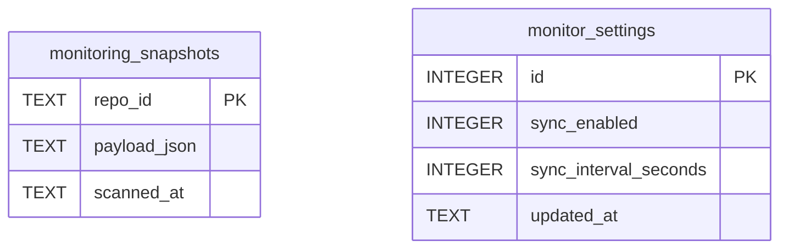
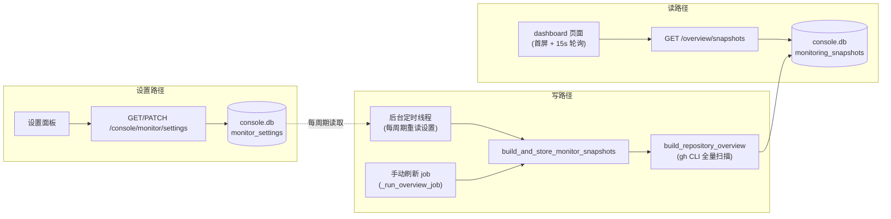

# PRD: iar console dashboard 本地快照缓存与可配置后台定时同步

> ✅ **交付前置**：无，可立即开工。
> 结构化声明见 §8 Delivery Dependencies，**那里是唯一事实源**。

> ⬜ **验收状态**：未开工。
> 本行是 §9 Acceptance Checklist 的投影，**那里是唯一事实源**。

本文档分两个高度：**Part A（§1–§4）** 给人看，用来确认"要不要做、做成什么样"，不含实现细节；**Part B（§5–§13）** 给执行者看，包含机制、改动树与验证命令。

## Feature Overview (功能一览)

> 本块是 §10 Functional Requirements 的通俗投影，不是第二事实源；行为验收以 §1 行为样例表为准。

- **本地快照秒开首屏**（FR-1、FR-2）：dashboard 数据持久化在本地数据库，打开页面直接读本地快照，不再每次现场扫描 GitHub。
- **后台定时同步**（FR-3）：console 服务内置一个后台循环，按设定间隔自动重新扫描并把结果写入本地快照，同步失败保留旧数据（FR-7）。
- **界面上的全局同步设置**（FR-4）：dashboard 上可直接开关自动同步、调整同步间隔，设置持久保存，重启后仍生效。
- **手动刷新不阻塞**（FR-5）：点"刷新全部"或单仓库刷新会触发后台重扫并写回快照，期间页面继续显示旧数据可正常浏览。
- **首次使用自动补数据**（FR-6）：全新环境没有任何快照时，页面显示"尚未同步"并自动触发首次扫描，而不是空白或报错。
- **数据新鲜度可见**（FR-8）：页面显示"上次同步时间"，并轻量轮询本地快照，后台同步完成后界面自动反映新数据。
- **明确不做逐 issue 增量 diff**（§11）：每个同步周期仍是全量扫描；基于 `updatedAt` 的增量优化列为后续跟进。

# Part A · 人审层 (Review Layer)

## 1. Introduction & Goals

### Problem Statement

打开 `http://127.0.0.1:8313/app/dashboard/` 看 Agent Runner 各仓库的 issue 队列状态时，每次进入页面或点刷新都要等待几十秒：dashboard 的每一次数据展示都是对 GitHub 的**全量实时扫描**——11 个仓库、每仓库 6 个 label 的 issue 查询、每个 issue 再带 2–3 次网络调用和 4 个本地 git 子进程，全部通过 `gh` CLI 子进程串行/半并发完成。仓库归档的历史记录里，同类全量统计接口实测单次耗时 **71.7 秒**。系统里其实已有一个 30 秒的内存缓存，但 dashboard 实际走的异步任务路径完全绕过了它，等于没有缓存；前端也没有任何自动刷新机制。用户想要的效果类似 git：数据先落在本地，后台按节奏同步，需要时也可以手动刷新。

### Interpretation (解读回显)

**行为样例**（下表每一行都会逐字变成验收标准，改一个单元格就是改验收条件）：

| 输入 / 操作 | 期望观察到的结果 |
|---|---|
| 打开 dashboard（本地已有快照） | 页面 1–2 秒内渲染出各仓库队列与状态，数据来自本地快照，并显示"上次同步于 HH:MM:SS" |
| 点击"刷新全部" | 后台开始重新扫描，页面不卡死、继续显示旧数据；扫描完成后卡片更新，"上次同步"时间戳随之更新 |
| 在设置里把同步间隔改为 15 分钟 | 设置立即保存；之后后台每 15 分钟自动同步一次；重启 console 后该设置仍然保持 |
| 在设置里关闭自动同步（边界情况） | 不再有任何后台自动同步，只能手动刷新；页面照常显示已有快照与上次同步时间 |
| 全新环境（本地从未同步过）打开 dashboard（边界情况） | 页面显示"尚未同步"的空态并自动触发首次扫描，而不是空白页或报错 |
| 后台同步期间 GitHub 网络失败（失败情况） | 页面继续显示上一份快照，数据不被清空；下个周期自动重试 |

**我默默定了这些**（没有逐一请示、直接定了的解读）：

- 快照和同步设置都存在**本地 SQLite 数据库**（console 现有的本地库），不回写全局配置文件。
- 默认同步间隔定为 **5 分钟**，界面上可在 1–60 分钟间调整，也可以整体关闭；设置是**全局**的，不分仓库。
- 每个同步周期仍是**全量扫描**；基于 `updatedAt` 的逐 issue 增量 diff 不做（它省的是 GitHub 配额，不影响你的等待时间）。
- 前端增加 15 秒一次的轻量轮询去读本地快照（纯本地读，成本约等于零），后台同步一完成界面就能跟上。
- 设置 UI 复用现有组件做**内联展开面板**，不新引入对话框组件库。

**我理解为不做**（你可能想要、但本 PRD 排除的）：

- 不做逐 issue 级别的增量更新（只重建有变化的 issue 详情）。
- 不做完成度统计接口的缓存改造（它有自己独立的 30 秒缓存，不在本次范围）。
- 不做多用户、权限或远程访问——console 本来就是绑定 127.0.0.1 的单机工具。

**文字版解读**：本需求读作"把 dashboard 的数据源从'每次实时扫描 GitHub'切换为'读本地持久化快照'，快照由一个节奏可配置的后台循环和用户手动刷新共同维护"，而**不是**"给现有实时扫描再加一层短时缓存"或"实现 git 式逐对象增量同步"。边界：快照必须进程重启后仍在；自动同步可全局关闭且关闭后不得有任何后台扫描；同步失败不得清除已有快照；现有手动刷新入口与数据内容结构保持不变。非目标见 §11。

### What The User Gets

打开 dashboard 立即看到最近一次同步的各仓库队列状态（秒级），页面上能看到数据是什么时候同步的；后台按自己设定的节奏自动保持数据新鲜，也可以随时点按钮立刻刷新且不影响当前浏览；这些偏好在界面上设置一次就长期生效。

### Measurable Objectives

- 本地已有快照时，dashboard 首屏数据就绪 ≤ 2 秒（快照读取接口本地响应 < 500ms），对比当前全量扫描的数十秒有数量级提升。
- 手动全量刷新期间页面持续可浏览旧数据，不出现整页阻塞。
- 在界面上修改同步间隔并重启 console 进程后，设置值保持不变（持久化生效）。
- 断网或 `gh` 不可用时，只要本地有快照，dashboard 仍正常渲染旧数据。
- 后台同步实际发生周期与界面设置值一致（服务端日志可观察到每次同步的时间与结果）。

## 2. Human Review Map (介入与风险地图)

本次需要人工确认的只有两项，其余全部由执行者 + 自动化门禁覆盖。

### 决策一：本地数据库新增两张表（监控快照 + 监控设置）

快照要进程重启后不丢，就需要落库。console 已有一个本地 SQLite 库（存运行历史、审计等），本次在其中新增两张表：一张按仓库存快照内容（JSON）和扫描时间，一张存全局同步设置（开关 + 间隔）。新增表、不动任何现有表，旧库文件打开时自动原地升级，已有数据不受影响。设置的默认值仍由静态配置声明，界面上改的是运行时覆盖值——这与现有 roadmap 设置的做法完全同构。



**请确认：** 同意在 console 本地库中按上述结构新增 `monitoring_snapshots` 与 `monitor_settings` 两张表（不动现有表）？

**验收：** 用一个含历史数据的旧版库文件打开新代码，旧数据原样保留、新表自动建好；全新环境首次启动也能从零建表。

### 决策二：同步节奏的默认值与可调范围

后台自动同步默认开启、默认每 **5 分钟**一次；界面上可在 1–60 分钟之间调整，或整体关闭（关闭后只剩手动刷新，不得有任何后台扫描）。间隔越小数据越新鲜，但每个周期都是一次全量 GitHub 扫描（11 个仓库约一分钟的网络调用量），5 分钟是新鲜度与 GitHub API 配额消耗之间的平衡点。设置全局生效，不按仓库区分——队列监控场景下各仓库新鲜度需求一致，分仓库配置带来的界面复杂度不值当。

**请确认：** 默认 5 分钟、可调范围 1–60 分钟、可全局关闭、不分仓库——这个节奏方案是否接受？

**验收：** 在界面上把间隔改成 15 分钟并保存后，服务端日志随后按 15 分钟周期出现同步记录；改成"关闭"后日志中不再出现自动同步，手动刷新仍可用。

### 自动门禁，不需要逐项人工审阅

快照读写方法、后台同步循环本身（沿用服务里已有的后台线程模式，数据库已开启 WAL 并发读写）、手动刷新写回快照、两个新接口（读快照、读写同步设置）、前端页面改造与设置面板、旧文档字符串修正——这些是单一组件内的行为或纯展示改动，由失败可辨识的单元测试、接口测试、端到端测试和 lint/构建门禁覆盖。

**本次明确不涉及**：不修改任何现有数据库表结构以外的 schema；不改 agent runner daemon 处理 issue 队列的逻辑；不改完成度统计接口；不引入任何新的调度框架或第三方依赖；无多用户/权限设计。

## 3. Usage And Impact After Implementation

**console 终端用户（dashboard 直接使用者）**：入口仍是 `http://127.0.0.1:8313/app/dashboard/`。打开页面立即看到本地快照数据与"上次同步"时间；header 新增"设置"入口，展开后可开关自动同步、选择间隔（1/5/15/30/60 分钟）；"刷新全部"与各仓库刷新按钮外观不变，但点击后页面不再阻塞等待，后台扫完数据自动更新。首次使用（无快照）时会看到"尚未同步"提示并自动开始首次扫描。断网时页面仍显示最近一次快照。

**运维/安装者**：console 的启动方式（`iar console`）不变；本地库文件自动原地升级，无需手工迁移；前端静态产物需随发布流程重新构建（发布流水线已有对应步骤）。

**API 调用方**：现有 overview 相关接口的地址、参数、返回结构全部保持不变；新增两个只读/设置接口属于纯增量，不影响任何既有调用。

**向后兼容**：现有配置文件中无需新增任何配置项即可运行（默认值内置）；本地库自动迁移；无废弃行为。

## 4. Requirement Shape

- **actor**：iar console 终端用户（通过 dashboard 页面）；间接涉及运维/安装者与 API 调用方（行为不变）。
- **trigger**：打开 dashboard 页面；到达后台同步周期；点击"刷新全部"或单仓库刷新；在设置面板修改同步偏好；console 进程启动。
- **expected behavior**：页面数据来自本地持久化快照；后台循环按全局设置的节奏全量重扫并写回快照；手动刷新触发同样的重扫写回且不阻塞浏览；无快照时自动首扫并显示空态；同步失败保留旧快照；设置持久化且重启后保持。
- **explicit scope boundary**：不做逐 issue 增量 diff；不改统计接口缓存；不改 runner daemon 逻辑；不引入新依赖或调度框架；不做多用户与远程访问。

# Part B · 执行器层 (Build Layer)

## 5. Repository Context And Architecture Fit

**当前相关模块**：

- 后端四层：`api/`（路由与组合根）→ `core/`（用例）→ `engines/` → `infrastructure/`（GitHub 客户端、SQLite 持久化、配置），依赖方向必须保持。
- 扫描逻辑：`src/backend/core/use_cases/agent_runner_monitor.py` 的 `build_repository_overview`（逐仓库全量扫描，经 `infrastructure/github_client.py` 的 `GitHubCliClient` 调 `gh` CLI）。
- 现状断点：`src/backend/api/routes/agent_runner.py` 的 `_run_overview_job` 直接调 `_build_overview_response`，**绕过**模块级 `_OVERVIEW_CACHE`（`TTLResponseCache`，30s），dashboard 主路径无缓存可用。
- 本地库：`src/backend/infrastructure/persistence/console_store.py` 的 `SqliteConsoleStore`（`~/.iar/console.db`，WAL，`PRAGMA user_version` 逐级迁移，当前 `_SCHEMA_VERSION = 3`，已有 `run_records`/`audit_logs`/`roadmap_queue`/`roadmap_settings`/`attempt_records` 五表；模块 docstring 的"当前版本 2"已过时）。
- 运行时可写设置先例：`roadmap_settings` 表 + `GET/PATCH /agent-runner/roadmap/settings`（`src/backend/api/routes/agent_runner_roadmap.py`）+ core 侧 `get_or_create_roadmap_settings`，是本 PRD 设置功能的同构模板。
- 后台线程先例：`agent_runner.py` 的 `_warm_overview_cache` 与 `_start_overview_job`（模块级 `threading.Thread(daemon=True)`，无 lifespan，进程退出即回收）。
- 配置：`src/backend/infrastructure/config/agent_runner_settings.py` 的 `AgentRunnerConsoleSettings`（pydantic-settings，config.toml `[agent_runner.console]` 段）。
- 前端：`frontend-public`（Next.js 静态导出，`output: "export"`，产物由发布流水线拷入 `src/backend/api/static/console/`）；dashboard 页 `frontend-public/app/(app)/app/dashboard/page.tsx`；API client 按域分文件（`lib/api/agentRunner.ts`、`lib/api/console.ts`），类型集中在 `lib/api/types.ts`；无 dialog 组件，有 `sheet.tsx`/`form.tsx`/`input.tsx`；roadmap 页有 `POLL_INTERVAL_MS` 轮询先例。

**Reuse Candidates**：`build_repository_overview`（快照内容的生产者，原样复用）；`SqliteConsoleStore` 的迁移与 upsert 模式；`TTLResponseCache` 保留不动；per-repo job 机制（手动刷新）原样复用，仅补写回；roadmap settings 端到端链路。

**架构约束**：路由层不直接写 SQL，须经 `SqliteConsoleStore`；core 不 import FastAPI；前端经 `lib/api/` 客户端访问，不直接 fetch 散落在组件里。

**Frontend Impact**：**Full-stack**。受影响前端为 `frontend-public`（仅此一个承载 console 界面）。改动页面 `app/(app)/app/dashboard/page.tsx`、API 客户端 `lib/api/agentRunner.ts` 与 `lib/api/console.ts`、类型 `lib/api/types.ts`，新增设置面板组件。

**Existing PRD Relationship**：已检索 `tasks/pending/`（4 个 PRD：prd-regrounding、completeness-judgment、tauri-desktop-shell、iar-prd-skill-alignment），均与本任务无重复、无先后依赖。归档 PRD `tasks/archive/P1-FEAT-20260910-111901-iar-console-bundled-web-terminal.md` 提供了 71.7 秒实测数据与 console 静态托管背景，作为上下文引用。本 PRD 可独立交付。

**Potential Redundancy Risks**：不要新建第二套缓存（内存 TTL 缓存保留现状即可）；不要为设置再写一套 TOML 回写（沿用 DB 设置表先例）；不要新引入调度框架。

## 6. Recommendation

### Recommended Approach

**最小改动路径**：给 dashboard 数据加一层"本地持久化快照"，读写两侧都挂在现有机制上——

1. `SqliteConsoleStore` 升 `_SCHEMA_VERSION` 到 4，新增 `monitoring_snapshots` 与 `monitor_settings` 两表及读写方法（照 `roadmap_settings` 的 upsert / get-or-create 模式）。
2. core 新增用例模块负责"构建并写入快照""读快照概览""读写同步设置"，复用 `build_repository_overview` 逐仓库生产快照内容。
3. `agent_runner.py` 路由：`_run_overview_job` 完成分支写回快照；新增 `GET /v1/agent-runner/overview/snapshots` 读快照；模块级 daemon 线程按设置周期触发同样的构建写回（照 `_warm_overview_cache` 模式，加非重入锁防止与手动刷新重叠）。
4. `agent_runner_console.py` 路由：新增 `GET/PATCH /v1/agent-runner/console/monitor/settings`（照 roadmap settings 路由模式，PATCH 用 pydantic 模型校验）。
5. 前端 dashboard：首屏改读快照接口 + 15s 轮询；header 加"上次同步"时间与设置面板（内联展开，不引 dialog）；无快照时显示空态并触发首扫。

**为什么最贴合现架构**：每一条都有完全同构的现存先例（设置表→roadmap_settings；后台线程→_warm_overview_cache；手动刷新→现有 job），不新增任何依赖、不改四层边界、不改现有接口契约。

**拒绝冗余抽象的理由**：不引入 APScheduler/Celery（本地单机工具，现有 daemon 线程模式足够）；不写 config.toml 回写（`TomlRegistryEditor` 只覆盖 registry 子树，且运行时可调偏好的先例是 DB 表）；不做第二份内存缓存层（快照库本身就是缓存）。

### Proposed Solution Summary (实现机制)

核心机制是**本地快照库 + 单一写入口**：所有 GitHub 全量扫描（无论后台周期触发还是手动刷新触发）结束后都把结果 upsert 进 `monitoring_snapshots`；dashboard 只读快照库。同步节奏由 `monitor_settings`（运行时覆盖，DB 持久）+ `AgentRunnerConsoleSettings` 新增字段（静态默认值 300 秒，供 config.toml 声明）两层提供，后台线程每周期开始前重读设置使改动即时生效。输入来源：仓库清单来自现有 registry 配置，快照内容由 `build_repository_overview` 生产，系统不做内容推断。挂载点：`agent_runner.py` 的 job 完成分支与模块级线程、dashboard 首屏数据加载。状态变化：console.db 出现两张新表；用户可见变化为首屏秒开、"上次同步"时间、设置面板。刻意避免的复杂度：逐 issue 增量 diff、独立调度服务、第二套缓存、config.toml 写回编辑器扩展。

### Alternatives Considered

- **基于 `updatedAt` 的逐 issue 增量重建**：只重扫有变化的 issue。拒绝理由：用户等待已被本地读消除，增量省的只是 GitHub 配额；但要在快照中维护逐 issue 的 `updated_at` 索引并处理 issue 删除/换 label 的一致性，复杂度与出错面明显更高。列为 §12 跟进。
- **config.toml 回写设置**：拒绝理由见上（DB 设置表是同构先例，TOML 编辑器扩展影响面更大）。
- **引入 APScheduler**：拒绝理由：零新依赖原则，现有 daemon 线程模式已覆盖需求。

## 7. Implementation Guide

> This section is a living implementation guide based on current repository analysis. If implementation discovers additional affected files, hidden dependencies, edge cases, or a better path, update this PRD before proceeding.

### Core Logic

数据与控制流（目标态）：

1. **写路径（唯一）**：`build_and_store_monitor_snapshots(repo_ids)`（core）逐个仓库调 `build_repository_overview` → 每仓库完成即 `upsert_monitor_snapshot(repo_id, payload_json, scanned_at)`；单仓库失败记 warning、保留旧快照、继续其余仓库。两个触发源共用此函数：后台 daemon 线程（周期到点 + 启动时若缺快照立即补一次）与 `_run_overview_job` 完成分支。模块级非重入锁保证同一时刻只有一个写路径在跑（手动刷新撞上周期的，周期跳过本次）。
2. **读路径**：`GET /overview/snapshots` → core → `SqliteConsoleStore.list_monitor_snapshots()` → 返回 `{repositories: [{repo_id, scanned_at, overview}]}；无快照仓库以空态标记返回`。dashboard 首屏与 15s 轮询都走这里。
3. **设置路径**：`GET /console/monitor/settings` 返回 `{sync_enabled, sync_interval_seconds, updated_at}`（无记录时返回默认值：enabled=true, 300s）；`PATCH` 校验 `sync_interval_seconds ∈ [60, 3600]`、`sync_enabled` 布尔，写库。daemon 每周期开头重读设置：`sync_enabled=false` 时跳过并等待下周期。

### Change Impact Tree

```text
.
├── Database (~/.iar/console.db via SqliteConsoleStore)
│   └── src/backend/infrastructure/persistence/console_store.py
│       [修改]
│       【总结】schema 升 v4，新增监控快照与监控设置两表及读写方法，修正过时 docstring
│
│       ├── _SCHEMA_VERSION 3 → 4；_migrate 增加 v4 分支（照 v2/v3 逐级 if 模式）
│       ├── 新增 _CREATE_MONITORING_SNAPSHOTS（repo_id PK / payload_json / scanned_at）
│       ├── 新增 _CREATE_MONITOR_SETTINGS（id PK 单行 / sync_enabled / sync_interval_seconds / updated_at）
│       ├── 新增 upsert_monitor_snapshot / list_monitor_snapshots（照 save_roadmap_settings 的 upsert 模式；JSON 用 ensure_ascii=False）
│       ├── 新增 get_or_create_monitor_settings / save_monitor_settings（读不到返回默认 enabled=300s）
│       └── 写路径异常降级为 _logger.warning（照 append_run 惯例），读失败返回 None/默认
├── Core
│   └── src/backend/core/use_cases/monitor_snapshots.py
│       [新增]
│       【总结】快照构建写回、快照读取、同步设置读写的用例编排
│
│       ├── build_and_store_monitor_snapshots(repo_ids=None)：逐仓库 build_repository_overview + upsert，单仓库失败降级继续
│       ├── get_snapshot_overview()：组装 {repositories:[{repo_id, scanned_at, overview}]}
│       └── get_monitor_settings() / update_monitor_settings(patch)：默认值回落 + 校验
├── Infrastructure
│   └── src/backend/infrastructure/config/agent_runner_settings.py
│       [修改]
│       【总结】console 设置新增静态默认同步间隔字段
│
│       └── AgentRunnerConsoleSettings 增加 monitor_sync_interval_seconds: int = 300（config.toml [agent_runner.console] 可覆盖默认值）
├── API
│   ├── src/backend/api/routes/agent_runner.py
│   │   [修改]
│   │   【总结】job 完成写回快照、新增快照读取端点、启动后台定时同步线程
│   │
│   │   ├── _run_overview_job 完成分支：payload 各仓库 upsert 进快照表（复用 core 写函数）
│   │   ├── 新增 GET /v1/agent-runner/overview/snapshots → core.get_snapshot_overview()
│   │   ├── 新增模块级 _monitor_sync_thread（daemon，照 _warm_overview_cache 模式）：Event.wait(间隔) 循环，每周期重读设置，非重入锁防止与 job 重叠，启动时缺快照立即补扫
│   │   └── 现有 /overview/per-repo、/overview/jobs/{id} 端点契约不变
│   └── src/backend/api/routes/agent_runner_console.py
│       [修改]
│       【总结】新增监控同步设置的 GET/PATCH 端点
│
│       ├── GET /v1/agent-runner/console/monitor/settings
│       └── PATCH 同路径，UpdateMonitorSettingsRequest（pydantic）校验间隔 [60,3600] 与开关布尔
├── Frontend (frontend-public)
│   ├── lib/api/types.ts
│   │   [修改]
│   │   【总结】新增 MonitorSnapshotsResponse 与 MonitorSettings 类型
│   ├── lib/api/agentRunner.ts
│   │   [修改]
│   │   【总结】新增 fetchOverviewSnapshots()（GET /overview/snapshots）
│   ├── lib/api/console.ts
│   │   [修改]
│   │   【总结】新增 fetchMonitorSettings() / updateMonitorSettings()
│   ├── app/(app)/app/dashboard/page.tsx
│   │   [修改]
│   │   【总结】首屏与轮询改读快照，header 加上次同步时间与设置入口，新增无快照空态
│   │
│   │   ├── 首屏 fetchOverviewSnapshots() 直接渲染；保留 job 轮询仅用于手动刷新进度
│   │   ├── 15s setInterval 轮询快照接口（照 roadmap POLL_INTERVAL_MS 先例）
│   │   ├── header 显示"上次同步于 HH:MM:SS"（取快照 scanned_at 最大值）+ 设置按钮
│   │   └── 全部仓库无快照时显示"尚未同步"空态并自动触发一次全量 job
│   └── components/monitor-settings-panel.tsx（落位参照 dashboard 现有子组件组织；rg --files frontend-public/components 确认目录）
│       [新增]
│       【总结】内联展开的同步设置面板（开关 + 间隔选择），保存即 PATCH
├── Tests
│   ├── tests/test_console_store.py
│   │   [修改] v3→v4 迁移保留旧数据、快照 upsert/读取、设置默认与往返
│   ├── tests/test_monitor_snapshots.py
│   │   [新增] core 用例：fake GitHub 客户端下构建写回、单仓库失败降级、设置校验边界（59s/3601s 拒绝）
│   ├── tests/test_agent_runner_console_api.py 或新文件
│   │   [修改/新增] 快照端点、设置 GET/PATCH 往返（tmp 库注入隔离，照现有 IAR_CONFIG/构造函数注入先例）
│   └── tests/playwright-e2e/tests/smoke/agent-runner-monitor.spec.ts + page-objects/AgentRunnerMonitorPage.ts
│       [修改] stub 快照端点后的首屏渲染、上次同步时间显示、设置面板交互
└── Docs
    └── rg -l "iar console|dashboard" docs/ 定位的相关页面
        [修改] console 文档补"本地快照 + 定时同步"行为说明与设置项；若新增页面须同步 mkdocs.yml 导航
```

以上文件清单是起点而非穷举；见 Executor Drift Guard。

### Risk Classification Register

| 变更点 | 层级 | tier | 决定性维度/覆盖 | 干预 | oracle/gate |
|---|---|---|---|---|---|
| console.db 新增两表 + user_version 3→4 迁移 | infrastructure | R2 | schema 固定区 + 持久状态 | 人工确认（决策一）+ rv-1 | rv-1 |
| 快照/设置 store 读写方法 | infrastructure | R1 | 单组件、有测试先例 | 执行者 + 失败可辨识单测 | rv-4 |
| core monitor_snapshots 用例 | core | R1 | 纯编排复用现有扫描，无新外部依赖 | 执行者 + rv-4 | rv-4 |
| 后台定时同步 daemon 线程 | api | R2 | 并发触发器；沿用现有 daemon + WAL + 非重入锁模式缓解 | 执行者 + 强 oracle | rv-2、rv-4 |
| `_run_overview_job` 写回快照 | api | R1 | 单路由模块行为补充 | 执行者 + rv-2 覆盖 | rv-2 |
| GET /overview/snapshots | api | R1 | 新只读端点，纯增量 | 执行者 + API 测试 | rv-4 |
| GET/PATCH monitor settings | api | R2 | 持久状态写 + 新 API 契约（新增非破坏） | 人工确认（决策二）+ rv-3 | rv-3 |
| dashboard 首屏/轮询/空态改造 | frontend | R1 | 用户可见、单页面 | 执行者 + e2e + 人读截图 | rv-2、rv-5 |
| 设置面板 UI | frontend | R1 | 用户可见、复用现有组件 | 执行者 + e2e + 人读截图 | rv-3、rv-5 |
| console_store docstring 修正 | infrastructure | R0 | 纯文档注释 | 执行者 + lint | rv-6 |

### Executor Drift Guard

- 以上文件路径基于当前仓库分析；若文件被移动/改名，用语义锚点定位：`SqliteConsoleStore._migrate`、`build_repository_overview`、`_run_overview_job`、`_warm_overview_cache`、`get_or_create_roadmap_settings`、`AgentRunnerConsoleSettings`。
- 隐藏的引用检查（实现前后各跑一次）：
  - `rg -n "per-repo|overview/jobs" frontend-public/lib src/backend/api` — 确认现有 overview 端点的全部调用方，保证契约不变。
  - `rg -n "_SCHEMA_VERSION|user_version" src/backend tests` — 找出所有依赖 schema 版本的测试。
  - `rg -n "create_console_store" src/backend` — 快照读写应复用同一 store 工厂，注意路由层每次请求新建实例的惯例。
  - `rg -n "POLL_INTERVAL_MS" frontend-public` — 前端轮询先例。
- 前端组件目录确认：`rg --files frontend-public/components | head -30`。

### Flow Diagram



### ER Diagram


两张新表相互独立，与现有五表无外键关系；迁移只新增表，不修改现有表。

### Realistic Validation Plan

```yaml
oracles:
  - id: rv-1
    behavior: 旧版 console.db（含历史数据）打开新代码后自动升级到 v4，旧数据完整保留，两张新表建成；全新环境从零建表
    reviewer: verifier
    real_entry: "uv run pytest tests/test_console_store.py -k 'monitor or migrate' -v"
    expected: "v3 种子库（先以旧 CREATE 语句建表并插入 run_records 数据、置 user_version=3）经 SqliteConsoleStore 打开后：run_records 数据逐条仍在、monitoring_snapshots 与 monitor_settings 存在、user_version=4"
    mock_boundary: "SQLite 用 tmp_path 真实文件库，不 mock；不涉及 GitHub"
    tier: R2
    test_layer: integration
    required_for_acceptance: true
    critical_value_source: "测试内以 v3 时代的 CREATE 语句手工播种的库文件（模拟用户真实旧库）"
    must_cross: "种子库写入 -> 新代码 SqliteConsoleStore 构造（_migrate）-> 新连接查询"
    forbidden_bypasses: "不得直接以 v4 代码建库后声称迁移成功；不得只验证新表存在而漏掉旧数据行数断言"
    fresh_state_probe: "迁移后用独立 sqlite3 连接重新打开库文件查询，不复用迁移连接的内存状态"
    final_tree_evidence: "迁移测试在最终实现树上运行；任何 _migrate 或建表语句变更后必须重跑"
    negative_control: "在实现前的代码（_SCHEMA_VERSION=3）上运行同一测试"
    expected_fail: "查询 monitoring_snapshots 报错 no such table，测试红色"
  - id: rv-2
    behavior: 真实 console 服务下 dashboard 首屏从本地快照秒开、显示上次同步时间，手动刷新经后台扫描后数据与时间戳更新，期间页面可继续浏览
    reviewer: human
    real_entry: "构建前端静态产物后运行 console（uv run iar console），浏览器打开 http://127.0.0.1:8313/app/dashboard/"
    expected: "已有快照时页面 2 秒内渲染数据并显示上次同步时间；点刷新全部后页面不阻塞，扫描完成后卡片与时间戳更新；快照接口本地 curl 响应 < 500ms"
    mock_boundary: "真实 console 进程、真实 SQLite、真实浏览器；GitHub 侧用本机已认证的 gh（凭证依赖，post-merge 人工验证时真实执行；CI 不可用时以 fake gh 环境的同路径运行作为降级证据并披露）"
    tier: R2
    test_layer: manual
    required_for_acceptance: true
    presentation: "tasks/evidence/P1-PERF-20260916-102117-iar-console-dashboard-snapshot-sync/rv-2-dashboard-snapshot.png（真实入口截图，标注验证层级为 real-entry）；自检：打开页面看 header 是否显示上次同步时间，curl -s -o /dev/null -w '%{time_total}' http://127.0.0.1:8313/api/v1/agent-runner/overview/snapshots"
    critical_value_source: "页面上显示的上次同步时间取自 GET /overview/snapshots 响应中的 scanned_at 字段原值"
    must_cross: "浏览器 -> FastAPI 路由 -> core 用例 -> SqliteConsoleStore -> SQLite 文件"
    forbidden_bypasses: "不得用组件级预览页或手工注入状态充当 dashboard 证据；不得直接调用 core 函数代替 HTTP 路径"
    fresh_state_probe: "手动刷新完成后开新浏览器标签（新会话）重新打开 dashboard，确认新数据与新时间戳"
    final_tree_evidence: "截图与 curl 计时在最终实现树上采集；路由、前端页面或 store 变更后重采"
  - id: rv-3
    behavior: 在 dashboard 设置面板修改同步间隔/开关后立即保存生效，重启 console 进程后设置保持，关闭后后台不再自动同步
    reviewer: human
    real_entry: "dashboard header 设置面板（真实入口同 rv-2）"
    expected: "改为 15 分钟保存后 GET 设置接口返回新值；重启进程后值保持；服务端日志按新周期出现同步记录；关闭自动同步后日志中无新自动同步"
    mock_boundary: "真实进程与真实库；GitHub 网络可用 fake gh 替代（设置持久化不依赖 GitHub 内容）"
    tier: R2
    test_layer: manual
    required_for_acceptance: true
    presentation: "tasks/evidence/P1-PERF-20260916-102117-iar-console-dashboard-snapshot-sync/rv-3-settings-panel.png（设置面板展开态真实截图）；自检：curl -s http://127.0.0.1:8313/api/v1/agent-runner/console/monitor/settings 对比界面显示值"
    critical_value_source: "界面上显示的间隔值来自 GET /console/monitor/settings 响应原值；修改操作经 PATCH 写库"
    must_cross: "浏览器 PATCH -> FastAPI 路由校验 -> core -> store 写库 -> 进程重启 -> 新请求 GET 读回"
    forbidden_bypasses: "不得直接写 SQLite 或改 config.toml 冒充界面设置；不得只验证 PATCH 200 而不做重启后读回"
    fresh_state_probe: "重启 console 进程后用全新 HTTP 请求 GET 设置接口断言持久值"
    final_tree_evidence: "证据在最终实现树上采集；设置路由、校验模型或 store 方法变更后重采"
    negative_control: "在实现前的代码上执行 curl PATCH /api/v1/agent-runner/console/monitor/settings"
    expected_fail: "404 Not Found，验证该端点此前不存在"
  - id: rv-4
    behavior: core 与 store 层行为正确：构建写回逐仓库落库、单仓库失败保留旧快照并继续、设置校验拒绝越界值（59/3601 秒）、后台线程与手动刷新不重叠执行
    reviewer: verifier
    real_entry: "uv run pytest tests/test_monitor_snapshots.py tests/test_console_store.py -v"
    expected: "fake GitHub 客户端下快照逐仓库 upsert；注入单仓库异常后其余仓库快照更新、失败仓库保留旧 scanned_at；PATCH 59/3601 返回 422；非重入锁并发用例通过"
    mock_boundary: "GitHub 客户端以 fake 注入（网络边界可 mock）；SQLite 与线程为真实"
    tier: R1
    test_layer: integration
    required_for_acceptance: true
  - id: rv-5
    behavior: dashboard 前端在 stub 快照/设置接口下正确渲染首屏、上次同步时间、空态与设置面板交互
    reviewer: verifier
    real_entry: "cd tests/playwright-e2e && pnpm test:smoke"
    expected: "agent-runner-monitor.spec.ts 更新后全绿：stub 快照响应驱动首屏渲染；无快照 stub 显示空态并触发 job 请求；设置面板选择间隔后发出 PATCH 到规范路径 /api/v1/agent-runner/console/monitor/settings"
    mock_boundary: "后端接口经 Playwright 路由 stub（前端为被测对象）；页面真实渲染于浏览器"
    tier: R1
    test_layer: e2e
    required_for_acceptance: true
  - id: rv-6
    behavior: 全仓质量门禁保持绿：后端 lint/测试、前端 typecheck/lint/build
    reviewer: verifier
    real_entry: "just lint && uv run pytest tests/ -x -q（后端）；pnpm --filter frontend-public typecheck && pnpm --filter frontend-public build（前端）"
    expected: "全部通过；前端产物成功导出（out/ 目录生成）"
    mock_boundary: "无 mock"
    tier: R0
    test_layer: smoke
    required_for_acceptance: true
```

失败排查提示：rv-2/rv-3 若 dashboard 404，先确认前端静态产物已构建并拷入 `src/backend/api/static/console/`（参照 `.github/workflows/release.yml` 的 build+copy 两步）；若快照为空，查服务端日志中同步线程的 warning；Playwright 失败先看 stub 路径是否带 `/api` 前缀。

### Low-Fidelity Prototype

设置面板改动小、单步交互，一处 ASCII 线框足够：

```text
┌ Agent Runner 管理终端    上次同步 12:03:21   [同步设置 ▾] [刷新全部] ┐
│ （点"同步设置"后 header 下方内联展开，页面内容不跳转）                  │
│ ┌─ 后台自动同步 ─────────────────────────────────────────────┐ │
│ │  (●) 开启   ( ) 关闭                                       │ │
│ │  同步间隔: [ 5 分钟 ▾ ]   可选: 1 / 5 / 15 / 30 / 60 分钟  │ │
│ │  上次同步: 2026-09-16 12:03:21   状态: 已保存 ✓            │ │
│ └────────────────────────────────────────────────────────────┘ │
│ ┌ 仓库卡片 … ┐  ┌ 仓库卡片 … ┐                                │
└──────────────────────────────────────────────────────────────┘

无快照空态：
│ ⏳ 尚未同步 — 正在后台执行首次扫描，完成后自动显示数据 [立即刷新] │
```

### Interactive Prototype Change Log

No interactive prototype file changes in this PRD.

### External Validation

No external validation required; repository evidence was sufficient.

## 8. Delivery Dependencies

### Delivery Dependencies

- Group: none
- Depends on tasks/issues:
  - none
- Gate type: none
- Notes: 已检索 tasks/pending/ 全部 4 个 PRD，与本任务无重复或先后依赖；可独立交付。

## 9. Acceptance Checklist

### 9.1 人读呈递区（Human Review Surface）

| 要看的结果 | 呈递物 | 10 秒自检 |
|---|---|---|
| dashboard 秒开并显示上次同步时间，手动刷新不阻塞且完成后数据更新 | `tasks/evidence/P1-PERF-20260916-102117-iar-console-dashboard-snapshot-sync/rv-2-dashboard-snapshot.png`（交付时填实际截图） | 打开 http://127.0.0.1:8313/app/dashboard/ 看 header 有无"上次同步"时间；`curl -s -o /dev/null -w '%{time_total}' http://127.0.0.1:8313/api/v1/agent-runner/overview/snapshots` 应远小于 1s |
| 设置面板改间隔立即保存、重启后保持、可全局关闭自动同步 | `tasks/evidence/P1-PERF-20260916-102117-iar-console-dashboard-snapshot-sync/rv-3-settings-panel.png`（交付时填实际截图） | 面板改间隔保存后 `curl -s http://127.0.0.1:8313/api/v1/agent-runner/console/monitor/settings` 显示新值 |

注：数据库迁移、core/store 单测、Playwright stub 测试、lint/构建属 `reviewer: verifier` 组（rv-1、rv-4、rv-5、rv-6），按设计不在人读呈递区展示，仅失败时上报。

### 9.2 Acceptance Evidence Package

按 §7 Risk Classification Register 排序：

1. **人工确认 + R2（优先审查）**：rv-1（迁移往返，含 negative_control 红跑记录）、rv-3（设置持久化，含 negative_control 404 记录）、rv-2（真实入口 dashboard）。
2. **R1**：rv-4（core/store 集成测试输出）、rv-5（Playwright smoke 输出）。
3. **R0**：rv-6（lint/typecheck/build 输出折叠呈现）。

#### Architecture Acceptance

- [ ] `rg -n "from fastapi|import fastapi" src/backend/core/use_cases/monitor_snapshots.py` 无命中（core 不依赖 Web 框架）
- [ ] 路由层无直接 SQL：`rg -n "CREATE TABLE|INSERT INTO|sqlite3" src/backend/api/routes/` 无新增命中（快照/设置 SQL 全部在 `console_store.py`）
- [ ] 未引入新第三方依赖：`pyproject.toml` 与 `frontend-public/package.json` 的 dependencies 无新增条目

#### Behavior Acceptance

- [ ] rv-1 通过：v3 种子库迁移后旧 `run_records` 行数不变、两新表存在、`PRAGMA user_version` 为 4；附实现前红跑记录
- [ ] rv-4 通过：`uv run pytest tests/test_monitor_snapshots.py tests/test_console_store.py -v` 全绿，含失败降级与间隔校验边界用例
- [ ] 现有 overview 端点契约未变：`tests/` 中原有 agent-runner 相关测试无修改即通过（或修改已在 Change Log 说明原因）

#### Frontend Acceptance

- [ ] rv-5 通过：`cd tests/playwright-e2e && pnpm test:smoke` 全绿，含空态与设置面板 PATCH 路径断言
- [ ] rv-2 真实入口证据采集：截图来自 `uv run iar console` 真实服务，非组件预览；截图标注验证层级
- [ ] 前端 build 成功：`pnpm --filter frontend-public build` 产出 `out/`

#### Documentation Acceptance

- [ ] console 相关文档页（`rg -l "iar console" docs/` 定位）补充快照/定时同步/设置项说明；若新增页面，`mkdocs.yml` 导航已同步
- [ ] `console_store.py` 模块 docstring 的 schema 版本描述与实际 `_SCHEMA_VERSION` 一致

#### Validation Acceptance

- [ ] rv-1 至 rv-6 全部执行通过，证据文件按 `rv-<n>-<slug>.<ext>` 命名存于 `tasks/evidence/P1-PERF-20260916-102117-iar-console-dashboard-snapshot-sync/`
- [ ] rv-2/rv-3 证据链完整：关键值来自接口响应原值、跨齐命名边界、新会话/重启后 fresh-state 读回、证据采集于最终实现树
- [ ] 所有 RV 脚本（如有）位于证据目录 `scripts/` 下，未进入代码 diff（`git diff --name-only` 核查）

#### Delivery Readiness

- [ ] 推荐方案全量实现，无遗留 regression 或发布阻塞
- [ ] 完成消息逐字携带 9.1 人读呈递区的全部内容（含截图），仅归档证据目录而未展示视为未交付
- [~] 独立 verifier Agent 审查通过 — runner-owned gate: verifier review
- [~] PRD 归档至 tasks/archive/ — runner-owned gate: archive

#### Human-Confirmed

- [ ] 决策一确认：console.db 新增 `monitoring_snapshots`/`monitor_settings` 两表方案（对应 rv-1 证据）
- [ ] 决策二确认：默认 5 分钟、1–60 分钟可调、可全局关闭、不分仓库（对应 rv-3 证据）
- [ ] 9.1 人读呈递区全部呈递物已查看

## 10. Functional Requirements

- **FR-1**：系统将每个受监控仓库的队列概览快照（内容与现有 per-repo overview 相同结构）持久化到本地数据库，记录扫描完成时间，进程重启后保留。
- **FR-2**：dashboard 首屏数据读取本地快照而非实时扫描；无快照的仓库以空态标记返回。
- **FR-3**：console 服务运行期间，后台循环按全局设置的间隔自动对全部受监控仓库执行全量扫描并写回快照；每周期开始前重读设置使改动即时生效；手动刷新与周期同步不得重叠执行。
- **FR-4**：用户可在 dashboard 界面查看并修改全局同步设置（开关 + 间隔，间隔合法范围 60–3600 秒），修改立即持久化并在进程重启后保持；非法值被拒绝并返回校验错误。
- **FR-5**：手动刷新（全部或单仓库）触发后台重扫，完成后写回快照；刷新期间页面继续显示旧数据。
- **FR-6**：本地无任何快照时，dashboard 显示"尚未同步"空态并自动触发首次扫描。
- **FR-7**：任一仓库扫描失败时保留该仓库旧快照，其余仓库正常更新；失败记录服务端日志。
- **FR-8**：dashboard 显示"上次同步时间"（取各仓库快照扫描时间的最大值），并以约 15 秒周期轮询本地快照使后台同步结果自动反映到界面。

## 11. Non-Goals

- 不做基于 `updatedAt` 的逐 issue 增量 diff 重建（列为 §12 跟进）。
- 不改完成度统计接口（`/console/stats/overview`）的现有 30 秒缓存策略。
- 不改 agent runner daemon 处理 issue 队列的逻辑与节奏。
- 不引入 APScheduler/Celery/Redis 等任何新依赖或独立调度服务。
- 不做多仓库分别设置同步间隔；不做多用户、权限、远程访问。
- 不修改现有五张数据库表的结构。

## 12. Risks And Follow-Ups

- **GitHub API 配额消耗**：定时全量扫描（默认 5 分钟 × 11 仓库）会持续消耗 `gh` 配额；对绝大多数个人使用场景富余，但值得作为后续优化。跟进项：基于 `updatedAt` 的逐 issue 增量重建（需快照内维护逐 issue 时间戳索引并处理 issue 删除一致性）。
- **长事务/并发**：后台线程写库与 UI 读库并发，已由 WAL + busy_timeout + 每次操作独立连接 + 非重入锁缓解；剩余风险为单仓库扫描期间快照新旧混合（逐仓库 upsert 的设计取舍，可接受）。
- **发布依赖**：前端改动需经发布流水线重建静态产物并拷入包数据；本地开发缺产物时 console 以 API-only 模式启动（现有行为），验证 rv-2/rv-3 前须先构建。

## 13. Decision Log

| ID | 决策问题 | Chosen | Rejected | Rationale |
|---|---|---|---|---|
| D-01 | 快照存哪 | console.db 新增快照表 | 扩容内存 TTL 缓存；独立 JSON 文件 | 进程重启不丢且与 run_records 等同库，内存缓存重启即丢，JSON 文件要自建并发控制而 SQLite WAL 现成 |
| D-02 | 同步设置存哪 | console.db `monitor_settings` 表 | config.toml 回写（扩 TomlRegistryEditor） | 运行时可调偏好已有 roadmap_settings 同构端到端先例；TOML 编辑器仅覆盖 registry 子树，扩展写错影响全局共享配置 |
| D-03 | 后台同步怎么调度 | console 进程内 daemon 线程 | 引入 APScheduler/Celery | `_warm_overview_cache`/job 已有同模式线程先例，单机工具无需新依赖与调度框架 |
| D-04 | 每周期扫描策略 | 全量扫描 | 基于 `updatedAt` 的逐 issue 增量 | 用户等待已被本地读消除，增量只省配额却引入逐 issue 索引与删除一致性复杂度 |
| D-05 | 设置 UI 形态 | header 内联展开面板 | 新增 shadcn Dialog 组件 | `components/ui/` 无 dialog，roadmap 设置先例就是内联式，避免新增组件依赖 |

### Final Reconciliation

- 尚未执行 — 归档前对照最终实现与新鲜证据完成本节并同步修正正文。
