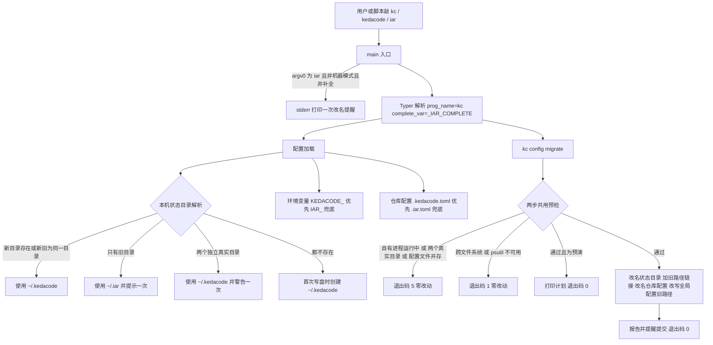

# PRD: 产品表面改名为 KedaCode / `kc` —— `iar` 保留为弃用别名，本机状态与配置双读迁移

> ✅ **交付前置**：无，可立即开工。
> 结构化声明见 §8 Delivery Dependencies，**那里是唯一事实源**。

> ⬜ **验收状态**：未开工。
> 本行是 §9 Acceptance Checklist 的投影，**那里是唯一事实源**。

> 本 PRD 分两个 altitude，分别服务不同读者，自上而下阅读：
>
> - **Part A · 人审层 (Review Layer)** — 需求方 / 验收人读这部分，决定"该不该做、做得对不对"，并通过风险地图知道**哪些地方必须亲自确认**。Part A 不出现实现机制、文件路径、命令。
> - **Part B · 执行器层 (Build Layer)** — 实现者（人或 Agent）读这部分动手。人只在 Part A 风险地图**点名处**下钻审查，其余默认交执行器 + 自动门禁（hook / 测试 / 架构检查）。

## Feature Overview (功能一览)

以下条目是 §10 Functional Requirements 的投影，行为验收请看 §1 的行为样例表。

- **主命令改名为 `kc`，产品名 KedaCode**（FR-1）：帮助、版本、报错建议、shell 补全、安装与发布产物、文档、管理终端页面统一使用 `kc` 与 KedaCode；PyPI 包名 `kedacode` 与 GitHub 仓库名不变，不新增 `keda` 命令。
- **`iar` 继续可用，只是会提醒**（FR-2）：`iar` 与 `kedacode` 两个入口长期保留、行为与 `kc` 完全相同；只有人在终端直接敲 `iar` 时，错误输出里多一行改名提醒；机器可读输出、shell 补全与脚本调用不受影响；不设移除日期。
- **本机状态目录新旧都认**（FR-3）：新位置是 `~/.kedacode`；只有旧目录 `~/.iar` 的机器原样继续工作（不复制、不新建）并提示可迁移；全新机器直接使用新位置。
- **环境变量与仓库配置文件新旧都认**（FR-4）：`KEDACODE_*` 优先、`IAR_*` 兜底；仓库配置 `.kedacode.toml` 优先、`.iar.toml` 兜底；新旧冲突时以新为准并警告；由本产品派生的子进程同时拿到新旧两个变量名；任何提示都不进入机器可读输出。
- **一条显式迁移命令**（FR-5）：`kc config migrate` 把本机旧状态目录搬到新位置并在旧路径留一个指向新目录的链接，同时把当前仓库的 `.iar.toml` 改名为 `.kedacode.toml`；有 runner 在跑时拒绝动手；预演只报告不写盘；重复执行无副作用。
- **跨进程契约一个字节都不变**（FR-6）：写在 GitHub Issue / PR 评论里的 `<!-- iar:… -->` 标记、Webhook 签名头、agent 执行标记、补全环境变量、`.gitignore` 托管块文本原样保留；新旧版本混跑时不会重复认领同一个 Issue。
- **周边一起换名**（FR-7）：随包 operator skill 改名为 `kedacode-operator` 并安全清理旧副本；容器 runner、安装脚本、Homebrew 发布骨架、CI、插件入口点、文档与示意图跟随新名，旧插件入口点分组仍被发现。
- **改名不留静默缝隙**（FR-8）：除明确列出的永久保留项与标注为兼容层的行外，代码、文档、前端文案、CI 与脚本中的旧名残留由机械检查归零，且永久保留项一个不少。

---

# Part A · 人审层 (Review Layer)

## 1. Introduction & Goals

### Problem Statement

同一个产品今天对外有四个互不相干的名字：GitHub 仓库叫 `keda`，PyPI 包叫 `kedacode`，命令叫 `iar`，本机状态目录叫 `~/.iar`。用户按文档装好 `kedacode` 之后要敲的却是 `iar`；README 标题写 Keda，管理终端的浏览器标题写「iar — Agent Runner 管理终端」，设置页又写「关于 iar 管理终端」。三个字母的 `iar` 无法从任何一个名字推导出来，只能死记——这是改名的直接动因。

这次不能「把字符串替换一遍」了事，因为 `iar` 已经不只是一个命令名，而是四类真实存在的外部契约：

- **用户磁盘上的数据**：本机状态目录 `~/.iar` 里有管理终端的历史数据库、进程登记、仓库注册表与克隆、容器认证快照、已安装的 skill；
- **脚本与 CI 依赖的接口**：9 个 `IAR_` 前缀的环境变量（全局配置文件路径、Skill 目录、PRD skill 路径、跳过 gh 鉴权检查等），以及每个受管仓库根目录里的 `.iar.toml`；
- **跨进程、跨版本的协议**：写在 GitHub Issue / PR 评论里的 `<!-- iar:claim -->`、`<!-- iar:event -->` 等标记，是不同 runner 之间判断「这个 Issue 有没有人在做」的唯一依据；
- **别人机器上已经装好的东西**：shell 补全脚本、Homebrew 公式、容器镜像里的启动命令、用户脚本里的 `iar …` 调用、注册在旧分组下的第三方插件。

仓库上一次同类改名（把 roadmap 功能改名为 backlog）选择了硬切换、不留别名；但那次改的是仓库内部概念，这次改的是上面四类外部契约。如果照搬硬切换：升级后用户脚本里的 `iar` 立即失效；`IAR_CONFIG` 被静默忽略而退回默认配置（不报错，只是读错了配置）；新版本 runner 看不见旧版本写下的 `iar:claim`，于是重复认领同一个 Issue；`~/.iar` 里的注册表与历史在新版本里「消失」。这些故障大多不报错，只表现为「结果不对」。

### Interpretation (解读回显)

这是你**前置批准**的对象，也是唯一能拦住"解读错了"的关卡——oracle 和实现都是同一份解读的产物，解读错了它们会互相印证，下游检查全绿在错的行为上。散文没法逐条否证，所以先给可以逐格改的具体样例。

| 验证方式 | 输入 / 操作 | 期望观察到的结果 |
|---|---|---|
| 🤖 自动验证 | 在一台全新机器上装好 `kedacode` 包，分别用 `kc`、`kedacode`、`iar` 查看版本、导出命令结构、列出注册表（机器可读与人类可读各一次） | 三个名字都能用，同一命令的标准输出与退出码逐字节相同；版本行是 `kc <版本号>`，命令结构的根命令名是 `kc`；只有人类可读模式下敲 `iar` 时，错误输出恰好多一行改名提醒；机器上生成的是 `~/.kedacode`，不会出现 `~/.iar` |
| 👀 人审 + 自动验证 | 一台只有旧目录 `~/.iar` 的机器（里面登记了一个仓库、有 3 条历史运行记录），升级后不做任何迁移，直接用 `kc` 列注册表、打开管理终端 | 登记的仓库和 3 条运行记录都在；每条命令恰好提醒一次「可执行 `kc config migrate` 迁移」；磁盘上没有被悄悄新建 `~/.kedacode` |
| 👀 人审 + 自动验证 | 同一台机器在仓库里依次执行 `kc config migrate --dry-run`、`kc config migrate`，然后再执行一次 | 预演只列出计划、磁盘不变；正式执行后 `~/.kedacode` 是真实目录、`~/.iar` 变成指向它的链接，仓库里的 `.iar.toml` 改名为 `.kedacode.toml` 并提醒你自己提交；重新打开管理终端仍是同样 3 条运行记录；第三次执行报告「已迁移」且什么也不改 |
| 👀 人审 + 自动验证 | 机器上有 runner 在跑（无论它是用 `kc` 还是 `iar` 启动的）时执行 `kc config migrate` | 拒绝执行并列出占用中的进程号，以「冲突」类退出码结束；`~/.iar`、`~/.kedacode` 与仓库配置文件都没有任何变化 |
| 🤖 自动验证 | 旧版本 runner 已在某 Issue 上留下未过期的 `<!-- iar:claim -->` 评论，新版本 runner 扫描到这个 Issue | 新版本把它当作「已被占用」，不重复认领；新版本自己写出的各类标记与改名前逐字节相同 |
| 🤖 自动验证 | 分别只设置 `IAR_CONFIG`、只设置 `KEDACODE_CONFIG`、两者都设且指向不同文件、两者都设且指向同一文件，然后用 `kc` 列注册表 | 只有旧名时用旧名的值并提醒一次；只有新名时直接用；冲突时用 `KEDACODE_CONFIG` 并警告一次；相同时不出声；任何情况都不会静默退回默认配置，机器可读输出里也不夹带提示 |
| 👀 人审 + 自动验证 | 打开管理终端各页面（首页、设置、统计空态、仓库扫描、目录选择）与新增的迁移文档 | 浏览器标题、侧边栏、说明文字、空态提示与提示消息都写 KedaCode / `kc`；页面上唯一保留的 `iar` 字样是作为协议标记名出现的 `iar:event`；迁移文档写清新旧对照与切换步骤 |

`👀 人审 + 自动验证` 表示自动断言之外还需人检查呈递的用户可感知结果；对应 §7.6 `reviewer: human`，必须填写 `presentation`。`🤖 自动验证` 表示自动 oracle 和 verifier 证据审查足够；对应 `reviewer: verifier`，不产生产品人审勾选。这个标记是审阅元数据，不属于行为 oracle；各行的"输入 / 操作"和"期望观察到的结果"须与 §7.6 中对应 oracle 的行为和预期逐项一致，命令、`rv-id` 和证据链放在 Part B。

表中只放当前仍成立的行为。行为被后续决策取代时，从样例表删除旧行，并在适当的变更记录中保留必要历史；不要把划线、打叉或标成"已取代"的过期决策继续留作当前验收 oracle。

**我默默定了这些**（没问你、我自己定的歧义点）

- 新旧状态目录同时是两个独立的真实目录 → 使用新目录，每条命令警告一次旧目录被忽略；迁移命令此时拒绝执行，不做自动合并，由你手工处理。
- 机器上只有 `~/.iar` → 原样继续使用，不复制、不新建 `~/.kedacode`，只提醒；全新机器 → 第一次需要写盘时才创建 `~/.kedacode`。
- 迁移完成后在 `~/.iar` 留一个指向 `~/.kedacode` 的链接，让仍写死旧路径的脚本、旧版本程序与旧容器挂载继续可用；新旧位置不在同一个文件系统上时拒绝迁移，不做跨盘复制；改名成功但建链接失败时不回滚，给出手工补建命令。
- 仓库里 `.kedacode.toml` 与 `.iar.toml` 并存 → 以新文件为准并警告；只有 `.iar.toml` 的仓库日常使用时不提醒（避免每条命令刷屏），只在 `kc init` 与迁移预演里提示可改名；在这种仓库里执行 `kc init` → 就地更新旧文件，不擅自改名。
- 迁移命令只改名仓库配置文件，不做 `git add` / `git commit`，结束时提醒你提交；状态目录里只改写本机全局配置文件中写死旧路径的值，其他文件里的旧路径只报告不改。
- 在非仓库目录执行迁移只处理本机状态目录；在未初始化的仓库里执行则跳过仓库步骤并说明。
- 改名提醒只在「人在终端直接敲 `iar`」时出现：机器可读输出、shell 补全、`kedacode` 入口都不提醒，标准输出永远不受影响。
- 迁移预演与正式执行使用同一套前置检查与同一个退出码：正式执行会被拒绝的情况，预演同样以该退出码结束（原先预演总是成功）。
- 界面与文档的产品名统一写 KedaCode，命令写 `kc`。

**我理解为不做**（你可能想要、但我读成不在范围内的）

- 每个受管仓库里的 `.iar/` 目录（会话记录、验证证据等）、`.iar-worktrees/` 工作树目录、`iar-evidence/` 证据目录与 `.gitignore` 托管块文本原样保留，不迁移、不改名。
- 不新增 `keda` 命令、不改 GitHub 仓库名和 PyPI 包名、不给 `iar` 定移除日期、不在升级时自动迁移（只提示，迁移必须由你显式执行）。
- 不改上游模板仓同步过来的共享文件，也不直接修改 Homebrew tap 仓库——tap 只给出你手动执行的步骤。

读成「对外换名 + 内部双读」，不是「全局字符串替换」，也不是「硬切换」：用户能看见的地方（命令、帮助、提示、文档、页面、安装与发布产物）全部换成 KedaCode / `kc`；用户已经装好、写好、存好的东西（`iar` 命令、`IAR_*` 变量、`~/.iar`、`.iar.toml`、补全脚本、旧容器、旧插件）不经任何操作继续工作，并且总有一条明确的提示指向新名与迁移命令。新旧冲突时一律新名优先且必须警告；读不到旧值时不允许静默退回默认值。写进 GitHub 的协议标记不是「用户可见的名字」而是跨版本契约，永久不改。迁移只在你显式执行时发生，有 runner 在跑时拒绝动手，失败时不留半迁移状态（唯一例外是改名成功后建链接失败：此时新目录已生效，命令明确报错并给出补建命令）。

### What The User Gets

- 一个能从产品名推导出来的命令：产品叫 KedaCode，包叫 `kedacode`，命令是 `kc`（长写 `kedacode` 也行）。文档、帮助、报错建议、管理终端只讲这一套名字。
- 升级零中断：不改任何脚本、不迁移任何数据，升级后一切照常，只是敲 `iar` 时会看到一行改名提醒、机器上只有旧目录时会看到一行迁移提示。
- 一条可预演、可重复、遇到运行中进程会拒绝的迁移命令，把本机状态和仓库配置一次搬到新名下；迁移后旧路径依然可用。
- 新旧版本混跑安全：多台机器、多个版本同时盯着同一个 GitHub 仓库的过渡期内，不会出现重复认领或互相看不见的事件。

### Measurable Objectives

- `kc`、`kedacode`、`iar` 三个入口在同一输入下的标准输出与退出码逐字节一致；版本输出、命令结构根名、帮助与报错建议都是 `kc`。
- 改名提醒只出现在以 `iar` 启动的人类可读模式，且只写到错误输出、每次恰好一行；机器可读模式下三个入口的错误输出都不含它。
- 只有旧状态目录的机器升级后，注册表与历史运行记录可见、每条命令恰好一次迁移提示，且没有被创建 `~/.kedacode`；全新机器只创建 `~/.kedacode`。
- 新旧环境变量同时存在且冲突时，新名生效且恰好一条警告；只有旧名时旧值生效且恰好一条提醒；任何情况下不静默退回默认值，机器可读输出始终可被解析。
- 迁移命令：预演不写盘；有占用进程时以冲突退出码拒绝且磁盘零变化；成功后旧路径链接指向新目录、仓库配置改名、管理终端读到同样的历史；第二次执行零改动。
- 新版本写出的全部 GitHub 标记与改名前逐字节一致，且把旧版本写下的未过期认领识别为已占用、不重复认领。
- 除永久保留清单与标注为兼容层的行外，代码、文档、前端文案、CI 与脚本中的旧名残留为零（由机械检查判定）；全量测试、lint、文档构建、前端类型检查与构建全部通过。

---

## 2. Human Review Map (介入与风险地图)

这一节只列需要人判断的决策。文件移动、代码检查、构建和回归测试由执行器完成，不要求 reviewer 逐项阅读实现细节。

### 决策一：命令叫 `kc`，所有派生名用 `kedacode` 拼写

建议主命令用 `kc`，产品显示名 KedaCode；凡是需要一个「长名字」的地方——仓库配置文件 `.kedacode.toml`、本机状态目录 `~/.kedacode`、环境变量前缀 `KEDACODE_`、operator skill `kedacode-operator`、插件入口点分组 `kedacode.agent_output_protocols`——一律用包名 `kedacode` 的拼写，而不是 `kc`。原因是两个字母的前缀太容易撞车：`KC_` 是 Keycloak 等工具常用的环境变量前缀，`.kc` 目录与文件也有现成占用；`kedacode` 与 PyPI 包名一致，搜得到、不会撞。`kedacode` 本身也是一个完全等价的命令入口。不新增 `keda` 命令，避免与 CNCF 的 KEDA（Kubernetes 事件驱动扩缩容）同名。

需要你知道的代价：`kc` 是不少 kubectl 用户的 shell 别名，shell 别名优先于真正的命令，这类用户敲 `kc` 会进到 kubectl——他们要么改别名，要么改用 `kedacode`（迁移文档会写自查方法）。另外临时运行时因为包名与命令名不同，要写成 `uvx --from kedacode kc`。

**请确认：** 主命令定为 `kc`、显示名 KedaCode、所有派生名统一用 `kedacode` 拼写（不用 `KC_` / `.kc`、不新增 `keda` 命令），可以吗？

**验收：** 在一台全新机器上装包后，帮助、版本、报错建议与管理终端都显示 `kc` / KedaCode，新生成的状态目录和仓库配置文件都是 `kedacode` 拼写。

### 决策二：`iar` 作为弃用别名长期保留，GitHub 标记永久不改

建议 `iar` 命令继续可用、不设移除日期，只在人直接敲它时提醒改名；`kedacode` 作为等价长名不提醒。写在 GitHub Issue / PR 评论里的 `<!-- iar:… -->` 标记、Webhook 签名头名称、agent 执行标记、shell 补全使用的环境变量名、`.gitignore` 托管块文本全部永久保留原样——它们是不同版本、不同机器之间互相识别的协议，改了就会出现新旧 runner 互相看不见、同一个 Issue 被认领两次。

这与仓库上一次同类改名「硬切换、不留别名」的先例相反。差别在于上次改的是仓库内部概念，这次改的是已经分发到别人机器上、写进别人脚本和 GitHub 历史里的外部契约。代价是代码里会长期保留一层很薄的兼容逻辑和一份永久保留清单，旧名不会从代码里完全消失。

**请确认：** 接受 `iar` 长期作为弃用别名（无移除日期），并接受 `iar:` 前缀的 GitHub 标记永久不改名，可以吗？

**验收：** 旧版本留下的认领标记被新版本识别为「已占用」而不会重复认领；新版本写出的标记与改名前逐字节一致；用 `iar` 敲同一条命令与用 `kc` 输出相同，只多一行改名提醒。

### 决策三：状态与配置新旧双读，只在你显式执行时迁移

建议升级后不自动搬任何东西：程序同时认新旧两套位置与名字，新名优先，只有旧名时沿用旧名并提醒；真正的搬迁由 `kc config migrate` 完成。迁移命令有四条硬规则：有任何 runner 进程（无论用哪个名字启动）在跑就拒绝；新旧两个状态目录都是独立的真实目录时拒绝、不自动合并；新旧位置不在同一个文件系统上时拒绝、不做跨盘复制；成功后在旧路径留一个指向新目录的链接。仓库配置文件只改名、不提交，由你决定何时提交。

替代方案是「升级时自动迁移」或「硬切换只认新名」：前者会在 daemon 运行中途搬动它正在写的数据库与锁文件；后者会让 `~/.iar` 里的注册表与历史在升级后看似消失。双读的代价是过渡期内存在两套名字的优先级规则，所以「新名优先 + 冲突必警告 + 不静默退回默认值」被写成了硬性验收。

**请确认：** 接受「双读 + 显式迁移命令」的方式，以及上面四条拒绝 / 保留规则，可以吗？

**验收：** 一台只有旧目录的机器升级后照常工作；迁移命令在有 runner 运行时拒绝且磁盘零变化，空闲时迁移成功、旧路径链接可用、管理终端历史不丢，重复执行无副作用。

### 自动门禁，不需要逐项人工审阅

- 三个命令入口输出一致、改名提醒只出现在正确场景、全新机器只生成新目录——由打包安装后的真实命令对比判定。
- 环境变量与仓库配置文件的新旧优先级、冲突警告、子进程同时拿到新旧两个名字——由隔离环境里的真实命令与单元测试判定。
- runner 识别以三个名字之一启动的自有进程、自我调用时优先找 `kc`、可执行文件缺失时自动换名——由真实进程扫描与单元测试判定。
- 旧插件入口点分组仍被发现且新分组优先；operator skill 改名后旧副本只在未被修改时清理——由真实安装与初始化判定。
- 安装脚本、shell 补全、容器配置、Homebrew 发布骨架、CI 工作流跟随新名——由打包产物检查、计划检查与 CI 判定。
- 旧名残留归零、永久保留项一个不少、全量测试 / lint / 文档构建 / 前端构建通过——由机械检查判定。

### 本次明确不涉及

没有数据库结构变更（管理终端的历史数据库只是随状态目录整体搬家，文件内容不动）；没有鉴权或权限边界变更（Webhook 签名头名称保持不变）；没有计费；唯一的破坏性操作是显式执行的迁移命令，它在有并发进程时拒绝执行；不改 GitHub 仓库名、PyPI 包名与任何 GitHub 标记。

---

## 3. Usage And Impact After Implementation

### 命令行使用者（运维 / 作者）

新安装：用 `uv tool install kedacode`、安装脚本或 Homebrew 装好后敲 `kc`。所有子命令、旗标、退出码、机器可读输出与改名前相同，只是名字变了；也可以敲 `kedacode`，完全等价且不提醒；临时运行写成 `uvx --from kedacode kc`。执行 `kc completion install` 后补全对 `kc`、`kedacode`、`iar` 三个名字都生效，已经装好的旧补全脚本继续可用。

升级的老用户：什么都不做也能继续用 `iar` 和所有 `IAR_*` 变量；在终端敲 `iar` 时错误输出多一行改名提醒；机器上只有 `~/.iar` 时每条命令提示一次可以迁移。准备好后按迁移文档切换：停掉 daemon → 升级 → `kc config migrate --dry-run` 看计划 → `kc config migrate` → 提交仓库里的配置文件改名 → 用 `kc daemon` 重新启动。

### 管理终端使用者（浏览器）

入口不变（`kc console` 打开的本地页面）。浏览器标题、侧边栏品牌、设置页说明、统计页空态、仓库扫描卡片与提示、目录选择徽标、Agent 矩阵说明都改为 KedaCode / `kc` / `.kedacode.toml`；自动驾驶区显示的配置来源是实际生效的那个文件（新文件或旧文件）。历史运行记录与仓库注册在迁移前后都可见。页面中唯一保留的 `iar` 字样是 Issue 详情里 `iar:event` 这类协议标记名。

### 脚本与 CI 维护者

`IAR_*` 环境变量继续有效，推荐改为 `KEDACODE_*`（9 个变量逐一对应，见迁移文档对照表）；两者同时设置且取值不同时以 `KEDACODE_*` 为准并警告。脚本里的 `iar …` 调用继续有效，机器可读模式（`--json` 等）的输出与改名前逐字节一致，错误输出中也不出现改名提醒。仓库自己的 CI 与安装冒烟工作流改用 `kc` 与 `KEDACODE_*`。

### 被 runner 驱动的 agent 与 operator skill 使用者

随包 skill 改名为 `kedacode-operator`，其中示例全部使用 `kc`。`kc init` 安装新 skill，并在旧 `iar-operator` 副本与某个历史随包版本完全一致时清理它；被改动过的副本保留并提示。agent 通过执行标记调用命令时，`kc`、`kedacode`、`iar` 三种写法都能被识别。

### 容器 runner 使用者

`kc container up` 启动的容器内使用新状态目录与新环境变量，宿主机挂载的是实际生效的状态目录（迁移前是 `~/.iar`，迁移后是 `~/.kedacode`）；容器服务名 `iar-runner` 保持不变，已有的 `docker compose` 操作习惯不受影响。绕过 `kc container up` 直接执行 `docker compose` 时，缺少宿主状态目录变量会直接报错并提示用法，而不是挂错目录。

### 插件作者（agent 输出协议）

新插件注册到 `kedacode.agent_output_protocols` 入口点分组；已经注册在旧分组 `iar.agent_output_protocols` 的插件继续被发现；同一协议 id 在两个分组都注册时以新分组为准。

### 多机 / 多版本并行的维护者

过渡期内新旧版本可以同时盯着同一个 GitHub 仓库：两边写出与识别的标记完全相同，不会重复认领。

### Impact On Existing Behavior

- 所有子命令、旗标、退出码、机器可读输出的结构与内容不变；变化只在命令名的显示文字（帮助、版本、建议、命令结构根名）。
- `iar` 命令、`IAR_*` 环境变量、`~/.iar`、`.iar.toml`、已安装的补全脚本、旧插件入口点分组在不做任何操作时继续工作；只有旧名时提醒（仓库配置文件除外，见上），冲突时新名优先并警告。
- 新增的只有：`kc` 命令入口、`KEDACODE_*` 变量、`~/.kedacode`、`.kedacode.toml`、`kedacode-operator` skill、`kc config migrate` 的状态目录迁移与配置文件改名能力；旧名存在时一律让位于「沿用旧名 + 提醒」，不强制切换。
- `kc config migrate` 原有的「清理旧版 init 写死的模板模式值」行为保留，并入新流程的仓库步骤；预演在会被拒绝的场景下改为返回与正式执行相同的退出码（原先预演总是返回成功）。
- GitHub 标记、Webhook 签名头、agent 执行标记、补全环境变量、`.gitignore` 托管块、容器服务名、每个仓库的 `.iar/` 与 `.iar-worktrees/` 目录保持原样。

---

## 4. Requirement Shape

- Actor: 命令行使用者（运维 / 作者）、管理终端使用者、脚本与 CI 维护者、被 runner 驱动的 agent 与 operator skill 使用者、容器 runner 使用者、插件作者、多机多版本并行的维护者。
- Trigger: 安装或升级到本版本后使用任何入口；或显式执行 `kc config migrate`。
- Expected behavior: 对外一律呈现 KedaCode / `kc` 与 `kedacode` 拼写的派生名；旧名入口、变量、目录、配置文件继续工作并给出提示；冲突时新名优先并警告；迁移只在显式执行且无进程占用时发生；跨进程标记与改名前逐字节一致。
- Scope boundary: 不改仓库名 / 包名 / GitHub 标记 / 每仓 `.iar/` 与 `.iar-worktrees/` 目录 / `.gitignore` 托管块；不自动迁移；不改上游模板同步文件与 Homebrew tap 仓库；不定 `iar` 移除日期。

---

# Part B · 执行器层 (Build Layer)

> 以下供实现者（人或 Agent）使用。人只在 Part A 风险地图点名处下钻审查；其余默认交执行器 + 自动门禁。

## 5. Repository Context And Architecture Fit

- Existing path:
  - **CLI 入口**：`pyproject.toml` 的 `[project.scripts]` 目前把 `iar` 与 `kedacode` 指向 `backend.api.cli:main`，它委托 `backend.api.cli_typer` 的 `main`；`src/backend/api/cli_typer_app.py` 中 `typer.Typer(name="iar")`、`main()` 的 `--version` 输出 `iar <ver>`、`app(args=args, prog_name="iar", standalone_mode=False)`、`_render_click_exception` 建议 `iar --help`；argparse 孪生 `src/backend/api/cli_parser.py`（`prog="iar"`）；`src/backend/api/cli_schema.py` 的根名回落 `root.name or "iar"`。
  - **机器模式输出**：`src/backend/api/cli.py::_run_parsed_command` 在 JSON 模式调用 `src/backend/api/cli_output.py::route_logs_to_stderr()`，把写 stdout 的日志处理器改绑到 stderr；应用日志（`src/backend/infrastructure/logging/logger.py`）在人类模式下把 `StreamHandler` 绑在 **stdout**，且配置加载（`config = Settings()`）发生在改绑之前。
  - **本机状态目录**：散落的 `Path.home() / ".iar"` 与 `"~/.iar/…"` 字面量——`src/backend/infrastructure/config/settings_sources.py`（`_global_iar_dir()`、`_ensure_global_config_toml()`、`resolve_registry_config_toml_path()`）、`src/backend/infrastructure/config/agent_runner_settings.py`（console 的 `history_db_path`、`process_registry_path` 默认值）、`src/backend/core/use_cases/agent_runner_container.py`（`process_registry_path` 默认值与由它派生的 daemon 锁目录）、`src/backend/engines/agent_runner/persistence/loop_state_json.py`、`src/backend/engines/agent_runner/container_auth.py`（两处）、`src/backend/engines/agent_runner/takeover.py`（`_DEFAULT_CLONE_ROOT`）、`src/backend/engines/agent_runner/factories/__init__.py`（registry 固定为 `~/.iar/config.toml`）、`src/backend/core/shared/prd_skill_location.py`（`KEDA_OWNED_SKILLS_RELATIVE_PATH = Path(".iar") / "skills"`）。
  - **环境变量（共 9 个）**：`IAR_CONFIG`、`IAR_CONSOLE`、`IAR_HOME`（仅容器内，无 Python 读点）、`IAR_REPO_ID`、`IAR_SKILLS_DIR`、`IAR_PRD_SKILL_PATH`、`IAR_LOOP_DAEMON_INTERVAL`、`IAR_IDEA_INBOX_INBOUND_SECRET`、`IAR_SKIP_GH_AUTH_CHECK`。读点在 `settings_sources.py`、`src/backend/api/cli_helpers.py`、`src/backend/api/cli_loop.py`、`src/backend/api/cli_parsed_commands/container.py`、`prd_skill_location.py`、`src/backend/api/routes/agent_runner_idea_inbox.py`；注入点在 `factories/__init__.py`、`src/backend/infrastructure/console/process_supervisor.py`、`src/backend/engines/agent_runner/container_ops.py`。
  - **仓库配置文件**：常量 `IAR_REPOSITORY_CONFIG_FILENAME = ".iar.toml"`（`settings_sources.py`，经 `src/backend/infrastructure/config/settings.py` 的 `__all__` 再导出）与 `IAR_REPOSITORY_MARKER_FILENAME`（`src/backend/core/use_cases/issue_pr_status.py`）；读写方包括 `src/backend/infrastructure/config/repository_settings_editor.py`（自动驾驶开关，文件不存在时拒绝）、`agent_runner_settings.py::load_agent_runner_local_settings`、`src/backend/engines/agent_runner/repository_local.py`（未初始化判定、`initialize_repository_local_config`、`_is_iar_git_repository`、`build_repository_local_config_text`）、`src/backend/engines/agent_runner/lifecycle_editor.py`、`takeover.py`、`src/backend/core/use_cases/repository_browse.py`（`has_iar_config=`）、`src/backend/engines/agent_runner/factory_repository_resolver.py` 的提示文案。
  - **迁移命令**：`src/backend/api/cli_parsed_commands/config_migrate.py::run_config_migrate_command`（`--repo-id` → `USAGE`，非 git 目录 → `NOT_FOUND`，预演恒返回 0）→ core 门面 `src/backend/core/use_cases/agent_runner_config_migration.py` → `src/backend/engines/agent_runner/repository_local_migration.py::migrate_repository_local_config`（只清理旧版 init 写死的 `generated_content` 值）；Typer 注册在 `src/backend/api/cli_typer_config.py::config_migrate_command`，argparse 孪生在 `src/backend/api/cli_parser_ops_commands.py`。
  - **自我调用**：`agent_runner_settings.py` 的 `_FALLBACK_RUNNER_COMMAND = ["uv", "run", "iar"]` 与 `_default_runner_command()`；worktree 命令默认值 `"iar worktree create --branch issue-{issue_number} --base-branch {base_branch}"` / `"iar worktree path --branch issue-{issue_number}"` 同时存在于 `agent_runner_settings.py` 与 domain `src/backend/core/shared/models/agent_runner.py`（双类）；`src/backend/engines/agent_runner/repl_command_executor.py` 拼 `["iar", *argv]`，`src/backend/core/use_cases/repl_session.py` 判 `argv[0] == "iar"`；`src/backend/infrastructure/process_runner.py::SubprocessRunner` 目前不做名字处理。
  - **进程识别**：`process_supervisor.py` 的 `_find_iar_command_index`、`_parse_unmanaged_kind`、`list_unmanaged_processes`（psutil，当前用户，跳过自身 pid），经 `src/backend/api/cli_registry.py::_machine_process_status` 输出 `unmanaged_count`。
  - **补全**：`src/backend/api/cli_completion.py`（`_PRIMARY_COMMAND_NAME = "iar"`、`_COMPLETION_ENV_VAR = "_IAR_COMPLETE"`、`alias_command_names()`、`_install_completion_script` 写 `~/.zsh/completions/_iar`、`~/.config/iar/iar_completion.bash`、`~/.config/fish/completions/iar.fish`）。Click 在未显式传 `complete_var` 时按 `prog_name` 推导补全变量名，`prog_name` 改成 `kc` 会变成 `_KC_COMPLETE`。
  - **插件**：`src/backend/engines/agent_runner/output_protocols/__init__.py` 的 `ENTRY_POINT_GROUP = "iar.agent_output_protocols"` 与 `EntryPointProtocolRegistry`；内置协议在 `pyproject.toml` 的 `[project.entry-points."iar.agent_output_protocols"]` 注册；`kc agent doctor --protocols --json` 已存在。
  - **operator skill**：`src/backend/engines/agent_runner/templates/skills/iar-operator/SKILL.md`、`src/backend/engines/agent_runner/remote_template_skills.py`（`skill_name = "iar-operator"`、`install_packaged_operator_skill`、`resolve_user_skill_install_roots`）、漂移测试 `tests/test_iar_operator_skill.py`（`re.findall` 提取反引号内 `iar …` 示例并 `assert examples`）。
  - **容器**：`src/backend/engines/agent_runner/templates/runner_container/` 下 `Dockerfile.runner`（`LOG_DIR`、`/home/runner/.iar`、`IAR_HOME`、`iar-runner-entrypoint.sh`、`CMD ["iar", "daemon"]`、`KEDA_VERSION` 构建参数）、`docker-compose.runner.yml`（服务名 `iar-runner`，挂载 `${HOME}/.iar` 与 `container-auth` 子目录，`IAR_REPO_ID`）、`entrypoint.sh`、`.env.example`；`container_ops.py` 写入 `base_env["IAR_REPO_ID"]`；`kc container up --dry-run` 会打印 `Env overrides`。
  - **前端**：`frontend-public/`（Next.js 管理终端，经 `just console-sync` 打进 wheel 的 `src/backend/api/static/`）。
  - **安装、发布、CI**：根目录 `install.sh`（`TOOL_BIN_NAME="iar"`、`LEGACY_TOOL_NAME="keda"` 分支、`verify_iar`，缺卸载循环）与陈旧副本 `scripts/install/install.sh`（有 `TOOL_BIN_NAMES="iar kedacode"` 卸载循环、无 LEGACY 分支，`docs/guides/release-process.md` 仍引用它）；`.github/workflows/release.yml`（Homebrew 骨架 `bin.install_symlink libexec/"bin/iar"`、`bin/kedacode`、`iar --version` 测试、tap README 文案）；`.github/workflows/install-smoke.yml`（在 `pull_request`、`main`、tag、release 上运行）、`ci.yml`、`cd.yml`；`justfile` 的 `reinstall-iar` 配方；项目自有的 `scripts/template/sync_template.sh`（`IAR_SKILLS_DIR`、`$HOME/.iar/skills`）。
  - **永久保留的线上契约**：`agent_runner_reclaim.py`、`agent_runner_events.py`、`agent_runner_dependencies.py`、`agent_runner_orchestrate.py`（`<!-- iar-attempt-history -->`）、`issue_logs.py`（`[iar-attempt-end]`）、`agent_runner_pr_body_contract.py`（`iar:merge-acceptance`、`iar:pr-contract`）中的标记；`repl_session.py` 的 `<<IAR_EXEC>>`、`<<END_IAR_EXEC>>`、`[IAR_EXEC_RESULT]`；`agent_runner_idea_inbox.py` 的 `X-IAR-Signature`；`src/backend/engines/agent_runner/repository_gitignore.py` 的托管块头尾与 `IAR_GITIGNORE_SECTIONS`；`src/backend/core/use_cases/agent_runner_session_store.py` 的每仓 `.iar/agent-runner/sessions`；`.github/workflows/validation-gate.yml` 解析的 `iar:realistic-validation`。
- Reuse candidates:
  - `emit_notice_once` 的进程内去重沿用 `agent_runner_settings.py` 的 `_WARNED_TEMPLATE_PINS` / `_warn_deprecated_template_mode_pins` 写法（进程内去重集合），但输出目标改为 stderr（理由见 Architecture pattern）。
  - 迁移命令沿用现有 `config migrate` 的 Typer / argparse 双注册、`CliError`、`ExitCode`（`src/backend/api/cli_exit_codes.py`：0 SUCCESS、1 GENERAL、2 USAGE、3 NOT_FOUND、4 PERMISSION、5 CONFLICT、10 DRY_RUN_OK——10 只用于 `run --dry-run`，本命令预演成功仍返回 0）与 `_print_migration_report`；core 门面沿用 `agent_runner_config_migration.py` 的 importlib 再导出写法。
  - 占用检测复用 `process_supervisor.py` 的 psutil 扫描、`processes.json` 受管记录与 daemon 锁文件。
  - 安装脚本的卸载循环从陈旧副本 `scripts/install/install.sh` 移植后删除该副本。
- Architecture pattern to preserve:
  - 四层方向 `api -> core -> engines -> infrastructure`。新身份模块放在 `src/backend/core/shared/models/`，因为 infrastructure 只允许 import `core.shared.interfaces` / `core.shared.models`、api 只允许 import core。身份模块的解析函数是纯函数：允许只读文件系统探测（`exists` / `is_symlink` / `samefile`），不写盘、不打日志，只返回结果与提示文本；创建目录由调用方负责，提示由调用方交给同模块唯一的输出函数 `emit_notice_once`（见下一条）。
  - 提示一律只写 stderr。应用日志的 stdout 处理器挂在 root logger 上（`src/backend/infrastructure/logging/logger.py`，人类模式），且配置加载早于 JSON 模式改绑，所以任何层用 `logger.warning` 输出提示，在人类模式都会落进 stdout，配置加载期的提示在机器模式也会。身份模块因此提供唯一的提示出口 `emit_notice_once`：直接写 `sys.stderr`、进程内按文本去重；infrastructure（经 `core.shared.models`）、core、engines、api 的读点与 `main()` 的 `iar` 改名提醒都只经它输出。
  - 双类陷阱：runner 配置默认值同时改 domain dataclass（`core/shared/models/agent_runner.py`）与 pydantic settings（`agent_runner_settings.py`）及 factory 映射；运行时读 domain。
  - Python 文本 I/O 显式 `encoding="utf-8"`；中文注释与 Google Style docstring；单文件非空行不超过 1000 行。
  - 改动 CLI 表面（命令名、`config migrate` 行为与退出码、补全文件名）时同步随包 operator skill 与 `docs/`。
- Frontend impact: Full-stack，仅文案变化、无 API 契约变化。`frontend-public/`（Next.js 管理终端；开发 `pnpm --dir frontend-public dev`，类型检查 `pnpm --dir frontend-public typecheck`，构建 `pnpm --dir frontend-public build`，经 `just console-sync` 打进 wheel；e2e 在 `tests/playwright-e2e/`）中改动 `app/layout.tsx`、`app/page.tsx`、`components/layout/app-sidebar.tsx`、`app/(app)/app/settings/page.tsx`、`app/(app)/app/stats/page.tsx`、`app/(app)/app/repositories/page.tsx`、`components/agent-runner/directory-picker-dialog.tsx`、`components/agent-runner/repository-agent-matrix-sheet.tsx` 的文案与若干注释。`components/backlog/backlog-autopilot-control.tsx` 显示后端解析出的 `config_source`，随后端解析器自动正确；`components/agent-runner/issue-detail.tsx` 的「该 Issue 还没有 iar:event marker。」是协议标记名，保留。`frontend-admin/` 是纯模板，无影响。
- Existing PRD relationship:
  - 本文件是对同名旧草稿（以 `<NEW>` 占位的硬切换方案）的整体重写，不新建 PRD。
  - `tasks/pending/P1-FEAT-20261007-013031-iar-operator-skill-subcommand-hub.md`：软重叠（同一 skill 目录）。后落地者 rebase；若 hub 先落地，本 PRD 把整个 hub 目录一并改名为 `kedacode-operator/`。
  - `tasks/pending/P1-FEAT-20261006-122336-any-issue-execution.md`：软重叠（命令名与文档文本）。后落地者 rebase。
  - `tasks/hold/P1-FEAT-20261006-024434-iar-run-quick-stage-skips.md`：恢复时改用 `kc`。
  - 先例：`tasks/archive/P1-REFACTOR-20261005-144335-roadmap-feature-rename-to-backlog.md`（硬切换，本 PRD 刻意不同，见 D-04）、`tasks/archive/P1-FEAT-20260910-125248-iar-package-manager-distribution.md`（包名 `kedacode` 与 Homebrew 分发）、`tasks/archive/P1-FEAT-20260910-111901-iar-console-bundled-web-terminal.md`（管理终端打包进 wheel）。
  - 无硬依赖，§8 为 `none`。
- Redundancy risks:
  - 新旧名字面量散落各处 → 统一收敛到身份模块，禁止在各模块重新定义 `"kc"`、`".kedacode"`、`"KEDACODE_"` 等（§7.4 检索）。
  - 每个读点各写一套「先新后旧」逻辑 → 只允许经身份模块的解析函数。
  - 另写一个进程扫描器 → 复用 `process_supervisor.py`。
  - 另开一条迁移子命令 → 扩展现有 `config migrate`。
  - 两份安装脚本继续并存 → 删除陈旧副本。

---

## 6. Recommendation

### Recommended Approach

- Approach: 新增一个纯函数身份模块作为新旧名字的唯一事实源；所有读点（状态目录、环境变量、仓库配置、自我调用、进程识别、插件分组、skill 名）经它解析，新名优先、旧名兜底并返回提示文本；对外文案批量替换为 `kc` / KedaCode；扩展现有 `kc config migrate` 增加本机状态目录迁移与仓库配置文件改名；跨进程标记一律不动，并用逐字节回放测试锁住。
- Why this is the best fit: 读点已经存在且分散在四层，集中解析避免同一条优先级规则写几十遍；迁移命令及其双注册、退出码、报告格式已存在，扩展它比新开命令少一套表面；兼容层很薄（解析函数 + 一次性提示），不引入新存储、新服务或新状态机。
- Rejected redundancy: 不新增兼容层服务、不新增迁移子命令、不新增第二套进程扫描器、不给 GitHub 标记加双写 / 双读、不做自动迁移逻辑、不批量改名内部标识符（如浏览接口的 `has_iar_config` 字段、内部类名与函数名）。

### Proposed Solution Summary (实现机制)

1. **身份模块** `src/backend/core/shared/models/product_identity.py`（新增）：
   - 常量：`PRIMARY_COMMAND_NAME = "kc"`、`LONG_COMMAND_NAME = "kedacode"`、`LEGACY_COMMAND_NAME = "iar"`、`OWN_COMMAND_NAMES`（三者）、`PRODUCT_DISPLAY_NAME = "KedaCode"`、`STATE_DIR_NAME = ".kedacode"` / `LEGACY_STATE_DIR_NAME = ".iar"`、`REPOSITORY_CONFIG_FILENAME = ".kedacode.toml"` / `LEGACY_REPOSITORY_CONFIG_FILENAME = ".iar.toml"`、`ENV_PREFIX = "KEDACODE_"` / `LEGACY_ENV_PREFIX = "IAR_"`、`OPERATOR_SKILL_NAME = "kedacode-operator"` / `LEGACY_OPERATOR_SKILL_NAME = "iar-operator"`、`OUTPUT_PROTOCOL_ENTRY_POINT_GROUP = "kedacode.agent_output_protocols"` / `LEGACY_OUTPUT_PROTOCOL_ENTRY_POINT_GROUP = "iar.agent_output_protocols"`、`LEGACY_COMMAND_HINT = "note: the 'iar' command has been renamed to 'kc' (package: kedacode); 'iar' keeps working as a deprecated alias."`，以及状态目录、环境变量、仓库配置三类提示文本（英文，与现有 CLI 输出一致，均点名 `kc config migrate` 或冲突的两个名字）。
   - 纯函数：`resolve_state_home(home_path) -> StateHomeResolution(path, source, notice)`；`read_product_env(environ, suffix) -> ProductEnvValue(value, source, notice)`；`build_child_env_aliases(values_by_suffix) -> dict[str, str]`（同一值同时写 `KEDACODE_<X>` 与 `IAR_<X>`）；`resolve_repository_config_path(repo_root) -> RepositoryConfigResolution(path, exists, notice)` 与 `has_repository_config(repo_root)`；`is_own_command_name(name)`（取 basename 去扩展名、大小写不敏感，兼容 `.exe`）；`resolve_own_command_argv(argv0, which)`；`normalize_state_path(raw_path, home_path, state_home)`。
   - 提示出口：`emit_notice_once(text)`，直接写 `sys.stderr`、进程内按文本去重，空文本不输出；它是模块内唯一有副作用的函数，也是全仓唯一的改名类提示出口。
2. **状态目录解析表**（`resolve_state_home`）：

   | `~/.kedacode` | `~/.iar` | 结果 | 提示 |
   |---|---|---|---|
   | 真实目录 | 指向它的链接，或经 samefile 判定为同一目录 | 新目录 | 无 |
   | 真实目录 | 不存在 | 新目录 | 无 |
   | 不存在 | 真实目录，或指向别处的链接 | 旧目录（不创建新目录） | 每进程一次：可执行 `kc config migrate` |
   | 真实目录 | 另一个独立的真实目录 | 新目录 | 每进程一次警告：两个目录并存，旧目录被忽略 |
   | 不存在 | 不存在 | 新目录（由 infrastructure 首次写盘时惰性创建） | 无 |

3. **环境变量**（`read_product_env`）：`KEDACODE_<X>` 优先；只有 `IAR_<X>` → 用旧值并每进程提醒一次；两者都有且不同 → 用新值并警告一次；相同 → 静默。由本产品派生的子进程（console 托管进程、factory 启动的 agent、容器）经 `build_child_env_aliases` 同时注入新旧两个名字。`KEDACODE_HOME` 只在容器内使用、没有 Python 读点，不做双读。
4. **仓库配置**（`resolve_repository_config_path`）：`.kedacode.toml` 优先；只有 `.iar.toml` → 读写都落在旧文件上且日常不提醒；两者并存 → 用新文件并警告一次；都没有 → 新建时用 `.kedacode.toml`。所有读写方（自动驾驶开关编辑器、生命周期编辑器、本地设置加载、接管、浏览、Issue / PR 状态、init）改为经解析器；`kc init` 在只有旧文件的仓库就地更新并输出改名提示。
5. **提示输出**：所有提示只经身份模块的 `emit_notice_once` 写 stderr（进程内按文本去重），任何层都不用 `logger` 输出提示；api 层 `main()` 在 `sys.argv[0]` 的 stem 为 `iar`、不是机器可读模式、环境中没有 `_IAR_COMPLETE` 时，经它输出 `LEGACY_COMMAND_HINT`（在 `--version` 提前返回之前）。三个入口在同一输入下 stdout 逐字节相同；`--version` 输出 `kc <ver>`；help、usage、建议命令、命令结构根名统一 `kc`。
6. **自我调用**：runner 默认命令改用 `resolve_own_command_argv`（当前 argv0 是自有名字则用它 → `which kc` → `which kedacode` → `which iar` → `["uv", "run", "kc"]`）；worktree 命令默认值改为 `kc worktree …`（domain 与 settings 双类同步）；REPL 接受三种前缀；`SubprocessRunner` 仅当 argv[0] 是自有名字且 `shutil.which` 找不到时替换为可用的自有名字（覆盖「合并后、重装前」可编辑安装还没有 `kc` 的窗口），其余命令原样执行。
7. **`kc config migrate`**：先对两步做同一套预检（预演与正式执行共用预检与退出码，预演永不写盘），全部通过后才执行。
   - 仓库步骤：在解析出的配置文件上做原有 `generated_content` 清理，再把 `.iar.toml` 改名为 `.kedacode.toml`；新旧并存 → 5；不做任何 git 操作，结束时提醒提交改名。
   - 本机步骤（新模块 `src/backend/engines/agent_runner/state_home_migration.py`，经 core 门面再导出）：占用检测 = 锁文件中存活的 PID + `processes.json` 中存活的受管记录 + psutil 扫描以三个自有名字之一启动的进程（排除自身与祖先进程），任一命中 → 5 并列出 PID、零改动；psutil 不可用 → 1。状态判定：新旧已是同一目录 → 0「已迁移」；只有新目录 → 0；两个独立真实目录 → 5；都不存在 → 0；只有旧的真实目录 → `os.rename(~/.iar, ~/.kedacode)` 后创建相对链接 `~/.iar -> .kedacode`；`EXDEV` → 1 且零改动；改名成功但建链接失败 → 1 并输出手工补建命令，不回滚。之后只改写新状态目录内 `config.toml` 中以引号包裹的旧状态路径值（`~/.iar`、`$HOME/.iar`、`${HOME}/.iar`、家目录绝对路径形式），其他文件中的旧路径只在报告中列出。
   - 范围：当前目录在仓库内或带 `--repo` → 两步都做；在非仓库目录隐式执行 → 只做本机步骤并返回 0；显式 `--repo` 指向非仓库 → 3；`--repo-id` → 2，建议 `kc config migrate --repo .`；仓库未初始化 → 跳过仓库步骤并说明。只有人类可读输出，不新增 `--json`。
8. **状态路径归一化**：settings 加载时对 console 的 `history_db_path`、`process_registry_path`、`process_log_dir` 与注册表中位于状态目录下的仓库路径应用 `normalize_state_path`，把 `~/.iar`、`~/.kedacode`、`$HOME/…`、`${HOME}/…`、家目录绝对路径前缀映射到当前生效的状态目录，保证同一份配置在迁移前后、链接存在与否都指向同一处，路径比较也不会因链接而失配。
9. **周边**：
   - 补全：主名 `kc`（安装文件 `_kc`、`~/.config/kedacode/kc_completion.bash`、`kc.fish`），三个名字都注册；补全变量保持 `_IAR_COMPLETE`，`main()` 调用 `app(...)` 时显式传 `complete_var="_IAR_COMPLETE"`，否则已安装的补全脚本失效。
   - 插件：入口点双分组发现，同 id 新分组优先；内置协议迁到新分组。
   - operator skill：目录改名 `kedacode-operator`；`kc init` 按安装根逐个检查旧 `iar-operator`，仅当目录只含已知随包文件且 `SKILL.md` 的 sha256 属于历史随包版本摘要集 `_LEGACY_OPERATOR_SKILL_DIGESTS`（实现时从 git 历史计算并写成常量）才删除；改过的副本保留并提示；`kc init --force` 直接删除。漂移测试改名为 `tests/test_kedacode_operator_skill.py`，提取反引号内 `kc …` 示例并保留非空断言。
   - 容器：`CMD ["kedacode", "daemon"]`（所有已发布版本都有 `kedacode` 入口，`KEDA_VERSION` 固定为旧版本时也能启动）；镜像内状态目录 `/home/runner/.kedacode`，并建相对链接 `/home/runner/.iar -> .kedacode`，让固定在旧版本的包读到同一目录；`KEDACODE_HOME` 替换 `IAR_HOME`；compose 同时传 `KEDACODE_REPO_ID` 与 `IAR_REPO_ID`；宿主挂载改为 `${KEDACODE_HOST_STATE_HOME:?…}` 及其 `container-auth` 子目录，由 `kc container up` 注入当前生效状态目录的绝对路径；服务 / 容器 / 镜像名 `iar-runner` 不变；镜像内入口脚本改名 `kedacode-runner-entrypoint.sh`。
   - 安装 / 发布 / CI：`install.sh` 主名 `kc`，新增 `TOOL_BIN_NAMES="kc kedacode iar"` 卸载循环，`verify_iar` 改 `verify_kc`，保留 `LEGACY_TOOL_NAME="keda"` 分支；删除陈旧 `scripts/install/install.sh` 并修正 `docs/guides/release-process.md` 的引用；`release.yml` 的 Homebrew 骨架加 `bin.install_symlink libexec/"bin/kc" if (libexec/"bin/kc").exist?` 并测试 `kc --version`；install-smoke / ci / cd 改用 `kc` 与 `KEDACODE_*`，保留一条带 `legacy-alias` 注释的 `iar --version` 别名探测；`justfile` 新增 `reinstall-kc` 与 `alias reinstall-iar := reinstall-kc`；`scripts/template/sync_template.sh` 的 skill 目录查找顺序改为 `KEDACODE_SKILLS_DIR` → `IAR_SKILLS_DIR` → `~/.kedacode/skills` → `~/.iar/skills`。
   - 文档与界面：README 标题 KedaCode (kc)；新增 `docs/guides/migrating-from-iar.md` 并加入导航；`docs/guides/iar-loop.md` 改名 `docs/guides/loop.md`；示意图改名 `assets/diagrams/kedacode-workflow.svg` 并改图中文字；前端文案改为 KedaCode / `kc`。
   - keda 自身配置：`config.toml` 删除与默认值相同的 `runner_command`、`history_db_path`、`process_registry_path` 与 worktree 命令钉住值，`process_log_dir` 改为 `~/.kedacode/process-logs`（与默认值相同则删除），注释改 `kc` 与 `KEDACODE_PRD_SKILL_PATH`；keda 仓库自身的 `.iar.toml` **文件名不变**（模板同步脚本只排除 `.iar.toml`，见 D-12），只删除与新默认值相同的钉住值并更新注释。
10. **兼容层标注**：凡因兼容必须在身份模块之外保留旧名的行（compose 传 `IAR_REPO_ID`、Dockerfile 的旧路径链接、sync 脚本的旧变量回退、CI 的别名探测、文档中解释旧名的句子），同一行带 `legacy-alias` 注释（Markdown 用 `<!-- legacy-alias -->`），残留守卫据此放行。
11. **永久保留清单**：`<!-- iar:* -->` 全部标记、`<!-- iar-attempt-history -->`、`[iar-attempt-end]`、`<<IAR_EXEC>>` / `<<END_IAR_EXEC>>` / `[IAR_EXEC_RESULT]`、`X-IAR-Signature`、`_IAR_COMPLETE`、`.gitignore` 托管块头尾（`# >>> iar (managed by \`iar init\`) >>>`、`# <<< iar <<<`）与段注释（`IAR-managed`）、容器服务名 `iar-runner`、每仓 `.iar/`、`.iar-worktrees/`、`iar-evidence/`、`iar:realistic-validation` 区块。

### Alternatives Considered (Only When Useful)

- Alternative: 硬切换，旧名全部失效（沿用 backlog 改名先例）。
- Why not chosen: 用户脚本、`IAR_*`、`~/.iar`、旧 runner 写下的标记在升级瞬间失效或被静默忽略，且大多不报错。
- Alternative: 升级时自动迁移本机状态目录。
- Why not chosen: daemon 运行中搬动 SQLite 与锁文件有损坏风险，多进程并发下无法安全选择时机。
- Alternative: 派生名用 `kc` 拼写（`KC_*`、`~/.kc`、`.kc.toml`）。
- Why not chosen: 与 Keycloak 等常见前缀冲突，且搜索不可区分。
- Alternative: GitHub 标记双写（同时写 `iar:` 与 `kedacode:`）。
- Why not chosen: 评论体积翻倍，旧版本只认旧标记仍需保留旧写法，收益为零。

---

## 7. Implementation Guide

This section is a living implementation guide based on current repository analysis. If implementation discovers additional affected files, hidden dependencies, edge cases, or a better path, update this PRD before proceeding.

### 7.1 Core Logic

- 启动：`main()` 读取 `sys.argv[0]` → 判定是否向 stderr 打印 `iar` 改名提醒 → `app(args=args, prog_name="kc", complete_var="_IAR_COMPLETE", standalone_mode=False)`；`--version` 输出 `kc <ver>`。
- 配置加载：`settings_sources` 经 `resolve_state_home(Path.home())` 得到状态目录，仅当解析结果是新目录且不存在时惰性创建 → 经 `read_product_env(os.environ, "CONFIG")` 定位全局配置 → 加载后对状态路径应用 `normalize_state_path` → 提示文本经 `emit_notice_once` 写 stderr（每进程每条一次）。
- 仓库配置：所有读写方经 `resolve_repository_config_path(repo_root)`；新建时用 `REPOSITORY_CONFIG_FILENAME`。
- 子进程：console 托管进程、factory、容器经 `build_child_env_aliases` 同时注入新旧变量名。
- 自我调用：runner 默认命令、worktree 命令默认值、REPL、`SubprocessRunner` 统一经 `is_own_command_name` / `resolve_own_command_argv`。
- 迁移：`kc config migrate` → api 层解析范围 → core 门面 → engines 预检（仓库步骤 + 本机步骤）→ 全部通过才执行 → 人类可读报告与退出码。
- 标记：所有 GitHub 标记的写入与解析代码不改；新增基线 fixture 与回放测试锁定逐字节兼容与认领语义。

### 7.2 Change Impact Tree

```text
.
├── Core 身份模块
│   └── src/backend/core/shared/models/product_identity.py [新增]
│       【总结】新旧名字唯一事实源与纯解析函数（允许只读文件系统探测，不写盘、不打日志，只返回结果与提示文本），外加唯一的提示出口
│       - 常量：主命令 kc、长名 kedacode、旧名 iar、三者集合、显示名、新旧状态目录名、新旧仓库配置文件名、新旧环境变量前缀、新旧 skill 名、新旧插件分组名、各类提示文本
│       - 纯函数：resolve_state_home、read_product_env、build_child_env_aliases、resolve_repository_config_path、has_repository_config、is_own_command_name、resolve_own_command_argv、normalize_state_path
│       - 提示出口：emit_notice_once，直接写 sys.stderr、进程内按文本去重，是模块内唯一有副作用的函数
│
├── Infrastructure
│   ├── src/backend/infrastructure/config/settings_sources.py [修改]
│   │   【总结】_global_iar_dir、_ensure_global_config_toml、_resolve_env_config_toml、resolve_registry_config_toml_path、_find_iar_config_toml 改经身份模块；只在解析结果为新目录时惰性创建；提示经 emit_notice_once 输出；删除 IAR_REPOSITORY_CONFIG_FILENAME 字面量定义
│   ├── src/backend/infrastructure/config/settings.py [修改]
│   │   【总结】__all__ 中的仓库配置文件名导出改为身份模块的常量与解析函数
│   ├── src/backend/infrastructure/config/agent_runner_settings.py [修改]
│   │   【总结】console 路径默认值由状态目录派生并在加载时归一化；_FALLBACK_RUNNER_COMMAND 与 _default_runner_command 改用 resolve_own_command_argv；worktree 命令默认值改 kc worktree；load_agent_runner_local_settings 经解析器；弃用提示文案改 kc
│   ├── src/backend/infrastructure/config/repository_settings_editor.py [修改]
│   │   【总结】TomlRepositoryAutopilotSettingsEditor 的 config_source_path 与读写方法经 resolve_repository_config_path；缺文件时的拒绝文案改新文件名
│   ├── src/backend/infrastructure/console/process_supervisor.py [修改]
│   │   【总结】_find_iar_command_index 与 _parse_unmanaged_kind 经 is_own_command_name 识别三个名字；托管子进程 CONSOLE 与 CONFIG 变量双注入；新增列出存活自有进程（排除自身与祖先）的函数供迁移占用检测
│   └── src/backend/infrastructure/process_runner.py [修改]
│       【总结】SubprocessRunner 在 argv[0] 是自有名字且 PATH 中找不到时替换为可用的自有名字，其余命令原样执行
│
├── Core 用例与模型
│   ├── src/backend/core/shared/models/agent_runner.py [修改]
│   │   【总结】domain worktree 命令默认值改 kc worktree create 与 kc worktree path，与 settings 双类同步
│   ├── src/backend/core/shared/prd_skill_location.py [修改]
│   │   【总结】PRD_SKILL_PATH 与 SKILLS_DIR 经 read_product_env 双读，提示经 emit_notice_once 输出；随包 skill 目录改为相对当前生效状态目录
│   ├── src/backend/core/use_cases/agent_runner_config_migration.py [修改]
│   │   【总结】按现有 importlib 再导出写法追加本机状态目录迁移入口与结果类型
│   ├── src/backend/core/use_cases/agent_runner_container.py [修改]
│   │   【总结】process_registry_path 默认值改由 resolve_state_home 惰性派生，daemon 锁目录随之
│   ├── src/backend/core/use_cases/issue_pr_status.py [修改]
│   │   【总结】IAR_REPOSITORY_MARKER_FILENAME 判定改为 has_repository_config
│   ├── src/backend/core/use_cases/repository_browse.py [修改]
│   │   【总结】has_iar_config 字段名保留，取值改为 has_repository_config
│   ├── src/backend/core/use_cases/repl_session.py [修改]
│   │   【总结】argv[0] 判定改为 is_own_command_name；执行标记常量不变
│   ├── src/backend/core/shared/prd_contract_client.py [修改]
│   │   【总结】面向用户的提示文案改 kc 与 KEDACODE_PRD_SKILL_PATH
│   ├── src/backend/core/use_cases/agent_runner_pr_body_contract.py [修改]
│   │   【总结】提示文案改新变量名；iar:merge-acceptance 与 iar:pr-contract 标记不变
│   └── src/backend/core/use_cases/generated_prd_content.py [修改]
│       【总结】提示文案改 kc init 与 KEDACODE_PRD_SKILL_PATH；每仓 .iar 忽略项不变
│
├── Engines
│   ├── src/backend/engines/agent_runner/state_home_migration.py [新增]
│   │   【总结】本机步骤：占用检测、四种状态判定、psutil 可用性、os.rename 加相对链接、EXDEV 与建链失败处理、改写新状态目录内 config.toml 的旧路径值、幂等与人类可读结果
│   ├── src/backend/engines/agent_runner/repository_local_migration.py [修改]
│   │   【总结】migrate_repository_local_config 在解析出的配置文件上做原有清理，新增 .iar.toml 到 .kedacode.toml 的改名与并存冲突判定，预检与执行分离
│   ├── src/backend/engines/agent_runner/repository_local.py [修改]
│   │   【总结】未初始化判定、initialize_repository_local_config、_is_iar_git_repository 经解析器；新建用新文件名，只有旧文件时就地更新并返回改名提示；build_repository_local_config_text 文案改 kc
│   ├── src/backend/engines/agent_runner/lifecycle_editor.py [修改]
│   │   【总结】TomlLifecycleSettingsEditor 的目标文件经 resolve_repository_config_path
│   ├── src/backend/engines/agent_runner/takeover.py [修改]
│   │   【总结】仓库配置存在性判断经 has_repository_config；_DEFAULT_CLONE_ROOT 改为按状态目录惰性计算
│   ├── src/backend/engines/agent_runner/factory_repository_resolver.py [修改]
│   │   【总结】未初始化提示改 kc init 与新文件名
│   ├── src/backend/engines/agent_runner/persistence/loop_state_json.py [修改]
│   │   【总结】loop-state.json 位于当前生效状态目录
│   ├── src/backend/engines/agent_runner/container_auth.py [修改]
│   │   【总结】两处默认状态目录改为当前生效状态目录，global_iar_dir 参数语义不变
│   ├── src/backend/engines/agent_runner/container_ops.py [修改]
│   │   【总结】容器环境注入 KEDACODE_REPO_ID 与 IAR_REPO_ID，以及当前生效状态目录绝对路径 KEDACODE_HOST_STATE_HOME
│   ├── src/backend/engines/agent_runner/remote_template_skills.py [修改]
│   │   【总结】skill_name 改 OPERATOR_SKILL_NAME；install_packaged_operator_skill 按安装根清理与历史随包摘要一致的旧副本，改过的保留并返回提示，force 时直接删除
│   ├── src/backend/engines/agent_runner/repl_command_executor.py [修改]
│   │   【总结】自我调用 argv 改用 resolve_own_command_argv
│   ├── src/backend/engines/agent_runner/output_protocols/__init__.py [修改]
│   │   【总结】EntryPointProtocolRegistry 同时读取新旧两个入口点分组，同 id 新分组优先
│   ├── src/backend/engines/agent_runner/factories/__init__.py [修改]
│   │   【总结】子进程 CONFIG 变量双注入；registry 配置路径改为当前生效状态目录下的 config.toml
│   ├── src/backend/engines/agent_runner/templates/skills/iar-operator/SKILL.md [删除]
│   │   【总结】整目录移到 kedacode-operator；hub PRD 先落地时连同其新增文件一起移动
│   ├── src/backend/engines/agent_runner/templates/skills/kedacode-operator/SKILL.md [新增]
│   │   【总结】skill 名与全部命令示例改 kc；补 config migrate 的状态目录迁移、范围规则、退出码与新旧名对照
│   ├── src/backend/engines/agent_runner/templates/runner_container/Dockerfile.runner [修改]
│   │   【总结】状态目录 /home/runner/.kedacode 并建 .iar 相对链接；KEDACODE_HOME；入口脚本改名 kedacode-runner-entrypoint.sh；CMD 改为 kedacode daemon
│   ├── src/backend/engines/agent_runner/templates/runner_container/docker-compose.runner.yml [修改]
│   │   【总结】宿主挂载改为 KEDACODE_HOST_STATE_HOME 及其 container-auth 子目录，未设置时报错；同时传新旧仓库 id；服务、容器、镜像名不变
│   ├── src/backend/engines/agent_runner/templates/runner_container/entrypoint.sh [修改]
│   │   【总结】KEDACODE_HOME 替换 IAR_HOME；gosu 环境透传新旧仓库 id
│   └── src/backend/engines/agent_runner/templates/runner_container/.env.example [修改]
│       【总结】注释改 kc container up；变量改 KEDACODE_REPO_ID 并说明 KEDACODE_HOST_STATE_HOME
│
├── API
│   ├── src/backend/api/cli_typer_app.py [修改]
│   │   【总结】Typer 名 kc；main 的 --version 输出 kc；app 调用传 prog_name 与 complete_var；按 argv0 向 stderr 打印 iar 改名提醒；_render_click_exception 建议改 kc --help
│   ├── src/backend/api/cli_parser.py [修改]
│   │   【总结】argparse prog 改 kc
│   ├── src/backend/api/cli_schema.py [修改]
│   │   【总结】根命令名回落值改为主命令名
│   ├── src/backend/api/cli_registry.py [修改]
│   │   【总结】_resolve_executable_from_command 识别三个名字；文案与建议改 kc
│   ├── src/backend/api/cli_completion.py [修改]
│   │   【总结】主名 kc，别名 kedacode 与 iar；安装文件改 _kc、kedacode 配置目录、kc.fish；补全变量保持 _IAR_COMPLETE
│   ├── src/backend/api/cli_helpers.py [修改]
│   │   【总结】SKIP_GH_AUTH_CHECK 与 CONSOLE 经 read_product_env 双读
│   ├── src/backend/api/cli_loop.py [修改]
│   │   【总结】LOOP_DAEMON_INTERVAL 经 read_product_env 双读
│   ├── src/backend/api/cli_exit_codes.py [修改]
│   │   【总结】EXIT_CODE_HELP 中的命令名改 kc
│   ├── src/backend/api/cli_init.py [修改]
│   │   【总结】输出文案改 KedaCode 与 kc；只有旧配置文件时提示 kc config migrate；旧 skill 保留提示
│   ├── src/backend/api/cli_typer_config.py [修改]
│   │   【总结】config_migrate_command 帮助与 docstring 说明两步迁移、范围规则与退出码
│   ├── src/backend/api/cli_parser_ops_commands.py [修改]
│   │   【总结】argparse 孪生的 config migrate 帮助同步
│   ├── src/backend/api/cli_parsed_commands/config_migrate.py [修改]
│   │   【总结】run_config_migrate_command 实现范围规则、两步共用预检、预演与正式执行同退出码、--repo-id 的建议命令、人类可读报告与提交提醒
│   ├── src/backend/api/cli_parsed_commands/container.py [修改]
│   │   【总结】REPO_ID 双读；提示与建议改 kc；状态目录提示改用当前生效目录
│   └── src/backend/api/routes/agent_runner_idea_inbox.py [修改]
│       【总结】INBOUND_SECRET_ENV 经 read_product_env 双读，inbound_secret_env 报告新变量名；X-IAR-Signature 不变
│
├── Frontend（frontend-public，Next.js 管理终端）
│   ├── frontend-public/app/layout.tsx [修改]
│   │   【总结】浏览器标题与描述改 KedaCode
│   ├── frontend-public/app/page.tsx [修改]
│   │   【总结】加载提示改为正在打开 KedaCode 管理终端
│   ├── frontend-public/components/layout/app-sidebar.tsx [修改]
│   │   【总结】侧边栏品牌改 KedaCode
│   ├── frontend-public/app/(app)/app/settings/page.tsx [修改]
│   │   【总结】标题改为关于 KedaCode 管理终端；配置文件写 .kedacode.toml；启动命令写 kc console
│   ├── frontend-public/app/(app)/app/stats/page.tsx [修改]
│   │   【总结】空态提示改 kc run；注释改 kc tokens
│   ├── frontend-public/app/(app)/app/repositories/page.tsx [修改]
│   │   【总结】提示改为未找到已初始化 KedaCode 的 git 仓库；卡片改为扫描本地 KedaCode 仓库
│   ├── frontend-public/components/agent-runner/directory-picker-dialog.tsx [修改]
│   │   【总结】徽标改为 KedaCode 已初始化
│   ├── frontend-public/components/agent-runner/repository-agent-matrix-sheet.tsx [修改]
│   │   【总结】说明改为写回该仓库的 KedaCode 配置文件
│   ├── frontend-public/components/agent-runner/lifecycle-agent-matrix.tsx [修改]
│   │   【总结】仅注释
│   ├── frontend-public/lib/api/types.ts [修改]
│   │   【总结】仅注释；类型与字段名不变
│   ├── frontend-public/lib/api/backlog.ts [修改]
│   │   【总结】仅注释
│   ├── frontend-public/lib/api/lifecycleAgents.ts [修改]
│   │   【总结】仅注释
│   ├── frontend-public/next.config.ts [修改]
│   │   【总结】仅注释
│   ├── tests/playwright-e2e/tests/workflows/lifecycle-agent-matrix.spec.ts [修改]
│   │   【总结】设置页标题断言改为关于 KedaCode 管理终端
│   ├── tests/playwright-e2e/tests/workflows/prototype-screenshots.spec.ts [修改]
│   │   【总结】设置页标题断言同步
│   └── 其余 e2e 规格（console-served-static、console-pages、agent-runner-monitor 等）
│       【总结】描述与建议命令改 kc；iar:event 原始标记夹具不变；config_source 夹具值按后端实际返回更新
│
├── Docs
│   ├── docs/guides/migrating-from-iar.md [新增]
│   │   【总结】新旧名对照（命令、9 个环境变量、状态目录、仓库配置、skill、插件分组、补全、容器变量）、切换 runbook、迁移拒绝条件与退出码、kubectl 别名自查、Homebrew 手动步骤、永久保留清单
│   ├── docs/guides/loop.md [新增]
│   │   【总结】由 iar-loop.md 改名而来，内容改 kc
│   ├── docs/guides/iar-loop.md [删除]
│   │   【总结】改名为 loop.md
│   ├── docs/guides/agent-runner.md [修改]
│   │   【总结】命令、变量、路径改新名；引用的 .gitignore 托管块原文保持不变；收件箱签名密钥变量改新名
│   ├── docs/getting-started/installation.md [修改]
│   │   【总结】安装后敲 kc；uvx --from kedacode kc；iar 弃用别名说明并链接迁移文档
│   ├── docs/api/references.md [修改]
│   │   【总结】CLI 参考改 kc，补 config migrate 新行为与退出码
│   ├── docs/guides/lifecycle-agent-matrix.md [修改]
│   │   【总结】命令与仓库配置文件名改新名
│   ├── docs/guides/configuration.md [修改]
│   │   【总结】环境变量表改 KEDACODE_ 并注明旧名兜底；状态目录与仓库配置文件改新名
│   ├── docs/guides/model-presets.md [修改]
│   │   【总结】命令改 kc
│   ├── docs/guides/release-process.md [修改]
│   │   【总结】安装脚本路径改根目录 install.sh；Homebrew 骨架的 kc 链接与 tap 手动步骤
│   ├── docs/guides/prd-standard.md [修改]
│   │   【总结】命令改 kc
│   ├── docs/architecture/system-design.md [修改]
│   │   【总结】补身份模块与双读在四层中的位置
│   ├── docs/guides/deployment.md [修改]
│   │   【总结】命令改 kc
│   └── docs/architecture/frontend-architecture.md [修改]
│       【总结】管理终端名称改 KedaCode
│
├── CI 与脚本
│   ├── .github/workflows/install-smoke.yml [修改]
│   │   【总结】版本探活、init 与 console 探活改 kc；KEDACODE_SKILLS_DIR；断言生成 .kedacode.toml；保留一条 legacy-alias 的 iar 别名探测；Windows 段改 kc
│   ├── .github/workflows/ci.yml [修改]
│   │   【总结】KEDACODE_SKILLS_DIR、uv run kc init、KEDACODE_PRD_SKILL_PATH
│   ├── .github/workflows/cd.yml [修改]
│   │   【总结】同 ci.yml
│   ├── .github/workflows/release.yml [修改]
│   │   【总结】Homebrew 骨架描述改 KedaCode；带存在性判断的 bin/kc 链接与 kc --version 测试；tap README 文案改 kc
│   └── scripts/template/sync_template.sh [修改]
│       【总结】skill 目录查找顺序改为新变量、旧变量、新目录、旧目录，旧名行带 legacy-alias 注释
│
├── pyproject.toml [修改]
│   【总结】[project.scripts] 新增 kc，保留 kedacode 与 iar；内置输出协议迁到新入口点分组；相关注释改写
├── install.sh [修改]
│   【总结】TOOL_BIN_NAME 改 kc；新增三个名字的卸载循环；verify_iar 改 verify_kc；保留 LEGACY_TOOL_NAME 分支
├── scripts/install/install.sh [删除]
│   【总结】陈旧副本，卸载循环已移植到根目录 install.sh
├── justfile [修改]
│   【总结】新增 reinstall-kc 与 reinstall-iar 别名；console-sync 注释改 kc
├── config.toml [修改]
│   【总结】删除与默认值相同的 runner_command、history_db_path、process_registry_path 与 worktree 命令钉住值；process_log_dir 改新目录；注释改 kc 与新变量名；registry 仓库路径不动
├── .iar.toml [修改]
│   【总结】文件名不变；删除与新默认值相同的 worktree 命令钉住值；注释改 KedaCode 与 kc
├── .gitignore [修改]
│   【总结】只改证据目录说明中提到 iar runner 的那句注释；.iar 忽略项与托管块不动
├── README.md [修改]
│   【总结】标题 KedaCode (kc)；安装与快速开始改 kc；uvx 写法；示意图引用改名
├── AGENTS.md [修改]
│   【总结】operator skill 路径与 CLI 同步规则改 kedacode-operator 与 kc
├── CLAUDE.md [修改]
│   【总结】同 AGENTS.md
├── mkdocs.yml [修改]
│   【总结】导航加入迁移文档，loop 页改名
├── ROADMAP.md [修改]
│   【总结】只改原则段中的命令名；历史里程碑不动；保留用户未提交的改动
├── assets/diagrams/iar-workflow.svg [删除]
│   【总结】改名为 kedacode-workflow.svg
├── assets/diagrams/kedacode-workflow.svg [新增]
│   【总结】图中 iar pipeline、iar daemon、iar run、iar ask 等文字改 kc
│
├── Tests
│   ├── tests/test_product_identity.py [新增]
│   │   【总结】状态目录解析五种情况、环境变量四种情况、仓库配置三种情况、自有命令名判定、自我调用顺序、路径归一化各前缀、子进程双注入
│   ├── tests/test_state_home_migration.py [新增]
│   │   【总结】占用检测（锁文件、受管登记、进程扫描、排除自身与祖先）、四种状态判定、EXDEV、建链失败、config.toml 改写、幂等、psutil 缺失
│   ├── tests/test_marker_compat_replay.py [新增]
│   │   【总结】回放基线 fixture 中的全部标记，断言解析结果与认领、回收判定
│   ├── tests/support/marker_compat_baseline.json [新增]
│   │   【总结】由基线树真实写入函数生成的标记文本
│   ├── tests/test_kedacode_operator_skill.py [新增]
│   │   【总结】由旧漂移测试改名；提取 kc 示例并保留非空断言
│   └── tests/test_iar_operator_skill.py [删除]
│       【总结】改名为 test_kedacode_operator_skill.py
│
└── 文案扫尾（不逐一列出，边界由残留守卫与全量测试判定）
    - src/backend 其余模块中用户可见的 iar 与 IAR 文案、帮助文本、建议命令、注释与 docstring 改为 kc 与 KedaCode；内部标识符不批量改名
    - tests 下断言旧文案、旧路径、旧环境变量的用例随实现更新
    - src/backend/api/static 由 just console-sync 重新生成，不手改
```

### 7.3 Risk Classification Register

| 变更点 | tier | 决定性维度/覆盖 | 干预 | oracle/gate |
|---|---|---|---|---|
| 三个命令入口、改名提醒、help / 版本 / 命令结构根名、补全变量 | R2 | 对外契约：用户脚本与机器调用方依赖输出逐字节不变；提醒误入 stdout 会破坏 JSON 消费方 | 决策一 + 自动门禁（真实 wheel 安装后对比） | rv-1 |
| 本机状态目录双读与 `kc config migrate` | R2 | 用户数据：搬动 console 数据库、注册表、锁文件；并发进程下迁移可致数据损坏 | 决策三 + 人审呈递 | rv-2 |
| GitHub 标记写入与解析（不改但须锁定） | R3 | 跨版本协议：误改导致重复认领或事件不可见，且不报错 | 决策二 | rv-3 |
| 环境变量与仓库配置双读、子进程双注入、提示输出通道 | R1 | 静默退回默认值风险；由优先级断言与 JSON 可解析断言直接判别 | 自动门禁 | rv-4 |
| 自我调用、进程识别、REPL 前缀、`SubprocessRunner` 换名 | R1 | 漏识别会让注册表状态与迁移占用检测失真 | 自动门禁 | rv-5 |
| 插件入口点双分组 | R1 | 第三方插件静默消失 | 自动门禁 | rv-6 |
| operator skill 改名与旧副本清理 | R1 | 误删用户改过的 skill | 自动门禁 | rv-7 |
| 打包、补全安装、安装脚本、容器、Homebrew 骨架、CI | R1 | 分发链路断裂；容器挂错目录 | 自动门禁 + PR 上 install-smoke | rv-8 |
| 管理终端文案、文档、示意图、README | R0 | 纯展示文本，但用户直接可见 | 人审呈递 | rv-9 |
| 全仓残留、保留项、lint、全量测试、文档与前端构建 | R0 | 机械可判定 | 自动门禁 | rv-10 |

### 7.4 Executor Drift Guard

The file list above is the expected implementation surface from current repository analysis. During implementation, treat it as a starting point and use these repository searches to catch hidden references or drift before marking the PRD complete.

| Check | Command | Expected Result | If It Fails, Inspect First |
|---|---|---|---|
| 旧状态目录拼接 | `rg -n -F -e 'Path.home() / ".iar"' -e 'Path(".iar") / "skills"' src/backend` | 零命中 | `settings_sources.py`、`container_auth.py`、`loop_state_json.py`、`takeover.py`、`prd_skill_location.py` |
| 旧状态目录字面量 | `rg -n -F -e '~/.iar' -e '$HOME/.iar' -e '${HOME}/.iar' src/backend config.toml .iar.toml` | 零命中，或只命中 `product_identity.py` | `agent_runner_settings.py` 的 console 默认值、`agent_runner_container.py`、`docker-compose.runner.yml` |
| 旧环境变量直读 | `rg -n -F -e 'environ.get("IAR_' -e 'environ["IAR_' -e 'getenv("IAR_' -e 'env["IAR_' src/backend` | 零命中 | `cli_helpers.py`、`cli_loop.py`、`cli_parsed_commands/container.py`、`prd_skill_location.py`、`agent_runner_idea_inbox.py`、`process_supervisor.py`、`factories/__init__.py`、`container_ops.py` |
| 新名字面量单点定义 | `rg -n -F -e '"kedacode-operator"' -e '".kedacode.toml"' -e '"KEDACODE_"' -e '".kedacode"' -e '"kedacode.agent_output_protocols"' src/backend` | 只命中 `product_identity.py` | 绕过身份模块自建常量的读点 |
| 旧名字面量单点定义 | `rg -n -F -e '"iar-operator"' -e '".iar.toml"' -e '"iar.agent_output_protocols"' -e '"IAR_"' src/backend` | 只命中 `product_identity.py` | `remote_template_skills.py`、`settings_sources.py`、`issue_pr_status.py`、`output_protocols/__init__.py` |
| 硬编码程序名与自我调用 | `rg -n -F -e 'prog_name="iar"' -e 'prog="iar"' -e '["uv", "run", "iar"]' -e '["iar", *' -e 'argv[0] == "iar"' -e '"iar worktree' src/backend config.toml .iar.toml` | 零命中 | `cli_typer_app.py`、`cli_parser.py`、`agent_runner_settings.py`、domain `agent_runner.py`、`repl_command_executor.py`、`repl_session.py`、`cli_parsed_commands/worktree.py` 的报错与建议、`console_processes.py` 与 `cli_completion.py` 的注释、`config.toml` 与 `.iar.toml` 的钉住值 |
| 补全变量显式传递 | `rg -n -F 'complete_var=' src/backend/api` | 除 `cli_completion.py` 原有的一处外，新增命中 `cli_typer_app.py` 的 `main()`，传入 `_IAR_COMPLETE` | `cli_typer_app.py::main`、`cli_completion.py` |
| 提示不经应用日志 | `rg -n -e 'logger\.[a-z]+\(.*notice' src/backend` | 零命中 | 调用 `resolve_state_home`、`read_product_env`、`resolve_repository_config_path` 的读点，以及 `main()` 的改名提醒；应改为交给 `emit_notice_once` |
| 前端与 e2e 旧文案 | `rg -n -e 'iar 管理终端' -e 'IAR 仓库' -e 'IAR 已初始化' -e '关于 iar' frontend-public/app frontend-public/components tests/playwright-e2e/tests` | 零命中 | `settings/page.tsx`、`repositories/page.tsx`、`directory-picker-dialog.tsx`、两个 e2e 规格 |
| 陈旧安装脚本与旧文档路径 | `rg -n -e 'scripts/install/' -e 'iar-loop' -e 'iar-workflow' -g '!tasks/**' -g '!ev/**' -g '!tests/**' .` | 零命中 | `docs/guides/release-process.md`、`mkdocs.yml`、`README.md` |
| 全仓残留与保留项 | `bash "$EV/scripts/rv-10-residue-guard.sh"` | 退出码 0，G1 到 G8 全部 PASS | 守卫输出中每个 FAIL 段的前 40 条命中 |

证据目录与残留守卫（守卫脚本在实施时原样保存为 `$EV/scripts/rv-10-residue-guard.sh`；`tasks/evidence/**` 只提交 `*.md`，脚本与原始输出留在本地）：

```bash
export EV=tasks/evidence/P1-REFACTOR-20261007-013512-rename-product-surface-to-single-new-name
mkdir -p "$EV/scripts"
```

```bash
#!/usr/bin/env bash
# rv-10 残留守卫：旧名残留归零 + 永久保留项一个不少。在仓库根执行，退出码非 0 即失败。
set -uo pipefail
BASE="${BASE:-$(git merge-base HEAD main)}"
fail=0

report() {
  local name="$1" hits="$2"
  if [ -z "$hits" ]; then
    echo "PASS $name"
  else
    echo "FAIL $name"
    printf '%s\n' "$hits" | head -40
    fail=1
  fi
}

EXCLUDES=(
  -g '!.git' -g '!tasks/**' -g '!ev/**' -g '!ROADMAP.md' -g '!uv.lock'
  -g '!docs/prototypes/**' -g '!docs/ai-standards/**' -g '!docs/guides/migrating-from-iar.md'
  -g '!scripts/shared/**' -g '!hooks/shared/**' -g '!justfile.shared'
  -g '!tests/**' -g '!src/backend/api/static/**'
  -g '!src/backend/core/shared/models/product_identity.py'
  -g '!site/**' -g '!dist/**' -g '!**/node_modules/**' -g '!**/.next/**'
)
KEEP=(-e '>>> iar \(managed by' -e '<<< iar <<<' -e 'IAR-managed' -e 'legacy-alias')

# G1 旧命令调用形态（iar 加子命令或旗标）
report G1 "$(rg --hidden -n "${EXCLUDES[@]}" '\biar [a-z-]' . | rg -v "${KEEP[@]}")"
# G2 旧环境变量名
report G2 "$(rg --hidden -n "${EXCLUDES[@]}" '\bIAR_(CONFIG|CONSOLE|HOME|REPO_ID|SKILLS_DIR|PRD_SKILL_PATH|LOOP_DAEMON_INTERVAL|IDEA_INBOX_INBOUND_SECRET|SKIP_GH_AUTH_CHECK)\b' . | rg -v "${KEEP[@]}")"
# G3 旧本机状态目录
report G3 "$(rg --hidden -n "${EXCLUDES[@]}" -e '~/\.iar\b' -e '\$HOME/\.iar\b' -e '\$\{HOME\}/\.iar\b' -e 'Path\.home\(\) / "\.iar"' -e 'Path\("\.iar"\) / "skills"' . | rg -v "${KEEP[@]}")"
# G4 旧仓库配置文件名
report G4 "$(rg --hidden -n "${EXCLUDES[@]}" -F '.iar.toml' . | rg -v "${KEEP[@]}")"

# G5 永久保留项一个不少
missing=""
marker_base="$(git grep -h -o -E 'iar:[a-z][a-z_-]*' "$BASE" -- src/backend ':!src/backend/api/static' | sort -u)"
marker_head="$(rg -o -N --no-filename 'iar:[a-z][a-z_-]*' src/backend -g '!src/backend/api/static/**' | sort -u)"
[ "$marker_base" = "$marker_head" ] || missing="$missing marker-kind-set-changed"
for literal in '[iar-attempt-end]' '<!-- iar-attempt-history -->' '<<IAR_EXEC>>' '<<END_IAR_EXEC>>' '[IAR_EXEC_RESULT]' '_IAR_COMPLETE' 'X-IAR-Signature' '# >>> iar (managed by `iar init`) >>>' '# <<< iar <<<'; do
  rg -q -F -- "$literal" src/backend || missing="$missing $literal"
done
rg -q '^kc = "backend.api.cli:main"' pyproject.toml || missing="$missing pyproject-kc-script"
rg -q -F '[project.entry-points."kedacode.agent_output_protocols"]' pyproject.toml || missing="$missing new-entry-point-group"
report G5 "$missing"

# G6 大写 IAR 作为产品名
report G6 "$(rg --hidden -n "${EXCLUDES[@]}" '\bIAR\b' src/backend frontend-public/app frontend-public/components frontend-public/lib docs README.md | rg -v -e 'X-IAR-Signature' "${KEEP[@]}")"
# G7 文档与界面中的裸 iar 单词（不含 .iar、iar-、iar:、iar/ 形态）
report G7 "$(rg --hidden -n -P "${EXCLUDES[@]}" '(?<![.\-\[])\biar\b(?![:\-/])' docs README.md AGENTS.md CLAUDE.md frontend-public/app frontend-public/components frontend-public/lib | rg -v "${KEEP[@]}")"
# G8 旧文件名与旧路径引用
report G8 "$(rg --hidden -n "${EXCLUDES[@]}" -e 'iar-operator' -e 'iar-loop' -e 'iar-workflow' -e 'scripts/install/' . | rg -v "${KEEP[@]}")"

exit "$fail"
```

### 7.5 Flow Diagram



No data model changes in this PRD.

### 7.6 Realistic Validation Plan (Oracle 块)

机读 + 执行追踪的**单一 oracle 源**：§9 证据包和任何确定性抽取器都引用 / 解析这里的 `id`。不要把命令、边界字段或 `rv-id` 复制到 Part A；Part A 每个人审决策至少在这里对应一条 oracle。

证据深度按 `tier` 走：`R0`/`R1` 只写"总是必填"那几项，`R2` 加证据链，`R3`/人审项再加负控。不写 `tier` 视为 `R3`，背全套。本 PRD 的 `R2`/`R3` 恰好 3 条（rv-1、rv-2、rv-3）。

```yaml
- id: rv-1
  behavior: "打包安装后 kc、kedacode、iar 三个入口行为一致：版本行与命令结构根名是 kc，同一输入的 stdout 与退出码逐字节相同，只有以 iar 启动且非机器模式时 stderr 多一行改名提醒；全新机器只生成新状态目录"
  reviewer: verifier
  real_entry: "uv build --wheel 产出的 wheel 经 uv tool install 装入临时 UV_TOOL_DIR 与 UV_TOOL_BIN_DIR，在临时 HOME 下用三个真实可执行文件分别执行 --version、schema --json、registry list --json、registry list"
  expected: "三个入口四条命令的 stdout 与退出码逐字节相同；--version 输出为 kc 加版本号；schema --json 的根命令名为 kc；kc 与 kedacode 的 stderr 不含改名提醒；iar 在 --version 与 registry list 的 stderr 中恰好一次提醒，在两条 --json 命令的 stderr 中没有提醒；首次运行后临时 HOME 下存在 .kedacode 且不存在 .iar"
  mock_boundary: "不 mock 任何代码；只隔离 HOME、UV_TOOL_DIR、UV_TOOL_BIN_DIR 并设置 KEDACODE_SKIP_GH_AUTH_CHECK=1"
  tier: R2
  test_layer: smoke
  required_for_acceptance: true
  critical_value_source: "三个可执行文件路径取自 uv tool install 之后 UV_TOOL_BIN_DIR 的真实目录清单；版本号取自 wheel 文件名"
  must_cross: "wheel 构建 -> 入口点脚本生成 -> 真实可执行文件启动 -> main 入口 -> Typer 解析 -> 配置加载与状态目录解析 -> stdout 与 stderr"
  forbidden_bypasses: "禁止 uv run、python -m backend.api.cli 或在测试内直接调用 main；禁止在真实 HOME 下运行；禁止预先创建 .kedacode 或 .iar"
  fresh_state_probe: "全部命令结束后由新的 shell 进程列出临时 HOME 顶层条目"
  final_tree_evidence: "报告头记录 wheel 的 sha256 与 git rev-parse HEAD^{tree} 输出；入口点、main、状态目录解析或打包配置改动后重建 wheel 并重跑"
  negative_control: "用 git merge-base HEAD main 的基线树构建 wheel 跑同一脚本"
  expected_fail: "基线 wheel 没有 kc 可执行文件，脚本在定位 kc 时失败；基线 iar --version 输出 iar 而非 kc"
- id: rv-2
  behavior: "只有旧状态目录的机器升级后照常工作且每条命令只提示一次；kc config migrate 在有自有进程运行时拒绝且磁盘零变化，空闲时预演不写盘、正式迁移后旧路径成为指向新目录的链接、仓库配置改名、管理终端读到同样的历史，重复执行零改动"
  reviewer: human
  real_entry: "沿用 rv-1 的已安装 wheel，在只含旧目录 .iar 的临时 HOME 与一个已登记的临时 git 仓库 demo 中，用已安装的 kc 依次执行 registry list --json、console 加 GET /api/v1/agent-runner/console/runs、占用场景下的 config migrate、config migrate --dry-run、config migrate、新起 console 读取运行记录、再次 config migrate，以及新旧两个独立真实目录并存时的 config migrate"
  expected: "迁移前 registry 列出 demo、console 返回 3 条运行记录、每条命令合并 stdout 与 stderr 后迁移提示恰好一次且 HOME 下无 .kedacode；占用场景退出码 5，输出列出名为 kc 与 iar 的两个桩进程及锁文件中的 PID，两个状态目录与仓库配置文件的清单与校验和不变；预演退出码 0 且清单与校验和不变；正式迁移退出码 0，.kedacode 为真实目录，.iar 为指向 .kedacode 的相对链接，仓库内只剩内容未变的 .kedacode.toml 并输出提交提醒；新起 console 返回同样 3 条记录且 id 一致；再次执行退出码 0 并报告已迁移；两个独立真实目录并存时退出码 5 且零改动"
  mock_boundary: "只隔离 HOME；运行中的 runner 用真实操作系统桩进程模拟（可执行文件名为 kc 与 iar 的 sleep 脚本，另在真实 daemon 锁目录写入含桩 PID 的锁文件）；3 条运行记录经仓库内 SqliteConsoleStore.append_run 写入临时 HOME 的 console 数据库；种子仓库配置不含旧版钉住值；迁移、占用检测、console 读取不得 mock"
  tier: R2
  test_layer: e2e
  required_for_acceptance: true
  presentation: "tasks/evidence/P1-REFACTOR-20261007-013512-rename-product-surface-to-single-new-name/rv-2-migrate-lifecycle.txt，按步骤分节记录命令、退出码、stdout、stderr、目录清单与 console 返回的运行记录，临时路径统一替换为 TMPHOME 占位，经 just prd review 汇总呈递"
  critical_value_source: "桩进程 PID 取自启动它们的 shell 中的 $! 并写入锁文件；运行记录 id 取自种子写入的返回值并与 console HTTP 响应逐条比对；链接目标取自 readlink 的真实输出"
  must_cross: "已安装 kc 可执行文件 -> 状态目录解析 -> 占用检测（锁文件、受管登记、进程扫描）-> 文件系统 rename 与 symlink -> 新进程 console HTTP -> console 数据库"
  forbidden_bypasses: "禁止直接 import 迁移函数；禁止手工 mv 或 ln 代替迁移命令；禁止复用迁移前已启动的 console 进程读取迁移后的数据；禁止在真实 HOME 上执行或为验证停止真实 daemon"
  fresh_state_probe: "迁移后新启动一个 kc console 进程经 HTTP 读取运行记录；另起 shell 用 ls -la 与 readlink 观察临时 HOME"
  final_tree_evidence: "报告头记录 wheel sha256 与 git rev-parse HEAD^{tree} 输出；状态目录解析、迁移模块、进程扫描或 console 存储改动后全流程重跑"
  negative_control: "同一脚本改用基线树 wheel 执行"
  expected_fail: "基线没有 kc 可执行文件；改用基线 iar 时 config migrate 不搬状态目录，HOME 下不出现 .kedacode，脚本在链接断言处失败"
- id: rv-3
  behavior: "新版本写出的全部 GitHub 标记与改名前逐字节一致，且把旧版本留下的未过期认领识别为已占用、不重复认领"
  reviewer: verifier
  real_entry: "在基线 worktree 与最终树上分别运行同一个标记快照脚本后 diff，并运行 uv run pytest -o addopts= tests/test_marker_compat_replay.py"
  expected: "两份快照逐字节相同；标记种类集合相同；回放测试中未过期的旧认领被判为已占用且不触发回收或二次认领，已过期认领按原规则可回收，其余各类标记的解析结果与基线一致"
  mock_boundary: "GitHub 评论读取用 tests 下的 fake 承载评论文本；标记写入与解析函数、认领与回收判定必须是真实代码"
  tier: R3
  test_layer: integration
  required_for_acceptance: true
  critical_value_source: "评论文本由基线树中的真实写入函数生成并存为 tests/support/marker_compat_baseline.json，覆盖 claim、event、dependency、fast-merge、dependency-wait、attempt-history、attempt-end 等全部种类"
  must_cross: "基线写入函数 -> fixture 文件 -> 最终树解析函数 -> 认领判定 -> 回收判定"
  forbidden_bypasses: "禁止手写或改写 fixture 中的标记文本；禁止回放测试只比较字符串而不经解析与认领判定"
  fresh_state_probe: "在新建的基线 worktree 中以 PYTHONPATH 指向基线 src 重新生成快照，再与最终树快照 diff"
  final_tree_evidence: "快照文件头记录两棵树的 git rev-parse 输出；任何触及标记写入、解析、认领或回收的改动后重跑"
  negative_control: "只在测试临时目录内把 fixture 副本中的 iar:claim 改为 kedacode:claim 后运行回放用例"
  expected_fail: "解析返回空，未过期认领未被识别为已占用，断言失败"
- id: rv-4
  behavior: "环境变量与仓库配置文件按新名优先、旧名兜底解析：只有旧名时生效并提示，冲突时新名生效并警告，相同时不出声，任何情况不静默退回默认值且机器可读输出不夹带提示；本产品派生的子进程同时拿到新旧两个名字"
  reviewer: verifier
  real_entry: "临时 HOME 下准备两份分别登记不同仓库 id 的 config.toml，用已安装的 kc 执行 registry list --json 四次：只设 IAR_CONFIG、只设 KEDACODE_CONFIG、两者指向不同文件、两者指向同一文件；仓库配置优先级与子进程双注入由 uv run pytest -o addopts= tests/test_product_identity.py 覆盖"
  expected: "四次 stdout 都能解析为 JSON 且不含提示，列出的仓库分别来自 IAR_CONFIG、KEDACODE_CONFIG、KEDACODE_CONFIG、共同指向的配置；只设旧名时 stderr 恰好一条提示，冲突时 stderr 恰好一条警告，另外两种情况 stderr 无相关提示；pytest 用例全部通过"
  mock_boundary: "配置文件是临时目录中的真实文件；pytest 中仓库配置与子进程环境使用真实临时目录与真实解析函数，不 mock 身份模块"
  tier: R1
  test_layer: integration
  required_for_acceptance: true
- id: rv-5
  behavior: "runner 识别以 kc、kedacode、iar 任一名字启动的自有进程；自我调用优先 kc；agent 执行标记中三种写法都可执行；被调用名字不在 PATH 时换成可用的自有名字"
  reviewer: verifier
  real_entry: "临时 HOME 的 registry 登记仓库 demo，启动三个可执行文件名分别为 kc、kedacode、iar 的桩进程（参数 daemon --repo-id demo），执行已安装的 kc registry list --json；另运行身份模块、REPL 与 SubprocessRunner 的相关 pytest 用例（uv run pytest -o addopts=）"
  expected: "registry list --json 中 demo 显示存在运行中的 daemon 且 unmanaged_count 为 3；pytest 覆盖 argv0 优先、which 顺序为 kc、kedacode、iar、全部缺失时回落 uv run kc、REPL 三种前缀、PATH 缺少被调用名字时 SubprocessRunner 换名，全部通过"
  mock_boundary: "桩进程是真实操作系统进程，只模拟可执行文件名与参数；which 在单元测试中注入"
  tier: R1
  test_layer: integration
  required_for_acceptance: true
- id: rv-6
  behavior: "新旧两个插件入口点分组中的输出协议都被发现，同一 id 新分组优先，内置协议只出现一次"
  reviewer: verifier
  real_entry: "在临时目录构建两个最小插件分发包，分别注册到 iar.agent_output_protocols 与 kedacode.agent_output_protocols，用 uv tool install 安装 kedacode wheel 时以 --with 带上两者，执行已安装的 kc agent doctor --protocols --json"
  expected: "输出同时列出两个插件的协议 id；每个内置协议 id 恰好出现一次；同 id 冲突时取新分组实现由 pytest 用例断言并通过"
  mock_boundary: "插件是真实安装的分发包；冲突优先级用例可用测试内构造的 EntryPoint 对象"
  tier: R1
  test_layer: integration
  required_for_acceptance: true
- id: rv-7
  behavior: "kc init 安装 kedacode-operator；与历史随包版本一致的旧 iar-operator 副本被清理，改动过的副本保留并提示；随包 skill 的命令示例全部可解析"
  reviewer: verifier
  real_entry: "临时 HOME 下设置 KEDACODE_SKILLS_DIR 指向临时目录，在两个用户 skill 安装根分别预置一份取自 git 历史的随包 iar-operator 原样副本与一份改动过的副本，在临时 git 仓库执行已安装的 kc init；另运行 uv run pytest -o addopts= tests/test_kedacode_operator_skill.py"
  expected: "两个安装根都出现 kedacode-operator；原样副本所在根的 iar-operator 被删除；改动副本保留且输出提示其路径；漂移测试提取到的 kc 示例非空且全部解析通过"
  mock_boundary: "只隔离 HOME 与 KEDACODE_SKILLS_DIR；离线时 kc init 的远端部分由 pytest 中的回退用例覆盖并在报告注明"
  tier: R1
  test_layer: integration
  required_for_acceptance: true
- id: rv-8
  behavior: "分发与周边产物跟随新名：wheel 含三个同目标脚本入口，补全安装写出 kc 文件，安装脚本以 kc 校验，容器预演注入当前生效状态目录与新旧仓库 id，Dockerfile 与 Homebrew 骨架使用新名，PR 上安装冒烟为绿"
  reviewer: verifier
  real_entry: "解压 rv-1 的 wheel 读取 entry_points.txt；临时 HOME 下执行已安装的 kc completion install --shell zsh；bash install.sh --check；在已登记的临时仓库执行 kc container up --repo 临时仓库路径 --repo-id demo --dry-run；读取 Dockerfile.runner 与 release.yml；gh pr checks 查看 install-smoke"
  expected: "entry_points.txt 中 kc、kedacode、iar 都指向 backend.api.cli:main；临时 HOME 出现 .zsh/completions/_kc 且输出列出三个命令名；install.sh 计划以 kc 校验；container up 预演的 Env overrides 中 KEDACODE_HOST_STATE_HOME 等于当前生效状态目录且同时含 KEDACODE_REPO_ID 与 IAR_REPO_ID；Dockerfile.runner 的 CMD 为 kedacode daemon；release.yml 骨架含带存在性判断的 bin/kc 链接与 kc --version 测试；PR 最终提交的 install-smoke 结论为 success"
  mock_boundary: "不启动真实容器、不推送 Homebrew tap、不发布 PyPI；install-smoke 结论取自 GitHub Actions 真实运行"
  tier: R1
  test_layer: integration
  required_for_acceptance: true
- id: rv-9
  behavior: "管理终端各页面与迁移文档对用户只呈现 KedaCode 与 kc，页面上唯一保留的 iar 字样是 iar:event 协议标记"
  reviewer: human
  real_entry: "just console-sync 后重建并安装 wheel，临时 HOME 下启动已安装的 kc console（空闲端口，非 8313），用 Playwright Chromium 打开 /app、/app/settings、/app/stats（空数据）、/app/repositories（触发扫描卡片与未找到提示）与目录选择对话框；uv run mkdocs build --strict 后打开 site 中的迁移文档页"
  expected: "浏览器标题、侧边栏品牌、设置页标题与说明、统计空态、仓库扫描卡片与提示、目录选择徽标均为 KedaCode、kc 或 .kedacode.toml；各页正文中独立的 iar 单词除 iar:event 外计数为 0；迁移文档页含新旧名称对照表与切换步骤"
  mock_boundary: "页面由已安装 wheel 内的真实静态资源与真实后端提供，不 mock 接口；统计页空态来自临时 HOME 的空 console 数据库"
  tier: R0
  test_layer: e2e
  required_for_acceptance: true
  presentation: "tasks/evidence/P1-REFACTOR-20261007-013512-rename-product-surface-to-single-new-name/rv-9-ui/ 下同一视口的基线与实现成对截图及迁移文档页截图，经 just prd review 汇总为本地 HTML 呈递"
  negative_control: "对基线树 wheel 截同样页面并统计独立 iar 单词"
  expected_fail: "基线截图可见 iar 管理终端、扫描本地 IAR 仓库等旧文案，独立 iar 计数大于 0"
- id: rv-10
  behavior: "除永久保留清单与 legacy-alias 标注行外旧名残留为零，永久保留项一个不少，全量回归通过"
  reviewer: verifier
  real_entry: "仓库根执行 bash tasks/evidence/P1-REFACTOR-20261007-013512-rename-product-surface-to-single-new-name/scripts/rv-10-residue-guard.sh、SKIP=check-test-flag just lint --full、uv run pytest -o addopts= -q、uv run mkdocs build --strict、pnpm --dir frontend-public typecheck、pnpm --dir frontend-public build"
  expected: "守卫 G1 到 G8 全部 PASS 且退出码 0；lint、全量 pytest、mkdocs 严格构建、前端类型检查与构建全部退出码 0"
  mock_boundary: "无 mock；全量 pytest 运行期间不得有 daemon 写入真实状态目录"
  tier: R0
  test_layer: smoke
  required_for_acceptance: true
```

隔离环境骨架（rv-1、rv-2、rv-4 至 rv-9 共用；只在脚本或子 shell 内执行，切换 HOME 前先固定 uv 的缓存与 Python 安装目录）：

```bash
export EV=tasks/evidence/P1-REFACTOR-20261007-013512-rename-product-surface-to-single-new-name
export UV_CACHE_DIR="$(uv cache dir)" UV_PYTHON_INSTALL_DIR="$(uv python dir)"
WORK="$(mktemp -d)"
uv build --wheel --out-dir "$WORK/dist"
export HOME="$WORK/home" UV_TOOL_DIR="$WORK/tools" UV_TOOL_BIN_DIR="$WORK/bin" KEDACODE_SKIP_GH_AUTH_CHECK=1
mkdir -p "$HOME"
uv tool install "$WORK"/dist/kedacode-*.whl
ls "$UV_TOOL_BIN_DIR"
```

Failure triage:
- `real_entry` 跑挂，先查隔离环境：HOME、UV_TOOL_DIR、UV_TOOL_BIN_DIR 是否都指向临时目录，切换 HOME 前是否已固定 `UV_CACHE_DIR` 与 `UV_PYTHON_INSTALL_DIR`，是否设置了 `KEDACODE_SKIP_GH_AUTH_CHECK=1`；别急着改实现策略。
- 机器模式 stdout 解析失败，先查提示是否经应用日志处理器输出——它在人类模式绑定 stdout，且配置加载早于 JSON 模式改绑。
- 迁移在没有真实 runner 时仍被拒，先看占用列表里的 PID 是否是当前命令的祖先（`uv run`、shell）；验证一律在临时 HOME 下进行，真实机器上的 daemon 不得为验证而停止或被结束。
- console 用空闲端口启动（不得用 8313，不得按端口区间批量结束进程），结束时只按记录的 PID 结束。
- `kc init` 需要网络；离线时只跑 rv-7 中的 pytest 部分并在报告中注明。
- 全量 pytest 大面积失败且耗时暴涨，先确认没有 daemon 在写真实状态目录，再看测试本身。
- 生产 / 供应商 / 需凭据的项：PyPI 发布与 Homebrew tap 不在本 PRD 验证范围；install-smoke 在 PR 上运行，无需等合并。
- UI 产生的关键值必须从 UI 原样提取再消费；写操作必须跨 commit 后由 fresh state 独立读取；已归档 PASS 若被真实运行反驳，立即失效并重新验收。
- **禁止为了让 oracle 能变红去改生产代码**（故障注入开关、失败模式、test-only 配置项、计数器、观测钩子）。本 PRD 的负控一律来自基线树 wheel、基线 worktree 或测试临时目录内的 fixture 副本。

### 7.7 Low-Fidelity Prototype (Only When Required)

- `No low-fidelity prototype required for this PRD.`

### 7.8 Interactive Prototype Change Log (Only When Files Actually Changed)

- `No interactive prototype file changes in this PRD.`

### 7.9 External Validation (Only When Web Research Was Used)

- `No external validation required; repository evidence was sufficient.`

---

## 8. Delivery Dependencies

工具中立的排期元数据，不是工具专属队列语法。无依赖时显式写 `none`。

- Depends on tasks/issues:
  - none
- Gate type: none
- Sequence: via-main
- Notes: 与 `tasks/pending/P1-FEAT-20261007-013031-iar-operator-skill-subcommand-hub.md`（同一 skill 目录）和 `tasks/pending/P1-FEAT-20261006-122336-any-issue-execution.md`（命令名与文档文本）只有软重叠，不构成先后依赖，后落地者 rebase；若 hub PRD 先落地，本 PRD 把整个 hub 目录一并改名为 `kedacode-operator/`。

---

## 9. Acceptance Checklist

本节分两层读者：**9.1 是给人看的**——验收时只看这一层，目标是几分钟内看完；**9.2 起是给 verifier 和未来回溯用的机器证据**，默认不用打开，出问题再下钻。每项必须带证据（命令输出 / 观察 / 工件引用），不是裸勾。验收针对最终目标态，而不是中间阶段。

### 9.1 人读呈递区（Human Review Surface）

规则：

- 交付时本表必须填上**实际呈递物路径**；agent 的完成回复必须原样带上本表内容（截图路径 + 自验方式），不允许只甩一句"证据在 tasks/evidence/ 里"。
- **呈递物要可直接打开，不能只给一个文件名**：本地产物给绝对路径 + 一行可执行命令（macOS `open "<绝对路径>"`）；页面、PR、CI 等给可点 URL。
- **视觉产物必须附真实渲染图**：表格、报告、页面这类人审件由**真实文件/真实页面**渲染成图片（不能用重建的复刻图冒充）。
- **图必须就地嵌，`open` 命令不能替代嵌图**：在本 PRD 与证据报告里用 `` 嵌入，报告与图片同目录；图片被 `.gitignore` 排除、在 GitHub 上是坏图，嵌图旁标注「本地图片，GitHub 上不显示」。每张图三件套齐发、顺序固定：**嵌图 → 本地标注 → open 命令**。录屏无法内联渲染，免嵌图，只给 open 命令。
- **"想自己复核？"要精确到看哪里、期望看到什么**（某张表的某列、某页的某个字段、旧值→新值），不要写"打开看看"。
- 截图落在 `tasks/evidence/<prd-slug>/`，并标注验证层级（real user flow / component preview）；涉及 Dialog、Portal、父级布局或用户流程时保留生产边界。
- 证据报告 `<prd-slug>.evidence-report.md` 的**首节必须是同一份「人审导航」**（同样的就地嵌图、打开命令、逐项期望值，另加 PR/CI 链接与"执行者已替你核对过什么"）——人只看这一节就知道要不要点开、点开看哪。
- "想自己复核？"列是可选项：呈递物可信就不用做；不信就花十几秒自己点。

| # | 你要看什么（对应 oracle） | 呈递物（交付时填实际路径） | 想自己复核？ |
|---|---|---|---|
| 1 | 迁移全流程：旧目录照常用 → 有 runner 时拒绝 → 预演 → 迁移 → 历史仍在 → 重复执行无副作用（rv-2） | 交付时填：`tasks/evidence/P1-REFACTOR-20261007-013512-rename-product-surface-to-single-new-name/rv-2-migrate-lifecycle.txt` 与 `just prd review` 生成的本地页面 | 「占用场景」段：退出码 5，列出两个桩进程 PID 与锁文件 PID；「迁移后」段：`.iar -> .kedacode`；「console」段：迁移前后 3 条运行记录 id 一致 |
| 2 | 管理终端与迁移文档改名（rv-9） | 交付时填：`tasks/evidence/P1-REFACTOR-20261007-013512-rename-product-surface-to-single-new-name/rv-9-ui/` 下基线与实现成对截图 | 设置页标题由「关于 iar 管理终端」变为「关于 KedaCode 管理终端」；侧边栏品牌由 iar 变为 KedaCode；仓库页卡片由「扫描本地 IAR 仓库」变为「扫描本地 KedaCode 仓库」 |

**以下项不需要你看**（`reviewer: verifier`，agent 自验 + verifier 复核，挂了会自己红）：rv-1（三入口一致性）、rv-3（标记兼容）、rv-4（环境变量与配置优先级）、rv-5（进程识别与自我调用）、rv-6（插件分组）、rv-7（skill 改名与清理）、rv-8（分发与周边产物）、rv-10（残留守卫与全量回归）。它们的证据在 §9.2。

### 9.2 Acceptance Evidence Package（机器证据 · verifier 入口，人默认跳过）

1. **人审项的 oracle 跑绿证据**（对应 §9.1 各行，呈递物之外另附命令证据）：交付时填——rv-2 各步骤退出码与断言摘要；rv-9 截图清单与各页独立 iar 计数。
2. **verifier-only 项结果**：交付时填——rv-1、rv-3 至 rv-8、rv-10 的输出摘要与报告路径。
3. **风险地图对账 Predicted → Reconciled**：交付时填——§7.3 预测的 R2 / R3 面（入口一致性、状态迁移、标记兼容）之外是否触发新的高风险面，如何处理。
4. **对抗自检**：交付时填结论，至少覆盖：提示是否可能进入 stdout（人类模式经 root logger，机器模式经配置加载期）；占用检测是否漏掉以 `iar` 启动的旧版本 daemon；链接存在时路径比较是否把同一目录判为两个；子进程是否只拿到新名；新安装上旧名是否可能被优先使用；预演是否在任何分支写盘。
5. **对锁定契约的 diff**：交付时填——标记快照 diff（rv-3）；`kc schema --json` 与基线 `iar schema --json` 去掉根命令名后的 diff；`ExitCode` 枚举 diff。
6. **低风险门禁结果（折叠）**：交付时填——lint、全量 pytest、mkdocs 严格构建、前端 typecheck 与 build。

### Human-Confirmed (来自 Part A 风险地图)

> Part A 第 2 节每个"必须人工确认"的决策点，这里都有对应的确认项；oracle 跑绿是机器层前提，**不是**人工勾选对象。
> 本组条目归**人**回答：在你回复之前它们一直保持 `- [ ]`，执行工具不得代勾、也不得改写成 `[~]`（`[~]` 只用于"等 runner 门禁"的项，见 Machine Contract §2）。
> 本组**不拦归档**：归档只要求本组之外的条目全部 `[x]`/`[~]`；本组仍有空框时 PRD 带着 🧍 归档，人确认后才勾选并把横幅改为 ✅ 已验收。只有人能回答的项必须放在本组——放在别处会让归档门禁永远过不去。

- [ ] 决策一：主命令 `kc`、显示名 KedaCode、派生名统一用 `kedacode` 拼写（不用 `KC_` / `.kc`、不新增 `keda` 命令）
- [ ] 决策二：`iar` 长期作为弃用别名（无移除日期），`iar:` 前缀的 GitHub 标记永久不改名
- [ ] 决策三：状态与配置新旧双读 + 显式迁移命令，及「运行中拒绝 / 两个真实目录拒绝 / 跨文件系统拒绝 / 旧路径留链接」四条规则
- [ ] §9.1 呈递区各项已亲眼看过（截图 / 自验，二选一或都做）

### Architecture Acceptance

- [ ] 新旧名字的字面量只在 `src/backend/core/shared/models/product_identity.py` 定义，各读点经其解析函数取值（证据：§7.4「新名字面量单点定义」与「旧名字面量单点定义」两条检索输出）
- [ ] 本机状态迁移位于 `src/backend/engines/agent_runner/state_home_migration.py`，经 core 门面 `agent_runner_config_migration.py` 再导出，api 只依赖 core（证据：`SKIP=check-test-flag just lint --full` 架构检查通过）
- [ ] 没有新增子命令、服务或存储，迁移能力并入现有 `config migrate`（证据：`kc schema --json` 与基线 `iar schema --json` 的子命令集合 diff 为空）

### Dependency Acceptance

- [ ] `product_identity.py` 只依赖标准库，不 import infrastructure / engines / api；解析函数不写盘、不打日志，唯一的副作用是 `emit_notice_once` 写 stderr（证据：模块 import 检索 + 单测在只读临时目录下通过 + §7.4「提示不经应用日志」检索零命中）
- [ ] infrastructure 只经 `core.shared.models` 引用身份模块，api 未直接 import engines 或 infrastructure（证据：lint 架构规则通过）
- [ ] `pyproject.toml` 的三个脚本入口指向同一目标，内置输出协议注册在新入口点分组（证据：rv-8 的 `entry_points.txt` 摘录）

### Behavior Acceptance

- [ ] 三个入口输出一致、改名提醒只在以 `iar` 启动的人类可读模式出现、全新机器只生成 `~/.kedacode`（证据：rv-1 报告）
- [ ] 只有旧目录的机器零操作可用；迁移的拒绝条件、预演、正式执行、旧路径链接、仓库配置改名与幂等（证据：rv-2 报告）
- [ ] 新版本写出的标记与基线逐字节一致，旧版本未过期认领被识别为已占用（证据：rv-3 快照 diff 与回放测试输出）
- [ ] 环境变量与仓库配置的优先级、冲突警告、子进程双注入，机器可读输出始终可解析（证据：rv-4）
- [ ] 进程识别、自我调用顺序、REPL 前缀与 `SubprocessRunner` 换名（证据：rv-5）
- [ ] 新旧插件入口点分组发现与新分组优先（证据：rv-6）
- [ ] operator skill 改名与旧副本的安全清理（证据：rv-7）
- [ ] 补全、安装脚本、容器预演、Dockerfile、Homebrew 骨架与 PR 上 install-smoke（证据：rv-8）
- [ ] `kc config migrate` 原有的旧版钉住值清理行为保留（证据：既有迁移测试在全量 pytest 中通过）

### Frontend Acceptance (When A Frontend App Changes)

- [ ] `frontend-public` 的首页、设置、统计空态、仓库扫描与目录选择文案为 KedaCode / `kc`（证据：rv-9 成对截图）
- [ ] 无 API 契约变化：`frontend-public/lib/api/types.ts` 只改注释，`pnpm --dir frontend-public typecheck` 与 `pnpm --dir frontend-public build` 通过（证据：rv-10 输出）
- [ ] e2e 规格中的旧标题断言已更新（证据：§7.4「前端与 e2e 旧文案」检索零命中）

### Documentation Acceptance

- [ ] 新增 `docs/guides/migrating-from-iar.md`（新旧对照：命令、9 个环境变量、状态目录、仓库配置、skill、插件分组、补全、容器变量；切换 runbook；迁移拒绝条件与退出码；kubectl 别名自查；Homebrew 手动步骤；永久保留清单）并加入 `mkdocs.yml` 导航（证据：mkdocs 严格构建 + rv-9 文档页截图）
- [ ] `docs/guides/iar-loop.md` 改名为 `docs/guides/loop.md`，导航与站内链接同步（证据：§7.4「陈旧安装脚本与旧文档路径」检索零命中）
- [ ] README、AGENTS.md、CLAUDE.md、`docs/` 各页、`kedacode-operator` skill 使用 `kc` / KedaCode / 新派生名（证据：rv-10 守卫 G1、G6、G7、G8）
- [ ] CLI 表面变化（命令名、`config migrate` 新能力与退出码、补全文件名）同步到随包 skill 与 `docs/api/references.md`（证据：skill 漂移测试通过 + 文档检索）

### Validation Acceptance

- [ ] rv-10 的全部命令退出码 0（证据：rv-10 输出摘要）
- [ ] rv-1、rv-2 使用的可执行文件来自真实 wheel 安装，未使用 `uv run` 或 `python -m`（证据：报告中记录的可执行文件路径与 wheel sha256）
- [ ] 所有隔离环境验证都在临时 HOME 下进行，真实本机状态目录未被读写（证据：报告中 HOME 为临时目录，验证前后真实状态目录的修改时间不变）
- [ ] 证据绑定最终代码树：报告头记录 `git rev-parse HEAD^{tree}`，最后一次影响 oracle 链的改动之后重新收集（证据：报告头与提交历史对照）
- [ ] PR 上 install-smoke 工作流对最终提交的结论为 success（证据：运行链接）

### Delivery Readiness

- [ ] Recommended approach fully implemented; no unapproved parallel abstraction introduced
- [ ] No open regression or rollout blocker remains
- [ ] §9.1 呈递区的呈递物路径已全部回填，且完成回复已原样带上呈递表内容（只给 evidence 目录链接不算交付）
- [ ] 每个呈递物都带**可直接执行的打开方式**（绝对路径 + `open` 命令或可点 URL）与**逐项期望值**
- [ ] 每张证据静态图都在 PRD 与证据报告里用 `` **就地嵌入**（只给 `open` 命令不算），并在嵌图旁标注「本地图片，GitHub 上不显示」
- [ ] 证据报告首节是同一份「人审导航」，含就地嵌图、打开命令、逐项期望值、PR/CI 链接与"已替你核对过什么"
- [ ] 合并后的本机切换 runbook、Homebrew tap 手动步骤与模板同步后续任务已写入迁移文档或 §12（证据：迁移文档对应小节）

---

## 10. Functional Requirements

- **FR-1**：主命令为 `kc`，产品显示名为 KedaCode。`kc`、`kedacode`、`iar` 三个可执行入口指向同一实现；版本输出为 `kc <版本号>`；帮助、用法、报错建议、命令结构导出的根命令名、shell 补全安装文件、安装脚本、Homebrew 骨架、文档、README、管理终端文案统一使用 `kc` / KedaCode。PyPI 包名 `kedacode` 与 GitHub 仓库名不变；不新增 `keda` 命令。
- **FR-2**：`iar` 作为弃用别名长期保留，不设移除日期。仅当以 `iar` 启动、不是机器可读模式、且不处于 shell 补全时，向 stderr 打印一次改名提醒；三个入口在相同输入下 stdout 与退出码逐字节一致；`kedacode` 不提醒；shell 补全变量保持 `_IAR_COMPLETE`，已安装的补全脚本继续可用。
- **FR-3**：本机状态目录按「新目录 `~/.kedacode` 优先」解析：只有旧目录时沿用旧目录、每进程提示一次且不创建新目录；新旧为同一目录（链接）时静默使用新目录；两个独立真实目录并存时使用新目录并每进程警告一次；都不存在时首次写盘才创建新目录。配置中写死的旧状态路径（`~/.iar`、`$HOME/.iar`、`${HOME}/.iar`、家目录绝对路径形式）在加载时归一化到当前生效的状态目录。
- **FR-4**：9 个环境变量按 `KEDACODE_<X>` 优先、`IAR_<X>` 兜底解析：只有旧名时生效并提示一次，冲突时新名生效并警告一次，相同时不出声，任何情况不静默退回默认值；由本产品派生的子进程同时获得新旧两个名字。仓库配置按 `.kedacode.toml` 优先、`.iar.toml` 兜底：只有旧文件时读写都落在旧文件且日常不提示（仅 `kc init` 与迁移预演提示可改名），并存时以新文件为准并警告，新建时使用 `.kedacode.toml`。所有提示与警告只写 stderr，不得进入机器可读模式的 stdout。
- **FR-5**：`kc config migrate` 在保留原有旧版钉住值清理的基础上，新增本机状态目录迁移与仓库配置文件改名：两步先做同一套预检，预演与正式执行共用预检与退出码，预演不写盘；任一自有进程（以三个名字之一启动、受管登记或锁文件中存活）运行时以退出码 5 拒绝并列出 PID；两个独立真实状态目录并存、或仓库内新旧配置文件并存时退出码 5；跨文件系统或进程扫描不可用时退出码 1；成功时改名状态目录并在旧路径创建指向新目录的相对链接（建链失败时退出码 1 并给出补建命令，不回滚），只改写新状态目录内全局配置文件中的旧路径值；仓库配置只改名、不提交并提醒提交；重复执行零改动且退出码 0。范围规则：在仓库内或带 `--repo` 时两步都做，非仓库目录隐式执行只做本机步骤，`--repo` 指向非仓库时退出码 3，`--repo-id` 时退出码 2 并建议 `kc config migrate --repo .`，仓库未初始化时跳过仓库步骤并说明。
- **FR-6**：跨进程与跨版本契约逐字节保持：`<!-- iar:* -->` 全部 GitHub 标记、`<!-- iar-attempt-history -->`、`[iar-attempt-end]`、agent 执行标记 `<<IAR_EXEC>>` / `<<END_IAR_EXEC>>` / `[IAR_EXEC_RESULT]`、Webhook 签名头 `X-IAR-Signature`、补全变量 `_IAR_COMPLETE`、`.gitignore` 托管块头尾与段注释、容器服务名 `iar-runner`、每仓 `.iar/` / `.iar-worktrees/` / `iar-evidence/` 目录。新版本把旧版本写下的未过期认领识别为已占用，不重复认领。
- **FR-7**：周边跟随新名并保持旧入口可用：operator skill 改名为 `kedacode-operator`，`kc init` 仅清理与某个历史随包版本完全一致的旧副本，改过的保留并提示；agent 输出协议同时发现新旧两个入口点分组、同 id 新分组优先；runner 自我调用优先 `kc`、识别以三个名字启动的自有进程、REPL 三种前缀均可执行、PATH 缺少被调用名字时换成可用的自有名字；容器镜像以 `kedacode daemon` 启动、使用 `/home/runner/.kedacode` 与 `KEDACODE_HOME` 并保留镜像内旧路径链接，宿主挂载当前生效的状态目录，同时传递新旧仓库 id 变量；安装脚本、补全、Homebrew 骨架、CI 工作流、justfile、项目自有的模板同步脚本、文档与示意图使用新名。
- **FR-8**：除永久保留清单与带 `legacy-alias` 标注的兼容行外，代码、文档、前端文案、CI 与脚本中的旧名残留为零，由残留守卫判定；永久保留清单中的每一项仍然存在，标记种类集合与改名前相同。

---

## 11. Non-Goals

- 每仓 `.iar/`、`.iar-worktrees/`、`iar-evidence/` 目录与 `.gitignore` 托管块文本不改名、不迁移。
- 不改 GitHub 仓库名、PyPI 包名、任何 GitHub 标记与 Webhook 签名头。
- 不使用 `KC_*` 前缀、不新增 `keda` 命令、不注册新的 PyPI 包名。
- 不在升级时自动迁移，不提供合并两个状态目录的功能，不做跨文件系统复制。
- 不修改上游模板同步文件（`scripts/shared/*`、`docs/ai-standards/*`、`hooks/shared/*`、`justfile.shared`）与模板仓库。
- 不直接修改 Homebrew tap 仓库，只提供手动步骤。
- 不批量重命名内部标识符（如浏览接口的 `has_iar_config` 字段、内部类名与函数名），除非其文本对用户可见。
- 不给 `iar` 定移除日期。
- 不改写 ROADMAP 中的历史里程碑描述。
- 不清理用户各自仓库 `.iar.toml` 里钉住的旧 worktree 命令（`iar` 别名存在时它们仍可执行，见 §12）。
- 不为迁移命令新增 `--json` 机器输出。

---

## 12. Risks And Follow-Ups

- **合并后本机切换**：迁移文档写明 runbook——停 daemon → 拉取 → `just reinstall-kc` → `kc config migrate --dry-run` → `kc config migrate` → 提交仓库配置文件改名 → `kc daemon`。keda 仓库自身的 `.iar.toml` 不改名（D-12），所以在 keda 里执行迁移时仓库步骤会把它改名——runbook 需注明在 keda 仓库外执行，或用 `--repo` 指向其他仓库、在 keda 内执行后撤销该文件改名，直到模板排除列表更新。
- **可编辑安装的重装窗口**：合并后、重装前，可编辑安装没有 `kc` 可执行文件；runner 自我调用经 `SubprocessRunner` 换名兜底，人手敲 `kc` 需先 `just reinstall-kc`。常驻 daemon 需重启才载入新代码。
- **Homebrew**：tap 仓库中现有公式需由你手动加上带存在性判断的 `kc` 链接并更新 tap README；在此之前 Homebrew 用户只有 `iar` 与 `kedacode`。执行者不得推送 tap。
- **模板同步后续**：上游模板仓迁移到 `.kedacode.toml` 之前，需先在模板同步排除列表中加入 `.kedacode.toml`（模板拥有的文件，本 PRD 不改）；`docs/ai-standards/tooling.md` 中的 `iar-operator` 路径与漂移测试文件名会变陈旧，需在模板仓修正后同步。两者记为后续任务。
- **kubectl 别名**：`kc` 常被设为 kubectl 的 shell 别名，会遮蔽本命令；迁移文档给出 `type kc` 自查方法与 `kedacode` 替代。
- **并行 PRD 冲突**：与 pending 的 operator skill hub PRD、any-issue-execution PRD 存在文本重叠，后落地者 rebase；hub 先落地时整目录改名。
- **链接与路径比较**：状态目录变成链接后，凡比较路径的地方必须用解析后的真实路径（`resolve()` / samefile），否则会把同一目录误判为两个；由 `normalize_state_path` 与 rv-2 覆盖。
- **用户仓库里的旧 worktree 钉住值**：各仓库 `.iar.toml` 中钉住的 `iar worktree …` 不会被清理，`iar` 别名存在时仍可执行；后续可让 `kc config migrate` 顺带清理与旧默认值相同的钉住值。
- **固定旧版本的容器镜像**：`KEDA_VERSION` 固定为旧版本时，镜像内旧代码读 `/home/runner/.iar`、只认 `IAR_REPO_ID`；由镜像内 `.iar -> .kedacode` 链接与 compose 同时传新旧仓库 id 兜底。
- **Windows**：建链接可能因权限失败；此时迁移以退出码 1 结束并给出补建命令，新目录已生效，写死旧路径的脚本需按提示处理。

---

## 13. Decision Log

每条记录对应本 PRD 中做出的一个关键决策，归档后作为永久参考。

| # | 决策问题 | 选择 | 放弃的方案 | 理由 |
|---|---|---|---|---|
| D-01 | 主命令名 | `kc` | 保留 `iar`；改为 `keda`；只用 `kedacode` | 短且可由 KedaCode 推导；`keda` 与 CNCF KEDA 冲突；`kedacode` 作为等价长名保留 |
| D-02 | 派生名拼写 | 一律 `kedacode`（`.kedacode.toml`、`~/.kedacode`、`KEDACODE_*`、`kedacode-operator`、`kedacode.agent_output_protocols`） | `kc` 拼写（`KC_*`、`~/.kc`） | 与包名一致可搜索；`KC_` 与 Keycloak 等冲突 |
| D-03 | 旧命令去留 | `iar` 长期弃用别名，无移除日期 | 硬切换；设移除日期 | 用户脚本与已分发安装无法同步升级；移除日期无法强制执行，反而制造断点 |
| D-04 | 与 backlog 硬改名先例的关系 | 刻意不沿用 | 沿用硬切换 | 先例改的是仓库内部概念，本次是已分发的外部契约 |
| D-05 | `kedacode` 入口是否提醒 | 不提醒 | 也提醒 | 它与包名同名，是正式长名而非弃用名 |
| D-06 | 改名提醒出现条件 | 仅以 `iar` 启动 + 非机器模式 + 非补全，写 stderr | 所有模式都提醒 | 机器调用方不应被噪声干扰，stdout 契约不能变 |
| D-07 | 提示输出通道 | 身份模块唯一出口 `emit_notice_once` 直接写 stderr、进程内去重，各层都只经它 | 经应用日志 `logger.warning`；各层各写一个 stderr 助手 | 应用日志的 stdout 处理器挂在 root logger 上，任何层的 stdlib logger 在人类模式都会落进 stdout，且配置加载早于 JSON 模式改绑；单一出口避免重复实现 |
| D-08 | 本机状态迁移方式 | 双读 + 显式 `kc config migrate` | 升级时自动迁移；硬切换 | 自动迁移会与运行中 daemon 竞争；硬切换让数据看似消失 |
| D-09 | 迁移后的旧路径 | 留相对链接 `~/.iar -> .kedacode` | 删除旧路径；复制一份 | 写死旧路径的脚本、旧版本与旧容器挂载继续可用；复制会让数据分叉 |
| D-10 | 两个真实状态目录并存 | 使用新目录 + 警告；迁移拒绝（5） | 自动合并 | 合并 SQLite 与锁文件无法安全自动化 |
| D-11 | 跨文件系统 | 拒绝（1） | 复制后删除 | 大目录复制非原子，中途失败会留半迁移状态 |
| D-12 | keda 仓库自身的 `.iar.toml` | 文件名不变，只更新内容 | 改名为 `.kedacode.toml` | 模板同步脚本只排除 `.iar.toml`，改名后会在模板迁移时被覆盖；待排除列表更新后再迁 |
| D-13 | GitHub 标记与其他线上契约 | 永久保留，逐字节不变 | 改名；双写 | 改名导致新旧 runner 互相看不见；双写无收益 |
| D-14 | 身份模块位置与纯度 | `core/shared/models/`；解析函数为纯函数并返回提示文本，唯一副作用是提示出口 `emit_notice_once`（只写 stderr） | 各模块各写常量；身份模块内打日志或写盘 | 唯一事实源；infrastructure 只能 import `core.shared.models`，提示出口放这里各层才都够得着；解析函数纯可单测 |
| D-15 | 每仓 `.iar/`、`.iar-worktrees/`、`iar-evidence/` | 不改 | 一并改名 | 各仓已提交的 `.gitignore` 与在途 worktree 依赖这些路径，收益小风险大 |
| D-16 | `.gitignore` 托管块头尾文本 | 永久保留 | 改为 kc | 现有仓库按精确头尾定位替换，改文本会产生第二个块 |
| D-17 | 补全环境变量 | 保留 `_IAR_COMPLETE` 并显式传 `complete_var` | 随 prog_name 变为 `_KC_COMPLETE` | 已安装的补全脚本写死旧变量 |
| D-18 | 容器 | CMD `kedacode daemon`；`/home/runner/.kedacode` + 镜像内 `.iar` 链接；`KEDACODE_HOME`；宿主挂载经 `KEDACODE_HOST_STATE_HOME` 注入；同时传新旧仓库 id；服务名 `iar-runner` 不变 | CMD `kc daemon`；服务名改名 | `KEDA_VERSION` 固定旧版本时旧包没有 `kc`；服务名被用户的 compose 操作引用 |
| D-19 | `KEDACODE_HOME` 是否双读 | 不双读 | 双读 `IAR_HOME` | 只在镜像内使用、无 Python 读点，随镜像模板一起换 |
| D-20 | 安装脚本 | 保留根目录 `install.sh` 并补卸载循环；删除陈旧 `scripts/install/install.sh` | 两份并存 | 两份已经分叉，留着必然再次漂移 |
| D-21 | operator skill 旧副本清理 | 仅清理与历史随包版本 sha256 一致的副本 | 全部删除；全部保留 | 不误删用户改过的副本，也不让旧 skill 永远残留 |
| D-22 | 显示名 | KedaCode | Keda；kc | 与包名一致，且避开 CNCF KEDA |
| D-23 | Homebrew | 骨架加带存在性判断的 `kc` 链接，tap 由你手动改 | 执行者直接改 tap | tap 是外部仓库，推送需授权；存在性判断避免旧版本公式失败 |
| D-24 | 内部标识符 | 不批量改名（如 `has_iar_config`） | 全量改名 | 无用户收益，且扩大 diff 与合并冲突 |
| D-25 | 配置中写死的旧状态路径 | 加载时归一化；迁移只改写新状态目录内的全局配置 | 迁移时改写所有文件 | 用户的其他文件不属于本产品，不擅自改写 |
| D-26 | 子进程环境 | 同时注入新旧变量名 | 只注入新名 | 子进程可能是旧版本或用户旧脚本 |
| D-27 | 可执行文件缺失兜底 | 仅当 argv[0] 是自有名字且 PATH 找不到时换名 | 一律改写 argv[0] | 不改变用户显式配置的命令 |
| D-28 | keda 自身 `config.toml` | 删除与默认值相同的钉住项，`process_log_dir` 改新目录 | 逐项改名保留 | 钉住默认值正是需要清理的旧值来源 |
| D-29 | 迁移命令范围与预演 | 仓库内两步、非仓库只做本机步骤；预演与正式执行共用预检与退出码 | 预演恒返回 0 | 预演必须能预告真实结果 |
| D-30 | 只有 `.iar.toml` 时是否提醒 | 日常不提醒，仅 `kc init` 与迁移预演提示 | 每条命令提醒 | 每个受管仓库都会命中，逐条提醒等于刷屏 |
| D-31 | 一份 PRD 还是两份 | 一份 | 对外改名与内部迁移拆两份 | 两者共享身份模块与验收，拆开会出现中间态 |

### Final Reconciliation (Archive Only)

- Interpretation: [confirmed / corrected — summary]
- Public behavior and contracts: [confirmed / corrected — summary]
- Related PRD status: [confirmed / corrected — summary]
- Requirements and risks: [confirmed / corrected — summary]
- Reconciled differences:
  - [none，或列出已经反向修正到正文的差异]

---

## Change Log

### 重写为 kc 方案（2026-10-07）

- Type: 整体重写（文件名保留）。
- Before: 以 `<NEW>` 占位的硬切换方案——旧命令、旧环境变量前缀、旧状态目录全部失效且不迁移数据，执行标记同步改名、在途任务作废（FR-1..FR-9、D-01..D-10、rv-1..rv-7）。
- After: 命令 `kc`、显示名 KedaCode、派生名 `kedacode` 拼写；`iar` 长期弃用别名；状态目录、环境变量、仓库配置双读 + 显式迁移命令；GitHub 标记与其他跨进程契约永久保留。
- Reason: 2026-10-07 用户在比较 `keda`、`kedacode` 后选定命令名 `kc`，并要求直接重写本 PRD。
- Impact: FR、决策、oracle 全部重新编号，旧版编号不再有效；本次只改 PRD，无代码改动。
- Review: 待人确认 §2 三项决策。
